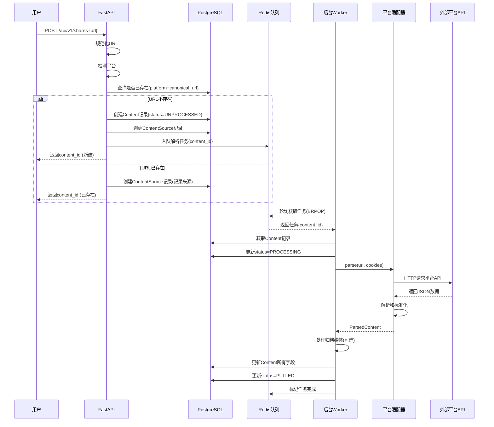

# VaultStream 工作流程图

本文档提供 VaultStream 各核心流程的可视化图表和说明。

---

## 1. 总体数据流向

```
   用户输入              平台内容              存储归档              推送分发
      │                     │                     │                     │
      ▼                     ▼                     ▼                     ▼
┌──────────┐         ┌──────────┐         ┌──────────┐         ┌──────────┐
│          │  URL    │          │  Parse  │          │  Push   │          │
│   用户    ├────────>│  适配器   ├────────>│  数据库   ├────────>│   Bot    │
│          │         │          │         │          │         │          │
└──────────┘         └────┬─────┘         └────┬─────┘         └──────────┘
                          │                    │
                          │ Download           │ Store
                          ▼                    ▼
                    ┌──────────┐         ┌──────────┐
                    │          │  WebP   │          │
                    │   媒体源  ├────────>│  MinIO   │
                    │          │         │          │
                    └──────────┘         └──────────┘
```

---

## 2. 内容创建和解析流程

### 2.1 用户提交 URL 流程



### 2.2 状态机转换

```
初始状态: UNPROCESSED
    │
    │ Worker获取任务
    ▼
  PROCESSING ─────────┐
    │                 │
    │ 解析成功         │ 解析失败
    ▼                 ▼
  PULLED           FAILED
                      │
                      │ 重试 (最多3次)
                      └────────────┐
                                   │
                      达到最大重试次数
                                   ▼
                            死信队列/人工介入
```

---

## 3. 媒体处理流程

### 3.1 归档图片处理流程

```
Worker解析完成
    │
    │ 检查: enable_archive_media_processing = true?
    ├─ NO ─> 跳过媒体处理
    │
    └─ YES
        │
        ▼
检查 raw_metadata.archive.images
        │
        ├─ 无图片 ─> 跳过
        │
        └─ 有图片
            │
            ▼
    对每张图片执行:
    ┌────────────────────────────────┐
    │ 1. 下载原图                     │
    │    └─> httpx.get(img_url)      │
    │                                │
    │ 2. WebP转码                    │
    │    └─> PIL.Image.save(WEBP)    │
    │                                │
    │ 3. 计算SHA256哈希               │
    │    └─> hashlib.sha256()        │
    │                                │
    │ 4. 生成内容寻址key              │
    │    └─> blobs/sha256/XX/YY/...  │
    │                                │
    │ 5. 检查MinIO是否已存在          │
    │    └─> storage.exists(key)     │
    │    ├─ 已存在 ─> 跳过上传        │
    │    └─ 不存在 ─> 执行上传        │
    │                                │
    │ 6. 上传到MinIO                 │
    │    └─> storage.put_bytes()     │
    │                                │
    │ 7. 获取访问URL                  │
    │    └─> storage.get_url()       │
    │        ├─ 预签名URL (私有桶)    │
    │        └─ 公开URL (公开桶)      │
    │                                │
    │ 8. 更新metadata                │
    │    └─> stored_key, stored_url  │
    └────────────────────────────────┘
            │
            ▼
    更新Content.raw_metadata
            │
            ▼
        提交数据库事务
```

### 3.2 MinIO 存储架构

```
VaultStream MinIO Bucket
│
├─ blobs/
│   └─ sha256/                    # 内容寻址存储
│       ├─ 00/                    # SHA256前2位
│       │   ├─ cf/                # SHA256第3-4位
│       │   │   └─ 00cf1234...89.webp   # 完整SHA256.webp
│       │   └─ ...
│       ├─ ab/
│       │   └─ cd/
│       │       └─ abcd5678...ef.webp
│       └─ ...
│
└─ (未来扩展)
    ├─ videos/                    # 视频转码
    ├─ audio/                     # 音频提取
    └─ thumbnails/                # 缩略图
```

**内容寻址优势**：
- ✅ 自动去重：相同内容只存储一次
- ✅ 完整性校验：SHA256可验证
- ✅ 分布均衡：前缀分桶避免单目录过多文件
- ✅ 可追溯：通过hash定位原始内容

---

## 4. Bot 推送流程

### 4.1 获取并推送内容

```
Telegram用户
    │
    │ 发送: /get [tag]
    ▼
Telegram Bot
    │
    │ POST /api/v1/bot/get-content
    ▼
FastAPI查询待推送内容
    │
    │ SELECT FROM contents
    │ WHERE status = 'PULLED'
    │   AND id NOT IN (已推送记录)
    │   AND (tag匹配)
    │ ORDER BY published_at DESC
    │ LIMIT 1
    ▼
返回Content数据
    │
    ▼
Bot格式化消息
    │
    ├─> 标题
    ├─> 作者
    ├─> 简介
    ├─> 互动数据
    ├─> 标签
    └─> 原始链接
    │
    ▼
发送到Telegram频道
    │
    ├─ 有封面? ─> send_photo(cover_url, caption)
    └─ 无封面  ─> send_message(text)
    │
    ▼
异步标记已推送 (不阻塞)
    │
    │ asyncio.create_task()
    │
    └─> POST /api/v1/bot/mark-pushed
        └─> INSERT INTO pushed_records
    │
    ▼
Bot回复用户: ✅ 已发送
```

### 4.2 推送去重机制

```sql
-- 查询待推送内容时，排除已推送的
SELECT * FROM contents
WHERE status = 'PULLED'
  AND id NOT IN (
    SELECT content_id 
    FROM pushed_records 
    WHERE target_platform = 'TG_CHANNEL_xxx'
  )
ORDER BY published_at DESC;
```

**支持多目标**：
- `TG_CHANNEL_xxx` - Telegram频道
- `DISCORD_xxx` - Discord频道（未来）
- `SLACK_xxx` - Slack频道（未来）

---

## 5. 错误处理和重试流程

### 5.1 任务重试决策树

```
Worker处理任务失败
    │
    ▼
捕获异常类型
    │
    ├─────────────────────────────────┐
    │                                 │
    ▼                                 ▼
可重试错误                        不可重试错误
(网络超时、5xx错误)               (403权限、404不存在)
    │                                 │
    ▼                                 │
attempt < max_attempts?               │
    │                                 │
    ├─ YES                            │
    │   │                             │
    │   ▼                             │
    │ 指数退避延迟                     │
    │ delay = 1s * 2^attempt          │
    │   │                             │
    │   ▼                             │
    │ 重新入队                         │
    │ attempt += 1                    │
    │                                 │
    └─ NO                             │
        │                             │
        ▼                             ▼
    达到最大重试                    立即标记失败
        │                             │
        ▼                             ▼
    ┌──────────────────────────────────┐
    │  更新Content:                     │
    │  - status = FAILED                │
    │  - failure_count += 1             │
    │  - last_error = 错误消息           │
    │  - last_error_type = 异常类名      │
    │  - last_error_detail = traceback  │
    │  - last_error_at = 当前时间        │
    └──────────────────────────────────┘
        │
        ▼
    推送到死信队列
    (人工介入/后续分析)
```

### 5.2 重试时间线示例

```
尝试1: t=0s      解析失败(网络超时)
                 └─> 等待 1s

尝试2: t=1s      解析失败(网络超时)
                 └─> 等待 2s

尝试3: t=3s      解析失败(网络超时)
                 └─> 等待 4s

尝试4: t=7s      达到最大重试次数(3)
                 └─> 标记FAILED，入死信队列
```

---

## 6. 完整请求链路追踪

### 6.1 日志上下文传播

```
HTTP请求进入
    │
    ▼
生成 request_id (UUID)
    │
    │ 中间件注入上下文
    ▼
log_context(request_id=xxx)
    │
    ├─> API处理
    │   └─> logger.info() 自动包含 request_id
    │
    ├─> 入队任务
    │   └─> task_data 携带 task_id
    │
    └─> Worker处理
        │
        ▼
    log_context(
        task_id=xxx,
        content_id=yyy
    )
        │
        └─> logger.info() 自动包含所有ID
```

### 6.2 日志示例

```json
{
  "time": "2026-01-03 20:54:00.280",
  "level": "INFO",
  "message": "创建分享成功",
  "extra": {
    "request_id": "c607ebdfc13241bd9a8c8900c655d5ec",
    "content_id": 5,
    "task_id": null
  },
  "name": "app.api",
  "function": "create_share",
  "line": 136
}
```

**追踪路径**：
1. 前端请求 → `request_id`
2. 数据库记录 → `content_id`
3. 异步任务 → `task_id`

---

## 7. 性能优化点

### 7.1 连接复用

```
传统方式 (每次创建):
    请求1 ─> new Client ─> API调用 ─> close
    请求2 ─> new Client ─> API调用 ─> close
    请求3 ─> new Client ─> API调用 ─> close
    
    问题: TCP握手、TLS握手开销大

优化后 (复用):
    初始化 ─> Client (长连接)
    请求1 ──────┐
    请求2 ──────┤──> 复用 Client ──> API调用
    请求3 ──────┘
    关闭 ─> close
    
    优势: 减少握手次数，降低延迟
```

### 7.2 异步非阻塞

```
同步方式:
    获取内容 (200ms)
        │
        ▼
    发送到频道 (500ms)
        │
        ▼
    标记已推送 (100ms)
        │
        ▼
    回复用户
    
    总耗时: 800ms

异步优化:
    获取内容 (200ms)
        │
        ▼
    发送到频道 (500ms)
        │
        ├─────────────────┐
        │                 │ 并行
    回复用户              │
        │                 ▼
        │         asyncio.create_task(
        │             标记已推送 (100ms)
        │         )
        ▼
    立即返回 (不等待标记完成)
    
    用户感知耗时: 700ms (减少100ms)
```

### 7.3 数据库查询优化

```sql
-- 优化前: N+1查询
SELECT * FROM contents;  -- 1次
-- 然后对每个content查询sources (N次)

-- 优化后: JOIN + 索引
SELECT 
    c.*,
    array_agg(cs.*) as sources
FROM contents c
LEFT JOIN content_sources cs ON cs.content_id = c.id
WHERE c.status = 'PULLED'
GROUP BY c.id;  -- 1次

-- 添加复合索引
CREATE INDEX idx_content_status_published 
ON contents(status, published_at DESC);

CREATE INDEX idx_pushed_records_lookup
ON pushed_records(target_platform, content_id);
```

---

## 8. 部署和扩展

### 8.1 水平扩展架构

```
            负载均衡器
                │
    ┌───────────┼───────────┐
    │           │           │
    ▼           ▼           ▼
FastAPI-1   FastAPI-2   FastAPI-3
(无状态)    (无状态)    (无状态)
    │           │           │
    └───────────┼───────────┘
                │
        ┌───────┴───────┐
        │               │
        ▼               ▼
    Redis队列      PostgreSQL
        │           (主从复制)
        │
    ┌───┴───┐
    │       │
    ▼       ▼
Worker-1  Worker-2
(竞争消费)

优势:
- FastAPI可水平扩展(无状态)
- Worker可根据队列长度动态扩容
- 单点故障影响降低
```

### 8.2 监控指标

```
应用指标:
├─ 队列长度 (queue_size)
├─ 任务处理速率 (tasks/sec)
├─ 任务失败率 (failed/total)
├─ API响应时间 (p50, p95, p99)
└─ 内容状态分布
    ├─ UNPROCESSED: xxx
    ├─ PROCESSING: xxx
    ├─ PULLED: xxx
    └─ FAILED: xxx

系统指标:
├─ CPU使用率
├─ 内存使用率
├─ 磁盘I/O
├─ 网络流量
└─ 数据库连接数

业务指标:
├─ 新增内容数/天
├─ 推送成功率
├─ 平台分布 (Bilibili: xx%, ...)
└─ 用户活跃度
```

---

## 9. 故障排查流程

### 9.1 内容解析失败

```
检查步骤:
1. 查看Content记录
   └─> SELECT * FROM contents WHERE id = xxx;
   
2. 检查错误信息
   └─> last_error, last_error_type, last_error_detail
   
3. 分类错误
   ├─ 网络问题 → 检查代理、DNS
   ├─ 权限问题 → 检查Cookies配置
   ├─ 平台变更 → 更新适配器逻辑
   └─ 其他 → 查看详细traceback

4. 手动重试
   └─> POST /api/v1/contents/{id}/retry
   
5. 修复后批量重试
   └─> UPDATE contents SET status='UNPROCESSED' 
       WHERE status='FAILED' AND last_error_type='NetworkError';
```

### 9.2 MinIO存储问题

```
检查步骤:
1. 确认MinIO服务状态
   └─> curl http://localhost:9000/minio/health/live
   
2. 检查bucket是否存在
   └─> mc ls local/vaultstream
   
3. 测试上传
   └─> echo "test" | mc pipe local/vaultstream/test.txt
   
4. 检查权限配置
   └─> mc admin user list local
   
5. 查看存储统计
   └─> mc du local/vaultstream
```

---

## 10. 最佳实践

### 10.1 开发建议

✅ **推荐**：
- 使用虚拟环境隔离依赖
- 配置文件使用 `.env` 管理
- 日志使用结构化格式 (JSON)
- 错误处理要细致分类
- 单元测试覆盖核心逻辑

❌ **避免**：
- 硬编码敏感信息
- 忽略异常不处理
- 长时间同步阻塞操作
- 无限重试失败任务
- 日志输出敏感数据

### 10.2 运维建议

✅ **推荐**：
- 定期备份数据库
- 监控队列积压情况
- 设置失败告警阈值
- 定期清理死信队列
- 定期归档旧数据

❌ **避免**：
- 生产环境开启DEBUG
- 不限制队列大小
- 忽略错误日志
- 不做容量规划
- 缺少回滚方案

---

## 附录：快速诊断命令

```bash
# 检查服务状态
curl http://localhost:8000/api/v1/health

# 查看队列长度
redis-cli LLEN vaultstream:tasks

# 查看最近失败的任务
psql -d vaultstream -c "
  SELECT id, url, last_error_type, last_error 
  FROM contents 
  WHERE status='FAILED' 
  ORDER BY last_error_at DESC 
  LIMIT 10;
"

# 查看MinIO使用情况
mc du local/vaultstream

# 查看系统资源
docker stats

# 实时查看日志
tail -f start.log | jq .  # JSON格式化
```

---

**版本**: v1.0  
**最后更新**: 2026-01-03
