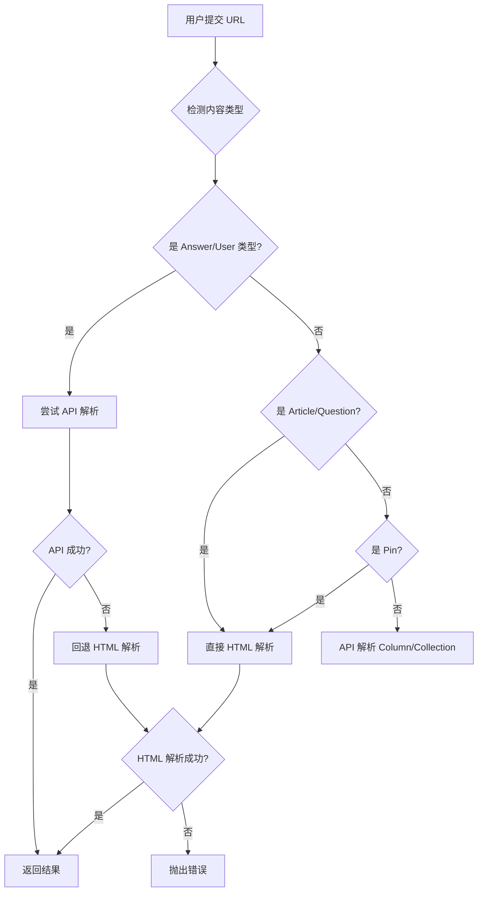

# 知乎内容适配器完整文档

VaultStream 的知乎适配器支持解析知乎的专栏文章、问答、想法（Pin）及用户主页信息。本文档详细说明了解析策略、回退逻辑和存档内容。

---

## 1. 支持的 URL 类型

适配器会自动识别以下 URL 模式：

| 类型 | URL 模式 | 示例 |
| :--- | :--- | :--- |
| 专栏文章 (Article) | `zhuanlan.zhihu.com/p/{id}` | `https://zhuanlan.zhihu.com/p/676348421` |
| 问题 (Question) | `zhihu.com/question/{id}` | `https://www.zhihu.com/question/532925796` |
| 回答 (Answer) | `zhihu.com/question/{qid}/answer/{aid}` 或 `zhihu.com/answer/{aid}` | `https://www.zhihu.com/question/123/answer/456` |
| 想法 (Pin) | `zhihu.com/pin/{id}` | `https://www.zhihu.com/pin/1728258525883654144` |
| 用户主页 (People) | `zhihu.com/people/{token}` | `https://www.zhihu.com/people/excited-vczh` |
| 专栏主页 (Column) | `zhihu.com/column/{id}` | `https://www.zhihu.com/column/learning-ai` |
| 收藏夹 (Collection) | `zhihu.com/collection/{id}` | `https://www.zhihu.com/collection/123456` |

---

## 2. 解析策略

### 2.1 策略概览


| 内容类型 | 主要解析方式 | 回退方式 | 原因 |
| :--- | :--- | :--- | :--- |
| Answer（回答） | ✅ API 优先 | HTML | API 公开可用，无需签名 |
| User Profile（用户） | ✅ API 优先 | HTML | API 公开可用 |
| Column（专栏） | ✅ API 优先 | ❌ 无 | 基础信息 API 可用 |
| Collection（收藏夹） | ✅ API 优先 | ❌ 无 | 基础信息 API 可用 |
| Article（文章） | ⚠️ HTML 直接解析 | - | API 风控严格，需复杂签名 |
| Question（问题） | ⚠️ HTML 直接解析 | - | API 风控严格，需复杂签名 |
| Pin（想法） | ⚠️ HTML 唯一方式 | - | 无公开 API |

### 2.2 详细说明

#### ✅ API 优先类型（Answer / User Profile）

核心：
- 知乎的回答详情 API (`/api/v4/answers/{id}`) 完全公开，无需任何 Cookie 或签名即可访问
- 用户信息 API (`/api/v4/members/{id}`) 同样公开
- 这些接口返回完整的 JSON 结构，包含统计信息

Include 参数配置：
```python
# Answer 完整参数
include=content,excerpt,voteup_count,comment_count,created_time,updated_time,thanks_count,relationship.is_author,is_thanked,voting

# User 完整参数
include=allow_message,answer_count,articles_count,follower_count,following_count,voteup_count,thanked_count,favorited_count,pins_count,question_count
```

优势：
- 稳定性高，不受页面改版影响
- 返回结构化数据，易于解析
- 包含完整的统计信息（点赞、评论等）

#### ⚠️ HTML 直接解析类型（Article / Question）

原因：
- 这些 API 自 2024 年底起强制要求 `x-zse-96` 签名 + 有效 Cookie
- 即使提供 Cookie，缺少动态签名仍会返回 403 或 10003 错误
- 实现签名算法成本高且不稳定（知乎持续更新算法）

HTML 解析机制：
1. 直接请求网页 URL（如 `https://zhuanlan.zhihu.com/p/676348421`）
2. 从 HTML 中提取 `<script id=\"js-initialData\">` 标签
3. 解析其中的 JSON 状态对象（与 API 返回的结构相同）

优势：
- 绕过 API 签名要求
- 获取的数据与 API 完全一致
- 只要网页可访问，数据就完整

---

## 3. 回退逻辑流程



关键决策点：
1. 类型判断：基于 URL 模式自动识别内容类型
2. 策略选择：根据类型选择 API 或 HTML
3. API 失败处理：仅对 API 优先类型启用 HTML 回退
4. 错误分类：
   - 403/401 → `AuthRequiredAdapterError`（需要 Cookie）
   - 404 → `NonRetryableAdapterError`（内容不存在）
   - 其他 → `RetryableAdapterError`（可重试）

---

## 4. 存档内容详解

### 4.1 通用字段

所有类型的内容都会包含以下基础字段：

| 字段 | 类型 | 说明 | 来源 |
| :--- | :--- | :--- | :--- |
| `platform` | string | 固定为 `\"zhihu\"` | 常量 |
| `content_type` | string | `article`, `question`, `answer`, `pin`, `user_profile` | URL 检测 |
| `content_id` | string | 知乎内部 ID | URL 提取或 API 返回 |
| `title` | string | 标题（Pin 为摘要） | API 或 HTML |
| `description` | string | Markdown 格式正文 | 经 `markdownify` 转换 |
| `author_name` | string | 作者昵称 | API `author.name` |
| `author_id` | string | 作者 URL Token | API `author.url_token` |
| `cover_url` | string | 封面/题图/头像 URL | API 或提取首图 |
| `media_urls` | list | 正文中所有图片 URL | 正则提取 |
| `published_at` | datetime | 发布时间 | API `created_time` |
| `tags` | list | 话题/标签 | API `topics` |
| `url` | string | 原始 URL | 用户输入 |

### 4.2 统计字段（stats）

不同类型包含的统计信息：

| 统计项 | Article | Question | Answer | Pin | User |
| :--- | :---: | :---: | :---: | :---: | :---: |
| `voteup_count` (点赞) | ✅ | ✅ | ✅ | - | ✅ (获赞总数) |
| `comment_count` (评论) | ✅ | ✅ | ✅ | ✅ | - |
| `thanks_count` (感谢) | - | - | ✅ | - | ✅ |
| `follower_count` (关注) | - | ✅ | - | - | ✅ |
| `answer_count` (回答数) | - | ✅ | - | - | ✅ |
| `visit_count` (浏览量) | - | ✅ | - | - | - |
| `reaction_count` (鼓掌) | - | - | - | ✅ | - |
| `repin_count` (转发) | - | - | - | ✅ | - |

数据来源：
- API 模式：直接从 JSON 的对应字段提取
- HTML 模式：从 `js-initialData` 中的 `initialState` 对象提取

### 4.3 归档数据（archive）

每条内容会额外生成离线归档数据，包含：

```json
{
  \"version\": 2,
  \"type\": \"article\",
  \"title\": \"文章标题\",
  \"plain_text\": \"纯文本内容（无 HTML 标签）\",
  \"markdown\": \"Markdown 格式正文\",
  \"images\": [
    {\"url\": \"https://...\", \"type\": \"content\"},
    {\"url\": \"https://...\", \"type\": \"avatar\"}
  ],
  \"links\": [],
  \"stored_images\": []
}
```


---

### Q3: 关于评论数据

当前仅存储评论数量。完整评论列表需要额外的 API 请求，且数据量大，暂未实现。

---

## 6. 开发者参考

### 6.1 添加新的 Include 参数

如果需要获取更多字段，可以修改 `API_INCLUDE_PARAMS`：

```python
# backend/app/adapters/zhihu.py
API_INCLUDE_PARAMS = {
    \"answer\": \"content,excerpt,voteup_count,comment_count,...\",  # 添加你需要的字段
}
```

### 6.2 扩展 HTML 解析器

HTML 解析器位于 `backend/app/adapters/zhihu_parser/`：
- `article_parser.py` - 文章解析
- `question_parser.py` - 问题解析
- `answer_parser.py` - 回答解析
- `pin_parser.py` - 想法解析
- `people_parser.py` - 用户主页解析
