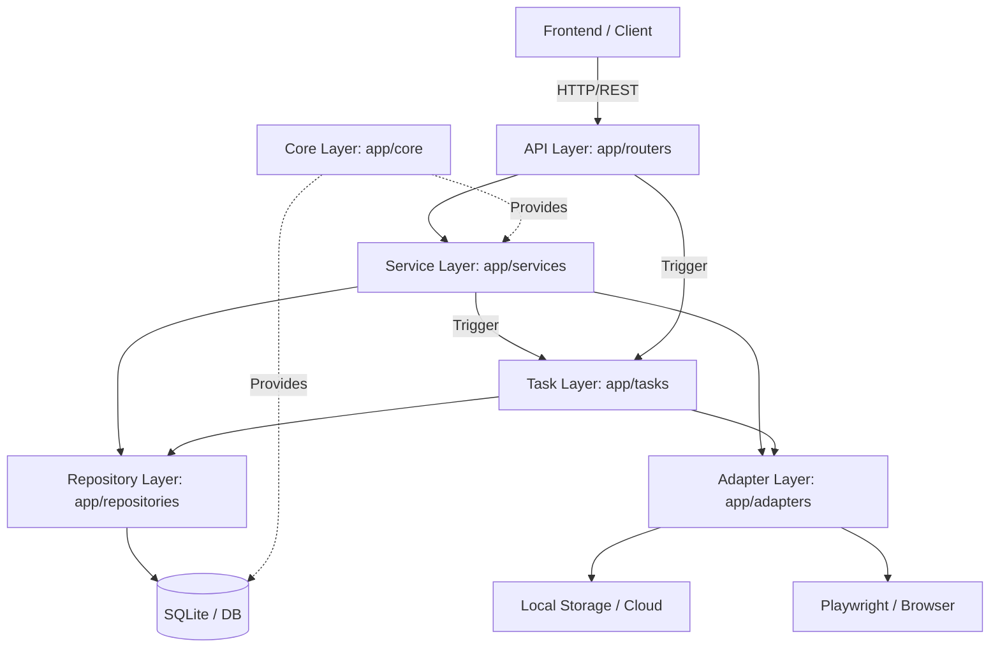

# VaultStream 后端架构文档


## 目录

- [1. 架构总览](#1-架构总览)
- [2. 分层结构](#2-分层结构)
- [3. 核心基础设施 (core/)](#3-核心基础设施-core)
- [4. 数据模型层 (models / schemas)](#4-数据模型层-models--schemas)
- [5. API 路由层 (routers/)](#5-api-路由层-routers)
- [6. 服务层 (services/)](#6-服务层-services)
- [7. 仓库层 (repositories/)](#7-仓库层-repositories)
- [8. 适配器系统 (adapters/)](#8-适配器系统-adapters)
- [9. 异步任务系统 (tasks/)](#9-异步任务系统-tasks)
- [10. 分发系统 (services/distribution/)](#10-分发系统-servicesdistribution)
- [11. 推送引擎 (push/)](#11-推送引擎-push)
- [12. 媒体处理 (media/)](#12-媒体处理-media)
- [13. Telegram Bot (bot/)](#13-telegram-bot-bot)
- [14. 事件系统与实时通信](#14-事件系统与实时通信)
- [15. 核心数据流](#15-核心数据流)
- [16. 模块交互矩阵](#16-模块交互矩阵)
- [17. 部署与运维](#17-部署与运维)

---

## 1. 架构总览

VaultStream 后端采用 **FastAPI + SQLAlchemy (async) + SQLite** 的轻量级技术栈，整体遵循**分层架构**设计：





```text
┌─────────────────────────────────────────────────────────────────────┐
│                         FastAPI Application                         │
│   main.py (入口 · 中间件 · 生命周期管理)                              │
├──────────┬──────────┬──────────┬──────────┬──────────┬──────────────┤
│ Routers  │ Services │ Repos    │ Adapters │ Tasks    │ Distribution │
│ (API 层) │ (业务)   │ (数据)    │ (基础设施)  │ (异步)    │ (分发系统)   │
├──────────┴──────────┴──────────┴──────────┴──────────┴──────────────┤
│                          Core (基础设施内核)                          │
│  config · database · queue · events · logging · dependencies        │
├─────────────────────────────────────────────────────────────────────┤
│                 SQLite (WAL) + 本地文件存储                          │
└─────────────────────────────────────────────────────────────────────┘
```

**技术选型要点**：

| 组件 | 技术 | 原因 |
|------|------|------|
| Web 框架 | FastAPI | 原生 async, 自动文档, Pydantic 集成 |
| ORM | SQLAlchemy 2.0 (async) | 成熟生态, 异步支持 |
| 数据库 | SQLite (WAL mode) | 轻量, ~200MB 内存 |
| 任务队列 | SQLite 任务表 | 无外部依赖, 适合单机部署 |
| 日志 | Loguru | 结构化日志, contextvars 上下文注入 |
| 配置 | pydantic-settings | 类型安全, .env 支持 |
| Bot | python-telegram-bot | Telegram 官方 SDK |

---

## 2. 分层结构

```
backend/app/
├── main.py              # FastAPI 入口 + 生命周期 + 中间件
├── models/              # SQLAlchemy ORM 模型 (分拆包)
├── schemas/             # Pydantic 请求/响应 Schema (分拆包)
├── constants.py         # 全局常量定义
│
├── core/                # 基础设施内核
│   ├── config.py        # 配置管理 (Settings)
│   ├── database.py      # 数据库初始化 + 会话管理
│   ├── db_adapter.py    # 数据库适配器 (SQLite)
│   ├── queue.py         # 任务队列基础
│   ├── events.py        # EventBus
│   ├── logging.py       # Loguru 结构化日志
│   ├── dependencies.py  # FastAPI 依赖注入
│   └── ...
│
├── routers/             # API 路由层 (归一化)
│   ├── contents.py      # 内容 CRUD
│   ├── distribution.py  # 分发规则
│   ├── system.py        # 系统/统计
│   ├── browser_auth.py  # [NEW] 浏览器扫码登录 (归一化)
│   └── ...
│
├── services/            # 业务逻辑层 (大脑)
│   ├── content_service.py       # 内容创建逻辑
│   ├── settings_service.py      # 系统设置 (已接入 Repo)
│   ├── distribution/            # [REFACTOR] 分发引擎系统
│   │   ├── engine.py            # 规则匹配核心
│   │   └── scheduler.py         # 排期计算
│   └── bot_config_runtime.py    # Bot 运行时管理
│
├── repositories/        # [NEW] 数据访问层 (DAL/仓储)
│   ├── content_repository.py    # 内容与 FTS5 查询
│   ├── distribution_repository.py# 规则与目标查询
│   ├── bot_repository.py        # 机器人配置/聊天查询
│   └── system_repository.py     # 设置/推送记录查询
│
├── tasks/               # [REFACTOR] 异步任务处理中心
│   ├── runner.py        # 任务执行引擎 (TaskWorker)
│   ├── parsing.py       # 内容解析处理器
│   └── distribution_worker.py # 分发推送处理器
│
├── adapters/            # [REFACTOR] 外部依赖适配器
│   ├── browser/         # 浏览器自动化适配 (Playwright)
│   ├── storage/         # 文件存储适配 (Local/S3)
│   ├── bilibili_parser/ # B站专用解析
│   └── universal_adapter.py # 通用适配层
│
├── push/                # 推送具体实现 (由 Task 调用)
│   ├── telegram.py      # Telegram 实现
│   └── napcat.py        # QQ 实现
└── ...
```

---

## 3. 核心基础设施 (core/)

### 3.1 配置管理 — `config.py`

基于 `pydantic-settings` 的类型安全配置，自动读取 `.env` 文件：

```python
class Settings(BaseSettings):
    # 数据库
    database_type: Literal["sqlite"] = "sqlite"
    sqlite_db_path: str = "./data/vaultstream.db"

    # 队列
    queue_type: Literal["sqlite"] = "sqlite"

    # API
    api_host: str = "0.0.0.0"
    api_port: int = 8000
    api_token: SecretStr = SecretStr("")

    # 存储
    storage_backend: Literal["local", "s3"] = "local"
    storage_local_root: str = "data/storage"

    # 各平台凭证 (SecretStr 加密存储)
    bilibili_sessdata: Optional[SecretStr] = None
    xiaohongshu_cookie: Optional[SecretStr] = None
    ...
```

**关键设计**：
- 所有凭证字段使用 `SecretStr`，防止日志泄露
- `validate_settings()` 在启动时执行基础校验
- 支持 `dev` / `prod` 环境切换

### 3.2 数据库 — `database.py` + `db_adapter.py`

采用适配器模式，当前仅支持 SQLite：

```
DatabaseAdapter (ABC)
  └── SQLiteAdapter
        ├── get_engine() -> AsyncEngine (aiosqlite)
        └── get_session_maker() -> async_sessionmaker
```

**SQLite 性能优化** (在 `db_adapter.py` 中配置)：

| PRAGMA | 值 | 效果 |
|--------|-----|------|
| `journal_mode` | WAL | 允许并发读写 |
| `synchronous` | NORMAL | 平衡性能与安全 |
| `cache_size` | -64000 | 64MB 缓存 |
| `temp_store` | MEMORY | 临时表放内存 |
| `mmap_size` | 268435456 | 256MB mmap |
| `foreign_keys` | ON | 外键约束 |

全局导出 `engine` 和 `AsyncSessionLocal`，供全项目使用。

### 3.3 任务队列 — `queue.py` + `queue_adapter.py`

```
QueueAdapter (ABC)
  └── SQLiteQueueAdapter
        ├── enqueue(task_data)   → 写入 tasks 表
        ├── dequeue(timeout)     → SELECT FOR UPDATE SKIP LOCKED
        ├── mark_complete()      → 更新状态
        └── push_dead_letter()   → 标记失败
```

**任务数据结构**：
```json
{
  "schema_version": 1,
  "action": "parse",
  "content_id": 42,
  "task_id": "uuid",
  "attempt": 0,
  "max_attempts": 3
}
```

### 3.4 事件总线 — `events.py`

`EventBus` 实现了 **本地内存广播 + SQLite outbox** 的混合模式：

- **本地广播**：进程内的 `asyncio.Queue` 订阅者，即时推送
- **跨实例同步**：写入 `realtime_events` 表，轮询线程每 0.5s 拉取其他实例写入的事件
- **SSE 输出**：`/api/v1/events/subscribe` 端点将事件流推送到前端

**核心事件类型**：

| 事件 | 触发时机 | 数据 |
|------|----------|------|
| `content_created` | 新内容入库 | id, url, platform, status |
| `content_updated` | 解析完成/编辑 | id, title, status, cover_url |
| `content_pushed` | 推送成功 | content_id, target_id, message_id |
| `queue_updated` | 队列变更 | action, queue_item_id, status |
| `distribution_push_failed` | 推送失败 | content_id, error, attempt_count |

### 3.5 存储后端 — `storage.py`

```
StorageBackend (ABC)
  └── LocalStorageBackend
        ├── put_bytes(key, data, content_type) → StoredObject
        ├── get_bytes(key) → bytes
        ├── exists(key) → bool
        ├── get_url(key) → Optional[str]
        └── get_local_path(key) → Optional[str]
```

**存储寻址策略**：
- 内容寻址：`sha256:abcdef...` → 目录分片 `ab/cd/abcdef...`
- 媒体文件命名：`{namespace}/blobs/sha256/{前2位}/{3-4位}/{hash}.{ext}`
- 缩略图后缀：`.thumb.webp`

### 3.6 日志 — `logging.py`

基于 **Loguru** + `contextvars` 自动注入上下文：

```python
# 自动携带 request_id / content_id / task_id
logger.info("内容解析完成")
# 输出: {"request_id":"abc123","content_id":42,"task_id":"xyz",...}
```

支持两种输出格式：
- `text`：人类可读的控制台输出
- `json`：结构化 JSON 日志 (适合日志聚合)

### 3.7 依赖注入 — `dependencies.py`

FastAPI `Depends` 注入链：

```python
# API Token 鉴权
require_api_token     # Header: X-API-Token 或 Authorization: Bearer
# 服务层注入
get_content_service   # → ContentService(db)
get_content_repo      # → ContentRepository(db)
```

---

## 4. 数据模型层 (models / schemas)

### 4.1 ORM 模型 — `models.py`

#### 核心实体关系

```
Content (内容表)
  ├── ContentSource (来源流水, 1:N)
  ├── PushedRecord (推送记录, 1:N)
  └── ContentQueueItem (队列项, 1:N)
        ├── DistributionRule (分发规则)
        └── BotChat (推送目标)

DistributionRule (分发规则)
  └── DistributionTarget (规则目标, 1:N)
        └── BotChat (Bot 聊天)

BotConfig (Bot 配置)
  └── BotChat (关联的聊天/群组, 1:N)

SystemSetting (系统设置, KV 表)
BotRuntime (Bot 运行时状态, 单例)
WeiboUser (微博用户, 独立表)
```

#### Content 表核心字段

| 字段 | 类型 | 说明 |
|------|------|------|
| `platform` | Enum(Platform) | 内容来源平台 |
| `url` / `canonical_url` / `clean_url` | Text | 原始/去重/净化 URL |
| `status` | Enum(ContentStatus) | UNPROCESSED → PROCESSING → PARSE_SUCCESS/FAILED |
| `review_status` | Enum(ReviewStatus) | PENDING → APPROVED/REJECTED/AUTO_APPROVED |
| `layout_type` / `layout_type_override` | Enum(LayoutType) | 系统检测/用户覆盖的布局类型 |
| `archive_metadata` | JSON | 归档存档信息 (含 `processed_archive` 与 `raw_api_response`) |
| `context_data` | JSON | 结构化关联上下文 (Context Slot) |
| `rich_payload` | JSON | 富媒体/交互组件载荷 (Rich Payload) |
| `extra_stats` | JSON | 平台特有互动/扩展统计数据 |
| `tags` | JSON | 用户标签列表 |
| `media_urls` | JSON | 媒体资源 URL 列表 (支持 `local://` 协议) |
| `published_at` | DateTime | 内容在原平台的发布时间 |
| `created_at` | DateTime | 记录创建时间 |

#### 关键枚举

```python
class Platform: BILIBILI, TWITTER, XIAOHONGSHU, ZHIHU, WEIBO, UNIVERSAL
class ContentStatus: UNPROCESSED, PROCESSING, PARSE_SUCCESS, PARSE_FAILED
class ReviewStatus: PENDING, APPROVED, REJECTED, AUTO_APPROVED
class LayoutType: ARTICLE, VIDEO, GALLERY, AUDIO, LINK
class QueueItemStatus: PENDING, SCHEDULED, PROCESSING, SUCCESS, FAILED, SKIPPED, CANCELED
```

#### ContentQueueItem (分发队列项)

每个 **(Content × Rule × BotChat)** 组合对应一条独立的队列项：

| 字段 | 说明 |
|------|------|
| `content_id` + `rule_id` + `bot_chat_id` | 三元组唯一约束 |
| `target_platform` / `target_id` | 缓存的目标信息 (避免推送时额外查询) |
| `status` | PENDING → SCHEDULED → PROCESSING → SUCCESS/FAILED |
| `priority` | 优先级 (rule.priority + content.queue_priority) |
| `scheduled_at` | 排期时间 (限流计算) |
| `attempt_count` / `max_attempts` | 重试控制 |
| `rendered_payload` / `nsfw_routing_result` | 预处理缓存 |

### 4.2 Pydantic Schema — `schemas.py`

**核心 Schema 分类**：

| 分类 | Schema | 用途 |
|------|--------|------|
| 分享入口 | `ShareRequest` / `ShareResponse` | URL 提交 |
| 内容展示 | `ContentDetail` / `ContentListItem` | 完整详情 / 列表精简 |
| 分享卡片 | `ShareCard` / `ShareCardListResponse` | 对外合规分享 (不含 archive_metadata) |
| 分发规则 | `DistributionRuleCreate/Update/Response` | 规则 CRUD |
| 审批 | `ReviewAction` / `BatchReviewRequest` | 单个/批量审批 |
| 队列 | `ContentQueueItemResponse` / `QueueStatsResponse` | 队列管理 |
| Bot | `BotConfigCreate/Response` / `BotChatResponse` | Bot 管理 |

**安全隔离原则**：`ShareCard` 系列 Schema 严格排除 `archive_metadata`、`client_context` 等敏感字段。

---

## 5. API 路由层 (routers/)

### 5.1 路由注册

在 `main.py` 中统一注册，前缀 `/api/v1`：

| 路由文件 | 前缀 | 主要端点 |
|---------|------|----------|
| `contents.py` | `/api/v1` | `POST /shares`, `GET/PATCH/DELETE /contents/{id}`, 审批流 |
| `distribution.py` | `/api/v1` | `CRUD /distribution-rules`, 预览, 渲染配置预设 |
| `distribution.py` | `/api/v1` | 分发规则 + 分发目标管理 |
| `distribution_queue.py` | `/api/v1` | 队列统计, 手动入队/重试/取消 |
| `system.py` | `/api/v1` | `/health`, `/dashboard/stats`, `/settings` |
| `media.py` | `/api/v1` | `GET /media/{key}` (本地代理), `GET /proxy/image` (远程代理) |
| `bot_config.py` | `/api/v1` | Bot 配置 CRUD, 同步群组 |
| `bot_management.py` | `/api/v1` | Bot 运行时, 心跳, 群组上报 |
| `crawler.py` | `/api/v1/crawler` | 爬虫采集接口 |
| `events.py` | `/api/v1` | `GET /events/subscribe` (SSE) |

### 5.2 中间件

```python
# 1. Request ID 中间件
@app.middleware("http")
async def request_id_middleware(request, call_next):
    # 生成/透传 X-Request-Id
    # 记录请求耗时日志

# 2. CORS 中间件
CORSMiddleware(allow_origins=["*"], ...)
```

### 5.3 关键 API 交互流程

#### 内容创建 (POST /shares)

```
Client → POST /api/v1/shares { url, tags, is_nsfw }
  └→ ContentService.create_share()
       ├→ AdapterFactory.detect_platform(url) → Platform
       ├→ adapter.clean_url(url) → canonical_url
       ├→ 去重查询 (platform + canonical_url)
       │   ├→ 新建 Content (status=UNPROCESSED)
       │   └→ 存量合并 tags
       ├→ 写入 ContentSource 流水
       ├→ task_queue.enqueue({content_id, action: "parse"})
       └→ event_bus.publish("content_created", ...)
  ← ShareResponse { id, platform, url, status }
```

#### 内容审批 (POST /contents/{id}/review)

```
Client → POST /api/v1/contents/{id}/review { action: "approve" }
  └→ content.review_status = APPROVED
  └→ enqueue_content_background(content.id)
       └→ 为每个匹配的 (rule × target) 创建 ContentQueueItem
  ← { id, review_status, reviewed_at }
```

### 5.4 媒体代理

`media.py` 提供两种代理模式：

1.  **本地媒体代理** `GET /media/{key}`：
    -   直接返回本地文件，1年缓存头
    -   支持 Range 请求 (视频)

2.  **远程图片代理** `GET /proxy/image?url=`：
    -   首次：下载 → WebP 转码 → 本地缓存
    -   后续：直接返回缓存 (X-Cache-Status: HIT)

---

## 6. 服务层 (services/)

### 6.1 ContentService

核心分享创建逻辑（`content_service.py`）：

**职责**：
- URL 规范化 (`normalize_bilibili_url`, `canonicalize_url`)
- 平台检测 (`AdapterFactory.detect_platform`)
- 去重判断 (platform + canonical_url 唯一约束)
- 标签清洗合并 (`_normalize_tags`：支持逗号/空格分隔, 去重)
- 来源流水记录 (`ContentSource`)
- 异步入队触发

### 6.2 SettingsService

动态系统设置的 CRUD，基于 `SystemSetting` 表 (KV 结构)。

### 6.3 BotConfigRuntime

Bot 运行时配置管理：
- `get_primary_telegram_runtime()` — 获取主 Telegram Bot 配置
- `get_primary_telegram_token_from_db()` — 推送时获取 Token
- `get_primary_qq_runtime_from_db()` — QQ Bot 运行时配置

---

## 7. 仓库层 (repositories/)

Repository 层封装了所有与数据库相关的物理查询，Service 层通过调用 Repository 实现数据解耦。

### 7.1 ContentRepository
- **职责**：处理内容的搜索（含 FTS5）、过滤及分页。
- **关键接口**：`list_contents`, `list_parsed_contents`, `search_by_fts5`。

### 7.2 DistributionRepository
- **职责**：处理分发规则及目标的复杂关联查询。
- **关键接口**：`list_active_rules_with_targets`（使用 `selectinload` 优化 N+1）、`get_rule_with_targets`。

### 7.3 BotRepository
- **职责**：处理 Bot 配置及其关联聊天。
- **关键接口**：`get_primary_config`（支持回退逻辑）、`list_chats_for_config`。

### 7.4 SystemRepository
- **职责**：处理系统设置、推送记录及统计。
- **关键接口**：`get_setting`, `upsert_setting`, `list_pushed_records`。
---

## 8. 适配器系统 (adapters/)

### 8.1 架构设计

```
PlatformAdapter (ABC)
  ├── detect_content_type(url) → str    # 检测内容类型
  ├── clean_url(url) → str              # URL 净化/规范化
  └── parse(url) → ParsedContent        # 解析内容
```

**适配器实现**：

| 适配器 | 平台 | 解析方式 | 内容类型 |
|--------|------|----------|----------|
| `BilibiliAdapter` | B站 | bilibili API + bilibili_parser/ | video, article, dynamic, bangumi |
| `TwitterFxAdapter` | Twitter/X | FxTwitter API (无需凭证) | tweet |
| `XiaohongshuAdapter` | 小红书 | xiaohongshu_parser/ | note, video |
| `ZhihuAdapter` | 知乎 | zhihu_parser/ | answer, question, article, user |
| `WeiboAdapter` | 微博 | weibo_parser/ | status, user_profile |
| `UniversalAdapter` | 通用 | Playwright/httpx | link (兜底) |

### 8.2 ParsedContent (标准化输出)

所有适配器解析后输出统一的 `ParsedContent` 数据类：

```python
@dataclass
class ParsedContent:
    platform: str          # 必填
    content_type: str      # 必填 (video, article, tweet...)
    content_id: str        # 必填 (平台 ID)
    clean_url: str         # 必填
    layout_type: str       # 必填 (article/video/gallery/audio/link)

    title: Optional[str]
    description: Optional[str]
    author_name / author_id / author_avatar_url / author_url
    cover_url / cover_color
    media_urls: list
    published_at: Optional[datetime]
    archive_metadata: dict  # 平台原始数据 + archive 归档
    stats: dict            # {view, like, favorite, share, reply, ...}
    source_tags: list      # 平台原生标签
    associated_question / top_answers  # 知乎结构化字段
```

### 8.3 AdapterFactory

```python
class AdapterFactory:
    @staticmethod
    def create(platform: Platform, **kwargs) → PlatformAdapter

    @staticmethod
    def detect_platform(url: str) → Optional[Platform]
    # 基于 URL 域名模式匹配
    # bilibili.com/b23.tv → BILIBILI
    # twitter.com/x.com   → TWITTER
    # 未匹配 → UNIVERSAL (兜底)
```

### 8.4 异常体系

```
AdapterError (基类)
  ├── retryable: bool      # 是否可重试
  ├── auth_required: bool   # 是否需要认证
  └── details: dict
RetryableAdapterError (retryable=True)
```

---

## 9. 异步任务系统 (app/tasks/) <a name="9-异步任务系统-tasks"></a>

任务层统筹所有的后台异步操作，通过 `runner.py` 进行任务调度。

### 9.1 执行引擎 (runner.py)
- **机制**：从 `task_queue` 中拉取任务并分发给对应的 Handler。
- **并发控制**：独立配置解析 Worker 和分发 Worker 的并发数。

### 9.2 内容解析 (parsing.py)
- **职责**：调用适配器进行内容抓取、媒体转码、FTS5 索引更新。
- **自动触发**：解析成功后可根据规则自动触发审批及分发。

### 9.3 分发推送 (distribution_worker.py)
- **职责**：执行具体的推送动作，包含重试逻辑、PushedRecord 记录。
- **解耦**：不关心具体的推送协议，通过 `push/` 工厂进行协议转发。

---

## 10. 分发系统 (app/services/distribution/) <a name="10-分发系统-servicesdistribution"></a>

分发系统负责“内容”与“目标”的逻辑撮合。

### 10.1 分发引擎 (engine.py)
- **匹配逻辑**：基于标签（Tags）、平台（Platform）、NSFW 标记进行多维匹配。
- **NSFW 路由**：支持 `block`（拦截）, `allow`（直发）, `separate_channel`（路由到 NSFW 备用频道）。

### 10.2 调度器 (scheduler.py)
- **限流控制**：基于 `DistributionRule` 的频率限制（Rate Limit）自动计算 `scheduled_at` 任务执行时间，避免触发平台反爬。
- **公平排期**：确保不同规则之间的推送任务不会出现严重的排队饥饿。
---

## 11. 推送引擎 (push/)

### 11.1 接口定义

```python
class BasePushService(ABC):
    async def push(content: dict, target_id: str) -> Optional[str]:
        """推送内容到目标，返回 message_id"""

    async def close():
        """释放资源"""
```

### 11.2 工厂模式

```python
def get_push_service(platform: str) -> BasePushService:
    # "telegram" → TelegramPushService (单例缓存)
    # "qq"       → NapcatPushService  (单例缓存)
```

### 11.3 TelegramPushService

- 使用 `python-telegram-bot` SDK
- 支持 Media Group (最多 10 个)：图片/视频混合
- 纯文本消息回退 (无媒体或媒体过大)
- 支持代理 (HTTP_PROXY 环境变量)
- 本地文件直接发送 (via `open()`)

**Telegram 限制常量**：
- 标题 (caption): 1024 字符
- 消息 (message): 4096 字符
- Media Group: 最多 10 个

### 11.4 NapcatPushService

- 基于 OneBot 11 HTTP API (`/send_group_msg`, `/send_private_msg`)
- 支持消息段拼装：text, image, video, record
- 支持合并转发 (`/send_group_forward_msg`)
- 本地文件通过 `file:///` URI 发送

---

## 12. 媒体处理 (media/)

### 12.1 processor.py

**图片处理** (`store_archive_images_as_webp`)：
1. 遍历 `archive.images[]`
2. 下载原图 (带 Referer/UA 伪装)
3. WebP 转码 (优先 ffmpeg → 降级 Pillow)
   - 动画 GIF: ffmpeg 快 25x
   - 静态图: Pillow 直接转
4. 内容寻址存储 (`sha256` → 2级目录分片)
5. 生成缩略图 (300x300, 70% quality)
6. 提取主色调 (缩放到 1x1 取平均)
7. 写入 `stored_images[]` 映射

**视频处理** (`store_archive_videos`)：
1. 下载视频文件 (支持代理)
2. 内容寻址存储
3. 写入 `stored_videos[]` 映射

### 12.2 color.py

`extract_cover_color(url)` — 从封面 URL 提取主色调 (Hex)。

### 12.3 extractor.py

`extract_media_urls(content)` — 从 content 提取可用的媒体 URL 列表，处理 `local://` 协议转换。

---

## 13. Telegram Bot (bot/)

### 13.1 架构

Bot 作为**独立进程**运行 (`python -m app.bot.main`)，与主 API 服务通过 HTTP 通信：

```
VaultStreamBot
  ├── 配置加载: get_primary_telegram_runtime() → BotConfig
  ├── 命令注册:
  │   ├── /start, /help   — 信息展示
  │   ├── /get             — 随机获取内容
  │   ├── /get_tag          — 按标签获取
  │   ├── /get_twitter      — Twitter 内容
  │   ├── /get_bilibili     — B站内容
  │   ├── /list_tags        — 标签列表
  │   └── /status           — 系统状态
  ├── 回调: button_callback (Inline Keyboard)
  ├── 心跳: 每 30s POST /bot/heartbeat
  └── 权限: PermissionManager (admin / whitelist / blacklist)
```

### 13.2 权限模型

```
PermissionManager
  ├── admin_ids: Set[int]     — 管理员 (完全权限)
  ├── whitelist_ids: Set[int] — 白名单 (基本操作)
  └── blacklist_ids: Set[int] — 黑名单 (硬拦截)
```

- 白名单为空 → 允许所有非黑名单用户
- 黑名单优先级最高

---

## 14. 事件系统与实时通信

### 14.1 SSE 端点

`GET /api/v1/events/subscribe` — 前端通过 EventSource 订阅实时事件：

```javascript
const es = new EventSource('/api/v1/events/subscribe');
es.addEventListener('content_updated', (e) => {
    const data = JSON.parse(e.data);
    // 更新 UI...
});
```

**特性**：
- 心跳保活: 300s 超时发送 ping
- 断线重连: 客户端标准 EventSource 自动重连
- Nginx 兼容: `X-Accel-Buffering: no`

### 14.2 事件流向

```
业务操作 (解析/审批/推送)
  └→ event_bus.publish(event, data)
       ├→ 本地广播 → asyncio.Queue → SSE 客户端
       └→ SQLite outbox → 轮询 → 其他实例
```

---

## 15. 核心数据流

### 15.1 内容采集 → 解析 → 分发 完整链路

```
1. 用户提交 URL
   POST /api/v1/shares { url, tags }
     └→ ContentService.create_share()

2. 入库 & 入队
   Content (status=UNPROCESSED) → task_queue.enqueue()
   └→ SSE: content_created

3. Worker 消费解析任务
   TaskRunner (runner.py) → ContentParser (parsing.py)
     ├→ AdapterFactory.create(platform).parse(url)
     ├→ 私有归档媒体处理 (WebP + 视频)
     ├→ 更新 Content (status=PARSE_SUCCESS)
     ├→ 自动审批检查
     │   └→ 匹配 → review_status=AUTO_APPROVED
     └→ SSE: content_updated

4. 分发入队 (审批通过后触发)
   enqueue_content(content_id)
     ├→ DistributionEngine.match_rules(content) → [rules]
     ├→ 为每个 (rule × target) 创建 ContentQueueItem
     │   ├→ 计算限流排期
     │   └→ status = SCHEDULED
     └→ SSE: queue_updated

5. 分发推送 (并由分发 Worker 推送)
   DistributionQueueWorker (distribution_worker.py)
     ├→ 目标/资格/去重检查
     ├→ get_push_service(platform).push(payload, target_id)
     ├→ 成功 → PushedRecord + BotChat 统计更新
     └→ SSE: content_pushed / distribution_push_success
```

### 15.2 local:// 媒体链路

```
解析阶段:
  adapter.parse() → archive_metadata.archive.images[].url (远程 CDN)
    └→ processor.store_archive_images_as_webp()
         ├→ download → webp 转码 → local storage
         └→ media_urls = ["local://vaultstream/blobs/sha256/ab/cd/..."]

API 输出:
  GET /api/v1/contents/{id}
    └→ _transform_media_url("local://...") → "/api/v1/media/..."

前端加载:
  GET /api/v1/media/vaultstream/blobs/sha256/ab/cd/hash.webp
    └→ FileResponse (1年缓存)
```

---

## 16. 模块交互逻辑

| 调用方 ↓ / 被调方 → | core | adapters | worker | distribution | push | media | bot |
|---------------------|------|----------|--------|-------------|------|-------|-----|
| **routers** | ✅ DB/Config/Deps | ✅ 平台检测 | ✅ 重试 | ✅ 入队/规则 | — | ✅ 代理 | — |
| **services** | ✅ DB/Queue/Events | ✅ 队列 | — | — | — | — | — |
| **worker** | ✅ DB/Queue/Config | ✅ 解析 | ✅ (自身) | ✅ 自动审批 | — | ✅ 转码 | — |
| **distribution** | ✅ DB/Events | — | ✅ Distributor | ✅ (自身) | ✅ 推送 | — | — |
| **push** | ✅ Config/Storage | — | — | — | ✅ (自身) | ✅ 提取 | — |
| **bot** | ✅ Config/DB | — | — | — | — | — | ✅ API 调用 |

---

## 17. 部署与运维

### 17.1 启动流程

`main.py` 的 `lifespan` 管理器控制启动/关闭顺序：

```
启动:
  1. validate_settings()        — 配置校验
  2. init_db()                  — 数据库初始化 (CREATE TABLE IF NOT EXISTS)
  3. task_queue.connect()       — 队列连接
  4. event_bus.start()          — 事件总线启动 (outbox 轮询)
  5. worker.start()             — 解析任务 Worker
  6. queue_worker.start()       — 分发队列 Worker (N 并发)

关闭 (逆序):
  1. queue_worker.stop()
  2. worker.stop()
  3. task_queue.disconnect()
  4. event_bus.stop()
```

### 17.2 静态文件

- `/media` — 归档媒体目录 (settings.storage_local_root)
- `/` — 前端静态文件 (static/ 目录, 必须最后挂载)

### 17.3 健康检查

```
GET /health → { status, db }
GET /api/v1/health → { status, queue_size, components }
```

### 17.4 运行参数

| 参数 | 默认 | 说明 |
|------|------|------|
| `api_host` | 0.0.0.0 | 监听地址 |
| `api_port` | 8000 | 监听端口 |
| `queue_worker_count` | 3 | 分发队列并发数 |
| `log_level` | INFO | 日志级别 |
| `log_format` | json | 日志格式 (json/text) |
