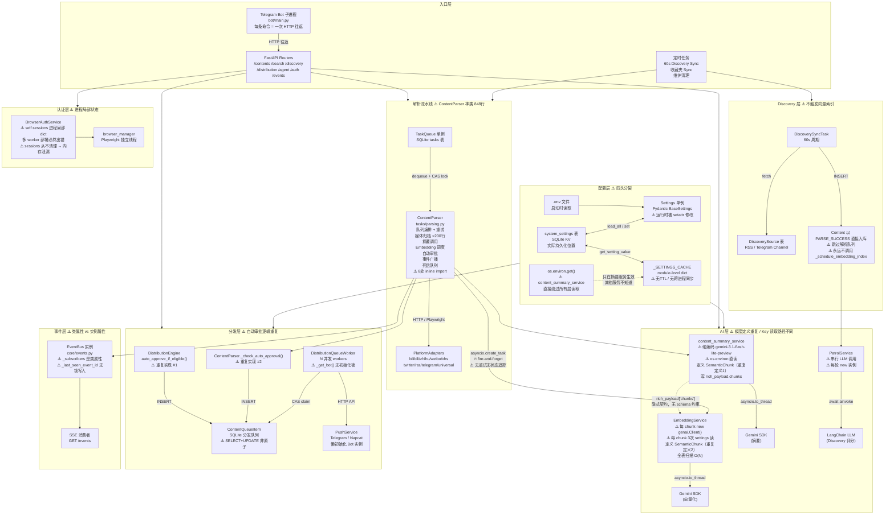
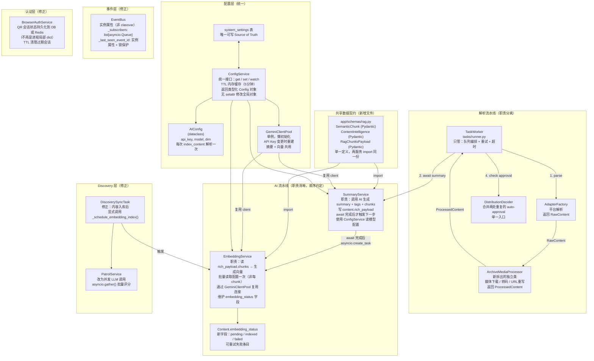
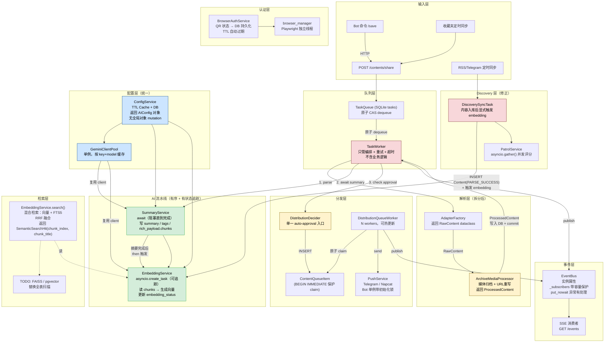

# 04 — 架构图

## 图 1：当前认知模型（Current State Model）

梳理当前系统的调用链路与状态流转现状，重点标注问题点。

---

## 图 2：推荐状态模型（Refactored State Model）

基于高内聚低耦合原则，建议的最佳状态主体划分。

---

## 图 3：目标架构组织图（Target Architecture）

采用建议后，新的状态流转全局视角。

**图例**：
- 🟢 绿色：AI 服务（重构后职责清晰）
- 🔵 蓝色：配置层（统一后的单一来源）
- 🟡 黄色：待分离的子模块
- 🔴 红色：当前有问题的神类/链路（重构优先）
