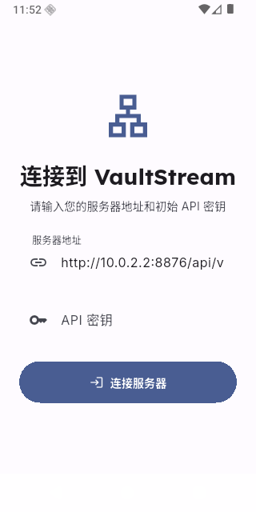

# 真实场景可用性与有用性验收

## 状态

in_progress。2026-09-10 用户明确授权创建持续 Goal，使用已登录的平台账号与真实模型自主验证、调查、查阅资料和修复。接口成功、内容质量、浏览器体验分别记录，不互相替代。

## 依据与边界

- [独立复审及整改记录](archive/2026-09-06-implementation-review.md)：原链接已归档，旧问题及旧验收不是当前结论。
- [系统构想](../plans/2026-07-15-vaultstream-system-concept.plan.md)。
- [前端信息架构](../plans/2026-06-10-frontend-information-architecture-redesign.plan.md)。
- 延续共享 checkout，不提交、推送或部署。不做用户明确排除的折叠屏专项。
- 尊重既有解析、媒体归档、同步、分发及 Agent 确认策略，不因验收绕过控制面，不向他人发送消息。
- DeepSeek 额度耗尽时，由后续执行者切换千问备用配置；不实现产品自动切换。千问 qwen-plus 当前免费额度已耗尽，视觉备用模型调用成功；不擅自关闭仅免费额度限制。

## 已验证起点

- 2026-09-12 用户显式要求切换新 DeepSeek Flash：当前 `agent_chat_model`、`text_llm_model`、`vision_llm_model` 均已持久化为 `deepseek-flash`，取代下文历史验收中的 `deepseek-v4-flash-vision-exp`。官方文档确认新名称对应 DeepSeek V4.1 Flash，并支持图像理解：https://api-docs.deepseek.com/zh-cn/quick_start/pricing/ 。通过项目 LLMFactory 三个实际入口复验，Agent/文本固定短答与视觉蓝色矩形识别均符合预期，供应商响应模型均为 `deepseek-flash`。仅发送自造样本，未发送收藏内容；摘要和 Embedding 配置保持原值。此为配置与基础调用验证，不代表完整 Agent/RAG 质量验收。

- Agent、文本、视觉的数据库模型配置统一为 `deepseek-v4-flash-vision-exp`，变更后三项正式连通性接口真实调用均成功。
- 摘要 `gemini-3.1-flash-lite-preview`、Embedding `gemini-embedding-2`（1536 维）此前真实调用成功。
- 用户已完成各平台登录；登录后的解析和收藏同步仍需逐项实际验证，不能由登录完成推断。
- 此前二维码初始化、图片解码和取消流程已通过；详见 [页面写操作失败与布局复核](2026-09-07-interaction-failures.md)。

## 验收顺序与证据要求

1. 账号与样本：读取当前真实账号、收藏来源和已有内容，选取各平台有代表性的文章、图文、转发、视频等样本。先小批量验证，避免直接全库重跑。
2. 捕获与解析：比对来源与存档的标题、作者、正文、段落、图片顺序、媒体、来源关系和模板；区分权限/登录/平台变化、抓取与归一化错误。修复后重新运行同一样本并检查相邻类型。
3. 理解与检索：以真实样本提出可核验问题，验证索引、精确/语义检索、引用与原文定位，检查缺失、无依据生成和重复模型处理。
4. Agent：实际完成查找、比较、解释和受控保存等用户任务；验证工具结果、引用、错误恢复、确认及刷新后的状态。
5. 前端：通过真实内容检查收藏、详情、搜索、消息、任务、同步和播放器的往返路径、横竖屏布局、可点击性及状态恢复。
6. 按问题逐项记录触发条件、修复、真实复验和剩余边界。临时探针用后删除，仅保留必要证据及高后果回归。

## 下一步

建立已登录账号与代表性内容的当前基线，执行第一批平台解析质量对照；据实际失败选择修复，不先做推测性重构。

## 2026-09-10 第一批真实样本

- 当前账号健康：知乎、小红书、微博、Bilibili 的 Cookie 已配置且平台校验为有效；X 未配置。自动同步保持关闭。
- 当前 13 条内容均为此前 universal 验收样本，不能当作真实平台质量证明。使用只读收藏 fetcher 每个平台取两条，不导入、不推进同步游标。
- 知乎两条真实收藏回答解析成功，正文分别 4753 / 4159 字符，媒体 2 / 0，作者存在，标题与问题一致。尚未逐段比对原文和前端渲染，不宣称质量完整通过。
- 小红书两条收藏均可拉取但解析失败，明确报缺少 xsec_token。检查真实收藏 API 确认每条 note 包含字符串 xsec_token，原 fetcher 构造裸链接时丢失该字段。已在收藏链接构造处保留并 URL 编码该字段。
- 同两条小红书收藏修复后解析成功：正文 1044 / 378 字符，媒体 5 / 4，作者存在，标题与收藏列表一致。未开启付费、未更改登录账号、未扩大抓取量。
- 下一步：检查访问参数变化下的内容去重，验证真实导入、后处理与页面消费；继续 Bilibili/微博样本及 RAG/Agent 任务。

## 2026-09-10 导入、检索与 Agent 首轮闭环

- 真实 SQLite 复现：同一小红书笔记仅访问 token 改变，原实现生成两个内容 ID。修复后 `clean_url/canonical_url` 只按平台对象生成；原始 url 继续保留解析参数。同一对象重用 ID，两个来源记录均保留。该数据完整性回归长期保留。当前项目改动前小红书存量为零；未声称完成其他旧库的 canonical URL 迁移。
- 经正式 `/shares` 导入真实小红书和知乎样本，分别为内容 14 / 15，均由实际解析 worker 到 parse_success；两者自动创建当前 Gemini 向量索引。自动同步保持关闭，所有 Bot 与分发规则均为禁用。真实样本保留为后续验收内容，标注“真实场景验收”。
- 原小红书源数据有 12 个换行，最后一行是话题；去标签逻辑原先用 `\s+` 压平全文。现只整理行内空白。真实源数据除末行标签外的逐行内容均保留，正式重新解析后内容 14 为 11 个换行、parse_success。重解析 run：`6f83a5673f6e473ba26723f0b9891976`。
- 两个语义问题“异地手机号在北京装网需要多少钱”“发钱促消费为什么不可行”分别将对应内容排第一，match_source=vector。小样本还召回了不相关的另一条内容，不能据此宣称完整召回/排序质量达标。内容 14 通过正式摘要动作生成 Gemini 摘要；原自动摘要关闭，未擅自更改该开关。
- DeepSeek 首次真实问答触发并行 search_content；工具共用 AsyncSession，出现 Session is already flushing，后续失败处理又触发 PendingRollbackError，HTTP 非 JSON 500。现同一 run 的工具数据库流程由一把锁顺序执行，run 与用户消息在模型调用前提交；失败事务 rollback 后重新读取 run 并保存 failed 状态。真实并发工具和事务失败回归通过。
- 修复后真实问答完成，run `run_d4db27199a594c13ba98a5fe88e38915` 有两次 search_content 和一次 api_get，全部 completed，但回答包含来源未出现的 380 元并把内部路由写为代码。补充系统指令：逐项核对数值与原文、保留转述性质、Markdown 内部引用、克制回答范围。
- 新会话复验 run `run_cab22dc944c143f0ba41273024910c67` 完成，回答包含 `[北京宽带](/collection/14)`，月费 30、安装费 100、300M 和实测/转述速度对应原文，没有再次出现 380。回答仍冗长，个别“运营商告知/官方参数”措辞超出原文明确身份；这些质量边界仍需更多样本评估，不能用单次成功宣称消除幻觉。
- 尚未完成：真实浏览器阅读/引用点击与刷新、其他平台类型、更多问答质量评估、平台同步完整执行与长媒体/转写等目标。Goal 保持 active。

## 2026-09-10 浏览器阅读与媒体复验

- 真实 Chrome 点击 Agent 会话 `sess_afc24d284d694e29a6fb67b29c170c00` 回答中的收藏链接，进入内容 14，再返回同一会话，回答与工具证据保留。该会话实际有一次 api_get 失败，随后 api_catalog 和再次 api_get 成功；不能将完成状态解释为所有工具均首次成功。
- 内容 14 的后端段落已经保留，但 MarkdownBody 仍把单换行合并。小红书正文启用 softLineBreak，重新构建后的桌面、844×390 横屏、390×844 竖屏均可阅读原始分行，横屏正文可滚动。
- 真实图集原显示 6 张，来源只有 5 张：本地 cover_url 和归档原图被建成两个封面资产，头像也重复。资产候选现按同类型、同角色的原 URL 与变体键去重；重建内容 14 后为 5 张图片和 1 个头像，6 个资产均 ready。浏览器图库显示 1/5，手机打开第 2 张并翻至第 3 张成功。未全库重建媒体资产。
- Flutter analyze 无问题，Web release 构建成功。媒体访问/manifest、Agent 执行边界、小红书身份回归合计 15 项通过。真实内容媒体候选与重建结果另行核对。
- Bilibili 真实样本 `https://www.bilibili.com/video/BV1z2421P7wV/` 通过已配置账号解析成功：视频类型，正文 1075 字符、媒体 1、作者存在。该轮只检查解析元数据，未下载完整视频；rich_payload 为空，尚未生产可跳转章节，不能据解析成功宣称完整视频体验通过。
- 图集检查还发现下载按钮仅弹出“开发中”，并缺少明确关闭按钮和按钮语义标签；后续需要完成实际操作或收敛入口，不能作为已实现功能验收。
- 下一步：图集实际操作、微博样本、视频章节与字幕、更多 RAG/Agent 质量及收藏同步闭环。Goal 保持 active。

## 2026-09-10 图集操作与视频来源调查

- 图集下载占位逻辑已替换为实际保存：刷新当前资产 manifest，使用不含控制面 Token 的独立 HTTP 客户端读取图片，交给 file_selector/XFile 保存。加入保存中状态、失败提示，以及关闭、旋转、翻页的明确语义标签。Flutter analyze 与 Web release 构建通过。当前 Mac 锁屏，CUA 明确返回无法自动解锁，因此新版本的实际浏览器下载落盘尚未验收；不把构建成功当作下载成功。
- 更正上一轮 Bilibili 的“媒体 1”：代码与真实结果表明该媒体只有封面，当前解析器没有视频播放源，也没有章节/字幕输出。这是功能缺失，不是字幕来源不存在。
- 同一真实视频、同一已配置账号探针：`x/player/playurl` 返回 code=0；播放源仅请求前 1024 字节，HTTP 206、video/mp4，包含 MP4 ftyp 标记。视频时长 1423 秒，没有下载整个约 52.6 MB 文件。
- `x/player/v2` 返回 code=0，提供 10 个带 from/to/content 的平台章节，及 ai-zh 中文字幕地址；字幕资源 HTTP 200，body 含 661 条 from/to/content 时间片。应标注为平台 AI 字幕，不能冒充人工逐字稿。访问签名不作为稳定内容身份，也不应写入文档或日志。
- 下一步按真实 contract 接入视频资产、章节与字幕，补齐解析前平台媒体身份到入库后资产 ID 的明确映射；保存策略、链接失效恢复和浏览器播放分别验收。

## 2026-09-10 视频时间点接入与书签完整性

- 新 Bilibili 代码实际输出视频资产候选 1、章节 10、字幕 661，字幕明确标注平台 AI 来源；字幕 CDN 请求不携带登录 Cookie，经 safe_fetch 执行安全和大小校验。一次字幕列表为空，后续独立复查及再解析正常；不据单次状态泛化可用性。
- 用隔离真实 SQLite 复现旧重解析将媒体资产全部删除，书签随外键级联消失。修复后按明确媒体身份复用资产和变体，书签与本地归档保留；平台 bvid/cid 保持身份，CDN 地址轮换不影响资产 ID。时间点在入库边界按同内容 source_identity 绑定资产。
- 8 项相关回归通过。完整进度见 [Bilibili 真实媒体执行记录](../plans/2026-09-10-bilibili-real-media.process.md)。正式平台视频入库与播放尚未验收；下一步先核对字幕索引批处理，避免把数百条短字幕逐条低效请求模型，再验证完整链路。

## 2026-09-10 视频正式入库、字幕纠错与时间点搜索

- 内容 16 经正式分享及 worker 入库，按已有开启的归档策略保存完整视频；实际 MP4 为 52.6 MB、1422.677 秒，H.264/AAC，已解码抽帧核对主题。
- 首次正式解析的字幕在讲手表，不能算作成功。已由旧 player/v2 替换到 player/wbi/v2，并校验视频及字幕轨身份。正式重新解析后保存正确的 661 条字幕；当前索引中不再含“华强北/闪电麦昆”等错误文本。
- 661 条原始 cues 无损保存在 47 个字幕检索段，连同 10 个章节、1 个全局单元共 58 个向量。自动调用中 6 个单元遭 Gemini 429；通过正式失败重试接口逐项补齐，6 个均 indexed。未切换模型，也未实现自动模型 fallback。
- 正式详情返回 57 个时间段；“霍金辐射”命中 15:04 章节和有关字幕，“黑洞为什么会蒸发”经向量命中该章节。正式签名资源无控制面 Token 的 Range 请求返回 206，字节范围和完整文件大小对应。
- 相关字幕身份、凭据边界、原文时间保留、媒体身份及解析回归共 7 项通过。浏览器仍处于锁屏状态；上述证据不等同于网页播放/seek、跨页面播放或图集下载验收。后续继续这些流程、远端失效恢复及微博等其他真实平台样本。

## 2026-09-10 索引撤回与微博运行验证

- 隔离真实 SQLite 复现：源字幕片段减少后，原重建流程仍保留已撤回文本的向量。现完整重建同步清理当前内容不存在的 chunk_index，回归验证其他内容不受影响。
- 真实微博短帖 RcBE4tNYz 和人民日报主页解析成功；博文返回 mblogid 与输入一致，正文/作者/时间已对照上游字段。没有将这两个样本导入数据库。
- 两个微博 async 入口直接执行同步 requests，慢网络会阻塞其他接口协程。并发回归先失败，移入工作线程后通过，真实样本结果保持一致。
- 微博主页原使用 datetime.now() 充当 published_at，已移除；真实复验无虚构发布时间。
- 本轮索引数据完整性、微博并发、Bilibili 字幕和媒体身份回归共 9 项通过，后端已重启。微博长帖/媒体/转发、平台同步闭环、浏览器播放及图集保存等仍待推进。

## 2026-09-10 Agent 视频原文读取闭环

- 真实只读视频问题首次 run `run_f90144b14bf84d50b5dfb5584f16184c` 返回 LangGraph 的步骤不足占位文本，却保存 completed。实际工具链为 search_content → api_get → search_content：通用详情压缩只保留前 20 个 chunks，后段目标字幕未进入模型上下文。
- 新增只读 read_content 工具，按内容和时间范围读取经过同内容资产校验的真实字幕，保留生成来源标记和可点击时间点；正文与时间片均有分页。动态模型调用在步骤耗尽且仍请求工具时抛出 agent_step_limit_reached，避免将 SDK 占位文本误记为正常完成。
- 真实复验会话 `sess_1f5f9492070d406386207604d57d05ec`，run `run_dc58c51b2ebd433c9ea390797e3f5c95` 完成：两次搜索后，read_content 读取内容 16 的 904–992 秒区间，回答引用 919.37、946.18、975.07 秒的字幕链接。
- 质量未完全达标：要求不超过 150 字，实际输出 389 字符（含 Markdown）；出现“视频原话（概括）”的含混标签。没有将有答案等同于全部质量要求通过，浏览器点击仍待复验。
- 原文读取越过第 20 项、跨内容资产排除、步骤不足结构化失败以及原有 Agent 执行/权限回归合计 11 项通过。后端已重启加载修复。
- 收藏同步预检：当前 max_items=50，enabled_platforms=[]，duplicate=merge、scope=all_favorites、first_sync=latest_page、unfavorite=keep_local。此轮未触发同步，也未更改范围或开关；小批量正式同步及游标完整性继续验收。

## 2026-09-10 小批量真实收藏同步

- 游标回归复现旧实现到达末页仍保留旧游标，失败结果中的 next_cursor 与实际状态不一致；代码也会在有失败项且上游有下一页时推进游标。现只有导入全部成功才保存下一游标，末页显式保存 None；失败时保留当前页并如实返回。隔离数据库覆盖末页与失败后不漏项。
- 临时将单次 max_items 从默认 50 设为 2，通过正式预览接口得到 fetched=2、existing=1、estimated_new=1。随后用单次手动 force 调用正式同步接口，run `741f4d47d2c04fb48f8be73a38f88a8f` 成功，处理 2、失败 0；自动平台始终为空，Bot 和分发规则保持禁用。
- 其中“北京宽带”复用内容 14，数据库同 platform_id 仍只有一条，新增 favorites_sync:xiaohongshu 来源，原 manual_paste 来源保留；另一条新增内容 17“科育社区 一室一厨一卫”，parse_success，4 张正文图片加头像，当前模型向量 indexed。
- 同步成功保存下一页游标。临时 max_items 配置已删除，恢复原本无覆盖值、有效上限 50；没有遗留自动同步开关或测试用上限。
- 此轮完整后端回归 55 项通过。系统仍锁屏，浏览器实页验收未恢复；本次证据覆盖正式预览、同步、去重、来源持久化、解析与索引，不代替全部平台或视觉流程验收。

## 2026-09-10 真实图片识别与 Agent 看图

- 现有 vision_llm 连通性诊断只发送文字，因此此前连通不代表图片输入已验证。用内容 14 的已归档封面实际调用 deepseek-v4-flash-vision-exp，识别出 2025 年 7 月 1 日、300M/500M/1000M 优惠月费 30/40/60 元、安装 100 元及千兆网关 200 元/台，与人工查看该图一致。
- 新增 read_image 工具，并让 read_content 返回图片资产列表。图片必须属于目标收藏，且已有可读取本地归档；限制字节/像素并缩图，不发送本地路径、签名或平台 Cookie。模型结果标明 generated 和模型名称，经既有 Agent 消息记录保存，不覆盖来源正文。
- 重启后正式 API 会话 `sess_b85a1b6a9c8f40eaa1bd55f87758c84f`，run `run_ab00289fefed4e5481d827b166c5f05a` completed。用户要求看第一张图片中的两档资费，Agent 调用 read_content → read_image，正确返回 500M 40 元/月、1000M 60 元/月及 `/collection/14` 链接，明确是图片识别结果。该价格组合不能从笔记正文直接得到。
- 回答附加了模型名称和重复解释，仍未完全满足“一句话”；没有将功能跑通等同于回答质量全部合格。当前图像识别保存在会话，尚未成为可检索的图片 OCR/视觉衍生索引，图片内区域定位及批量处理也未实现。
- 新增长期回归保护图片归属、路径穿越/符号链接越界以及模型异常不泄露请求数据；完整后端回归 57 项通过，git diff --check 通过。本轮没有浏览器视觉验收证据。

## 2026-09-10 索引等待期间的数据库写入

- 使用独立磁盘 SQLite、两条数据库连接和实际索引实现复现：索引在等待第二个分块的模型结果时，另一连接更新无关收藏，旧代码产生 OperationalError（数据库写锁）。模型仅在远程边界替换，写入及事务使用真实实现。
- 根因是查询下一分块触发 autoflush，把前一分块提前写入尚未提交的事务，随后整个远程调用期间持有 SQLite 写锁。现多分块模型阶段禁止自动 flush，在全部结果返回后集中持久化和删除撤回分块，维持整份索引事务边界。
- 修复后相同并发回归通过，独立收藏更新成功；撤回字幕清理回归仍通过。此证据证明该索引流程的写锁问题，不代表历史消息已读失败全由此原因引起，也不覆盖调用方在进入索引前已持有写事务的情况。
- 再次检查浏览器仍返回 Mac locked，页面播放、下载等交互验收等待解锁；后端工作可继续。
- 此轮完整后端回归 58 项通过，git diff --check 通过，已重启本地后端加载索引修复。Agent 工具账本 flush 与远端等待间的事务仍需独立复现，未将该路径宣称为已修复。

## 2026-09-10 Agent 工具进度与写锁

- 使用实际 Agent LangChain 工具包装器、真实磁盘 SQLite 和独立连接复现：工具处理期间 running 记录不可见，独立会话标题更新被锁住，工具返回后 completed 与工具消息仍未提交。旧实现四项观察均失败。
- 工具执行前提交运行账本，执行后将结果和工具消息一起提交，再返回模型；确认请求在返回前也提交。保持既有同轮工具串行与确认领取约束，不放宽写工具权限。
- 相同独立连接验证已通过，并覆盖工具成功、结构化失败两条路径；此前确认单一领取、并行模型工具和失败 run 持久化回归继续通过。此证据覆盖工具包装层，工具内部自行持有的长事务仍需逐项验证。
- 此轮完整后端回归 60 项通过，git diff --check 通过。重启后正式 POST /agent/tools/read_content/invoke 读取内容 16 的 904–992 秒，HTTP 200、ok=true、返回 5 个时间片；没有将接口检查等同于新增真实模型或浏览器验收。

## 2026-09-10 Agent 数据库失败收尾

- 正式工具执行实现中，用隔离 SQLite 的真实唯一键冲突触发 ORM flush 失败。旧错误处理再次 flush，抛出 PendingRollbackError，未按预期产生结构化工具失败。
- 现统一工具异常分支，先回滚未完成事务，再按已保存 ID 读取运行、会话和调用记录，提交 failed 状态和错误消息。真实冲突回归验证工具及直接调用的 run 都为 failed、有完成时间，session 恢复可用，错误类型保持 IntegrityError 而非二次异常。
- 同轮并发、运行前后写锁、成功/失败结果持久化、确认领取等 Agent 回归 8 项通过；不以本修复宣称能回滚工具已经提交或实际发送的外部副作用。
- 完整后端回归 61 项通过，git diff --check 通过，已重启本地后端。此次新增证据是实际数据库事务与工具执行回归，没有额外宣称模型回答或网页交互验收。

## 2026-09-10 自然语言检索与无依据问答

通过正式 `/search/unified?kind=contents&top_k=3` 和实际 Gemini 向量检查以下固定样本。当前样本规模很小，不能外推为全库或全部平台质量。

| 查询 | 首位内容 | 首位相似度 | 判断 |
| --- | --- | --- | --- |
| 异地办的宽带怎么注销 | 14 北京宽带 | 0.7133 | 正确召回 |
| 发钱为什么不能促进消费 | 15 知乎消费观点回答 | 0.6739 | 正确召回 |
| 黑洞为什么会蒸发 | 16 黑洞视频 | 0.8456 | 正确召回 |
| 这份租房信息的厨房和卫生间独立吗 | 17 科育社区租房 | 0.7587 | 正确召回，但原文不足以确认独享 |
| 收藏里有冰岛签证材料清单吗 | 16 黑洞视频 | 0.6194 | 无关结果，不是答案证据 |

- 四个有对应内容的样本首位正确，但后续候选有明显噪声；无答案查询同样返回 top-k。没有凭这五个样本硬编码相似度阈值，也没有将 top-k 非空当作可回答。
- 正式 DeepSeek Agent 会话 `sess_7d35b4662f664a318821ddbdd22bdc54`，run `run_f30e83f6b42e453589390b8feeb569d8` completed。实际工具账本确认分别检索“冰岛签证材料清单”“冰岛 签证 材料”“Iceland visa”，均完成；最终明确未找到相关收藏，没有编造材料清单。
- 正式会话 `sess_e41c87fffa8f40ab9f2bb6de41017ca7`，run `run_f5bc6c44ce014a0782ecbb48ad7254e6` completed。对租房信息是否独立厨卫，回答明确原文不足以确认，并引用 `/collection/17`，没有把“一室一厨一卫”直接升级为独享承诺。
- 两项回答仍偏长。搜索无关候选抑制、精简回答、更多正负样本以及图片衍生检索仍未完成。本轮只做真实只读调用，未修改模型配置、平台状态或生产代码；临时验收脚本随后删除。

## 2026-09-10 知乎收藏真实预览与续页

- 正式 preview 返回 success：fetched=50、unique=50、existing=1、estimated_new=49、skipped=0。三条抽样实际解析 ID 与收藏 ID 相同，正文长度分别 4753、4159、12029，媒体数量 2、0、0；第三条为“扩散语言模型定型文”。本轮未导入。
- 抽样发现 max_items=3 后返回 None；代码明确丢弃输入 cursor，所有同步重复从首个收藏夹 offset=0 开始。超过单次上限的后续收藏无法靠连续同步推进。
- 修复为收藏夹 ID + offset 的内部游标，保留页内消费位置并跨收藏夹继续；全部结束才返回 None，非法或已消失的收藏夹游标明确失败。任务层继续仅在成功导入后保存游标，未改自动化开关。
- 外部 API 边界回归覆盖单条批次跨页、跨收藏夹和非法游标。真实连续两批各 3 条，首批 ID：1899926796490741749、2077845154967439221、2079324985190097006；次批：2079306072364429736、2079236323873908534、2065775582630172511。重复数 0，均有下一游标。
- 这证明稳定列表下的续页能力；收藏排序在读取期间变化仍可能影响上游 offset 分页，本次未验证全量收藏同步、动态删除重排或所有知乎内容类型。
- 完整后端回归 62 项通过，git diff --check 通过；本地后端重启加载修复，临时探针已删除。

## 2026-09-10 消息盒子正式动作复验

- 选择本次自主收藏同步生成的消息 26（source run 741f4d47d2c04fb48f8be73a38f88a8f），原本未读且未静默、未延后、未移除。通过正式 actions 接口标为 read，HTTP 200、is_unread=false、read_at 非空；独立 SQLite 读取确认持久化，未读计数由 25 降至 24。随后 unread 恢复原状态。
- 对同一验收消息依次验证 mute/unmute、snooze/unsnooze、dismiss/restore，均 HTTP 200，对应状态字段按 contract 设置或清空。最后通过正式动作恢复 read_at、muted_at、snoozed_until、dismissed_at 全部为空，并由数据库确认。未执行影响全体消息的 read-all。
- 当前前端 action 请求使用相同 URL、action 字段和 UTC snoozed_until，并在成功后失效重读 provider；此处仅为代码核对。浏览器再次报告 Mac locked，不能据此宣称页面点击、提示和徽标渲染已验收。
- 本轮没有发现需新增修改的后端动作错误；没有用局部通过覆盖历史页面问题。临时探针已删除，保留以上真实结果作为后续页面验收基线。

## 2026-09-10 长正文语义覆盖

- 实际内容 15 正文 4809 字，无源 chunks，只有一个全局索引；代码只向全局概览加入前 4000 字，正文末尾未进入向量。内容完整保存不等于语义完整覆盖。
- 现超过 4000 字的正文额外按 2000 字、重叠 200 字建立原文单元，采用 -2 以下编号，与全局 -1 和非负媒体切片分开。保留字符区间，不生成假时间点，不改写来源。
- 回归验证重叠分块可还原完整正文、尾部证据入库、平台切片编号不受影响、正文缩短后旧单元清除。
- 使用真实 Gemini 模型重建内容 15 后，-1/-2/-3/-4 四个单元均 indexed，最后 100 字存在于索引。正式查询“越南未来二十年的工业化如何转化成中国的国民收入”首位命中内容 15 的“正文片段 3（字符 3601–4809）”，match_source=vector，结果包含末段相应原文。
- 另一个医疗教育市场化问题命中正文第 2 段 hybrid；没有把该查询冒充末段专属验证。完整后端 63 项通过，git diff --check 通过。只重建内容 15，其他历史长文不因此自动标为已覆盖；临时探针删除。

## 2026-09-10 索引完整性判断

- 隔离真实数据库复现：移除一个字幕索引后，has_current_content_index 仍返回 true。原判断只检查任意一个当前模型成功行；发现同步会据此跳过必要补建。
- 现复用已有重建估算逻辑，所有当前单元都必须匹配文本指纹、模型签名和 indexed 状态。回归覆盖缺失单元、正文修改导致指纹过期、单元 failed，三者均返回 false。
- 对当前真实内容 14/15/16/17 只读核验均完整，无需重复请求模型重建。完整后端 64 项通过，未改变自动索引开关。该判断是是否需要补建的依据，不代表召回质量或浏览器体验已全部验收。

## 2026-09-10 微博图文与详情 URL

- 从公开搜索获取图文样本：I5WmvFCMq 解析得到 60 字正文、9 张图片；另一个真实 URL https://weibo.com/2/detail/5331437486081232 失败。
- 失败根因是正则把 2 当用户 ID、detail 当博文 ID。增加该详情路径的优先识别后，同一 URL 成功，返回 5331437486081232、正文 237 字、9 张图片。
- 临时 URL 验收覆盖 /2/detail、/detail、标准用户/博文及 /u/主页四种路径，均通过。本轮未导入、未下载图片，也未验证图片浏览体验；探针随后删除。

## 2026-09-10 微博同源链接去重

- 真实同一微博数字 ID 5331437486081232 和短 ID RdbPCpw0o 返回相同上游数字 ID、相同正文，旧解析却沿用各自输入 ID 和不同 clean_url。收藏入口按 canonical URL 去重，存在重复路径。
- 在 URL 净化阶段统一数字 MID，解析也使用同一数字 ID，未增加网络查询。公开分段 Base62 规则由实际上游 ID 对验证；主页身份保持原规则。
- 真实复验两种链接的 parsed ID、canonical URL、正文均一致。隔离真实 SQLite 连续 create_share 复用一条内容并保留两个来源；标准用户/博文入口同样归一，主页保留 /u/ 路径。
- 当前用户库微博内容为 0，未迁移历史内容、未导入样本。完整后端 65 项通过，git diff --check 通过；其他含旧身份记录的数据库不能直接视为已迁移。临时探针已删除。

## 2026-09-10 微博正式收藏与看图闭环

- 正式 POST /shares 保存 /2/detail/5331437486081232 为内容 18，初始 unprocessed，worker 随后 parse_success。用短 ID RdbPCpw0o 再次分享仍返回 18；保留 manual_paste 和 system_share 两个来源。
- 数据库显示正文图片 cover 1、gallery 8、avatar 1，全部 ready；2 个 embedding 单元 indexed。逐张打开并 verify 本地 optimized 文件，9 张正文图片均有效，8 张 1000×1000、1 张 600×600，非空字节。
- 实际查看资产 39 为柳枝、双鸟、花枝与桥的插画。正式 POST /agent/tools/read_image/invoke 读取此资产，DeepSeek 返回“图中有2只鸟。还能看到柳枝、粉色花朵、花瓣和一座桥。”，HTTP 200、ok=true、generated=true、route=/collection/18，与人工检查一致。
- 本轮新增内容保留用于后续真实页面验收；没有向他人发送消息。验证覆盖正式入库/同源去重/来源记录/解析/本地图片/索引/视觉读取，不代表浏览器九图滑动、保存或图片识别结果入索引已验收。临时探针已删除。

## 2026-09-10 Bilibili 默认分 P 去重

- 真实 SQLite 收藏入口复现普通视频链接与带尾斜杠、p=1 的链接创建两条记录。修复归一 HTTPS/www、尾斜杠及默认第一页，其他正整数分 P 保留；不做 AV/BV 互转。
- 同一回归验证 p=1 复用默认内容，p=2 保持独立，p=02 复用 p=2；非法 p 不静默选第一页。当前用户库内容 16 canonical 已带尾斜杠，统一格式与其一致，未迁移内容或媒体 ID。
- 完整后端 67 项通过，尾斜杠格式调整后目标回归 2 项通过。仍需真实多分 P 视频全流程样本，本回归不能替代不同分 P 的实际视频播放验收。

## 2026-09-10 真实 Bilibili 多分 P

- 使用公开课程 https://www.bilibili.com/video/BV1Gr4y187aS/ 的 P1/P2 只读解析，媒体 cid 分别为 710789626/31541103270，时长 82/631 秒，与平台分集信息一致。
- 发现两条解析标题都只有“线性代数先修课(合集)”，无法区分收藏的是哪一节。现多分 P 标题使用平台 pages.part 与序号，真实复验分别为“线性代数先修课(合集) · P1 课程简介”和“线性代数先修课(合集) · P2 01 线性方程组”；单分 P 规则不变。
- 本次只读解析，没有下载或入库课程，两节 chunks 均为 0；因此不作为这套课程字幕可用或真实播放的证据。临时探针删除。

## 2026-09-10 简洁回答调整待验收

- 依据此前三类真实回答的重复说明，补充 Agent 简单问题一两句、遵守一句话要求、来源嵌入句中、不主动汇报工具/模型名与搜索过程、来源性质只标注一次的要求。保持不确定性和事实核验要求。
- 本地语法检查与 git diff --check 通过，后端已重启加载。计划逐字复验此前的签证缺失、租房条件、宽带首图三个问题。
- 自动审批两次拒绝执行，补充用户 Goal 授权范围及此前具体 run 证据后仍要求用户明确授权这三个收藏问题对应的私有正文/图片向 DeepSeek 披露。没有执行被拒调用或绕过审批；本轮没有新增模型回答证据，效果仍待验证。

## 2026-09-10 索引与原文并发修改

- 在隔离真实 SQLite 中，索引等待模型边界时通过另一连接更正正文，旧代码仍返回成功并提交旧原文向量。此测试不访问外部模型或发送收藏数据。
- 完整索引在提交前核验 Content.updated_at，使用条件更新在同一短写事务内保护版本，再写入分块；版本变化则丢弃本轮结果。真实回归验证新正文保留、旧结果未入库、返回 false。
- 原有等待模型时不持有写锁、撤回分块、长文完整覆盖和缺失索引判断回归继续通过。完整后端 68 项通过，git diff --check 通过。单分块 retry 的同类竞争仍需单独核对；没有执行待授权的真实模型复验。

## 2026-09-10 单分块重试版本保护

- 隔离 SQLite 复现单分块 retry 在模型边界期间更正原文后仍返回成功。现与完整重建复用同一条件更新版本门禁，旧结果不提交。
- 正式 ASGI 路由回归确认冲突返回 409，提示刷新后重新索引；保留更新后的原文与先前失败索引状态，没有把旧向量改成成功。工具与 DB 均为真实实现，仅模型边界使用本地返回值。
- 完整后端 69 项通过，git diff --check 通过。本轮没有外部模型调用，先前被审批拒绝的真实问答复验仍待用户确认。

## 2026-09-10 浏览器恢复后的真实交互验收

- Chrome 连接恢复，本地 8877 页面已连接后端，首页显示消息盒子 25。通过消息菜单将“收藏同步已完成”标为已读，列表未读标记消失，返回首页角标变为 24；随后通过菜单执行标为未读恢复原状态。
- 内容 18 桌面详情实际显示微博九图、作者、正文换行；打开全屏图集，下一张从 1/9 切换到 2/9，关闭后实际截图确认返回内容详情。
- 保存图片点击后页面生成 blob 下载链接，但自动化等待 download 事件超时。下载管理页被浏览器安全策略禁止访问，没有绕过；文件实际下载完成仍未验收，不能据此断言保存成功或失败。
- 内容 16 真实浏览器点击播放，HTML video paused=false、readyState=4、duration=1422.677333；点击“15:04 霍金辐射”章节后 currentTime=904.061097 且持续播放。随后点击暂停，页面显示播放按钮与 15:07/23:42。证实该视频浏览器解码播放与章节定位可用，未扩大为所有视频/多分 P 播放均通过。
- 本轮未执行外部模型调用，也未修改应用代码；简洁回答的真实复验仍受先前自动审批拒绝限制。

## 2026-09-10 视频断点与逐字稿阅读缺口

- 在 844×390 与 390×844 检查内容 16，视频、章节与逐字稿切换入口可通过滚动到达；竖屏切换逐字稿实际显示 47 段。已恢复默认视口。
- 实际截图显示章节标题与摘要重复占两行；SQLite 原始首章 title/content 完全相等。共享 PlaybackSegmentList 已省略去除首尾空白后与标题相等的摘要，保留不同摘要。Flutter analyze 无问题，Web release 构建成功，git diff --check 通过。
- 最新 main.dart.js 编译产物包含去重条件，本机 HTTP 返回的脚本与文件 SHA256 一致。但浏览器复验仍显示重复文本，尚未查明运行页面为何未反映修改，因此此项不能标为真实验收通过。临时缓存绕过设置已恢复，未改用户应用设置。
- 新确认的功能缺口：逐字稿条目只有两行预览且点击直接 seek，没有完整正文展开；后端 media_segments.py 还将 excerpt 截断至 280 字。需要补齐完整逐字稿阅读 contract 和页面，不能仅解除前端两行限制就宣称正文完整。

## 2026-09-10 完整逐字稿阅读与播放

- media_segments 新增 full_text，保留同一通过归属/类型/时间校验的完整切片原文；excerpt 继续为至多 280 字预览。前端逐字稿可展开 SelectableText 全文，独立“从此处播放”按钮明确 startPlaying=true；切换章节/逐字稿不复用错误列表偏移。
- 真实内容 16 的 47 段 full_text 与原始 chunks.content 逐段一致。本样本各段均未超过 280 字，不能据此证明截断边界；额外临时构造超过 280 字的段落，验证全文及尾部完整、预览仍为 280 字，跨内容资产仍不返回。没有调用外部模型。
- 普通入口仍显示旧资源；在忽略的 build 输出内临时给当前编译脚本独立文件名，浏览器实际显示章节标题仅一次、逐字稿可展开到末尾。最终构建中切换逐字稿从 00:00 开始；展开 00:28 后点击从此处播放，video currentTime=28.393561、paused=false、readyState=4，随后已暂停。
- 69 项后端回归、Flutter analyze、Web release build、git diff --check 通过；OpenAPI 清单 148 endpoints、56 action contracts 通过。Wasm dry run 的既有依赖警告仍存在，此处仅验收默认 JS Web 构建。
- 临时验收页面和脚本副本已删除。普通入口资源更新问题仍需独立调查；不能将临时新资源入口成功外推为旧标签页自动更新已完成。原生端与所有响应式断点的全文展开尚未全面验收。

## 2026-09-10 普通入口旧脚本根因与恢复

- 直接记录 Chrome Network.responseReceived：flutter_bootstrap.js 与 main.dart.js 都为 fromDiskCache=true、fromServiceWorker=false；旧 main.dart.js Content-Length=6084601，Last-Modified=2026-09-09 18:07:17 GMT。此前没有证据将问题归因 Service Worker，本次确认是磁盘缓存。
- 原 Python 临时静态服务器未设置缓存校验。仅重启本地 127.0.0.1:8877 验收服务器，在响应增加 Cache-Control: no-cache，未修改项目启动脚本或部署。通过 Page.reload(ignoreCache=true) 刷新一次后，普通入口 main.dart.js 来自服务器（fromDiskCache=false），Content-Length=6085376，响应携带 no-cache。
- 普通入口当前已实际显示章节标题一次，以及可展开的逐字稿；无需临时独立文件名。固定 390×844 视口重新加载，首屏标题、播放控件、章节操作正常；逐字稿首段展开后可滚动读到“虽然已经是5年前的事了”末尾和“从此处播放”按钮，未出现横向文字裁切。
- 动态修改模拟视口时曾出现画面缩放异常，固定尺寸后重载消失；未确定是模拟视口/DPR 切换还是应用问题，不据此修改业务代码，也不将动态方向切换标为全面通过。默认视口已恢复，Network 诊断监听关闭，页面回到无诊断参数的普通入口。

## 2026-09-10 平台同步记录错误归属

- 浏览器账号中心实际将未配置的 X、以及微博/Bilibili 都显示为“最近同步: 正常”。PlatformHealthService 原先把任意 scope=all 的任务算到所有平台，空任务也成为成功证据。
- 现在只有显式平台 scope，或全平台任务 result.results 确实包含该平台时才关联；无 scope 不再猜测为 all。临时验证空全平台记录不遮蔽旧的单平台记录，真实参与平台可关联，未参与平台返回 None。
- 重启后真实账号中心仅小红书保留最近同步正常；知乎、X、微博、Bilibili 不再显示不存在的同步成功，已配置登录信息保留。69 项后端回归通过。
- 同轮恢复了逐字稿展开组件当前播放段的背景高亮；Flutter analyze 与 Web release build 通过，该高亮尚未单独浏览器复验。当前 last_run 仍代表整个任务账本状态，跨平台任务部分失败的分平台状态表达尚需后续核对。

## 2026-09-10 多平台部分失败的状态隔离

- 进一步核对确认账号列表、详情与健康判断原先都读取整批任务 status，会把另一平台失败传播到成功平台。新增 favorites_sync.last_run_status，按当前平台结果取 success/failed/partial_success/skipped；单平台任务在结果生成前失败时使用该单平台任务状态。last_run 原始账本与链接不改写。
- 临时验收调用真实 PlatformHealthService.get_status，任务结果构造为知乎成功、小红书部分失败，仅认证和配置读取边界替换：知乎保持 health=ok，小红书 health=error，未参与的 Bilibili 无关联任务，原始整批 status=error 保留。另验证单平台成功、失败、部分失败、跳过及未产出结果的异常。没有伪造真实平台失败或改用户任务数据。
- 账号列表和详情使用新字段，并显示部分失败/已跳过的中文状态。69 项后端回归、Flutter analyze、Web release build 通过。重启后的真实小红书详情显示“最近收藏同步 成功”，任务入口仍存在。
- 同轮普通入口截图确认视频处于 00:00 时，逐字稿首段有独立背景高亮，后续段保持普通背景，补齐上一轮高亮视觉复验。

## 2026-09-10 小红书视频样本与收藏读取

- 使用当前数据库登录，通过真实 XiaohongshuFavoritesFetcher 只读读取收藏。先检查 12 条，再将有上限的样本扩大至 40 条；两次均成功，40 条批次仍返回后续 cursor。
- 从平台原始 notes[].type 判断，当前这 40 条均非 video；未找到合适视频样本，因此没有执行视频解析、导入、媒体下载或播放，也不将本轮读取成功外推为视频链路通过。
- 未写入同步 cursor、未新增收藏、未调用外部模型，Cookie 与带 xsec_token 的访问地址未输出或保存为探针文件。真实样本证实当前登录和跨页读取可用；小红书视频的真实验收仍缺样本。

## 2026-09-10 PDF 原生文本与页码证据

- 新增原生 PDF 上传后提取、原页阅读、页码检索和 Agent 读取工具；多附件按明确资产 ID 区分，说明不被提取正文覆盖。实施与边界见 [执行记录](../plans/2026-09-10-document-native-text.process.md)。
- 真实内容 19 是人工生成、无私人信息的验收样本，包含中文 4 页 PDF 与官方多栏 3 页 PDF。中文 2 页有文本、1 页仅图像、1 页空白；多栏 3 页有文本，合计 5 页正文。实际 6 个语义单元 indexed。公开加密样本返回 encrypted；修复空白页误判整份 PDF 损坏和布局模式左右栏交错问题。
- 普通 Chrome 页面已实际验证“海棠书签”搜索结果进入资产 49 的第 2 页，正文自动滚动、手机 390×844 中文完整、翻至第 3 页明确未识别。Agent 本地 read_content 返回指定页全文与 route；引用 DTO 保留相同页号，尚未验收真实 Agent 模型回答。
- 新摘要原先会替换全部 chunks，现保留 PDF 页、章节、字幕，并标记模型派生块；模型等待期间原文变化拒绝提交，手动摘要 API 返回 409。6 项文档完整性回归覆盖原说明、其他内容索引、并发编辑/原件更换、资产归属以及摘要保留/竞态。
- 最新 75 项后端与 11 项前端回归、Flutter analyze、默认 JS Web build、OpenAPI 150 端点/57 动作 contract 通过。Python 3.13.15 独立约束安装、pip check、pip-audit 通过；测试本身仍使用根 Python 3.11.16 环境。Wasm 既有 secure_storage 依赖不兼容未解决。
- 重启后真实重新提取 run fb6632e225bd47aa8bd5a0b6903eaf11 从 202 processing 到 success（2 文件/7 页/5 文本页），6 个索引重建成功，保存说明不变，manifest 不暴露提取内部来源信息。
- Chrome 连接在本轮恢复时已不可用，最新横屏/引用卡片视觉复验待续。整份 PDF 摘要、扫描 OCR、复杂版面、Office 与原页预览尚未完成。
- 自动审批在执行前拒绝永久删除本轮内容 19，要求用户明确授权；已发出确认，样本、附件和索引均保留，没有通过其他路径删除。原有收藏未删除，无对外发送。

## 原生文件选择器的通用 MIME 修复

当前 file_selector_macos 源码创建 XFile 时不提供 MIME；项目 MultipartFile 因而采用 Dio 的 application/octet-stream 默认值。修复前使用同样的真实 multipart 报文上传 PDF，后端返回 media_type=other、documents=0，跳过提取。后端现将通用二进制 MIME 与缺省 MIME 一样按文件名推断类型；明确 MIME 不改写，后续 PDF 提取仍校验文件头和 checksum。隔离 SQLite 中重新走正式上传、后台子进程和读取 API，结果为 document、1 份文档、空白 PDF 的真实 no_text 状态。没有修改用户数据库中的样本或现有内容；原生 macOS 文件选择器交互仍未实测。

## 2026-09-10 摘要失败被误报为成功

- 使用真实 ASGI router、SQLite 和运行账本，仅替换供应商边界。强制生成已有摘要时，供应商报错与缺少密钥两种情况都复现 HTTP 200，旧摘要被当成本次成功结果。
- 修复后缺少配置返回 503，供应商失败/空摘要返回 502；账本均为 error，旧摘要和原有切片保持不变，供应商详细异常不进入响应或运行字段。源版本冲突仍为 409。
- 回归同时补齐真实 EventBus outbox 建表，避免任务/消息验收在缺少 realtime_events 表的环境中静默丢事件。全套后端 78 项通过；没有请求真实供应商、没有写用户收藏或清理内容 19。
- PDF 摘要输入仍只有保存说明，该缺口继续保留，不能将本次失败状态修复描述为整份 PDF 理解已完成。

## PDF 摘要来源修复

确认旧摘要仅发送保存说明。现改用资产和变体校验后的原生页，逐文件标注页码和提取覆盖；部分读取固定在摘要前标注限制，pending/无可读文本返回 409，保留旧摘要。上传时不再先概括说明，提取完成后按既有自动摘要开关执行，再建立索引。隔离模型边界验证发送原页、标注空页、保留说明和来源切片；真实模型生成质量仍未验收。

## 真实 PDF 摘要与 Agent 页码回答（2026-09-10 21:35）

仅使用本次自制及公共样本内容 19，不发送私人收藏。正式 generate-summary 接口 HTTP 200，run `5fc48225cd57402bbf20daed95db3b59`：摘要包含第一份档案/分页样本及第二份多栏 Lorem Ipsum/欧盟国家信息表，固定保留部分页面未读取提示；保存说明不变、7 个原生页切片保留。

正式 Agent 接口 HTTP 200，run `run_8196945a3be64026b437ee61ec8bf575`、session `sess_ac2d21258d2d412a947eb8c66df27712`。问题只要求读取内容 19、资产 49、第 2 页的测试价格。实际回答：“该页写的测试金额是 128 元（并注明不是用户真实账单），见 native-text-sample.pdf 第2页”，链接为 `/collection/19?document_asset=49&page=2`。数据库确认 completed、回答已持久化，恰好一次 completed 的 read_content，参数匹配指定文件和页码，没有检索或读取其他收藏。

此证据覆盖一个已知页的真实模型读取、回答与引用，不代表开放式搜索、多文档综合、扫描页识别或全部回答质量通过。前端本次未重新完成视觉验收；样本及会话保留。

## 摘要更新后的旧索引撤销

代码确认手动摘要替换切片后不更新索引，而向量搜索只按模型签名和 indexed 状态过滤，可能命中旧解释。
摘要成功保存时在同一事务撤销该内容的旧向量索引，防止切片替换后仍召回旧解释；失败时原摘要、原切片和原索引均保留。手动摘要成功后使用既有 PostIngest 自动索引调度，遵循 enable_auto_semantic_indexing；关闭时不调用 embedding 模型，用户仍可显式重建。摘要成功回执不等于索引已完成。

隔离 SQLite 回归确认成功只撤销当前内容索引，其他内容不变；模型失败保留旧索引。全套后端 79 项通过。本轮尚未对用户库重新生成摘要，既有样本清理仍待授权。

## 应用内浏览器恢复与 PDF 引用遗漏

Chrome 扩展仍不可用，应用内浏览器可进入已连接项目。844×390 下从指定第2页切到第3页的未识别提示，再回第2页，恢复普通视口后页码保持；横屏截图出现捕获拼接异常，仅记交互通过，视觉尚不能判定。普通视口原页正文与真实摘要显示正常。

真实会话 sess_ac2d21258d2d412a947eb8c66df27712 展开 read_content 后只有 JSON，没有引用卡片。代码确认只消费搜索结果分组，漏掉直接页读取结果；现按已验证的 pdf_native_text 返回字段映射到相同页码引用。

修复后 flutter analyze 无问题、JS Web 构建通过（现有 secure storage 的 Wasm 干运行不兼容仍在）。应用内浏览器重新加载同一持久会话，出现包含页原文的 native-text-sample.pdf · 第2页引用卡片；实际点击进入 `/collection/19?document_asset=49&page=2`，页面选择第2/4页。没有重跑模型或修改私人收藏。

## 演示播放会话缺失原件恢复

应用内浏览器恢复内容11“演示视频：跨页面播放”时显示媒体加载失败。数据库资产9/变体9为 ready original_archive video/webm，但配置存储目录中没有原件。backend/manual_tests/ui-fixtures/review-video.webm 仍存在，191940字节，SHA-256 与归档 checksum 完全一致。通过现有 stage_stream/publish_staged 恢复到同一内容寻址键，读回校验一致；未替换其他文件、未改资产或内容记录。

在真实播放器页面点击“重试”，从失败恢复为00:00/00:09并显示播放控制；点击播放后实际到达00:09/00:09。此次是旧验收数据缺失，不能归为播放器恢复逻辑缺陷。此短视频完成播放不证明原生后台、长视频、音频焦点等完整体验。

## 摘要重复调用与陈旧复用修复

PDF 原页接入后未复用相同输入摘要，普通内容此前又仅凭已有摘要/切片就跳过，无法判断正文变化。统一按实际输入提示词、模型、API 版本和 schema 指纹复用，去掉上述两种分支。真实 SQLite、模型边界回归验证：第一次调用生成，第二次输入不变不调用且保留现有索引，修改说明后重新调用，force 仍重新调用。79 项后端回归通过；本轮未对私人内容发起模型调用。

## RSS 发现链路错误回执

用户库当前 discovery_sources 为0，19条内容均无 discovery_state，动态空态原因是尚无来源。代码发现 RSS 适配器吞掉全部错误，导致同步和来源测试将 HTTP 失败/错误网页记成成功空结果；修复为传播脱敏错误并校验订阅格式。SQLite回归覆盖503、HTML错误页与有效空RSS，确认失败账本及原游标保持。82项后端回归通过。

使用生产 RSSDiscoveryScraper 只读访问 https://blog.python.org/feeds/posts/default，实际解析50条，保存返回游标再读为0条且游标不变。不新增来源、不入库、不调用模型；这不代表完整发现排序和动态交互已验收。

## 真实 Atom 正文核对与候选入库

官方源首条只有39字符，核对 feedparser 原始 content/summary 与 raw节点后确认来源只给摘要，并非解析截断；另有条目本身无正文。未因此修改解析器或伪造全文。

将本次公开响应暂存为临时输入，在隔离SQLite使用生产RSS解析器和DiscoverySyncTask导入其中两条；同两条重复同步后仍为2内容/2来源关联，默认 GET /discovery/items 返回200、total=2。模型、自动索引、巡逻关闭，无分发目标。首次测试因默认禁网失败，随后把网络获取放到独立只读步骤，测试继续遵守禁网；没有修改测试禁网配置。临时测试和公开XML已删除，隔离库由fixture清理，用户库不变。此结果不覆盖真实动态前端、AI排序和长期定时行为。

## 巡逻评分输出和批次状态

确认旧实现将任意score强转float、tags强转list，且自动批次0条评分成功仍记success。现严格校验0–10有限数值及字段类型；批次部分/全部失败记error，异常事务回滚。SQLite回归确认99分被拒绝、候选保持INGESTED、旧摘要/原文不变、任务失败，并拒绝布尔值、负数、NaN、Infinity。83项后端回归通过。

真实已配置文本模型使用Python官方公开发布标题及39字符摘要，内存评分成功6分、VISIBLE；理由明确指出正文无技术详情，仅有测试呼吁，没有编造发布特性。不入库、不读取私人收藏，未覆盖用户兴趣画像长期排序效果。

## 巡逻评分与用户操作竞争

旧评分路径在模型等待后直接覆盖 discovery_state，可能撤销用户刚执行的稍后/忽略。现使用内容版本条件更新，手动冲突返回409，批次继续其他候选；成功项独立提交以免下一次模型调用占用SQLite写锁。隔离SQLite及正式ASGI接口验证：模型等待期间另一session改为SNOOZED，迟到9分结果被拒绝，旧摘要/分数保持。84项后端回归通过；未对用户候选执行评分或改变状态。

## 巡逻覆盖摘要的职责修复

真实同步顺序为摘要/索引后再巡逻，但巡逻只读4000字并将一句话写回summary，既可能覆盖更完整摘要，也会绕过关闭自动摘要的意图。现从评分提示、响应模型和写入中移除summary，评分只负责ai_score/ai_reason/ai_tags/discovery_state。成功路径回归同时覆盖有摘要和无摘要，确认评分可见状态正常提交而摘要、原文、切片和索引保持不变。86项后端回归通过。

## 动态候选动作与收藏归属

临时隔离SQLite/正式ASGI验收：INGESTED候选在默认动态出现、收藏库不出现；依次执行snoozed、visible、ignored、visible、promoted，默认动态及稍后查询与状态一致；PROMOTED后进入收藏库。为样本预置过期时间，再运行真实DiscoveryCleanupTask，已收录内容未被删除，正文、promoted_at和唯一来源关联保留。1项临时验收通过，脚本与fixture实验库已清理；没有变更用户库，没有新增永久测试或代码修改。此为后端状态链路证据，不外推为动态页点击/滚动恢复的视觉验收。

## 普通原文与字幕读取引用

继PDF原页后复核发现 stored_original 读取结果同样未转为引用。后端segments增加明确media_asset_id，前端映射为内容引用与现有timepoint引用，不解析route猜身份。2项后端来源读取回归、Flutter analyze及临时Dart验收通过；临时验收确认正文保留且视频引用路由携带140秒/指定资产，脚本已删除。本轮尚未复验真实会话卡片点击，不将DTO验证视为视觉通过。

## 原文引用的历史会话真实点击验收

原计划仅读取验收内容19保存说明的新Agent调用被自动审批执行前拒绝，要求明确外部模型传输授权；已发出确认，未执行、未换路径重试。改为只读已有持久会话 sess_e41c87fffa8f40ab9f2bb6de41017ca7：应用内浏览器刷新加载新构建后，read_content完成结果含1张普通原文引用卡，实际点击进入 /collection/17。没有重做会话或发送其内容给模型。本轮验证已有普通原文引用恢复/点击，视频时间点卡片的真实点击仍待验收。

## 视频原文时间点引用真实点击与播放

通过本地 AgentService.invoke_tool 读取内容16的140–170秒范围，不调用模型、不发送收藏给外部模型。运行 run_47e755f46f43494b80d0ca0ff0358056，会话 sess_57433b52414b44c790ad0da9cdc253d3，completed；3个章节/字幕片段均核对media_asset_id=33且资产属于内容16。页面显示1条内容引用和3条时间点引用；点击2:23字幕实际进入 /collection/16?t=143.64&media_asset=33。已有演示播放会话未被静默替换，显示“立即播放”；显式点击后播放读数02:39/23:42，确认未从0秒起播，随后已暂停。未测得第一帧的精确143.64秒误差，不夸大为帧精确定位。该会话为直接工具执行记录，不是新模型问答；待确认模型传输没有执行。

## 真实任务页业务结果与返回恢复

应用内浏览器打开PDF提取run fb6632e225bd47aa8bd5a0b6903eaf11：业务摘要明确2文件/7页/5页原生文本及未识别限制，数值与持久结果一致；技术详情默认折叠。展开技术详情后点击“查看内容”进入/collection/19，再用页面返回回到同一任务，Run ID、任务类型、触发来源及Metadata/Result仍展开，状态保持。本轮普通视口实际排版未见原截图中的字段居中错位；未据此声称所有断点或全部任务类型通过。没有修改任务或内容数据。

## 失败解析任务误显示已完成

按真实parsing异常回执字段构造失败run，修复前presentation同时包含任务error与“解析状态：已完成”。根因是缺失result.status时无条件默认成功。现移除该默认值，字段缺失则不展示该业务行；有真实status或skipped仍保留。临时检查覆盖失败、运行中、成功和明确跳过，86项后端回归通过，未写入用户任务记录。

## Android 原生验收环境建立

flutter devices仅发现macOS和Chrome，flutter emulators无设备；仓库含android/linux/web而不含macOS/iOS工程。本机Android SDK已有emulator但无系统镜像，已安装标准Android36 ARM64镜像并创建vaultstream_acceptance（非折叠屏），adb发现emulator-5554，sys.boot_completed=1。内存压力使模拟器选用软件渲染，不能作为性能验收环境。

Android debug构建使用API_BASE_URL=http://10.0.2.2:8876/api/v1，不嵌入密钥。Flutter自动在gradle.properties添加android.builtInKotlin=false、android.newDsl=false。构建尚未完成，当前Java wrapper进程正在下载gradle-8.14-all.zip.part，已观察到约15MB；不能称APK构建或原生功能通过。未创建额外平台工程、未发布应用。

## Android 系统分享入口补齐

核对实际AndroidManifest发现SEND/SEND_MULTIPLE只声明image/*，已有PDF和音视频捕获能力无法从对应系统分享入口进入。锁定版本receive_sharing_intent 1.8.1能够将PDF/音频归为file、视频归为video；AppShell将媒体项转换XFile并复用统一CaptureDraft。现为单项及批量入口补充application/pdf、audio/*、video/*，保留原text/plain入口。XML解析检查确认两种action声明齐全，diff检查通过；尚未安装APK，不能称系统分享/上传通过。混合MIME批量分享未声明通配类型，仍待实机行为核验。

同一Android构建会话63722仍在下载Gradle，zip.part从约15MB持续增长至77,864,618bytes，未重启或并行启动第二个构建。模拟器emulator-5554屏幕为320×640/density160；此时仅环境运行，尚无本项目原生页面验收。

## 原生分享监听生命周期

ShareReceiverService只在启动post-frame通过read初始化，却由自动释放provider持有；临时ProviderContainer验收在pump一帧后取得不同服务对象，明确复现提前释放。待分享状态同样自动释放，连接页未挂载AppShell时没有监听者。两者改为keepAlive，仍在容器dispose时释放平台流订阅；AppShell首次挂载后检查已暂存分享，补齐连接完成后的消费。临时验收确认无页面监听时服务对象和待保存内容跨帧保持，修复前失败、修复后通过，脚本已删除。

定向build_runner生成导致其他生成文件缺失，已执行全量生成恢复；最终flutter analyze无问题，生命周期验收1项通过。这里验证Provider生命周期及静态接收路径，尚未声称Android真实分享表单或保存通过。APK构建63722仍运行，最后观察Gradle下载约123MB，没有重启。

## 连续分享不再被旧表单清除

原状态setSharedContent直接覆盖当前值；AppShell在表单打开期间忽略新状态，旧表单finally又无条件clear，导致后来分享丢失。临时验收复现第二次分享替换第一项。现在当前表单保持不变，新分享按接收顺序暂存；complete绑定当前SharedContent对象，迟到/重复完成不能清除下一项。AppShell先释放显示标记再完成本项，使后续分享能打开同一捕获surface；异步finally使用事先取得的应用级服务，避免页面卸载后访问WidgetRef。

三项连续分享、跨帧保留、重复完成旧项的临时验收通过，flutter analyze无问题，脚本删除。尚未验证真实Android连续分享；内存队列也不表示杀进程后恢复。APK构建会话63722继续运行，Gradle zip.part已增长至174,319,234bytes。

## 连续分享的真实 Widget 表单验收

临时Flutter Widget验收使用实际AppShell、GoRouter与AddContentDialog，只有空播放器和分享插件reset方法替换边界，不调用网络/写库。主界面挂载前预置first，挂载后确实出现第一张保存表单；表单内收到second仍显示first；点击取消后实际出现second表单；再次取消后表单消失、待分享状态清空，无Flutter异常。1项通过，脚本删除。这补足前一轮状态验收，但不是Android系统intent/文件权限验收。APK构建63722继续下载Gradle，已观察208,428,261bytes。

## Android 构建中断与环境修复

构建63722已明确exit1：Gradle下载Premature EOF，运行约1119秒；并报告Android Studio自带Java25.0.2与Gradle8.14不兼容。官方兼容矩阵https://docs.gradle.org/current/userguide/compatibility.html确认Java25需要Gradle9.1+，Java21可运行现有Gradle8.14。本轮未升级仓库Gradle或AGP。

官方分发HEAD确认224116304bytes及Range支持，curl续传剩余部分成功；下载官方sha256逐字节校验一致后将.part改为wrapper所需.zip。Gradle归档已准备好。另从Adoptium官方API下载Temurin21到忽略目录backend/.test-runtime/android-jdk，下载会话89651仍运行，尚未解包或启动下一次构建。下一步使用独立XDG_CONFIG_HOME指定项目验收JDK；未修改系统Java或全局Flutter配置。

## 分享生命周期调整后的现有前端回归

现有flutter test全套11项通过，覆盖鉴权恢复/日志脱敏、播放持久恢复、动态分页与动作竞态、登录关闭释放会话和连接页媒体隔离。此为本轮共享生命周期调整后的回归证据，不重复声称真实外部平台验收。JDK下载会话89651经再次poll仍在运行，官方元数据返回Temurin21.0.12+101.0.LTS、200073404bytes及SHA256，最近已下载约38MB；下载未结束，未解包、未重启APK构建。

## JDK 续传

下载89651在预设超时后exit28，已收到135082168/200073404bytes；等待超时前持续增长。确认退出后从已取得的官方发布元数据package.link续传同一文件，新会话63773仍运行。没有重下已保存部分、没有更换JDK版本或修改全局配置；校验与APK重建仍未执行。

续传63773、21898均因curl18（连接提前结束）退出，但文件依次增长至151605550、164134749bytes。现会话40468对同一官方package.link最多再续传三次，仅在完整大小且SHA256匹配时宣布下载成功；仍未解包或构建。这里是有实际字节增长的下载恢复，不是反复重启仍在运行的任务。

## JDK 校验完成并重试 Android 构建

续传40468最终exit0，200073404bytes完整且官方SHA256匹配；解包后实际java -version为Temurin21.0.12.1+1。使用XDG_CONFIG_HOME指向backend/.test-runtime/android-jdk/flutter-config，flutter config --jdk-dir仅写入该目录settings；全局旧式.flutter_settings不存在，未改全局JDK设置。

新构建80321使用同一API_BASE_URL=http://10.0.2.2:8876/api/v1、不含token，已进入assembleDebug。Gradle8.14目录与zip.ok已生成，daemon-45836.out.log存在；经会话poll仍运行，无APK成功结论。此前Gradle/Java环境问题已处理，但依赖解析与原生编译仍待结果。

Android构建80321后续已加载Kotlin依赖并进入NDK28.2.13676358安装，日志报告官方android-ndk-r28c-darwin.zip及2.8GB解包阶段。当前Gradle/AGP/Kotlin仅有将来弃用警告，不是本次编译失败，未为警告升级版本或绕过校验。磁盘可用247GiB；同一构建会话仍在运行，APK仍未生成验收结论。

构建80321的第一次Gradle执行在10m26s后因Maven Central的org.bouncycastle:bcprov-jdk18on:1.77下载Read timed out失败；随后出现flutter_secure_storage项目评估NPE与kotlin-android插件连带错误。Flutter自身已在同一会话自动重试#1，当前会话仍活跃，未人工启动第二个构建，也未把依赖下载失败误当成插件代码缺陷去修改依赖。

针对同一Maven下载错误，独立curl从repo.maven.apache.org下载bcprov-jdk18on-1.77.jar（8372360bytes），与官方.sha1一致且Zip完整性通过，暂存于忽略目录。说明该构件当前可获取；不能据此认为Gradle自身下载成功。构建80321仍在自动重试，未修改正在使用的缓存，也未重启构建。

后续只读检查确认Gradle已自行缓存bcprov-jdk18on-1.77.jar，SHA1与官方值一致；没有手工改缓存，说明该下载错误已由自动重试恢复，80321仍运行。同期CUA getState返回Mac已锁定且自动解锁失败，已请求用户手动解锁；未尝试绕过锁屏。终端构建继续，当前不将浏览器或原生可视化验收记为通过。

## Kotlin 编译器依赖下载恢复

80321最终exit1，自动重试因org.jetbrains.kotlin:kotlin-compiler-embeddable:1.9.22的Maven下载Read timed out失败，非编译代码错误。独立curl取得60150247bytes，官方SHA1与Zip完整性均通过；在原构建退出后补入同版本、同校验和files-2.1缓存目录，不变更项目仓库地址或依赖版本。Gradle官方缓存机制依据：https://docs.gradle.org/current/userguide/dependency_caching.html 。随后以同一隔离JDK启动新APK构建2116，结果仍待观察。

构建2116已越过此前Kotlin依赖失败点，日志确认Build-Tools35.0.0和Platform36 revision2安装完成，继续安装Platform34 revision3。只读核对curl环境与Gradle JVM未见显式代理配置差异，未据猜测添加代理或网络配置；仍等待实际编译/打包结果。

## Android APK 构建、安装及系统分享路由

构建2116最终exit0，assembleDebug270.5s，生成frontend/build/app/outputs/flutter-apk/app-debug.apk。aapt确认包com.vaultstream.frontend、version0.1.0(1)、minSDK24、targetSDK36、启动Activity.MainActivity。adb仅发现本次专用emulator-5554；安装Success，冷启动Status ok。实际截图/UI树显示连接页、预填http://10.0.2.2:8876/api/v1、空密钥输入框与连接按钮，未填写密钥或声称连接成功。模拟器软件渲染和首次初始化耗时不作为性能结论。

实际Android包管理器query-activities对SEND/SEND_MULTIPLE × application/pdf/audio/mpeg/video/mp4/image/png共8组合均返回VaultStream.MainActivity。这证明安装包已包含入口声明，不等于文件权限、插件接收和最终入库完成。浏览器仍等待Mac解锁；本轮只通过专用模拟器ADB检查，不涉及Mac锁屏或其他应用内容。

## Android 连接失败与软键盘验收（2026-09-11）

专用模拟器320×640实际提交空密钥，显示服务器连接成功但密钥错误，证明10.0.2.2到本机后端的公开探测通路可用。输入明确无效占位符，软键盘展开后连接按钮可通过向上滚动表单显示并点击。第一次测试误在提交后发送返回键而退出到Launcher，该次不计鉴权证据；重新定位、收键盘后提交，实际显示密钥错误并保持连接页与可用连接按钮。中途冷启动后占位符为空，没有被保存。验收结束重启清理表单占位符；没有读取或传递真实密钥，也没有执行平台登录或写入收藏。这里仍不证明有效凭据连接与登录后分享保存。

## Android 有效连接与持久恢复（2026-09-11）

读取既有数据库项目api_token，经本机ADB标准输入填入专用模拟器连接表单；密钥未输出、未放入宿主机命令参数、源码或新文件。本机/dashboard/stats验证HTTP200。操作过程中密码框出现重复输入，全选清空未生效；改为逐字符删除并确认空框后单次输入，遮罩长度匹配，提交后实际进入动态主页。此前失败不能归为产品密钥/鉴权缺陷。

随后force-stop与冷启动，UI验证仍进入主界面，无需重输密钥，说明本轮Android安全存储与认证恢复成功。未修改用户平台账号或后端配置。真实320×640主页截图另外发现空态“管理信息来源”按钮被底部导航遮住，仅露出顶部，已留证android-home-before-layout.png；该布局问题尚待修复。系统分享接收/保存尚未实测，不用认证通过替代。

## Android 动态空态与连续系统分享复验（2026-09-11）

动态空态前固定88px留白将320×640的管理信息来源按钮推到首屏之外；删除该留白，并同步删除事件空态的同类留白，保留ListView滚动与刷新。flutter analyze无问题，APK增量构建8.6s成功，覆盖安装保留认证。实际截图按钮完整位于[85,408][235,456]，底栏起点512；点击进入信息来源设置后可返回。对照截图android-home-before-layout.png / android-home-after-layout.png。

使用真实Android ACTION_SEND text/plain向正在运行的Activity发送公开测试文本，插件打开统一保存表单且正文保留。第二次分享在第一表单中保持排队；真正取消第一项后出现第二项，最终两项取消回到已连接主页。过程中首次am命令远端空格转义错误未送达；随后旧UI坐标受键盘和附加信息展开影响，点击未取消且曾增加一个字符；均按截图重新定位后复验，不归为产品故障，不计入失败结论。没有保存或新增测试收藏，也未调用模型。

本轮验证原生文本intent接收、表单顺序和取消恢复；文件URI权限、PDF/媒体接收及实际入库仍未验收。

## Android 真实 PDF 系统分享、归档与阅读（2026-09-11）

将既有公开合成native-text-sample.pdf（64884bytes）放入专用模拟器Download，使用系统Files界面选中文件→Share→VaultStream，实际接收content URI及系统授权，未用file://或直写应用私有目录替代。应用显示统一文件捕获表单；点击保存后实际回执“已归档原始文件”。数据库仅新增匹配标题的一条内容20，document/parse_success；资产51、变体83 ready，source=system_share、application/pdf，大小与SHA256均与原文件一致。

内容20已生成4个原生页chunk；实际收藏库首项可打开该PDF，详情明确4页中2页有原生文本。点击下一页并滚动，实际第2/4页显示“海棠书签”及样本金额128元，与原文件一致。截图android-pdf-page2.png。本轮走通原生系统分享→文件读取→归档→提取→收藏查找→按页阅读；未验证批量混合文件、外置存储提供器、音视频分享或PDF视觉/OCR。样本20保留作为后续验收证据，未删除其他样本。

只读核对内容20的content_embeddings：3条index_status=indexed，embedding_model=gemini-embedding-2。这里只证明索引已就绪，不把可能的缓存复用描述为3次新的模型调用。

## Android PDF 与视频混合系统分享（2026-09-11）

系统 Files 实际选中上述 PDF 与既有公开 review-video.webm 样本，分享面板明确显示 Sharing 2 files，并提供 VaultStream。应用统一保存表单完整列出两个文件，提示归为同一条内容。保存后新增内容21“2 个共享文件”，document/parse_success；资产52为PDF、资产53为视频，顺序0/1，各自归档及原始变体均ready。大小分别64884和191940bytes，SHA256逐一匹配原始样本，没有丢附件或拆成两条内容。

本轮没有修改 Manifest：直接使用命令行 query-activities 查询通配 MIME 返回空，但实际系统 Files 的混合分享可用，因此该命令结果不足以证明入口缺陷。Files 原有选择状态和操作时机影响了初次选中数量，最终通过全选快捷键确认2 selected后完成真实分享。这里仅验收接收和归档，混合内容详情中的视频播放、其他文件提供器、同名附件仍待独立验证。内容21保留为验收证据。

## 混合附件详情漏视频与播放文字对比度修复（2026-09-11）

实际打开内容21只见PDF入口和文档正文，已归档的视频没有入口。根因是文档模板把附件过滤为document/other。现保留所有资产附件入口，音视频复用GlobalPlaybackSurface；普通打开详情不自动激活，显式媒体定位只激活对应资产。没有新增播放器执行器或重复归档附件。

flutter analyze通过，Android调试包构建成功并覆盖安装。真实详情同时显示video/webm与application/pdf；点击立即播放，样本视频解码并到达00:09 / 00:09。继续滚动可见PDF第1/4页、翻页控件与原生文本。截图android-mixed-file-playback.png。截图同时发现浅色主题的深色时间文字落在黑色视频控制层上；仅为该视频控制层指定白色文字，音频控件继续使用主题文字色。再次analyze、APK构建与安装均通过，实际截图android-mixed-file-playback-contrast.png确认时间文字可读；播放器重启后保持暂停恢复。

本轮未新增长期测试，未提交或发布，Web构建尚未更新。多音视频附件队列、原生后台播放、其他文件提供器与同名附件仍待验证，不由此处单个短视频播放外推。

## 客户端阅读体验优先整改（2026-09-11）

用户明确要求重点优化客户端样貌、不同格式的阅读效果与页面条理，特别指出摘要位于正文之后、竖屏画廊缺少焦点大图，以及模拟器规格过旧。后续目标仍包括整个客户端一致性，不以本轮两项改动替代全面整改。

已将摘要从ContentSupportingSections移到所有普通模板正文之前，沉浸式文字列同样先摘要再正文；长摘要按真实文字排版判定是否超过四行，可展开全文。图集和图文笔记的竖屏图片网格改为焦点大图、横向翻页、缩略图与明确“查看大图”入口。实际全屏切图发现返回详情后页码复位，现同步全屏onPageChanged与焦点图PageController。全屏背景收敛为黑色，工具栏统一深色背景和白色图标，真实图片复验可读，不再透出底层页面。

专用AVD硬件配置已从320×640/160dpi改为1080×2400/420dpi，并重启、清除旧wm覆盖；最终adb报告Physical size:1080x2400、Physical density:420，无Override。只修改项目专用模拟器，不修改用户其他设备。透明AppBar状态栏同步明暗主题，浅色实机截图已确认深色状态栏图标。

最终flutter analyze通过，Android APK与普通Web构建通过，APK覆盖安装且本地Web静态产物已更新。真实内容14的浏览器预览确认标题后摘要、焦点图与全屏入口，全屏切到2/5后退出，详情仍为2/5，页码同步复验通过。浏览器临时手机viewport覆盖出现截图拼接异常，已恢复默认视口，不将异常截图作为手机视觉验收；新硬件规格下的原生完整阅读验收、横竖屏状态连续性、长摘要展开，以及其他模板/列表/工具页一致性继续推进。

## 连续阅读头部与摘要实际溢出检测（2026-09-11）

普通详情、加载头和宽屏沉浸头的底色改为页面surface，移除横向二次缩进，保留不透明共享转场与必要纵向间距。真实内容14的宽屏截图确认标题与来源融入阅读列，摘要仍具有独立但轻量的视觉边界。

临时320/412宽度验收最初通过，但真实中文Web页面出现摘要超过四行却无展开按钮，独立TextPainter预测与SelectableText实际显示不一致。尝试监听字体通知仍未通过，已移除该中间实现；最终由实际RenderParagraph报告didExceedMaxLines，预览本身固定最多四行。真实页面重新加载后显示四行完整概览，无须手动改变窗口触发布局。临时专项验收覆盖长摘要展开/收起，以及同一内容摘要变短后隐藏展开按钮，全部通过后删除脚本。这里没有把字体加载假说确认为唯一根因。

最终analyze无问题，Web和Android构建通过、模拟器覆盖安装成功。本地浏览器预览已更新，临时viewport覆盖已恢复，预览tab2保留用于后续验收。尚未完成其他模板及新分辨率原生端的完整视觉验收，整体客户端优化继续。

## 详情辅助信息降噪与静态语义（2026-09-11）

真实内容14原先将同名平台/自定义标签重复分组展示，浏览器AX将不可操作Chip读为checkbox。现按同名标签合并成一组静态主题标记，Tooltip保留平台、自定义或双重来源，不写回数据库。AX复验北京宽带与跨省宽带各仅一项，标签均为text且来源仍可读。

平台统计原先采用独立卡片和高亮图标方块，外观类似点赞/收藏操作。现使用紧凑图标文字Wrap，沿用所有原有数值与平台字段映射。真实页面底部截图及AX确认620点赞、628收藏、267评论、650分享均保留，静态标签位于其后，未出现额外操作按钮。来源统计模块的布局随可用宽度自然换行。

flutter analyze与diff检查通过，最终Web和Android构建成功并覆盖安装。这里仅完成详情辅助区的视觉与语义整改，尚未据此声称收藏列表、全部内容模板或原生大字号验收完成。

## 收藏密度与短帖重复标题（2026-09-11）

真实1280宽浏览器中，扣除导航后的收藏区原有四列，缩略图进一步压缩中文标题。列数改为按约400dp卡片槽位计算、最多四列，继续按字号缩减有效宽度；列表与骨架共用该规则。真实更新截图确认三列，知乎回答标题与视频标题可完整或更连贯地展示，窄屏仍单列。

从收藏点击微博内容18，稳定页面显示大图和正文正常，但截断标题“《诗经》中的十二个月…”与正文首句重复。普通与沉浸布局改为共用shortPostTitleRepeatsBody，比较正文开头时处理末尾省略号；manual_edit_fields包含title时保留人工标题。真实更新截图确认来源行后直接进入原文，不再重复放大标题，九张图片导航保留。未修改数据库标题或正文。

flutter analyze无问题，最终Web/Android构建与模拟器覆盖安装成功。浏览器tab2保留在收藏库供后续验收；本轮不把桌面截图外推为新分辨率手机或大字号完整验收。

## 手机阅读辅助区断点与大字号验收（2026-09-11）

模拟器再次只读确认Physical size:1080x2400、Physical density:420。尝试通过原生窗口工具连接时，CUA确认Mac锁定；本轮没有操作锁屏或绕过窗口权限，不声称完成原生触控验收。

临时Flutter验收直接运行ContentSummaryBlock、UnifiedStats和TagsSection，组合412×915、915×412逻辑尺寸及1/2倍字号。公开长摘要可展开收起，同名标签只出现一次，长标签边界不超出视口，统计与标签可滚动到达，四组均无布局异常。进一步在摘要展开后对调视口宽高，四组都保持展开状态和全文，再恢复尺寸并收起成功。临时脚本已删除，本轮不改产品代码、不重复构建。

该结果证明上述共享组件的布局与状态连续性，不证明完整详情页面在普通/沉浸模板切换时保留图片页，也不替代原生触控、图片缩放或屏幕旋转验收。Mac解锁后的真实窗口验收及其他客户端页面优化继续待办。

## 画廊跨布局选择状态修复（2026-09-11）

代码追踪确认普通焦点图与沉浸画廊分别持有初始为0的页码，详情页没有保存选择；替换布局会重建为第一张。现由ContentDetailPage持有图片位置，TemplateContext传递选中页与变化回调，两套PageController按选中页初始化并响应外部更新，全屏切图也更新详情选择。切换内容时重置位置，传入布局的页码按当前图片数量限定。

临时验收运行真实ContentTemplateBody与ImmersiveMediaDetail：412×915竖屏选第3张，切换1200×700沉浸布局保持第3张；沉浸布局改选第2张，返回竖屏保持第2张。测试隔离网络图片，仅验证组件替换与选择状态，未调用外部模型；通过后删除脚本。flutter analyze、diff检查及Android/Web构建通过，模拟器覆盖安装成功。本轮仍不声明Mac锁定期间完成原生旋转、图片解码或缩放触控验收。

### 任务失败页大字号操作布局（2026-09-11）

- 临时组件验收复现：320dp / 412dp 竖屏、文字放大 2 倍时，收藏同步失败平台标题被右侧“重试全部”挤到约 47.6 / 139.6dp；没有 RenderFlex 报错，但阅读空间明显不足。
- 失败区标题及平台标题改用 OverflowBar；空间不足时重试按钮移到下一行，保留原有操作和接口。
- 修复前标题宽度断言失败，修复后两种宽度通过且没有布局异常；临时验收文件已删除。现有前端回归 11 项通过，flutter analyze 无问题。
- 当前 Mac 仍锁定，无法补做本轮原生界面的目视验收；组件验证不代表整机视觉验收。

### Markdown 代码阅读排版（2026-09-11）

- 320dp 竖屏、2 倍字号、typescriptreact 语言标签的临时验收复现标题栏向右溢出 193px；原显示代码还调用 trim，删除首行缩进，且不能选择正文。
- 语言标签改用有限宽度、省略及完整名称提示；复制改为标准 IconButton，正文使用保留原文的 SelectableText，长行继续横向滚动。复制完成后才显示成功反馈。
- 修复后实际 MarkdownBody 路径通过布局检查；原始缩进、换行与复制内容一致。剪贴板边界在临时测试中替换，未宣称真实系统剪贴板验收。临时文件验收后已删除，flutter analyze 无问题。

### 手机表格阅读（2026-09-11）

- 当前锁定的 flutter_markdown_plus 1.0.7 默认 FlexColumnWidth，将所有列等分到页面内；RichContent 未覆盖此行为。412dp 手机六列表格在正常及 2 倍字号下均没有横向阅读区域。
- 复用该依赖原生固定列宽与横向滚动能力，列宽基准 200dp 并按正文文字缩放，单元格保持自然换行，滚动条明确提示表格还有横向内容；边框和正文使用主题颜色。
- 临时验收直接挂载 RichContent：两种字号修复前缺少横向区域，修复后横向拖动产生实际滚动位移且无布局异常。flutter analyze 无问题。临时脚本已删除；该证据为组件行为，不代表原生视觉验收完成。

### 文章图片重复与阅读结构核对（2026-09-11）

- 对照前端方案 7.4 与当前模板，确认文章 RichContent 已渲染正文图片，但 _ArticleBody 仍在末尾追加完整 ctx.images，重复展示。
- 页尾仅保留未被正文引用的图片；匹配该资产的全部来源候选，避免原文 URL 与首选代理 URL 不同导致重复。正文图集与附件去重共用 Markdown 图片节点提取，替代仅识别简单括号的正则；不把代码示例当图片。
- 临时组件验收覆盖带标题图片、引用式图片、来源候选转换、代码示例和补充图片全屏索引：仅第三张图片留在页尾，点击仍传出全图集索引 2。验收通过，脚本已删除，静态检查无问题；未使用真实网络图片解码作为证据。
- 整体范围仍未完成：方案中的 PDF 原页预览（当前仅原生文本）、帖子串、对话/消息包专用结构，以及原生整页横竖屏阅读连续性仍需后续开发或验收。本轮没有据此扩大完成声明。

### PDF 原页预览接入（2026-09-11）

- 接入 pdfrx 2.6.1，本地 PDFium 原页渲染与现有文档文本共用文件 / 页码定位。默认原页，可切文本，原生文本提取不是预览前置条件。保留文件错误、页码越界、手动重试；无 OCR 声明。
- 首次 pub add 因依赖源变化升级大量无关包，已按原锁定版本与 pub.flutter-io.cn 重解；最终仅 7 项 PDF 必需新增/变化，其余原版本保留。
- 文件资源使用无控制面凭据的独立 HTTP client，64 MiB 流式上限、60 秒单候选读取上限；403 不切换来源、不触发 Riverpod 自动重试。410 单次刷新与 404 本地缺失回报沿用媒体 contract。
- 独立 Dart 原生资产路径真实渲染本机生成的红/蓝两页 PDF，输出首像素分别 [0,0,255,255] / [255,0,0,255]。初次 flutter test 缺少平台 PDFium 模块；明确提供本机 native asset 路径后，实际 PdfPageView 组件验收通过。
- 组件验收还复现并修复每次翻页重建文档引用的加载闪烁，修复后直接切第二页，保持同一文档。临时渲染脚本已删除；凭据隔离与 403 停止回归长期保留。完整前端回归 13 项通过。
- 尚未完成整页浏览器/Android 目视与双指缩放验收，不能用上述组件证据外推；目录、缩略页仍未实现。

### PDF 阅读手势与来源恢复验收（2026-09-11）

- 使用真实 PdfPageView / PDFium 与 412×915 手机尺寸，将预览放入带后续正文的 SingleChildScrollView。向上拖动预览 250dp 后外层实际滚动超过 100dp，说明未放大状态可继续向下阅读；未因猜测改动手势。临时组件脚本已删除。
- PDF 访问长期回归新增三条恢复路径：410 后只刷新一次并重读当前来源；再次 410 明确失败，停止刷新；本地 404 只提交一次 media_blob_missing / variant_id 核验，再按顺序读下一个来源。连同凭据隔离与 403 停止共 5 项专项回归通过。
- 本轮仅增验收与回归，没有产品代码变更，不重复构建。真实 Android 双指缩放、PDF 长文档体验与浏览器整页视觉仍待验收。

### PDF 内置目录导航（2026-09-11）

- 在原页工具栏接入 PDF 自身 outline，加载结果按当前文档复用；存在目录才显示入口，章节层级保留在可滚动对话框中，目标页越界不跳转。
- 本机生成含父/子书签的两页 PDF，使用真实 PDFium、DocumentPdfPreview 与 412×915 / 2 倍字号验收：目录显示两个层级，选择子章节定位第 2 页，并保持同一 PdfDocument。无目录样本不显示入口；两项验收通过且无布局异常。
- 临时测试删除；flutter analyze 无问题。浏览器与 Android 整页目视验收仍待解锁后继续，不以组件结果替代实际设备验收。

### 全局工具区响应式与跳转验收（2026-09-11）

- 当前 RootPageActions 已被动态、收藏、自动化三个主页复用；medium 及以上直接显示工具，compact 使用统一菜单。
- 临时验收挂载真实共享组件与 GoRouter，在收藏页同等 AppBar 两个局部动作和侧栏占宽条件下，验证 412×915、915×412、600×900、1200×700，均使用 2 倍字号。竖屏菜单 / 横屏及宽屏按钮策略正确，五个入口逐一真实 push、pop 正确目标路由，无布局异常或越界。
- 测试目标页为路由占位，仅证明共享工具可达与导航，不代表各目标页面业务完成，也不是三个完整主页原生视觉验收。无需改产品代码，临时脚本已删除。

### 已归档 PDF 真实访问与渲染（2026-09-11）

- 使用运行项目现有配置密钥，只读调用 content 20 的 document-text 与资产 51 manifest；控制面及独立签名资源读取均返回 200，资源请求确认不含 X-API-Token。没有生成任务、调用模型或修改内容。
- 真实归档 PDF 为 64884 字节、4 页（原生文本页 2 页），SHA-256 e8c7e0bce2c61175ec722e9e526e0ff8b5d6220bbe0c1231a4cec6dc5148661b，与原归档验收记录一致。本机 PDFium 将全部 4 页分别渲染为 200×300 / 240000 字节像素结果。
- 第一轮探针因项目未使用 .env 而缺少运行密钥返回 401；确认实际持久化在 system settings 后按真实配置读取，未修改鉴权。修正访问回归中的占位头名称为实际 contract 的 X-API-Token，5 项专项回归通过。
- 临时下载副本与探针均删除，原归档及数据库保持原样。此证据证明真实项目文件读取及本机引擎渲染，不替代 Web/Android 整页目视验收。

### PDF 原页 / 文本切换状态（2026-09-11）

- 通过真实 GoRouter / DocumentReader / PDFium 组件，从 document_asset=7&page=2 深链接进入，切换文本再返回原页。修复前 PDF provider 加载次数从 1 增加至 2，并重新出现加载状态。
- 阅读模式切换改用保留状态的 Visibility，同一文件原页组件暂时隐藏，仍由当前阅读页面持有。修复后只加载 1 次，文本与原页均保持第 2 页；离开页面后 provider 释放次数为 1。
- 临时验收通过并删除，flutter analyze 无问题。当前 Mac 仍锁定，原生整页视觉验收尚未完成。

### PDF 本机关键词命中与页码引用（2026-09-11）

- 读取真实 content 20 / asset 51 的当前有效原生文本页，从第一页截取短查询，仅在本机调用 UnifiedSearchService 的文档页关键词分支。实际命中 content 20、asset 51、page 1，match_source=text；excerpt 包含查询内容，route 精确为 /collection/20?document_asset=51&page=1。
- 查询文本与正文未输出到验收日志，也未调用外部模型；数据库和归档未修改。临时探针已删除。
- 此次直接验收文档关键词分支，未调用会触发 embedding 的完整 /search/unified 接口，不能据此宣称语义检索或 Agent/RAG 回答质量已验收。前端对应参数解析与阅读模式保持已有单独路由验收；真实搜索页点击到原页的浏览器闭环仍待目视验收。

### Agent 与收藏正文 Markdown 一致性（2026-09-11）

- Agent 原来使用默认 MarkdownBody，与收藏正文在代码、表格和段落层级上不一致。阅读样式与代码构建器现收敛到 core/widgets/markdown_reading.dart，两处直接复用；旧 collection 内 markdown_config.dart 已移除，没有保留双路径。
- 临时验收挂载真实 AgentPage，替换会话数据边界，不调用模型：412×915 / 1 倍及 2 倍字号下，代码缩进、可选择正文、复制入口、代码及表格独立横向滚动均通过，无布局异常。模型图片语法仍显示 alt 文本，没有 Image 组件。
- 两项验收通过，临时文件删除；flutter analyze 无问题。该结果不代表真实模型回答质量或原生整页目视验收。

### Agent / 文本 / 视觉当前模型实调（2026-09-11）

- 重新读取当前项目数据库配置，agent_chat、text_llm、vision_llm 均为 deepseek-v4-flash-vision-exp，三项 key 均已配置；未输出 key 或服务地址。
- 使用项目 LLMFactory 的三个实际工厂入口调用配置模型，每次最多 128 输出 token、60 秒等待：Agent 固定短答 AGENT_OK、文本 13+29=42、视觉识别本机生成的白底蓝色矩形。三次均返回非空且符合预期；视觉实际传入 PNG 图像数据，不以纯文本连通性冒充视觉能力。
- 无额度或调用错误，未切换千问、未修改模型配置，也未发送真实收藏正文。临时探针已删除。
- 该结果证明三个模型角色当前可实际调用并具备基础文本/图像能力；不代表完整 Agent 工具编排、RAG 引用准确性或复杂内容理解质量已验收。

### 文档阅读宽度收敛（2026-09-11）

- 对照已确认前端方案 7.4 与真实详情单栏/双栏布局，发现文档未启用已有阅读宽度约束。将 document 纳入共享 constrainsBodyWidth，原页、文本与附件区沿用 720 dp 上限，手机受父级可用宽度约束。
- flutter analyze 无问题；当前完整 frontend/test 回归 16 项全部通过。未为简单样式条件添加镜像测试。
- CUA 再次确认 Mac 已锁定；此轮未完成新的 Web/Android 整页目视或触控验收，不把构建与回归结果当作视觉认可。

### 全屏图集缩放后切图（2026-09-11）

- 临时组件验收复现：第一张放大后用下一张按钮进入第二张，PageView 仍为 NeverScrollableScrollPhysics，未放大的图片不能横向滑动。
- onPageChanged 现在读取当前图片的真实 TransformationController 缩放值；非当前图片的变换回调不再改写当前手势。每张图原有缩放位置保留。
- 修复后验收通过：下一张恢复滑动、返回第一张保留放大、后台图片变换不影响当前页，实际拖动可返回前页。flutter analyze 无问题，临时测试已删除。组件使用空媒体候选隔离网络，只验证真实图集控制器/按钮/手势，不代表图片解码或整页视觉验收。

### 全屏图集双击放大锚点（2026-09-11）

- 临时真实双击事件验收复现：412×915 下点击局部坐标 (300,600)，原先放大后同一内容点移到 (600,1200)，离开视口。原实现只有缩放矩阵，没有按点击位置平移。
- 记录 onDoubleTapDown 的 localPosition，放大时以对应平移保持双击内容点不动；再次双击仍还原 identity 与可翻页状态。
- 412×915 和 915×412 两项组件验收通过，flutter analyze 无问题；临时脚本删除。此验收覆盖实际手势回调及变换几何，媒体采用空候选，不代表原生图片解码、双指手势或整页目视验收。

### 任务加载失败短横屏布局（2026-09-11）

- 临时挂载真实 TaskResultPage，将数据边界替换为明确连接失败，关闭测试容器的自动重试以直接验收终态。915×412 / 2 倍字号通过；740×360 / 2 倍字号出现底部 20 px RenderFlex 溢出。
- 错误容器改为可纵向滚动；同一失败样本无溢出，ensureVisible 后点击重试，真实 provider 调用次数从 1 增至 2。flutter analyze 无问题，临时文件删除。
- 不修改 API、错误语义或重试策略；此证据覆盖错误终态布局与按钮，不代表真实服务错误链路或整页目视验收。

### 全屏图集键盘阅读（2026-09-11）

- 对照前端方案可访问性要求，临时验收从来源页实际 push 图集并发送右方向键，修复前仍停留第 1 页。
- 图集内增加有自动焦点的快捷键范围，左右方向键与可见按钮共用有边界的翻页操作，Esc 使用同一路由 pop 返回来源。
- 实际按键验收通过：右键至第 2 页、末页不越界、左键回第 1 页、首页不越界、Esc 返回原始来源页。flutter analyze 无问题；临时测试已删除。媒体使用空候选，不据此证明真实解码或系统辅助技术完整验收。

### PDF 缩略页导航（2026-09-11）

- 补齐已确认前端方案中的缩略页导航：原页工具栏打开自适应懒加载网格，复用已打开 PdfDocument，定位当前页并提供页码和选中状态，点击返回同一阅读器。
- 本机生成 24 页 PDF，真实 PDFium 验收 412×915、915×412 / 2 倍字号，初始第 23 页可见，滚动后点击第 24 页准确返回；语义节点包含 tap 操作。初版横屏页码超出可见区域，已限制缩略图高度并通过复验。
- 320×740 / 2 倍字号额外挂载真实 DocumentPdfPreview，选择第 24 页后阅读器对应页码为 24，所有 PdfPageView 共用原 PdfDocument，provider 文件读取次数为 1，无布局异常。三项专项通过，flutter analyze 无问题；临时测试与合成 PDF 已删除。
- 当前 Mac 仍锁定，未据此宣称浏览器/Android 整页目视或真实双指缩放通过。

### 实际主题本地字体验收（2026-09-11）

- 检查持续出现的 CupertinoIcons 构建提示：Flutter icon_tree_shaker 比较编译产物收集到的 IconData 字族和 FontManifest；当前 manifest 确实没有 CupertinoIcons，但应用 lib 中没有直接引用该字族/图标的代码。本次未证明某个实际业务控件缺字，因此没有仅为消除提示添加依赖。
- 实际主题使用的 Lexend / Inter 字体文件已由 Git 跟踪并纳入 assets，main.configureRuntimeAssets 禁用运行时下载。临时验收构造真实 AppTheme 的明暗主题，保持 allowRuntimeFetching=false，等待 GoogleFonts.pendingFonts 完成，再挂载标题、正文和标签：1 项通过，无字体加载或布局异常。
- 该结果证明当前主题字重资源可本地加载，不证明所有平台中文回退字体一致，也不等于 CupertinoIcons 提示已消除或真实页面图标全部目视通过。临时测试删除，无产品代码或依赖修改，不重复构建。

## 2026-09-12—13 续接后的当前状态

后续 UI／UX、原生 PDF、分享、后台播放、PiP、导航和弹窗改动统一记录在 [续接执行记录](../plans/2026-09-12-ui-motion-continuation.process.md)，本文件不再重复逐轮经过。上文保留 9 月 10—11 日历史样本与验证，旧“下一步”不直接代表当前待办。

- 已补齐 Android PDF 双指缩放、清晰度重绘和阅读工具；后台媒体控制与 PiP 已有短媒体模拟器证据。
- Android 文档授权分享读取已在本机修复，但补丁位于依赖缓存，重装依赖不自动保留。
- 本地 OCR 接入已按用户要求撤除，PDF 原生文本保留；OCR 不作为本期完成条件。
- 页面呈现、草稿保护、跨导航入口及共享表单／返回预览持续整改，整体尚未完成。
- 未解决的快速返回异常、PiP 黑帧、启动 ANR、Web 截图比例问题及最后集成构建边界见续接记录；不要用后续成功样本抹掉这些边界。
- 更多平台解析／同步、搜索与 Agent 质量、长媒体／真机等原始业务范围仍未整体验收。

2026-09-13 按用户要求删除与续接记录重复的后半程流水账；没有将未完成目标改为完成，也没有重新运行真实平台或模型验收。
