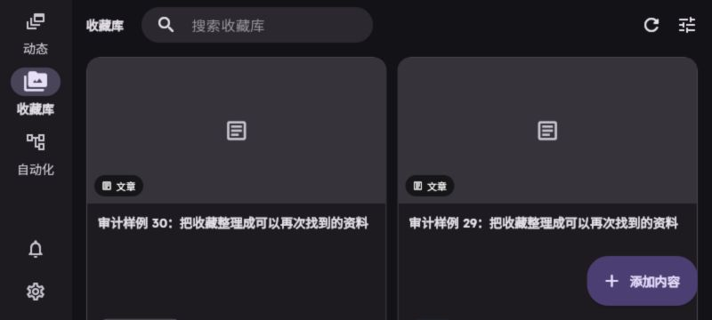
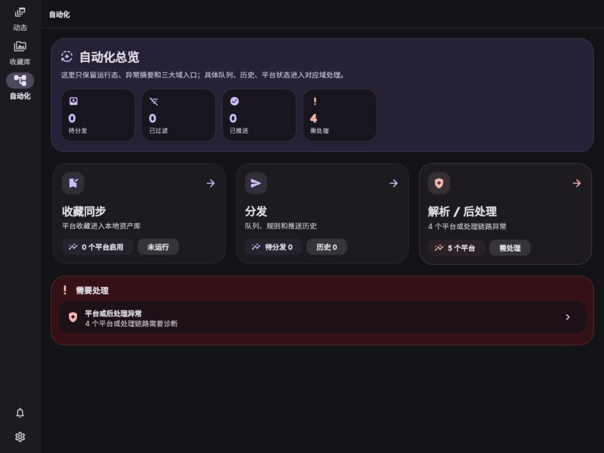

# VaultStream 仓库审计：意图、复杂度与核心体验

## 状态与使用方式

`active`；审计日期：2026-09-05。用户在审计后明确确认：[前端信息架构方案](../plans/2026-06-10-frontend-information-architecture-redesign.plan.md) 与 [系统构想](../plans/2026-07-15-vaultstream-system-concept.plan.md) 基本覆盖产品的真实期望和功能需求，以两者为准。本文已据此修正意图判断；以下代码与测试证据仍对应原审计基线。需求已确认、实现是否完成、本次是否实施是三个独立判断；本次实施范围仍由 [实施任务书](../plans/simplification-and-ux.plan.md) 的 In scope 决定。

初次审计阶段未修改业务代码、提交、推送或部署。起点为 `main@fba018edcafc9fe1fd3a15208b087c9ef9277eb1`，工作区原本干净；远端为 `https://github.com/ienone/VaultStream.git`。该阶段所有实验使用此提交的临时导出、临时 SQLite 和合成数据，未使用真实平台账号、模型请求或外部推送。截图是审计附件；临时实验代码、数据库和日志不作为交付物保留。后续有限实施及按用户要求合入当前工作区的复核记录见文末，不能与原审计基线混同。

## 结论与推荐顺序

项目的主要负担不是“用了 Python + Flutter”，也不是每个大文件都需要拆分，而是**同一操作在不同入口重复编排、任务身份与结果分裂，以及已有能力没有经过真实页面链路验收**。

| 顺序 / ID | 结论与证据等级 | 用户价值 / 净复杂度收益 | 成本与风险 | 处置 |
| --- | --- | --- | --- | --- |
| 1 / VS-A01 | 解析任务按内容批量结算；失败可变为任务成功。隔离实验证实 | 恢复可靠结果；收敛两套解析重试 | 中；涉及状态、幂等和手动重解析 | 实施 |
| 2 / VS-A02 | 禁用平台后失败项重试仍导入；三种重试入口缺少统一策略。单项实证、其余静态 | 尊重用户控制；合并重复导入编排 | 中；必须保留部分失败与来源信息 | 实施 |
| 3 / VS-U01 | 手机及窄平板正文高度为 0。实际浏览器及独立 widget 探针一致 | 恢复核心可用性；删除错误布局约束 | 低；安全区、缩放与横屏需回归 | 实施，可与后端独立 |
| 4 / VS-U02 | 切换导航清空筛选但搜索框保留旧字。实际交互及代码一致 | 返回原任务；减少双份状态冲突 | 低；显式重置仍需保留 | 实施 |
| 5 / VS-A03 | 当时 FastAPI 下 Agent API 目录为空。既有测试失败及 OpenAPI 对照 | 已用框架公开 OpenAPI 能力恢复目录，后续又收窄通用写能力 | 低；不得扩大权限目录 | 已实施；策略修复见归档 issue |
| 6 / VS-Q01 | CI 工作目录导致后端测试收集失败；部分夹具依赖真实 DNS | 让验收可复现，避免以测试数量掩盖缺口 | 低至中；依赖版本仍需记录 | 实施必要基线修复 |
| 7 / VS-D01 | 当前实现、构想和旧 issue 混写；端点清单缺项 | 少维护重复事实，避免错误任务扩张 | 低；保留决策原因 | 随修复同步必要文档 |
| 8 / VS-C01 | DistributionEngine 空继承和测试透传层无独立职责 | 少一个名字和测试替身入口，收益有限 | 低 | 最后小范围删除 |
| VS-U03 / VS-A04–A07 | 页面层级、任务账本、媒体迁移、编辑保护及广泛 Agent 能力 | 已按独立边界持续实施；动态流、账号中心、任务账本、媒体消费者迁移和编辑保护已有进展，剩余项仍需实证 | 中至高 | 不将局部完成扩写为整体完成 |

不推荐引入 Redis/Celery、另一个工作流引擎、全局能力框架、通用结果渲染协议或新前端技术栈来完成这轮修复。没有测得需要这些部署和概念成本的负载问题。收益估计均为定性判断，不设置删行数或百分比配额。

## 基线与覆盖

统计使用 Git 跟踪文件：Python `.py`、Dart `.dart`；排除 `.g.dart`、`.freezed.dart`、`.mocks.dart`、vendor、构建产物。物理行含空行/注释，仅用于量级比较。

| 范围 | 文件数 | 物理行 / 非空行 |
| --- | ---: | ---: |
| backend/app | 190 | 40,628 / 34,814 |
| backend/tests | 93 | 19,033 / 15,554 |
| frontend/lib 手写代码 | 124 | 36,023 / 33,435 |
| frontend/test | 25 | 3,395 / 3,089 |
| docs 原有 Markdown | 75 | 6,353 / 4,333 |

后端生产 requirements 30 项；前端生产依赖 32 项（含两个 Flutter SDK 项）。后端 adapters 约 11,049 行、services 8,523 行、routers 8,469 行，repositories 543 行；前端 collection 约 11,140 行、automation 10,066 行、settings 6,416 行。大小不是删除依据。

当前 Docker 是 Web + Python 后端服务，SQLite 与本地媒体卷；镜像构建时安装 ffmpeg 和 Playwright WebKit。没有把旧历史中的 MinIO、Redis 或其他 checkout 的部署方案当成当前依赖。后端还可以启动解析/分发 worker、定时同步/清理/保活及受控 Bot 子进程；这次 UI 实验关闭正常 lifespan，未启动这些真实副作用。

本机 macOS arm64；根虚拟环境 Python 3.11.16，SQLite 3.53.1，FastAPI 0.141.1、Starlette 1.6.0、SQLAlchemy 2.0.52、httpx 0.28.1、pytest 9.1.1。CI 当前 Python 3.13、Flutter stable，后端大量依赖未锁版本。可用 Flutter 3.47.1 / Dart 3.13.1；隔离目录离线解析依赖改变了 191 项锁定结果，因此前端验证证明“当前源码在可用依赖环境下”的行为，**没有证明原 pubspec.lock 可重复安装**。

| 覆盖对象 | 已做 | 限制 |
| --- | --- | --- |
| 上下文/意图 | AGENTS、根 README、docs 索引；两份构想正文关键章节；plans/issues 索引、相关活动问题和部分归档；关键 Git 历史、可读 GitHub PR；审计后用户对两份文档的明确确认 | 没有逐字审计所有历史文档；历史确认记录不足已由本次用户确认补足，不能继续据此降低需求可信度 |
| 后端 | 10 个模块文档、API/数据库入口；13 个注册 router 的能力清单；捕获、解析、搜索、同步、分发、Agent、事件/配置/媒体关键调用链；模型/schema/相关测试 | router 大文件按入口与关键分支检查，非每行安全审计；平台 adapter 按职责抽样，未做所有平台真实抓取 |
| 前端 | 7 个页面文档、3 个组件文档、路由/shell/providers/client；收藏、详情、动态、自动化、设置实际浏览器交互 | 写操作由隔离中间件阻断；Agent 模型与确认全流程、真实账号、首次安装未做人工 E2E |
| 运行 | 后端非 integration 基线、三项故障注入；Flutter codegen/analyze/test/Web build；真实 shell 探针和只读 UI→真实 API→SQLite | 未跑 Docker、Android/iOS/桌面原生包、生产库迁移、真实外部平台、负载/断电恢复、pip_audit/Bandit/gitleaks 全套安全门禁 |

## 意图还原：目标与手段分开

直接确认依据来自本次用户委托、适用 AGENTS，以及审计后的用户澄清：“这两个文档基本上覆盖全了我对这个产品的真实期望和功能需求，以他们两个为准”。因此，两个文档明确表达的目标属于已确认需求，不能再标为未经确认的 AI 推演。文中本就有条件的技术方向、未定布局及待确定细节仍保持原边界；实现事实由代码和验证说明，实施顺序按功能切片选择。

| 重要意图 | 可信度 | 来源、矛盾和判断 |
| --- | --- | --- |
| 私有收集、归档、阅读、再次找到多平台内容 | 有明确确认依据 | 系统构想三、四、七章及用户确认；这是完整个人知识流的一部分，不能据当前实现把产品缩成收藏夹 |
| 可控制的同步、审批与 Telegram/QQ 分发 | 有明确确认依据 | 系统构想三、十三章及用户确认；保留，不以精简删除 |
| 清晰导航、可返回和跨设备核心体验 | 有明确确认依据 | 两份文档明确动态/收藏库/自动化三主入口；工具具体位置仍待原型，不能混同为主导航目标未定 |
| Agent 帮助捕获、检索、阅读、事件和自动化 | 有明确确认依据 | 系统构想十章和 IA；只读、本地可撤销、高成本/外部/账号/危险操作按文中策略分级，不等于任意写入已获执行授权 |
| 动态推荐、事件聚合、证据/观点对照 | 有明确确认依据 | 系统构想八、九、十二章及 IA；当前占位是实现缺口，不能以缺少历史确认将目标取消 |
| 音视频全局播放、原生 PiP、后台媒体控制、OCR/PDF、页码/时间点 RAG | 有明确确认依据 | 系统构想五至七章及 IA；应用内全局播放第一层已实现，原生 PiP、后台媒体控制、OCR/PDF 与页码/时间点 RAG 仍需分别实施验收 |
| 独立账号中心 | 有明确确认依据 | 两份权威文档均明确独立账号中心与显式入口；当前 `/accounts` 列表和 `/accounts/:platform` 详情已落地，真实平台验收仍待具备账号时执行 |
| 媒体保留与统一播放/访问体验 | 有明确确认依据；资产迁移技术细节仍需设计 | 系统构想四、六章及 IA 为目标依据；专项资产方案是手段，存量迁移仍需窗口与验证 |
| Browser Agent、工作空间扩展、Rust | 有明确确认依据的条件性方向 | Browser Agent 在稳定订阅/接口不足时受控使用；优先单人自托管；Rust 须真实基准证明必要，不能解释为立即全面重写或堆多租户界面 |
| 全局 AI 生成分阶段开发路线 | 已被替代或放弃 | `2f59c19`（2026-07-25）明确移除 AI 生成开发路线；现 plans 索引也要求每次选择功能切片 |

历史核对：GitHub 可读集合返回 4 个 closed PR，未见独立 Issue 讨论或评论提供上述蓝图的逐项确认。[PR #3](https://github.com/ienone/VaultStream/pull/3) 可佐证早期统一内容结构和前后端贯通工作；[PR #4](https://github.com/ienone/VaultStream/pull/4) 是未合并 WIP，不是产品范围批准。两份构想文件名日期不等于批准日期；相关 Git 演进包括 `527d7b6`、`fc77bfc`、`7896179`、`d7aa947`、`4e40630`、`2f59c19`。历史检索当时没有提供确认记录；审计后的用户明确确认已补足依据，现以两份文档为产品目标准则。

意图摘要：产品目标是自托管个人知识流，覆盖捕获、归档、理解、探索、行动。此次切片先修“收进来—读得到—找得回—按用户规则再处理”的基础可靠性；事件、主动探索、原生媒体和跨场景 Agent 是已确认需求，尚未进入这个切片，不是应删的膨胀方向。保留数据、来源与人工修正，按文档边界渐进实现，不恢复已删除的总路线。

## 系统地图与主要链路

```text
应用 shell：动态 /home → 收藏库 /collection → 自动化 /automation
工具入口：通知（占位）、设置 /settings；/agent 路由存在但没有同等全局入口
收藏：分享/添加 → POST /shares → ContentService → Content + ContentSource → Task
      → worker/ContentParser → adapter → 正文/媒体/索引 → 收藏列表/详情/搜索
同步：平台设置与启用策略 → favorites scheduler/manual/retry → 同一内容导入链
发现：RSS 或 Telegram 监控 → discovery 缓冲 → 后续处理/收藏
分发：审批/规则 → DistributionService → DistributionQueue → worker → Telegram/QQ
Agent：会话/工具注册/确认 → domain tools 或 ASGI API bridge → 上述实际 API
```

| 链路 | 已核实的职责与结果 | 边界/断点 |
| --- | --- | --- |
| 捕获/同步 | URL、原始文本及单/多文件进入同一前端捕获 surface 和内容写控制层；系统分享保留来源上下文，多张图片持久化为同一 gallery；Bot 显式 `/save` 与私聊明确保存前缀复用链接/文本/附件 contract；favorites 三个平台实现各有认证、游标、限速职责 | 开放式自然语言理解、Bot 不确定场景确认、跨消息附件组、OCR/转写与真实原生分享仍未验收；历史 enqueue/retry 缺口已按 A01/A02 修复 |
| Bot/发现 | `bot/main.py` 注册消息处理，`bot/monitoring.py::handle_monitored_message` 只处理已开启监控的 chat，把 URL 写为 discovery 的 INGESTED 内容；Bot 命令有权限边界。发现源当前是 RSS/Telegram | 监控直接写缓冲不是同步 create_share 的同义入口，不能盲目合并；HN/Reddit/GitHub 等枚举不等于支持，未支持类型返回错误 |
| 解析/归档 | worker 领取 SQLite Task，adapter 分层抓取，更新内容、媒体、索引/审批；API 重解析另调 `retry_parse` | 两套重试和终态；强制重解析会覆写字段，人工编辑保护尚未落实，目标已确认 |
| 浏览/搜索 | 列表/详情读真实数据库；关键词过滤、Embedding 分块/签名索引、FTS/vector 混合与 RRF 实现存在 | 不是完整带来源问答 RAG；本轮没有调用真实模型、验证嵌入质量 |
| 自动化/分发 | 规则、审批、队列、目标、渲染配置及 worker 有真实调用；enqueue 与 worker poll 分别受策略控制 | 页面汇总不等于任务已闭环；没实际向 Telegram/QQ 发送 |
| Agent | LangGraph 会话和 registry、持久化高风险确认；api_bridge 用 httpx ASGITransport 调实际 app | 目录已恢复；通用写能力已收窄为内容更新与卡片审核，外部/系统副作用拒绝 |
| 状态/配置 | SQLite Content、Task、DistributionQueue；SystemSetting 中保存配置及部分 run JSON；ConfigService 类型化缓存，settings_service 写入/刷新；环境 Settings 存启动项/凭据 | 这些职责不能全归为重复；任务身份/状态确实分裂。多 worker 缓存失效未实测 |
| 事件/媒体 | EventBus 内存订阅 + SQLite realtime_events 重放；asset/variant/manifest/签名资源访问；部分旧 URL/proxy 消费者仍在 | 不可替换成纯内存总线丢重放；媒体须有迁移退出条件 |

## 可直接实施的发现

### VS-A01：收敛解析执行与任务结算，保留 SQLite

证据：`backend/app/core/queue_adapter.py::dequeue` 使用 Task.id CAS 领取，返回时丢掉行身份，只给 payload；`mark_complete`（126）和 `push_dead_letter`（148）按 content_id 更新所有 RUNNING 行。隔离数据库为同一 content 建两个任务、都领取后调用一次完成，**两行均 COMPLETED**。`is_processing` 对多个结果调用 scalar_one_or_none，异常被转为 False，可能进一步放行重复处理（静态证据）。

`tasks/parsing.py::process_parse_task` 的 finally（157）无条件完成。注入重试耗尽异常后，实际处理器写出 **Content=PARSE_FAILED、Task=COMPLETED**：`_handle_parse_error` 按原始 attempt 判断，而内层已经消耗重试。该实验只替换外部解析执行为确定异常，数据库、队列与终态路径真实执行；没有借外部平台故障猜测。

同文件 `_execute_parse_with_retry` 与 `retry_parse`（775）是两套真正被调用的重试/更新流程，后者的异常分类和后处理不同；`routers/contents.py` 的直接重试/后台重解析均有消费者。`ContentService.create_share`（144–150）及 update_content（200–202）还忽略 enqueue=False；这是可达代码证据，未额外模拟数据库写失败。

推荐：保留 SQLite Task 和现有 SQLAlchemy CAS；领取、完成、失败都使用唯一 Task 行身份，成功/跳过/失败显式结算，finally 只清理资源。统一解析、错误分类与后处理的执行器，队列和 HTTP 入口只负责编排、保留既有 HTTP 契约；去掉第二套重试循环。提交内容后入队失败必须作为明确错误返回，不再假称成功；保留已保存内容及来源，使重复提交可安全重试，不引入新 outbox 系统。

取舍：少两套状态规则和重复重试，比迁移任务框架更直接；不删除历史 Task、不自动重放外部副作用、不承诺断电恢复。当前没有完整 lease/recovery 证据，已有 graceful shutdown 测试不等于崩溃恢复。自动恢复属于 A04 后续设计。

验收：同内容两任务互不结算；耗尽/认证失败/非重试错误终态正确，成功只后处理一次；取消不伪成功；API 入队失败可见且再次提交不会重复内容；队列与手动解析的分类/后处理一致。详见任务书批次 2。

### VS-A02：失败项重试必须复用已有控制策略

证据：`routers/system.py` 中 `/favorites-sync/sync` 调用 `AutomationPolicyService.favorites_platform_manual`；run retry（1716）、item retry（1786）、batch retry（1890）没有同等检查。设置 enabled platforms 为空后调用 item retry，实际 HTTP **200、导入调用 1 次**。实验替换的仅是 ContentService 外部导入边界，无真实抓取。

run/all 的内部路径与单项不同，不能声称三条都已动态证明绕过；单平台调用及重复 router 编排已静态确认。已有 [专项 issue](archive/favorites-sync-retry-policy-gap.md) 方向基本成立，但“新增 force”的建议不能照搬：现有策略已经表达显式 override 语义，先读真实 contract。

推荐：在创建 retry run 或导入之前复用已有 policy，把单项/批量的共同导入与来源/结果处理收敛到 favorites 业务层；router 保留参数、HTTP 映射。默认禁用返回既有策略格式的 409，并展示原因。既有显式允许手动覆盖配置按 contract 保留，不能新开一个默认强制开关。all 模式只作用于当前允许的平台；部分失败仍保留逐项结果。

Agent API bridge 会执行同一 API，所以应修领域边界，再测工具入口，不能只隐藏前端按钮。不要据此宣称所有 Agent 操作都绕过策略：分发 enqueue/worker pause 已有检查，直接重排队列不等于暂停时真的发出消息。

验收：UI/API/Agent 下 disabled 的三类重试都无导入副作用；允许的路径能成功；混合批次、来源、重试历史和错误结构保留；删除单项/批量重复导入块。

### VS-U01：导航栏占满手机屏幕

`frontend/lib/layout/app_shell.dart::_MobileShell.build`（109 起）把 crossAxisAlignment.stretch 的 Row 直接用作 bottomNavigationBar，没有竖向边界。360×800 浏览器中只见三主入口，正文不可见；真实 AppShell + StatefulShellRoute 的最小 widget 探针得到 **360×800、600×900 的 body.height=0**，800×360 有正文。不是网络空列表导致。


推荐：为底部导航提供正确的内容高度及 SafeArea 约束，复用 NavigationBar 和工具菜单，不重做导航 IA、不另加兼容分支。核心页面正文应获得余下空间；横屏短高度不被顶栏/辅助区耗尽。验收覆盖 360×800、600×900、800×360、1200×900，并加文字缩放、安全区、三入口可点击与返回行为测试。

### VS-U02：返回收藏库后筛选语义和显示分离

`AppShell._onDestinationSelected`（28 起）在“当前或目标是收藏库”时 clearFilters；StatefulShellRoute.indexedStack 原本能保留各分支状态。实际输入“审计样例 29”并形成筛选 chip，切到自动化再返回，chip 消失而搜索文字仍在。列表不再表示框中查询，用户无法判断当前范围。

推荐：普通分支切换保持查询、筛选与滚动位置；清空只由明确的重置交互触发，并使搜索框和 provider 同步。不添加新的全局状态容器。复用已有状态保留机制符合 [Flutter 自适应最佳实践](https://docs.flutter.dev/ui/adaptive-responsive/best-practices)。验收要断言 provider、输入框、结果与返回位置，不能只测导航索引。

### VS-A03：用公开 OpenAPI 能力替换脆弱的 API 目录扫描

`services/agent/tools/api_bridge.py::_api_catalog_tool`（115 起）平铺 app.routes，假定每项有 path/methods。当前运行时出现 13 个 included-router 节点，app.openapi() 有 131 个路径，而目录返回空；既有 `test_agent_api_catalog_lists_client_api_surface` 失败。

推荐遍历 `app.openapi()['paths']` 的 HTTP operations，再应用现有路径允许/禁止范围、prefix、include_mutations 和 confirmation 标记，输出字段保持兼容。不要写框架私有树递归或“旧扫描失败再换方式”。FastAPI 当前官方明确提供 app.openapi()，路由内部可以是树，由框架负责展开：[Extending OpenAPI](https://fastapi.tiangolo.com/how-to/extending-openapi/)。

净收益：删除自行猜框架路由结构的责任；无新依赖、许可、服务或数据迁移。以本机 FastAPI 0.141.1 / Starlette 1.6.0 为已验证版本，CI 解析出的版本另记；还须验证公开 operation 元数据到现有 name 字段的稳定映射。测试必须用实际 FastAPI include_router，涵盖读写过滤和禁区，不能全 mock app.routes。

### VS-Q01：先修复验证入口，不降低标准

CI 从 backend 运行 pytest，根目录 `scripts` 不在 import path，`test_scripts/test_dev_controller.py` 收集时报 ModuleNotFoundError。根目录启动能越过此问题；pytest 官方说明 python -m pytest 会把当前目录加入 sys.path：[调用方式](https://docs.pytest.org/en/stable/how-to/usage.html)。推荐明确 pytest 的两个源码根路径，保留 workflow 的 backend 工作目录与覆盖率配置，避免每个测试自行 sys.path 注入。

adapter fallback 测试先经过 safe_fetch DNS 校验，现有 httpx_mock 不替代 DNS，导致在受限环境中注册响应未消费。应在测试边界提供确定的公开地址解析，并覆盖私网/重定向拒绝，不能关闭 SSRF 或放宽“未消费响应”断言。监听端口测试经提权单独重跑已通过，不是业务失败。

没有把本次环境升级当成修复：后端无锁定、CI 与本机 Python 不同；Flutter 离线重新解析的依赖不等于原锁文件通过。当前切片记录支持环境与真实解析版本，不顺手进行全仓依赖升级/锁定工程。

### VS-C01：只删除确认无职责的分发别名

`services/distribution/engine.py::DistributionEngine` 是空的 DistributionService 子类，包导出之外的消费者是测试；生产规则匹配/审批/入队在 DistributionService。scheduler 的 `_enqueue_content_impl` 也是无独立行为的测试透传层。

推荐删除空别名、导出和纯测试透传，相关测试改验实际服务；保留 enqueue_content_background 管理异步 session 生命周期及错误边界的责任。不要删除所有 repository，也不要仅按单实现数量合并 adapter/favorites/provider，它们隔离外部协议、SQL 或生命周期。验收检查导出、动态加载、测试 patch 位置与分发策略行为。

## 暂缓的架构与体验问题

### VS-A04：持久化运行账本与常用任务 renderer 已落地

原审计确认 `background_task_state.py` 的 SystemSetting run JSON 以读改写维护，存在并发覆盖风险。2026-09-06 已在 A01 之后完成最小数据边界：新增 `background_task_runs`，以稳定 `run_id` 原子开始/结算，每任务保留 200 条；M30 只清理成功迁移的旧键。诊断跨任务查同一张表，详情按主键读取，通用 API 把任务特定字段收敛到 `metadata`，前端不再解析未声明顶层 extra。仓库实验库 15 条旧记录已迁移，schema 30、旧键 0、完整性检查通过；并发回归覆盖 12 个 run 同时写入无覆盖。

2026-09-06 后续已补读取时 task presentation：常用任务得到业务标题、摘要、错误码、结构化结果、实体链接和安全导航动作，原始 payload 降为折叠诊断；收藏同步旧详情弹窗已删除，失败项 retry 迁入统一任务页并继续经过原领域策略。仓库实验库中的失败重解析 run 已通过真实读取与 schema 校验。仍没有重放 `running`；运行账本不是持久队列，崩溃恢复仍需独立定义 lease、幂等和外部副作用边界。标准库 create_task/TaskGroup 提供进程内并发与取消，不覆盖数据库持久化：[Python 3.11 asyncio](https://docs.python.org/3.11/library/asyncio-task.html)。

### VS-A05：媒体双路径有真实迁移需求，不能整块盲删

assets、variants、manifest、签名 URL 和前端候选读取在审计时仅部分落地；当时仍有 legacy mapUrl、嵌套媒体、队列预览/推送等旧消费者。存量字段不能仅因新模型存在就移除。旧 [媒体问题](archive/media-proxy-image-access.md) 把请求路径工作混为一谈：quota trim 当时已使用 asyncio.to_thread；图像解码/转码仍同步处于 async handler，冷 miss 仍做 quota 扫描。转码/存储/限额异常被一并降级为原始缓存，而 cache hit 固定 image/webp，存在内容类型失真静态证据，未做真实媒体下载探针。

推荐未来沿现有媒体计划限定一组实际消费者迁移，再删除对应旧路径；退出条件是存量样本与全部相关读写消费者均走资产契约。先明确错误与 MIME，再按测量移动阻塞工作；to_thread 并不保证 Python CPU 工作并行，官方有 GIL 限制。无需先引入新代理服务、缓存框架或对象存储。当前有实际安全/历史数据责任，保持迁移期有范围和退出条件。

当前状态（更新于 2026-09-06）：代理缓存命中 MIME、失败阶段、事件循环阻塞、同 URL 冷请求合并、不同 URL 冷工作并发及低频配额检查已收敛；资源级签名与公开代理不携带全局 API Token。正文嵌套媒体、全屏图集、收藏/动态卡片和自动化队列预览已持有资产/变体候选；发现列表/详情 API 也分别返回 card/detail 用途资产。前端旧 `mapUrl()`、`mapPlayableUrl()`、图片专用鉴权头及旧直链回退已删除；未归档 Markdown 图片显示明确占位，附件会在打开已知过期签名前刷新一次 manifest。仓库实验库当前 8 条内容、7 个资产，旧字段存在但缺少资产的内容为 0，回填 dry-run 待新增资产为 0。签名 blob 的 Range、过期、刷新读取和缺失写回探针直接使用仓库实验数据库/存储通过；队列与 Telegram 本地上传边界也已持久化贯通。旧 API/数据库字段仍承担迁移、编辑或嵌套身份匹配，schema 清理尚未完成。真实浏览器/原生长媒体、后台播放和 Telegram/QQ 网络发送仍无完整验收，不能把代码或本地适配器通过写成外部可用。

### VS-A06：人工编辑与强制重解析存在冲突

`ContentService.update_content` 允许编辑，`ContentParser._update_content` 会更新 title/body/author/source_tags 等字段；未找到这些字段的编辑来源/版本保护闭环，layout_type_override 则已有保留。详情 reParse 入口没有呈现字段覆写影响。静态可达链成立，本轮不使用用户真实数据试验。

系统构想四章已明确：人工修改过的标题、正文、标签、模板不能被重解析静默覆盖；新结果应可比较，由用户接受、合并或保持现状。因此这是已确认保护目标的实现缺口，不应再次询问是否需要保护。版本表示、比较/合并交互及迁移方案仍需独立切片设计。A01 不得扩大覆盖范围或让原先跳过的成功内容重解析；若涉及未定义的迁移/覆盖细节，停止该部分处理设计边界。

当前状态（2026-09-05）：最小保护闭环已实现。数据库记录人工字段和最新冲突候选；解析写入保留人工值；详情页逐字段比较并支持采用、保留、合并；重新解析前呈现覆写边界。该闭环不声称提供完整历史版本，也未扩大 A01 的重试范围。

### VS-A07：Agent 的能力范围与流控制需要分别判断

API bridge 原有大前缀已收敛为显式 method + path template：通用 mutation 只允许内容字段更新与卡片审核，settings、Bot、收藏同步、外部发送和队列写操作均拒绝。高风险工具不再接受调用方自报 `confirmed`；专用 `push_batch` 在用户确认后仍服从分发暂停策略。关闭证据见 [归档 issue](archive/backend-agent-api-bridge-policy-bypass.md)。没有证据批准进一步扩大能力集。

前端 Agent 页混合输入/会话/UI 与独立 SSE 读取；普通事件 SSE 还负担重连、鉴权与游标重放，两者不能为了统一硬塞进万能组件。事件客户端 90 秒 idle、服务端较长保活值得单独核对；隔离运行见反复重连，但未做连接/负载专项验证。保留现有鉴权和重放，不以浏览器裸 EventSource 替代含 header 的 client。

### VS-U03：主要页面职责和视觉层级尚未完成，但不自动补蓝图

| 页面/入口 | 用户任务、主动作与下一步 | 观察与建议 | 当前处置 |
| --- | --- | --- | --- |
| 动态 /home | 发现值得看的订阅更新、事件变化和摘要 → 内容/事件详情 | 已接入 discovery 候选流、来源上下文、媒体资产、分页、收录、忽略、稍后处理与恢复；人工事件按更新时间进入独立视图 | 候选与人工事件浏览闭环完成，继续补自动事件生产与综合 |
| 收藏库 /collection | 找/加/筛选内容 → 详情阅读与上下文操作 | 无封面文章仍占大媒体占位，高度挤压标题与文本；800×360 尤其明显。未来对无媒体内容用更紧凑文本卡，保留真实媒体卡，不全站去圆角 | U01/U02 实施；卡片重设计暂缓 |
| 内容详情 | 阅读、原文、编辑/更多 → 返回原列表 | 当前顶部已是原文 + 更多，不是历史“五个同级图标”；桌面正文/来源/目录可读。卡片 OpenContainer 的内部导航与已有深链路由并存，URL 未随打开变化 | 深链一致性候选；本轮不改整套阅读器 |
| 自动化 /automation | 查看/控制同步、发现、分发并处理结果 → 对应领域面板 | 总览、收藏同步、分发队列/历史、解析后处理已有独立深链；健康汇总按启用范围过滤，异常只出现一次，领域卡只保留本域数量 | Section Shell、健康误报和总览层级已收敛；继续拆分有真实业务目标的 Detail Shell |
| 设置 /settings | 应用/系统配置 → 回到任务页 | 平台账号已迁入独立 `/accounts`；设置保留服务器连接、AI/发现、推送/通知和外观/系统 | 账号职责已移出；继续收敛低频配置层级 |
| 消息盒子 | 集中查看消息/回执/确认并跳转处理 | `/notifications` 已持久化后台失败、用户主动任务回执、应用/Telegram Bot Agent 工具确认、Bot 显式捕获成功回执、平台登录失效和周期摘要；捕获回执深链对应收藏并随内容删除移出 | Agent confirmation、Bot 确认/捕获、平台认证和周期摘要闭环完成；普通 Bot 对话仍不入盒 |
| Agent /agent | 会话、工具过程与确认 → 操作结果 | 路由、全局入口和基础页面存在；待确认项可跨刷新/会话切换恢复，停止/清空/删除会取消旧确认；会话/SSE/timeline 已进入 typed controller；未调用模型人工验收 | 确认生命周期、策略和前端状态边界已修；真实模型待专项验收 |





截图与交互使用 30 条含长中文标题/正文、不同平台、解析失败项的合成收藏；浏览器读真实 API/SQLite，写及外部媒体请求被阻断。测试过暗色 360×800、600×900、800×360、1200×900；检查过桌面详情、动态、自动化、设置、搜索与导航返回。浅色 1600×1000 切换后只观察到加载态，不能算完整浅色内容验收。未系统验证文字缩放、键盘全链路、TalkBack/VoiceOver、触摸真机、所有空/错误/部分失败状态；加载骨架及未配置状态有观察，接口写入/权限/部分失败主要依靠代码和测试。手机正文缺失阻断了移动阅读验收。

## 规划—实现—用户可用程度对照

来源 S＝系统构想，I＝前端 IA，M＝媒体专项，P＝解析可靠性专项；具体文档见 [plans 索引](../plans/README.md)。这里的“实现”限于本轮覆盖。

| 目标 / 来源与可信度 | 当前证据 | 状态、缺口 | 建议 |
| --- | --- | --- | --- |
| 统一捕获 / README、S/I，有明确确认依据 | `/shares`、`/captures/text`、`/captures/file(s)`、统一 adaptive surface、来源与媒体资产 | 链接、文本、单/多文件已贯通；入队失败可见。Bot `/save` 和私聊明确保存前缀已接入链接、文本和单消息附件，`/ai` Agent 确认已贯通；开放式意图理解、跨消息 media group、Bot 不确定场景确认和真实原生分享仍未验收 | 继续接入真实指令/捕获生产者，不恢复第二套分享表单 |
| 收藏同步 / S、有明确确认依据 | 三个平台同步、游标/run、设置与自动化面板 | 部分实现可用；禁用 retry 漏控 | A02 修现有能力 |
| Telegram 监控发现 / S、有明确确认依据 | 已开启 chat → INGESTED 缓冲 | 已实现但未真实 Bot 验证；不等于转发媒体全能捕获 | 保留，未来按样本验收 |
| RSS/Telegram discovery / S、用户已确认的主动探索目标 | source、scheduler、scoring/collect 接口 | 部分实现；更多 source 枚举、Browser Agent 无闭环 | 不补所有来源 |
| 收藏列表/详情 / README、I，有明确确认依据 | 实际 Web 读取长正文、打开详情 | 桌面已实现且本轮验证；窄屏不可用 | U01/U02 |
| 编辑/批量操作 / I、有明确确认依据 | ContentService 更新、批量动作与 UI | 已实现但本轮只读，未完整操作验收；人工保护不足 | A06 已确认保护目标，后续设计实现 |
| 关键词/语义找回 / S、有明确确认依据 | FTS/vector/RRF、索引签名与分块 | 部分实证；关键词交互验证，模型召回质量未验证 | 保留；文档删除“混合检索仅未来”的失真 |
| 页码/时间点问答与完整 RAG / S、有明确确认依据 | 有检索和 Agent，不足以证明引用问答闭环 | 未找到完整实现 | 已确认需求，后续切片 |
| 审批/分发/目标 / README、有明确确认依据 | 规则服务、队列、worker、Bot adapter | 已实现但未外部发送验收 | 保留，C01 只去空壳 |
| 动态推荐流 / I、有明确确认依据 | `/home` 读取 discovery items 与 active knowledge events，展示来源/正文预览/媒体并持久化收录、忽略、稍后处理和恢复 | 候选、稍后列表和人工事件变化入口已实现；自动事件生产和模型质量未验 | 继续补已确认缺口，不重写现有 feed |
| 通知/通用任务结果 / I、有明确确认依据 | 持久化 run 账本、深链、核心 payload 与常用 task presentation 已贯通；`/notifications` 接收失败、用户主动完成回执、应用/Telegram Bot Agent 工具确认、Bot 显式捕获成功回执、平台登录失效和周期摘要并保存用户消息状态 | 通知→任务业务结果、实体/领域入口、收藏同步失败项、Bot/应用 Agent 待确认、Bot 捕获、账号修复跳转和基于持久化活动的摘要已闭环；普通 Bot 对话不自动入盒 | 后续按真实来源接入，不恢复 diagnostics 临时 sheet |
| Agent 工具与确认 / S、有明确确认依据 | 会话/registry/持久化 confirmation/API bridge；待确认项可恢复，所属 run/session 结束后取消；Bot `/ai` 可展示并决定带归属的确认；通用写 bridge 已收敛，push 服从暂停策略；前端使用 typed controller 消费 session/SSE/confirmation | 确认、策略、前端状态和 Bot 确认响应闭环已实现；真实模型与 Telegram 网络未验 | 不扩大工具集；继续按真实流程补验收 |
| 媒体资产访问 / S/I 目标已确认，M 为迁移手段 | asset/variant/manifest/签名；图片、播放、附件、队列与分发消费已迁移；旧 URL 映射和媒体 API Token 已删除；仓库实验库真实 API/签名读取及本地适配器探针通过 | 旧 API/数据库字段仍用于迁移、编辑或身份匹配；真实浏览器/原生长媒体、后台播放和 Telegram/QQ 外部发送未验收 | A05 继续 schema 清理与真实平台验收 |
| 多模板与富媒体阅读 / S/I、用户已确认的完整目标 | layout/template、Markdown、媒体播放器 | 部分实现；不能把枚举当所有模板完成 | 保留现有，按需求选择后续 |
| 全局媒体会话/PiP/后台播放 / S/I、有明确确认依据 | 应用级 provider 现持有同一控制器和候选会话；详情、Root Shell mini player 与 `/player` 已贯通 | 应用内连续会话第一层完成；真实长媒体、原生 PiP、后台播放与系统媒体控制未验收 | 保留当前会话，后续按平台原型补原生闭环 |
| OCR/PDF、事件聚类与证据差异 / S、有明确确认依据 | 人工知识事件已通过独立 ORM/API、内容关系和响应式详情页贯通角色与证据状态 | 自动聚类、综合、OCR/PDF 仍未实现 | 保留人工事实边界，后续再加低置信建议与模型综合 |
| 独立账号中心 / S/I、有明确确认依据 | `/accounts` 与 `/accounts/:platform` 复用真实 platform-health/browser-auth，Shell 有显式入口；设置不再重复账号对象 | 独立列表、单账号能力状态、问题、最近同步、修复步骤与账号动作已实现；真实平台验收仍缺，后端未声明细粒度 OAuth scope | 不恢复旧账号页，不从能力字段猜测 scope |
| 多租户/Rust / S、已确认的条件性方向 | 未找到产品闭环或基准 | 未找到实现 | 当前不引入；保留单人优先与基准前提 |
| 平台可靠性“完成” / P、文档报告 | plan 标记 completed-with-known-limit，历史 16 样本 15 通过、知乎 question 受限 | 历史有限验收，本轮未复跑；不是当前所有平台可用 | 修状态与证据日期，不冒称完成 |
| 全局阶段路线 / 历史 | 删除路线的提交与现索引 | 已失效或被替代 | 不恢复 |

## 文档减负（VS-D01）

保留当前模块/API/数据库契约、真实边界与决策原因。两份构想保留为用户已确认的目标依据，未实现条目标为实现缺口；不要复制出第三份总路线。

| 对象 | 具体失真/重复 | 推荐处理 |
| --- | --- | --- |
| plans/README 与两个构想 | 审计曾因缺历史确认降低可信度，用户现已明确确认 | 恢复权威需求地位，保留文中条件和未定细节；不以精简删掉已确认目标 |
| 媒体/解析专项索引 | 媒体索引 draft 与正文 active/实际部分迁移不一致；解析索引 active 与正文 completed-with-known-limit 不一致 | 以实际范围、历史验收日期和限制同步状态 |
| frontend README/navigation、dashboard.md | 旧工具 overlay、首页趋势/任务时间线等描述与当前 UI 不一致 | 当前文档只描述实际导航/占位；愿景链接计划，不假装完成 |
| search-rag.md | 混合搜索描述落后于当前 RRF/FTS/vector 代码 | 标明已有实现与未做质量验收，区分 RAG 问答 |
| frontend-control-policy-gaps 等旧问题 | 泛化“没有策略”，实际 AutomationPolicyService 已有多入口控制 | 已逐 producer 闭环并归档；未来出现具体绕过时再建聚焦 issue |
| media-proxy-image-access | 原审计问题已按统一资产/候选、受控代理缓存和语义失败态完成 | 已归档；外部媒体/平台验收限制保留在当前组件文档 |
| docs/backend/api/endpoints.md | 校验缺 POST /api/v1/ai/models | 按真实 router/schema/client 更新，不猜返回值 |
| issues/README、若干归档引用 | 仍提已移除总路线；部分反引号路径指向已归档 issue | 删除失效路线指向、修实际归档路径；实测普通 Markdown 链接检查未发现断链，不等于反引号引用有效 |
| 本审计与专项 issue | 审计是跨域证据，不应长期复制修复进度 | 实施按 ID 维护状态与链接；关闭时专项 issue 同步，不为每项新建模板 |

初次审计只交付报告和任务书。后续 D01 只更新这些已指出的事实及实施涉及文档，不借“文档治理”大规模重写或删除已确认目标。process 在实施确已开始且需要跨会话记录时才创建。

## 验证结果、复现方式与限制

全部后端测试使用仓库根 `.venv/bin/python`，在隔离导出中运行。Flutter/Dart 全部按 AGENTS 在沙盒外授权执行。基线失败不等于本轮引入回归。

| 检查 | 结果 | 解读 |
| --- | --- | --- |
| backend cwd：`python -m pytest tests -q -m 'not integration' --tb=short` | 收集 1 error，scripts 模块不存在 | 与当前 CI 启动方式一致的本地复现；未声称 GitHub CI 已执行 |
| repo cwd：`python -m pytest backend/tests -q -m 'not integration' --tb=short` | **813 passed，3 failed，5 errors，4 skipped，9 deselected**；60.07s；coverage 66% | 失败为 API catalog、tiered fallback、控制端口；5 errors 属 httpx_mock 未消费校验；覆盖率是配置统计，非功能完成度 |
| 控制端口失败单测提权重跑 | **1 passed**，0.59s | 沙盒不能监听本地端口导致前次失败，不归为业务 bug |
| 3 个临时故障注入测试 | **3 项预期行为断言失败** | 分别证明 A01 的两种错态与 A02 单项 retry 漏控；独立于既有套件统计 |
| requirements coverage | 通过 | 依赖声明覆盖，不是供应链安全审计 |
| OpenAPI docs inventory | 失败，缺 POST /api/v1/ai/models | 当前公开路径数量 131 |
| SQLite schema gate | 临时新库通过 | 不证明真实存量库迁移成功 |
| Flutter 离线依赖/codegen | 成功；生成 91 个输出；json_annotation 范围提示 | 隔离锁文件被重新解析；没有改工作区 lock/codegen |
| `flutter analyze --no-pub` | 非零；3 条 use_null_aware_elements info | detail_sections.dart 299/353/475；没有编译错误，不写“analyze 通过” |
| `flutter test --no-pub --reporter expanded` | **98 passed** | 原测试没覆盖真实 shell 的窄屏正文高度 |
| 真实 shell 临时探针 | 2 failed、1 passed | 360×800 与 600×900 正文 0 高度；800×360 通过 |
| `flutter build web --no-pub --release` + 隔离 API defines | 成功 | 非生产配置、非原锁依赖验收、非原生端验收 |
| 浏览器只读链路 | 收藏/详情、动态/自动化/设置可观察；U01/U02 复现 | 未全量 mock API；后台任务、真实外部请求/写操作被禁用 |

最小重建实验：从上述提交导出到临时目录；用测试 fixture 的 SQLite/session maker 创建两个同 content_id 的 Task，领取后只完成一次；以确定 RetryableAdapterError 代替解析外部调用，读取真实 Content/Task 终态；平台 enabled 设为空，用真实 retry route、仅拦截导入外部边界检查调用数。前端以真实 AppShell + StatefulShellRoute + 三个简单页面断言各尺寸的正文区域，再用隔离真实 API 的合成内容验证返回筛选。实施时将必要回归测试正式放入 tests，不保留一次性探针为 CI 依据。

## 已确认目标、待定细节与停止线

1. 动态候选流、稍后处理和人工事件变化入口、独立账号列表/详情、持久化消息盒子第一阶段和 Agent 显式全局入口已按确认目标进入实现；自动事件生产和更多消息生产者仍是后续切片，不再询问是否需要。
2. 全局工具具体放顶栏还是侧栏、播放器位置等，IA 明确保留原型比较；这是布局细节未定，不是功能目标未定。
3. 人工修改不能被静默覆盖、重解析结果可比较和选择已明确；版本表示、合并交互、历史任务保留、崩溃恢复与媒体迁移窗口仍需有限设计与验证。
4. Agent 按文中只读、本地可撤销及高成本/外部/账号/危险操作分级。具体工具 contract 和确认实现须遵循此边界；产品能力确认不等于逐次外部操作授权。
5. 原生媒体、事件聚合、OCR/RAG 和受控探索属于已确认目标，后续选择功能切片；多用户与 Rust 继续遵守文中单人优先、资源/性能证据和适时演进的条件。

本次需求澄清不改变原修复 In scope，也不把既有测试结果扩展为完整产品验收。当前实现文档与两份权威文档不一致时，分别标明实现缺口和目标；如两份权威文档自身出现无法调和的冲突，再集中确认具体冲突。不可逆数据操作、超出契约的人工内容覆盖或新的外部副作用仍须停止对应操作并说明边界。

## 2026-09-05 处置结果

[核心链路精简与可用性修复任务书](../plans/simplification-and-ux.plan.md)的 In scope 已实施并标记 `completed-with-known-limit`：VS-Q01/U01/U02/A01/A02/A03/C01/D01 均有正式回归和行为证据。原审计失败与截图保留为历史基线，不改写为从未发生；修复后截图位于 [simplification-and-ux](assets/simplification-and-ux/) 目录。favorites retry policy 问题已移至 [归档 issue](archive/favorites-sync-retry-policy-gap.md)。原生端、真实平台、部署、CI Python 3.13、完整键盘/读屏链路及 Out of scope 项仍未验证或未实施，不能由本次完成状态外推。

## 2026-09-05 当前工作区复核与需求更正

用户明确要求直接在 `/Users/ienone/coding/vaultstream` 变更，不再创建工作区或通知已完成任务。已检查原实施任务的关键代码、测试和记录，将其未提交修复合入当前工作区；保留本次需求确认，不覆盖两份权威文档的目标。不新增任务、不提交、push 或部署。

当前工作区实际复核：后端非 integration 套件（单独排除监听端口用例）**830 passed / 4 skipped / 10 deselected**，52.85 秒；监听端口用例沙盒外重跑 **1 passed**。requirements、131 条 OpenAPI inventory 与临时新 SQLite schema gate 均通过。前端旧构建缓存直接运行时因生成代码缺失导致失败；重新离线解析依赖、build_runner 生成 91 个输出后，`flutter analyze --no-pub` 无问题，`flutter test --no-pub` **104 passed**。原 pubspec.lock 和 analysis_options.yaml 已恢复；测试使用此次解析的可用依赖，仍不证明原锁文件在全新环境可重建。初次沙盒外请求曾因自动权限审核超时未启动，后续合法重试完成，未绕过 Flutter/Dart 提权要求。

视觉证据需降级说明：复看原任务的 `collection-mobile-dark-360x800.png`，右侧内容及导航存在裁切。这张图不足以证明完整窄屏页面验收，尚不能区分截图视口问题与运行布局问题。本次未重做浏览器交互验收；widget 尺寸/导航测试通过不能替代此项。保留原图及该限制，不把它描述成完整移动端视觉通过，也不据截图直接修改未经定位的业务布局。宽屏、原生端、真实平台和部署结论仍以各自实际证据为限。

两份权威文档明确的动态、账号中心、通知、跨场景 Agent、媒体/检索及人工修订保护均为已确认目标；已实现部分记录可重复证据，未完成部分继续记为实现缺口，不再当作需求未确认。文档自身保留的原型、优先级、性能前提和迁移细节仍按原边界处理。

## 2026-09-06 Agent confirmation 与策略边界切片

Agent 待确认项现已持久化投影到消息盒子，并可按 session 恢复；消息深链使用 `/agent?session_id=...`。停止 run、清空或删除 session 会取消待确认项，批准执行失败也会把 confirmation/run 正确标记为失败。客户端在 direct tool、Action 或 WebSocket 中自报 `confirmed` 不再生效。

通用 `api_mutation` 写能力已从大前缀收敛为内容字段更新和卡片审核；收藏重试、外部测试发送、Bot restart、批量分发和设置 mutation 在创建 run 前拒绝。专用 `push_batch` 获得确认后仍检查 `distribution_mode`，不能把暂停队列重新排入 scheduled。

验证使用仓库实验数据库 `backend/data/vaultstream.db`，未创建临时数据库：schema version 31、integrity/foreign key/FTS/run ledger/notification gate 均通过；真实 ASGI 探针验证 pending → session 恢复 → Agent 消息深链 → stop → cancelled → 活动消息移除，以及 blocked mutation 返回 `agent_api_path_not_allowed`。探针记录随后按自身 ID 清理，未执行真实同步、发送或模型调用。后端非 integration 套件为 **888 passed / 4 skipped / 10 deselected**，唯一监听端口测试沙盒外 **1 passed**；Agent/消息聚焦测试 **44 passed**；requirements 与 140 条 OpenAPI inventory 通过。Flutter analyze 无问题，完整测试 **131 passed**。

Agent 页面随后已把会话、SSE、确认、停止和 timeline 转换移入 typed controller，并补充增量合并、确认去重和 stop 测试；页面旧请求路径已删除。重构后 Flutter analyze 无问题，完整测试为 **133 passed**。仓库数据库的 AI capability 实测 Agent unavailable，原因是没有配置可供 Agent 使用的 LLM 密钥。

平台账号登录失效现由手动检测、扫码完成、主动退出和 Cookie 保活结果投影到消息盒子；未配置不提醒、连续失效按平台去重、恢复后自动移出。直接使用仓库实验数据库验证了失效 → 去重 → 恢复状态转换，探针记录按唯一 ID 清理后为 0；未触发平台请求。加入该切片后，后端非 integration 套件为 **892 passed / 4 skipped / 10 deselected**。仍未完成：真实模型 SSE 对话与人工页面验收、Bot confirmation 生产者、Bot/周期摘要消息，以及系统构想中的 OCR/转写、事件/RAG 和跨场景轻量 Agent。上述结果不等于部署或外部平台验收。

动态“稍后处理”已从写入 `ingested` 的无效标记改为独立持久状态 `snoozed`：默认动态流排除它，稍后列表显式分页读取，`visible` 恢复到新动态；收录、忽略、稍后和移回均调用真实 API，撤销也按目标状态回填，不保留前端假状态。直接使用仓库实验数据库完成 `visible → snoozed → visible` ASGI 探针，逐步核对默认流和 `state=snoozed` 查询，探针内容按自身 ID 清理，未创建临时数据库、未执行外部请求。仓库库 schema gate 继续通过，复核时无探针残留。加入该切片后，后端非 integration 套件为 **893 passed / 4 skipped / 10 deselected**，discovery 聚焦测试 **31 passed**；Flutter analyze 无问题，完整测试 **136 passed**。事件变化和主动探索仍未实现；上述结果也不等于真实来源同步、部署或原生端人工验收。

人工知识事件现已用独立 `knowledge_events` / `knowledge_event_members` 模型表达跨模板组织关系，不再借用 `contents.parent_id` 或综合内容字段猜测事件边界。API 与内容详情贯通创建、加入、角色/证据分类、原内容回链、移除/恢复和事件归档/恢复；最后一条成员不可移除，避免产生没有证据的空事件。事件详情在 360×800 与 1200×900 下分别使用单阅读流和时间线/证据概览双栏，动态页新增“事件变化”视图，读取 active event 并按真实更新时间排列。仓库实验数据库已由 schema 31 迁移到 32，真实 ASGI 探针验证创建 → 加入 → 分类 → 移除/恢复 → 内容过滤 → 解决状态，并将事件、成员和内容探针残留全部清为 0；integrity、foreign key、FTS 与 schema gate 均通过，未使用独立临时数据库。后端非 integration 套件在排除监听端口用例时为 **895 passed / 4 skipped / 10 deselected**，监听端口用例沙盒外 **1 passed**；OpenAPI inventory **144 条**。Flutter analyze 无问题，完整测试 **139 passed**，动态/事件聚焦测试在 360×800 与 1200×900 均通过。自动事件聚类、低置信合并/拆分建议、事件综合、历史关系和自动事件更新生产仍未实现；本地代码与仓库库探针不等于部署或外部平台验收。

独立账号中心现已从平台列表贯通到 `/accounts/:platform` 单账号详情：页面只展示后端已声明的登录方式、浏览器登录、收藏同步支持/启用/可用性与认证检查结果，不把这些能力字段冒充平台授权的细粒度 OAuth scope；同时提供问题说明、最近同步任务深链、稳定修复步骤及登录/重登、检测、退出和收藏同步入口。详情在 360×800 与 1200×900 下分别使用单阅读流和主区/修复指引双栏，未知平台显示明确空状态，列表行可实际进入对应平台路由。Flutter analyze 无问题，完整测试 **142 passed**。本切片未改写或探测外部平台；仓库实验数据库仍为 schema 32，`knowledge_events` 与 `knowledge_event_members` 均无探针残留，integrity 与 foreign key 检查通过。真实扫码/Cookie 平台流程和平台侧授权范围仍待具备账号与网络条件时人工验收，不能由本地 UI 和 widget 测试外推。

周期摘要现已成为消息盒子的真实生产者：leader 任务按用户开关与间隔检查，手动 API 和设置页“立即生成”复用同一 service，只汇总检查窗口内已持久化的动态候选与 active 知识事件变化，并在消息 payload 保留证据 ID、计数和语义路由；空窗口推进游标但不制造占位消息。仓库实验数据库真实 ASGI 探针验证首轮生成、证据关联、消息落盘和紧接重复检查不生成第二条，并按唯一 ID 清理内容、事件、成员和通知记录；未使用独立临时数据库、未调用模型或外部平台。后端非 integration 套件在排除监听端口用例时为 **898 passed / 4 skipped / 10 deselected**，监听端口用例沙盒外 **1 passed**，OpenAPI inventory **145 条**；Flutter analyze 无问题，完整测试 **143 passed**，摘要设置控件在 360×800 与 1200×900 下均通过。该摘要切片不覆盖 Bot 消息、模型事件综合或外部/部署验收。

Telegram Bot `/ai` 现按真实 `AgentRunResponse` 区分自然语言回复、工具结果和 `waiting_confirmation`，高风险请求显示批准/拒绝按钮；回调携带 confirmation ID，但执行前会从后端读取 confirmation 并核验 `tg-{user_id}` 会话归属，白名单用户只能处理自己的请求，管理员可代处理，最终仍由正式 decision API 和后端策略决定是否执行。Bot 来源的待确认项以 `bot_agent_confirmation` 投影到消息盒子并保留 `telegram_bot` origin。仓库实验数据库探针验证创建 Bot 会话 → 生成收藏同步确认但不执行 → 消息落盘 → 拒绝 → 活动消息移出，精确清理后 session、confirmation、notification 均为 0；未联系 Telegram、模型或收藏平台。Bot/通知聚焦回归 **23 passed**，后端非 integration 完整回归提升为 **904 passed / 4 skipped / 10 deselected**。真实 Telegram 网络与模型调用、普通 Bot 对话/非确认回执和 Bot 转发捕获确认仍未验收。

全局搜索现已由 Root Shell 桌面工具栏、紧凑菜单和移动端更多菜单进入稳定 `/search` 页面。`GET /api/v1/search/unified` 分组返回内容与人工知识事件：内容复用现有 FTS/vector/RRF 混合检索，事件只查询标题、描述、成员备注和成员内容，并分别保留 `fts|vector|hybrid` 与 `title|description|member` 匹配来源。结果回到真实 `/collection/:id` 或 `/events/:id`；“交给 Agent”把查询预填到 typed controller 建立或恢复的正式 session，用户点击发送前不触发模型调用。仓库实验数据库 ASGI 探针以 `kind=events` 验证成员内容命中、事件 ID 和路由，探针事件、成员和内容均清为 0；schema 32、integrity 与 foreign key 检查通过，未使用独立临时数据库或外部调用。后端非 integration 完整回归为 **908 passed / 4 skipped / 9 deselected**，OpenAPI inventory **146 条**；Flutter analyze 无问题，完整测试 **146 passed**，搜索页在 360×800 与 1200×900 下通过，并覆盖内容、事件和 Agent 查询交接。人物、主题、时间点、搜索共享容器形变、轻量内嵌 Agent、真实 embedding 质量及原生/辅助技术人工验收仍未完成。

Telegram Bot 新增用户显式 `/save`：命令参数或回复带文字/链接的转发消息均调用正式 `/shares`、`/captures/text`，保存 `telegram_bot` 来源和最小消息上下文，并进入现有解析队列；队列暂不可用时仍明确区分“内容已保存、解析待恢复”。该入口没有改写 `handle_monitored_message`，已监控 chat 继续只产生 discovery 缓冲。仓库实验数据库探针以实际 `save_command → ASGI → ContentService → Content/ContentSource/Task` 链路验证链接落盘、来源上下文和解析任务，随后按内容和任务 ID 清理为 0；数据库 schema 32、integrity 与 foreign key 检查通过，未连接 Telegram 或任何外部平台。Bot 聚焦测试 **31 passed**，后端非 integration 完整回归为 **912 passed / 4 skipped / 9 deselected**，OpenAPI inventory 仍为 **146 条**。纯附件转发、自然语言自动判断、不确定场景确认、普通 Bot 对话/非确认回执入盒及真实 Telegram 网络验收仍未完成。

音视频详情的主体播放器现由应用级 `GlobalPlaybackController` 持有媒体控制器、候选来源、运行期切源与当前位置，不再随详情 Widget 销毁；Root Shell 在存在会话时显示 mini player，可暂停、继续、关闭或进入稳定 `/player`，展开页在 360×800 与 1200×900 下分别采用单列和双栏，并返回同一内容详情。Flutter analyze 无问题，完整测试提升为 **151 passed**；播放器、内容详情和导航聚焦回归 **23 passed**。这些证据验证状态归属、响应式结构和导航，不等于真实浏览器/原生长媒体、系统后台播放、PiP 或媒体控制验收；章节、字幕、队列及仅音频切换仍没有完整 contract/实现。

Telegram Bot `/save` 随后补齐单消息附件：回复图片、文档、音频、视频、语音、动画或视频消息时，Bot 通过 Telegram 文件对象下载原件，并以 multipart 调用正式 `/captures/files`；文件名、MIME、`telegram_bot` 来源和 message/forward/media group/attachment type 上下文写入现有内容与媒体模型。仓库实验数据库探针走通实际 `save_command → Telegram Document → /captures/files → Content/ContentSource/MediaAsset/MediaVariant → repository storage`，验证 38 字节原件落盘，并由正式删除 API 清理数据库记录和物理 blob；未创建 `/tmp` 数据库，也未联系真实 Telegram。Bot 聚焦回归 **34 passed**，后端非 integration 完整回归为 **915 passed / 4 skipped / 9 deselected**。跨消息 media group 合并、真实 Telegram 下载限制/网络、自然语言自动判断与不确定场景确认仍未验收。

Bot 显式捕获成功现在由 `ContentService` 投影为持久化 `bot_capture_receipt`，而不是由 Bot 直接写消息表：链接、文字、附件分别标记捕获类型，按内容 ID 去重，深链对应 `/collection/:id` 并在 30 天后过期；普通聊天、下载失败和未提交内容不产生回执，通知写入失败也不改变已保存内容的结果。内容删除会把对应回执标为 `content_deleted` 并移出活动消息。仓库实验数据库复跑同一附件链路，实际同时落盘内容、来源、媒体资产、38 字节 blob 和消息回执，正式删除内容后验证回执关闭，再按精确 ID 清理回执；探针内容、回执和 blob 均为 0，schema metadata 为 32，integrity、foreign key 和媒体孤儿检查通过，未使用 `/tmp` 数据库或外部 Telegram。后端非 integration 回归为 **916 passed / 4 skipped / 10 deselected**，唯一需监听本地端口的测试沙盒外 **1 passed**，合计 **917 passed**；Flutter analyze 无问题，完整测试 **151 passed**，消息盒子捕获筛选在 360×800 与 1200×900 下通过。普通 Bot 对话仍不自动进入消息盒子，真实 Telegram 与原生端人工验收仍是外部缺口。

Bot 私聊文本路由随后接入严格的自然语言保存前缀：只有“帮我保存 …”“收藏：…”等明确表达，或回复目标消息后单独发送“保存”，才复用既有 `save_command`；“这个值得保存吗”等疑问句、其他普通私聊和群聊文本均不触发归档。未命中的文本继续交给 `handle_monitored_message`，因此已监控群聊的 discovery 边界没有被改写。仓库实验数据库实际验证 `帮我保存 URL → /shares → Content/ContentSource/Task → bot_capture_receipt`，随后经正式内容删除 API 关闭回执，并按唯一任务/回执 ID 清理为 0；没有 `/tmp` 数据库、外部 Telegram 或平台请求。Bot 文本路由聚焦回归 **30 passed**；后端非 integration 完整回归为 **925 passed / 4 skipped / 10 deselected**，加上已单独通过的监听端口测试共 **926 passed**。这只完成确定性显式意图，不冒充开放式语言理解；不确定场景确认、跨消息 media group 与真实 Telegram 仍未完成。

Agent 工具目录新增专用 `capture_content`，只接受一个明确链接或一段原始文字，可附带备注、标签、NSFW 和展示模板，文字标题被显式建模；链接标题仍由解析结果确定，传入标题会在参数校验阶段拒绝，不再静默忽略。该工具使用 write confirmation，批准前不落内容，批准后直接复用 `ContentService`、`ContentSource`、统一后处理和 Telegram 捕获回执；通用 `api_mutation` 没有重新放宽。Pydantic 复杂校验错误同时改为稳定 JSON-safe 结构。仓库实验数据库真实探针验证 `tg-* Agent session → pending confirmation → approved → Content/ContentSource → bot_capture_receipt → official delete → receipt resolved`，确认前内容为 0，删除并精确清理后 content、session、confirmation、notification 和本次新增 background run 均为 0；未使用 `/tmp` 数据库，也未调用模型、Telegram 或其他外部平台。探针还暴露并修复了“捕获后立即删除、异步语义索引仍写外键”的竞争条件：索引持久化前会重新核对内容，提交时的删除竞争也正常返回 `indexed=false`，不再制造孤立 embedding 或后台失败通知；3 条早期探针运行残留与 1 条虚假失败通知已按精确 ID 删除，运行前的索引状态已恢复。Agent/embedding 聚焦测试 **50 passed**；后端非 integration 主套件 **928 passed / 4 skipped / 10 deselected**，监听端口单测沙盒外 **1 passed**，合计 **929 passed**。当前仅完成单链接/单段文字的确定性工具能力；真实模型选择工具、附件/media group、事件合并、模板推断和存储成本确认仍未验收。

统一搜索随后补齐人物、主题与真实音视频时间点结果。人物/主题聚合混合检索命中及 `author_name` / `tags` 精确字段召回的内容并进入收藏筛选，直接查作者或标签不依赖 embedding，也不生成虚构实体；时间点只接受 `rich_payload.chunks[]` 上显式的 `segment_type=chapter|transcript`、同内容 audio/video `media_asset_id` 和非负 `start_seconds`，可选结束秒数也必须在已知媒体时长内。查询同时支持既有向量 chunk 命中与 SQLite JSON1 精确文本兜底；发布日期、跨内容资产、无效/越界/非有限秒数全部拒绝。前端在 Compact 单列与 Expanded 两列流中展示五类结果，时间点深链为 `/collection/:id?t=...&media_asset=...`，详情选择对应媒体并把起播位置交给同一应用级播放器。仓库实验数据库探针写入 180 秒视频、75–102.5 秒章节、事件与来源字段，正式 API 返回五类结果和可播放深链，随后将内容、事件、成员、媒体全部精确清理；库恢复为 8 条原内容、0 个事件、0 个探针/孤儿媒体，integrity 为 ok。后端非 integration 主套件 **930 passed / 4 skipped / 10 deselected**，监听端口安全测试沙盒外 **1 passed**，合计 **931 passed**；Flutter analyze 无问题，完整测试 **152 passed**。当前摘要/解析流程尚不生产转写或章节秒数，真实 embedding 质量、完整章节/字幕 UI、RAG 回答、原生长媒体和辅助技术人工验收仍未完成；本地代码和仓库库探针不等于部署。

同一显式时间点 contract 随后成为内容详情的 `media_segments`，不再要求前端解析原始 `rich_payload`。搜索与详情复用一个服务层校验器，详情、搜索深链和 `/player` 因而共享同一媒体资产及秒数；详情和展开播放器均优先展示章节、无章节时展示转写片段，点击后在既有全局会话中 seek，长列表限制在自身滚动区域。仓库实验数据库 ASGI 探针同时核对统一搜索和内容详情均返回 75–102.5 秒章节，清理后仍为 8 条原内容、0 个事件、0 个探针内容、0 个孤儿媒体，integrity 为 ok。后端非 integration 主套件保持 **930 passed / 4 skipped / 10 deselected**，监听端口安全测试此前单独 **1 passed**；Flutter analyze 无问题，完整测试 **154 passed**，章节定位与播放器页面在 360×800、1200×900 均通过。解析/摘要仍不生产章节或转写时间，字幕正文、队列、真实长媒体、原生后台/PiP 和辅助技术人工验收仍是明确缺口；未部署或调用外部平台。

Agent 的检索证据链随后接入同一 `UnifiedSearchService`：`search_content` 分组返回内容、人工知识事件和经统一校验的音视频时间点，每条结果提供稳定内容/事件/起播路由；平台与 ISO 起止时间只约束内容派生证据。检查同时确认旧实现把不存在的单数 `platform=` 参数传给 `EmbeddingService.search`，此前测试因 `**kwargs` monkeypatch 掩盖了真实运行错误；现已改为正式 `platforms` contract，并在 schema 阶段拒绝未知平台和无效时间。成功或失败的工具结果持久化为 `tool` 会话消息，刷新后前端仍恢复三类结构化引用；引用交错排列，时间点点击实际进入带 `t` 与 `media_asset` 的详情路由。仓库实验数据库 ASGI 探针走通统一搜索与正式 Agent 工具调用，得到 `/collection/9`、`/events/1`、`/collection/9?t=75&media_asset=8`，并核对工具消息已落盘；随后精确清理内容、事件、成员、媒体、Agent session/run/tool call/message，库恢复为 8 条原内容、0 个事件、0 个探针内容/Agent 调用、0 个孤儿媒体，integrity 与 foreign key 检查通过。Agent 聚焦测试 **42 passed**；后端非 integration 主套件 **931 passed / 4 skipped / 10 deselected**，监听端口安全测试沙盒外 **1 passed**，合计 **932 passed**；Flutter analyze 无问题，完整测试 **158 passed**，并覆盖刷新恢复与引用点击。真实 Agent LLM 仍未配置和人工验收，当前证据只证明工具、持久化和 UI 导航，不代表模型回答质量、部署或外部平台效果。

音视频时间段界面随后移除“有章节就隐藏逐字稿”的互斥选择。内容详情与 `/player` 继续只消费当前媒体资产的已校验 `media_segments`，但章节和逐字稿同时存在时用同一个分段控件分别展示，各自保持时间排序、播放区间高亮与同一全局会话 seek；只有一种类型时仍直接显示，不增加平行播放器或前端 payload 解析。播放器聚焦回归 **9 passed**，覆盖从章节切到逐字稿并定位 15 秒，以及 360×800、1200×900 页面；Flutter analyze 无问题，完整测试 **159 passed**。这补齐的是逐字稿片段浏览，不等于字幕轨渲染；时间段生产、真实长媒体、播放队列、系统后台/PiP 和辅助技术人工验收仍未完成。

应用级播放会话随后补齐同一内存队列，不复用自动化分发队列：另一条媒体正在播放时，内容详情不再自动抢播，而是明确提供立即播放或入队；`/player` 展示待播顺序并支持点击播放、移除和拖动排序，当前媒体正常结束后由同一控制器以播放态续播下一项，关闭播放器会同时结束会话并清空队列。关闭旧会话后仍可见的媒体详情会建立自己的新会话，避免停在永久 loading。同一展开页还提供 0.75x–2x 倍速和 15/30/60 分钟定时暂停；倍速沿用到下一项，定时器在会话内切换媒体时继续计时，关闭会话时取消。播放器聚焦回归现为 **13 passed**，覆盖唯一入队、顺序调整、下一项播放意图、跨详情不抢播、关闭后接管、队列播放/移除、倍速/定时状态及 360×800、1200×900 页面；Flutter analyze 无问题，完整测试 **164 passed**。真实媒体播完事件、定时暂停、长媒体连续性、后台/原生生命周期和辅助技术尚未人工验收，因此 widget 证据不外推这些能力。

音视频时间点书签随后以独立 `media_bookmarks` 持久化，不借用捕获备注、事件成员备注或解析器所有的 `rich_payload`。正式 API 支持按内容和媒体资产列出、创建、修改备注与删除书签；服务层核验内容、资产归属、音视频类型、非负位置和已知时长上界，并拒绝同一资产的重复毫秒位置。`/player` 可记录当前播放位置及可选备注，点击书签由同一全局会话 seek，编辑与显式确认删除都会刷新真实 API 状态；对话框控制器改由组件生命周期持有，避免关闭动画期间提前销毁。仓库实验数据库已由 schema 32 迁移到 **33**，真实 ASGI 探针走通创建 → 列表 → 改备注 → 删除，并通过正式内容删除清理探针资产；库恢复为 8 条原内容、0 条书签、0 条探针内容，integrity 为 ok、foreign key 无异常，未使用 `/tmp` 数据库或外部服务。后端非 integration 主套件为 **933 passed / 4 skipped / 10 deselected**，监听端口安全测试沙盒外 **1 passed**，合计 **934 passed**；OpenAPI inventory **148 条**。Flutter analyze 无问题，完整测试 **167 passed**，覆盖书签模型、记录、定位、备注与删除确认。真实浏览器/原生设备上的当前位置、长媒体 seek、后台恢复和辅助技术仍未人工验收；本地代码与仓库实验库探针不等于部署。

视频播放会话随后补齐“仅听声音”呈现模式：开关只存在于视频会话，切换时不替换 `PlaybackRequest`、不重建控制器，也不改变当前位置、章节、待播队列或持久书签；迷你播放器和展开页都明确标记当前模式，后续视频继续沿用同一会话偏好，纯音频不显示重复开关。该实现隐藏画面但继续消费原视频流，不能冒充服务器已选择低带宽音频轨。播放器聚焦回归 **17 passed**，Flutter analyze 无问题，完整测试 **169 passed**；测试覆盖模式切换前后媒体身份和队列保持，以及纯音频入口边界。真实浏览器/原生设备上隐藏 texture 后的持续音频、功耗、后台生命周期和系统媒体控制仍需人工验收；未改数据库、未调用外部平台、未部署。

全局搜索的返回状态随后从隐式 `ListView` 行为收归 `SearchPage` 持有：查询、结果类型和内容范围继续写入稳定 URL，结果滚动由页面级控制器维护；从深处的内容结果 `push` 到详情再 `pop` 返回时恢复原像素位置且不重复请求，修改查询或筛选时则明确回到新结果顶部。真实 GoRouter 回归同时核对查询文字、两个筛选、滚动偏移和请求次数；搜索聚焦测试 **3 passed**，Flutter analyze 无问题，完整测试 **170 passed**。共享容器形变、真实浏览器历史/原生返回手势、辅助技术和搜索质量仍未人工验收；未改后端或仓库数据库、未调用外部服务、未部署。

Agent 与人工知识事件随后由专用 `organize_knowledge_event` 写工具贯通：只接受显式 `create` 或 `add_member`、内容 ID 和必要的事件 ID/标题，角色、证据状态与关系说明复用现有知识事件 contract；不匹配动作的多余字段在 schema 阶段拒绝。工具必须经过正式 confirmation，批准前不写数据库，批准后直接复用 `KnowledgeEventService`，成员 `added_by` 固定为 `agent`，不会冒充人工页面操作；结构化结果和内容/事件路由作为 `tool` 消息持久化，前端刷新后恢复中文分类摘要与两个可点击引用。仓库实验数据库真实探针走通创建确认 → 批准 → 创建事件 → 第二次加入确认 → 批准 → 加入第二条内容，验证两条成员来源均为 `agent`、角色为原始来源/评论观点、证据状态为已确认/观点；随后精确清理事件、成员、内容、Agent session/run/tool call/message，内容与事件数量恢复到探针前，schema 为 **33**、integrity 为 ok、foreign key 无异常，未使用 `/tmp` 数据库、模型或外部网络。知识事件/Agent 聚焦测试 **51 passed**；后端非 integration 主套件 **931 passed / 4 skipped / 9 deselected**，完整 dev controller 文件沙盒外 **10 passed**，合计 **941 passed**。Flutter analyze 无问题，完整测试 **172 passed**，Agent 结果聚焦测试 **8 passed**。自动聚类、事件合并/拆分建议、模型事件综合与真实模型选择工具仍未实现或验收；本地代码和仓库实验库探针不等于部署。

应用级播放器随后补齐本地会话快照：当前媒体、毫秒位置、待播队列、倍速和视频仅听声音偏好随显式操作即时保存，播放进度按 5 秒节流更新；应用重建 provider 后以暂停状态恢复同一媒体与队列，不自动出声。带持久资产的请求只保存资产身份与章节/逐字稿，不保留短期资源签名，恢复时重新读取 playback manifest；睡眠定时器不跨重启，显式关闭会同时清除内存会话、队列和快照。编解码与恢复/关闭聚焦回归加入 2 条，播放器聚焦测试为 **19 passed**；Flutter analyze 无问题，完整测试 **174 passed**。当前证据使用空来源避免伪造真实媒体初始化，只证明快照生命周期和状态恢复；真实浏览器/原生设备的长媒体位置恢复、后台终止、系统媒体会话和 PiP 仍未人工验收或实现。后端及仓库数据库未改动，仍为 schema **33**、8 条原内容、0 条知识事件/成员/书签/探针 Agent 调用，integrity 为 ok、foreign key 无异常；未使用 `/tmp` 数据库、外部平台或部署。

数据库门禁随后移除版本“自我证明”：`ensure_schema_metadata()` 只建元数据表，m29 至 m33 各自显式记录真实完成版本，启动过程也只有在完整性、外键、关键表/列/索引和 FTS 全部通过后才推进当前版本。版本为 33 但缺少播放书签关键列或索引的数据库现在明确返回 `degraded`。仓库实验数据库只读实测 schema **33**、integrity `ok`、foreign key 0、关键结构无缺失，FTS 8 条索引与 8 条内容一致；未创建临时数据库、未改动实验数据。schema gate / FTS 聚焦测试 **7 passed**；后端非 integration 套件在沙盒内为 **943 passed / 1 个仅因端口权限失败 / 4 skipped / 9 deselected**，dev controller 文件沙盒外 **10 passed**，合并口径为 **944 passed / 4 skipped / 9 deselected**。该结果证明当前结构门禁及仓库库现状，不替代未来 schema 迁移设计，也不等于部署验收。

自动语义索引随后进入真实用户控制面：设置页的 `enable_auto_semantic_indexing` 由 `AutomationPolicyService` 每次从持久设置读取，所有 post-ingest 自动索引在创建 `content_embedding` run 和调用 embedding provider 前检查；关闭时不制造任务或失败消息，已有索引读取与用户显式手动重建不受影响。仓库实验数据库探针把该设置暂时置为 false，验证策略拒绝且新增 embedding run 为 0，随后恢复原设置；schema gate 继续为 33/ok，FTS 仍为 8/8，未创建临时数据库或调用外部模型。后端策略聚焦测试 **4 passed**，非 integration 主套件 **935 passed / 4 skipped / 9 deselected**，dev controller 文件沙盒外 **10 passed**，合计 **945 passed**；Flutter analyze 无问题，完整测试 **175 passed**，新增设置 widget 测试验证开关写入同一持久键。其他 AI 自动化、媒体归档和解析队列策略仍由活动 issue 继续追踪；本地策略证明不等于真实 embedding 质量或部署验收。

解析 worker 随后接入同一真实用户控制面：设置页的 `enable_parse_worker` 由 `AutomationPolicyService` 在每次 dequeue 前读取，关闭时 worker 保持运行但不领取后续任务；捕获与入队仍可继续，pending 任务等待恢复，已经开始的解析不会被强制中断。仓库实验数据库探针临时关闭该设置并启动正式 `TaskWorker` 循环，只替换 dequeue 和任务状态记录以隔离副作用，确认暂停期间 dequeue 调用为 0，随后删除临时设置并恢复运行时默认值；schema gate 仍为 **33/ok**、FTS 为 **8/8**，未创建 `/tmp` 数据库或调用外部平台。策略与 runner 聚焦测试 **5 passed**；后端非 integration 主套件 **936 passed / 4 skipped / 9 deselected**，dev controller 文件沙盒外 **10 passed**，合计 **946 passed**。Flutter analyze 无问题，完整测试 **175 passed**，设置 widget 测试同时验证两个真实持久键。其他 AI 自动化和媒体归档策略仍由活动 issue 继续追踪；本地暂停证明不等于真实队列积压恢复、长任务抢占或部署验收。

媒体归档控制面的逐入口核对确认总开关、图片/视频子开关及数量/体积参数已被新解析、已解析内容补处理和发现入库实际读取，不需要再增加平行策略层；真正缺口是 `PARSE_SUCCESS` 内容补处理只检查图片，视频即使启用且缺少 `stored_key` 也会被跳过。补处理现按子策略分别检查未归档图片与视频，并显式标记 archive metadata JSON 变更，避免下载结果只留在内存。仓库实验数据库探针以正式 `ContentParser.execute_parse` 走通已解析内容的视频补处理，确定性替换外部下载后验证 `stored_key` 与 `local://` URL 均落库，探针内容清理为 0，临时媒体设置全部恢复；数据库 `integrity=ok`、foreign key 0，未使用 `/tmp` 数据库、外部网络或真实媒体存储。归档补处理聚焦测试 **7 passed**，完整解析任务文件 **45 passed**；后端非 integration 主套件 **938 passed / 4 skipped / 9 deselected**，dev controller 文件沙盒外 **10 passed**，合计 **948 passed**。本切片未修改前端，上一轮 Flutter analyze 无问题、完整测试 **175 passed** 继续有效。运行中下载抢占、真实远程视频下载质量及浏览器/原生播放仍未验收，本地持久化证明不等于部署。

Cookie 保活控制面的实际缺口不是开关不存在，而是此前只在启动三个长期循环前读取一次；进程启动后关闭设置，下一轮仍会访问平台，反向地若启动时关闭则重新开启也必须重启。现在三个循环始终保留调度，但每次创建平台检查协程前都通过 `AutomationPolicyService` 读取最新持久设置；禁用轮次不调用平台、不写成功/失败状态、不触发账号通知，重新启用后在下一调度点自然恢复。未引用的旧静态启动函数已移除。仓库实验数据库探针临时设置 `enable_cookie_keepalive=false` 并调用正式 preflight，确认平台调用 0、新增 keepalive run 0，随后恢复原设置；数据库未产生残留，未使用 `/tmp` 或外部平台。策略/维护任务聚焦测试 **8 passed**；后端非 integration 主套件 **940 passed / 4 skipped / 9 deselected**，dev controller 文件沙盒外 **10 passed**，合计 **950 passed**。Flutter analyze 无问题、完整测试 **175 passed**，设置 widget 覆盖同一持久键和关闭说明。已经开始的检查不会被抢占；真实平台保活效果和部署均未验收。

自动摘要调用链复核确认 `PostIngestService.generate_summary` 已在 provider 调用前读取 `enable_auto_summary`，真正的前端问题是 `AutomationTab` 在“自动化策略约束”和“内容生成”同时展示两套写入同一键的“内容理解/摘要”开关。现保留策略区唯一控制并增加稳定 widget key，内容生成区只保留摘要模型配置；关闭仍只约束 post-ingest 自动生成，不阻止内容详情的用户显式生成。聚焦 widget 测试验证页面只有一个摘要控制并写入真实键；Flutter analyze 无问题、完整测试保持 **175 passed**。本切片未改后端和数据库，后端合计 **950 passed** 的上一轮证据继续有效；真实模型摘要质量、费用和部署均未验收。

分发策略最终核对发现 enqueue、worker 和 Agent push 已受 `distribution_mode=paused` 约束，但 post-ingest 自动审批与规则 CRUD 后的全量刷新会先把内容提升为 `AUTO_APPROVED`，再由 enqueue 拒绝，造成用户暂停后仍有状态副作用。`DistributionService` 现于自动审批前读取同一持久策略；规则刷新在暂停时不再产生新审批，但继续把不再匹配的旧 `AUTO_APPROVED` 撤回 `PENDING`，显式人工审核不受影响。仓库实验数据库探针创建一条临时匹配规则和内容，确认自动审批 false、状态 pending、enqueue 0、队列项 0，随后记录清理为 0、设置恢复；没有使用 `/tmp` 数据库或真实推送平台。分发专项 **11 passed**；后端非 integration 主套件 **942 passed / 4 skipped / 9 deselected**，端口控制器沙盒外 **10 passed**，合计 **952 passed**。当前设置页公开的自动化 producer 已逐项核对，活动泛化 issue 已转为[修复记录](archive/frontend-control-policy-gaps.md)；未来新增入口仍须按自身 contract 证明策略覆盖。Flutter 本切片未变，上一轮 analyze 无问题、完整 **175 passed** 继续有效；真实外发和部署未验收。

前端写操作边界复核删除了已经失效的旧问题口径：内容详情后处理面板已移除，内容、Agent、平台认证、发现源和健康矩阵动作已有 controller/provider。仍实际残留的是设置页语义重试与 `PushTab` 的 Bot 操作；前者现由 `SemanticIndexActions` 独占 `/search/semantic/reindex` 请求和 `run_id` 解析，Widget 只消费 typed result。新增 provider 单测覆盖 path、payload 与结果，Flutter analyze 无问题，完整套件增至 **176 passed**。活动 issue 已收窄到 Bot 配置、进程控制和 chat 同步，并与后端副作用边界一起处理；本切片没有调用模型、Bot 或外部平台。

同一前端边界随后完成剩余迁移：`PushTab` 的 Bot 配置/服务控制/chat 同步进入 `BotConfigActions`，引导页复用 settings、模型发现与 Bot action provider，自动化历史的立即重推进入 `PushedRecords` notifier；未被任何路由或调用方引用的旧 `BotManagementPage` 和私有模型已删除。page/widget/settings tab 静态扫描不再发现直接 API 写方法；provider 聚焦回归与相关页面合计 **19 passed**，Flutter analyze 无问题，完整测试增至 **179 passed**。该前端 issue 已转为[修复记录](archive/frontend-ui-layer-api-write-boundary.md)；后端 inline response contract 和 Bot router 外部副作用仍分别保持活动，不用前端搬移掩盖。

Bot 后端边界随后完成最小拆分：Telegram 进程同步/手动启停和 Napcat 二维码/chat 同步、`BotChat` upsert、同步事件发布均移入 `TelegramBotRuntimeService` / `BotChatSyncService`，router 通过 FastAPI dependency 调用；`PYTEST_CURRENT_TEST` 业务分支已删除，API 测试改由 dependency override 注入无外部副作用的 fake。QQ service 单测以受控 HTTP client 走通 group list → `BotChat` 持久化 → progress/completed 事件，Telegram 单测验证无主配置时实际调用 stop 路径；聚焦回归 **10 passed**。仓库实验数据库探针进一步走通真实 ASGI 创建 QQ 配置 → 自动同步 → 二维码 → 手动同步 → `BotChat` 落库，Napcat 边界由确定性 client 截断，3 次请求均未离开进程，探针配置和 chat 精确清理为 0；schema 仍为 **33**、integrity 为 ok、foreign key 无异常，未使用 `/tmp` 数据库。后端非 integration 主套件 **944 passed / 4 skipped / 9 deselected**，dev controller 沙盒外 **10 passed**，合计 **954 passed**。配置写入与运行时动作的事务/回执、自动同步 run 账本和用户可见策略当时仍是[活动问题](archive/backend-bot-config-router-side-effects.md)，本切片不把 service 拆分外推为真实 Bot 在线或部署验收。

动作 API contract 第一批随后按真实 router 返回值收敛：AI connectivity/model discovery、platform parse test、favorites sync trigger/retry、discovery bulk/source test/sync/delete，以及 distribution queue 的 enqueue/cancel/retry/push/schedule/reorder/status/repush 均有命名 Pydantic 响应；没有为了统一 envelope 改写既有状态码或同步/异步语义。OpenAPI 门禁从仅证明 148 条路径存在扩展为同时固定校验 **24 个动作 contract** 的成功状态码和 schema 引用。前端 AI 连通性和发现源质量检查改为 typed result，Widget 不再解释动态响应 map。契约/API 聚焦回归 **63 passed**；后端非 integration 主套件 **968 passed / 4 skipped / 9 deselected**，dev controller 沙盒外 **10 passed**，合计 **978 passed**。Flutter analyze 无问题，完整套件 **180 passed**。默认全套中唯一额外失败是标记为 integration 的百度图片代理真实网络测试在受限网络返回 400，因此不计作本地非 integration 验收；本切片未修改仓库实验数据库，也未创建 `/tmp` 数据库或调用模型、Bot、推送平台。内容处理、部分 Bot/认证、Agent 会话等旧动作当时仍有匿名 OpenAPI 响应，后续已由[动作 contract 修复记录](archive/backend-diagnostic-api-contract-is-inline.md)完整收敛。

System router 边界随后完成两轮收敛：AI provider/模型发现/平台解析进入 `AIDiagnosticsService`，收藏同步状态与动作进入 `FavoritesSyncService`，平台登录与收藏健康进入 `PlatformHealthService`，后台失败详情、run 查询、provider 状态和 Prometheus 指标进入 `SystemDiagnosticsService`。`system.py` 从约 1900 行降至约 920 行；新增结构回归禁止模型构造、平台 adapter、内容写入、认证探针、协程调度和任务账本聚合回流 router。原 URL 与响应 contract 保持不变，系统/收藏首轮聚焦回归 **43 passed**，后台诊断下沉后系统聚焦非 integration 回归 **39 passed / 1 deselected**。最终后端非 integration 主套件为 **969 passed / 4 skipped / 9 deselected**，dev controller 沙盒外 **10 passed**，合计 **979 passed**。仓库实验数据库只读检查为 schema **33**、integrity ok、foreign key 无异常，未创建 `/tmp` 数据库或触发模型、平台、Bot、推送外部调用。AI capability、dashboard 与 settings 的只读聚合仍位于同一 router，因此[边界问题](archive/backend-system-router-boundary-pollution.md)当时保持进行中，不把副作用迁移外推为彻底拆分完成。

Bot 运行时与群组同步随后接入统一 run：配置保存后的 Telegram 进程同步使用 `config_change` trigger，手动 start/stop/restart 与 chat sync 返回稳定 `run_id`，QQ 自动同步也走同一记录路径；配置事务与运行时结算明确分离，运行时失败不伪造配置回滚。restart 的嵌套 start/stop 失败会把最终响应和 run 标为 error。任务详情新增中文进程控制投影，手动成功和所有失败复用消息盒子；chat run 只保存配置 ID、平台和计数，不把群组详情或凭据写入账本。仓库实验数据库确定性探针以伪造进程边界验证手动启动 → success run → `/tasks/{run_id}` 回执，并按唯一 ID 清理 run/回执为 0；未启动 Telegram、未连接外网、未使用 `/tmp`。Bot/run/OpenAPI 聚焦回归 **51 passed**，OpenAPI 门禁提升为 **148 条路径、28 个动作 contract**；后端非 integration 主套件 **975 passed / 4 skipped / 9 deselected**，dev controller 沙盒外 **10 passed**，合计 **985 passed**。[Bot 边界问题](archive/backend-bot-config-router-side-effects.md)当时继续追踪 CRUD service 与配置响应是否直接引用 runtime run，不把 run 接入写成整个配置层已完成。

自动化工作台随后完成真实 Section Shell：`/automation`、`/automation/sync`、`/automation/distribution`、`/automation/distribution/history`、`/automation/processing` 分别表达总览与四个可恢复分区；总览卡、异常入口、分发局部切换、账号入口和后端任务结果投影统一生成语义路径，仓库内部不再生成 `?tab=` 链接。AppBar 与移动端系统返回键都先回自动化总览，不会从分区直接跳离主导航；分区继续复用现有 typed provider 和业务组件，没有复制第二套 API 调用。任务呈现聚焦回归 **4 passed**，自动化、任务详情和导航壳聚焦回归 **20 passed**；Flutter analyze 无问题，完整测试 **182 passed**。本切片不写数据库、不调用外部平台，也不等于自动化页 Detail Shell、视觉层级或真实发送验收已经完成；[职责过载问题](frontend-automation-page-responsibility-overload.md)继续保持进行中。

平台认证动作 contract 随后覆盖二维码会话取消、平台本地退出的 POST/DELETE 入口和知乎指纹刷新：四个同步动作统一返回命名 `AuthActionResponse`，不虚构 `run_id`，失败继续使用原有 HTTP 状态。API 测试固定成功 payload 与通知同步边界，OpenAPI 门禁提升为 **148 条路径、32 个动作 contract**，认证/OpenAPI 聚焦回归 **48 passed**。后端非 integration 全量在默认沙盒为 **989 passed / 4 skipped / 9 deselected**，唯一失败是控制器测试绑定本机端口被沙盒拒绝；该用例沙盒外复跑 **1 passed**，合计 **990 passed**。本切片未调用扫码、平台退出、知乎刷新或外部网络，也未写仓库数据库；命名 schema 只证明响应形状稳定，不等于真实账号流程已验收。

自动化健康汇总随后修复了停用项误报：后端平台健康不再把“支持浏览器登录但未启用收藏同步、也没有 Cookie”的平台标为故障，关闭同步后旧失败 run 也不污染当前状态；前端总览把已启用发现源和推送目标的实际异常纳入“需处理”，同时忽略停用项遗留的 `last_error` / `sync_error`。系统 API 聚焦回归 **20 passed**，自动化 widget 聚焦回归 **8 passed**，覆盖停用平台、来源和目标携带旧错误时仍显示健康；后端非 integration 主套件 **981 passed / 4 skipped / 9 deselected**，dev controller 沙盒外 **10 passed**，合计 **991 passed**。Flutter analyze 无问题，完整测试 **183 passed**。该切片未写仓库数据库、未使用 `/tmp`，也未触发账号、发现源或推送平台请求；真实启用配置的外部健康仍待人工验收。

自动化总览视觉层级随后按审计截图收敛：删除与 AppBar、领域卡重复的欢迎块和四张独立指标卡；异常存在时只在三域入口上方出现一次可操作摘要，领域卡恢复为中性入口并只保留本域的启用、待分发、已推送和来源/目标数量。自动化 widget 聚焦回归 **8 passed**，导航返回聚焦回归 **8 passed**，Flutter analyze 无问题，完整测试 **183 passed**。该切片不改变 API、持久化或健康判断，也未触发外部平台；Detail Shell 仍只在存在真实目标与 contract 时继续拆分。

Bot 配置边界最终收敛到 `BotConfigService`：create/update/activate/delete 的持久化与后续运行编排不再留在 router，四个配置动作分别使用命名 mutation/delete response，并直接携带 runtime 或 chat-sync 的 kind、run ID、状态与错误。Telegram 进程调用抛异常时会先结算 error run，再返回“配置已保存、运行时失败”的事实；QQ 自动同步在加入后台队列前创建 run，避免响应后仍无账本记录。设置页的 typed action 解析该结果，不再把所有保存统一提示为“正在启动 Bot”。Bot/API/OpenAPI 聚焦回归 **56 passed**，门禁为 **148 条路径、36 个动作 contract**；后端非 integration 主套件 **989 passed / 4 skipped / 9 deselected**，dev controller 沙盒外 **10 passed**，合计 **999 passed**。Flutter analyze 无问题，前端完整测试 **184 passed**。本切片的 HTTP 与进程边界由测试 fake 隔离，未写仓库实验数据库、未使用 `/tmp`、未启动 Bot 或连接外部平台；真实 Bot 在线状态仍待外部配置下人工验收。[Bot 边界问题](archive/backend-bot-config-router-side-effects.md)已转为修复记录。

动作 API contract 最终覆盖当前全部写动作的 2xx 成功结果：内容删除、重试、摘要、巡逻评分与重新解析，媒体书签、知识事件成员、语义索引、Agent 会话、卡片审核、分发规则与手动触发、系统设置，以及 Bot chat/heartbeat 均改为命名响应；唯一无 schema 的成功写动作继续是明确登记并回归的 `204 No Content` 目标删除。内容摘要、巡逻评分和语义分块 retry 保持 HTTP 返回前完成，重新解析等受理动作继续返回可追踪 `run_id`；前端对 contract 要求的 run ID 缺失会报服务响应无效，不再把同步完成提示成“已启动”。OpenAPI 门禁最终为 **148 条路径、56 个动作 contract**，静态盘点已无匿名 2xx JSON 写响应；[动作 contract 问题](archive/backend-diagnostic-api-contract-is-inline.md)已转为修复记录。后端非 integration 主套件 **1010 passed / 4 skipped / 9 deselected**，dev controller 沙盒外 **10 passed**，合计 **1020 passed**；Flutter analyze 无问题，完整测试 **188 passed**。仓库实验数据库仅做只读复核：schema **33**、integrity `ok`、foreign key 无异常，保留 8 条原内容、0 个知识事件、0 个媒体书签；本切片没有写探针记录、没有创建 `/tmp` 或工作区根部数据库，也没有调用模型、Bot、平台、推送外部服务、提交、push 或部署。

System router 最后残留的 AI capability 聚合随后进入 `AIDiagnosticsService`：配置状态、语义索引统计和最近连通性记录均由同一领域 service 生成，router 只注入 session 并返回原 contract；结构回归同时禁止 `EmbeddingService`、`ConfigService` 或 capability 构造回流。`system.py` 从 **921 行降至 597 行**。继续保留的 dashboard、tags 与 settings 是 system/config 本域短查询，没有跨域副作用，单纯拆同一 URL router 不产生新的 owner 或策略收益，因此[System router 边界问题](archive/backend-system-router-boundary-pollution.md)已归档。系统相关聚焦回归 **37 passed / 1 integration deselected**；后端非 integration 主套件再次为 **1010 passed / 4 skipped / 9 deselected**，dev controller 沙盒外 **10 passed**，合计 **1020 passed**；OpenAPI 仍为 **148 条路径、56 个动作 contract**。本切片未改前端，Flutter analyze 无问题、完整 **188 passed** 的当前证据继续有效；仓库实验数据库只读复核保持 schema **33**、integrity `ok`、foreign key 无异常及原有 8 条内容，未使用 `/tmp`、未触发外部服务。

自动化页最后两处职责缺口随后关闭：`/automation/processing` 不再把账号、发现源和推送目标健康矩阵误称为处理链，改为按解析、媒体归档、摘要/OCR/转写、全文/语义索引展示真实策略、队列/索引数量、失败内容和最近 run；总览移除独立“需要处理”面板和过期内部 tab 别名。复杂分发规则也不再由 `AutomationPage` 打开 dialog 或编排写请求，新建与编辑分别进入 `/automation/distribution/rules/new` 和 `/automation/distribution/rules/:ruleId`，独立页面复用既有 typed provider、目标差异更新与回填预览/确认 contract，刷新和返回保持语义位置；旧规则 dialog/健康矩阵组件均已删除。[自动化职责过载问题](archive/frontend-automation-page-responsibility-overload.md)已归档。自动化与规则编辑聚焦回归 **14 passed**，Flutter analyze 无问题，完整测试提升为 **190 passed**。本切片未改后端、未写仓库实验数据库、未使用 `/tmp`、未调用外部平台，也没有提交、push 或部署。

响应式布局随后完成统一窗口类别的当前代码迁移：Root Shell 以 compact/medium 与 expanded 切换底栏和 NavigationRail，以 large 切换 extended rail，删除独立 800px 断点；自动化总览、分发 list-detail、处理阶段和全局搜索均按各自可用区域的 `WindowMetrics` 决定单/双栏，不再读取整屏宽度或自写 900px 判断。`features/` 与 `layout/` 已无 800/900/1200 布局断点，`ResponsiveLayout` 中和 `AppPane` 重复且无调用方的 pane 尺寸也已删除。规则详情系统返回会先回分发域，其他自动化分区仍先回总览。响应式、导航、自动化和搜索聚焦回归 **36 passed**，Flutter analyze 无问题，完整测试 **191 passed**；[Material 3 Expressive issue](archive/frontend-material3-expressive-design-system-gap.md)当时继续追踪颜色、形状、motion 与其他视觉 token，不把统一断点完成外推为整个设计系统已完成。本切片没有后端或数据库写入，也未调用外部服务。

Agent 工作台随后移除私有 920px 断点，改用正文区域自身可用尺寸对应的 `WindowMetrics`：`expanded` 以上且高度不紧凑时显示固定语义宽度的会话 supporting pane，compact/medium 和 1200×450 短横屏使用横向会话栏。消息流、错误提示和输入区统一限制在可读正文宽度；工具过程、待确认与错误分别使用低层 surface、`tertiaryContainer` 与 `errorContainer`，形状和滚动跟随改用 `AppShape` / `AppMotion`。新增 839/840 边界及短横屏回归后，Agent 专项 **9 passed**，Flutter analyze 无问题，完整测试 **192 passed**。仓库实验数据库只读复核仍为 schema **33**、integrity `ok`、foreign key 无异常、8 条原内容、0 个知识事件、0 个媒体书签；没有创建 `/tmp` 数据库、写入仓库数据库、调用模型或外部服务，也未提交、push 或部署。

设置 Section Shell 随后移除基于整屏的 mobile 判断与共享设置组件的 640px 私有弹层断点，统一按页面自身可用宽高类别决定分区 supporting pane 或列表 → 全屏详情；839/840 临界点和 1200×450 短横屏均有页面级回归。分区栏、主工作区和表单限宽进入 `AppPane`，Shell 与 `SettingGroup`、`SettingTile`、`AdaptiveTaskSurface`、高级项展开和加载态改用 `AppShape` / `AppMotion`，不再各自保留数字圆角、毫秒值或曲线。新页面专项 **2 passed**，最终 Flutter analyze 无问题，完整测试 **194 passed**；首次专项失败只因测试未隔离真实设置 provider 且未等待有限动画，固定为空数据 provider 后复跑通过，不归为产品缺陷。本切片未改后端或数据库，未调用外部服务，也未提交、push 或部署。

详情媒体网格随后把左右翻页、缩略图点击和选中变化统一到 `AppMotion.contentSwap/stateChange`，形状改用 `AppShape`，页码与视频占位改用 inverse surface 和 TextTheme；选中缩略图继续由宽度、3px 语义边框和 tonal 背景表达，移除额外发光阴影。统一媒体候选、manifest、Hero tag、播放器和点击 contract 未变。媒体网格/详情转场/缩略图/来源会话专项 **17 passed**；新测试首次因等待持续媒体组件完全 settle 超时，改为按共享动效时长推进固定帧后单测与完整专项均通过，不是产品运行错误。本切片没有后端、数据库或外部调用。

收藏详情的富文本、Markdown、统计、骨架和全屏图集随后完成同一轮视觉语义收敛：正文/引用/代码 surface 使用 `ColorScheme`，字号和字距回到 TextTheme，形状和加载 pulse 进入 `AppShape` / `AppMotion`。检查确认原 Markdown 样式缓存只按 brightness 分键，却缓存了具体主题颜色；同一亮度切换动态色或内容主题会继续显示旧颜色。该缓存已删除，并新增红色 → 蓝色同亮度主题回归。首次新断言只推进一帧，命中 MaterialApp 的主题插值旧色；改为等待有限主题动画完成后，富文本/文档/详情/媒体专项 **16 passed**。详情页及 `widgets/detail` 的数字圆角、局部毫秒动效、固定状态色、固定字号与负字距盘点已无命中。Flutter analyze 无问题，完整测试 **197 passed**；未修改后端或仓库数据库，未调用外部服务，也未提交、push 或部署。

动态页视觉盘点中的 13 个命中全部来自 `bot_overview_card.dart`、`health_status_card.dart`、`discovery_overview_card.dart` 和 `donut_chart.dart`；全仓库代码、测试和文档均无调用方，真实 `/home` 已是 discovery/事件信息流，相关系统状态职责也已迁往自动化和设置。这 4 个旧组件已删除，不为失效范围保留 fallback 或补视觉 token。动态领域剩余的 250ms 是 SSE 诊断事件去抖，不是界面 motion，保持在 provider；最终编译与回归结果随后统一记录。

自动化域的视觉实现随后完成第一批设计 token 清账：总览卡、规则筛选、规则编辑面和确认 surface 不再局部写圆角，进入/切换/展开动画改用 `AppMotion`，表单最大宽度改用 `AppPane`，规则编辑器的 section、开关和 chip 文字回到 `TextTheme`；新增的 `sheetBorder` 与 `listItemStagger` 分别表达完整临时 surface 和列表错峰语义，不建立页面私有常量。自动化/规则/导航聚焦回归 **22 passed**，Flutter analyze 无问题；设计系统 issue 当时保持进行中，不把单域清账外推为全应用完成。

设计系统清账最后覆盖自动化队列/收藏同步/Bot 编辑、设置业务分区、收藏筛选与动态内容块、引导和认证页面：共享平台徽标替代重复实现，状态色与排版回到 `ColorScheme` / `TextTheme`，形状和视觉 motion 回到 `AppShape` / `AppMotion`；无调用方的自动化 Bot 卡、目标管理页和动态页旧概览组件已删除。普通自动化、规则、设置与账号工具页改用标准 Material 3 `AppBar`，无调用方的 `FrostedAppBar` 实现删除。`features/` 与 `layout/` 静态扫描已无数字圆角、手写字号或字距；保留的黑白固定色只服务视频/全屏媒体和二维码对比，拖拽阴影只在浮起反馈出现，剩余毫秒值均为请求去抖或播放位置数据。Flutter analyze 无问题，完整测试 **199 passed**；[Material 3 Expressive 问题](archive/frontend-material3-expressive-design-system-gap.md)已转为修复记录。仓库实验数据库仅在最后做只读完整性复核，不创建 `/tmp` 数据库、不写探针记录；真实动态色设备、减少动效、键盘全链路、TalkBack/VoiceOver 和外部平台仍未由本地测试替代。

后端 CI 可复现性切片随后建立 `constraints.txt` 完整依赖闭包，所有 requirements 安装入口、Docker 构建和 CI/Release 缓存键统一消费该基线；Quality Gates 的 requirements、pytest、pip-audit、Bandit、OpenAPI、schema 和 gitleaks 即使前项失败也会分别给出结果。发现与收藏手动执行从裸 `asyncio.create_task` 迁到 FastAPI 受管后台任务，分发 Worker 停止时会等待启动状态记录；测试模块级 SQLite 引擎、伪 Bot 配置和故障请求均有确定回收或注入边界。全新本机 Python **3.13.15** 安装后，`pip check`、无网络 dry-run、requirements 检查、pip-audit、Bandit high/high、OpenAPI **148/56** 与仓库实验数据库 schema **33** 均通过；后端非 integration 套件在 `ResourceWarning` 提升为错误后为 **1020 passed / 4 skipped / 9 deselected**，覆盖率 **65%**。数据库核验前后保持 8 条内容、0 个知识事件、0 个媒体书签。本机 Docker daemon 未运行且没有触发 GitHub Actions，所以 [CI 环境问题](backend-ci-environment-reproducibility.md)保留 active，仅待 Linux runner 验收；本轮没有提交、push 或部署。

媒体访问活动 issue 经当前调用链复核后归档：前端已删除默认 URL 改写和图片专用鉴权头，卡片、详情、嵌套媒体、图集、队列与播放器消费后端排序的资产/变体候选；本地签名过期、授权失败、本地缺失、远端不可达和格式问题有 typed 分类、单次 manifest 刷新、缺失上报、候选降级与手动重试。后端代理的校验/转码/缓存查找在线程执行，同 URL singleflight、全局 4 路冷处理、低频配额、真实 MIME 和独立持久化/转码结果均有回归；Telegram/NapCat 分发也从统一资产选择来源。媒体代理、manifest、push 和分发媒体聚焦回归 **69 passed**；[媒体访问问题](archive/media-proxy-image-access.md)已转为修复记录。真实浏览器/原生长媒体和 Telegram/QQ 发送仍是外部授权/网络验收限制，不再用已失效的“所有外链默认代理、红色失败块”现象保持代码 issue 活动。

后端测试价值治理随后把临时限流、退避和旁路工作从不相关单测中移除，同时保留次数与参数断言；生产媒体归档把确定的 `UnsafeUrlError` 从瞬时失败中分离，SSRF 拒绝不再重复尝试。默认 pytest 将 `ResourceWarning` 视为失败，并通过 `pytest-socket` 禁止非回环网络；真实外联集合显式标记 `integration` 与 `enable_socket`，本地控制面回环通信仍可测试。原先在收集阶段读取仓库数据库模型配置的真实 LLM 用例已移到忽略的 `backend/manual_tests/`，常规 pytest 不再加载真实模型配置。风险映射、分层与慢测试保留规则进入[后端测试策略](../backend/testing.md)，CI 输出最慢 20 项。全新本机 Python 3.13 非 integration 套件无覆盖率为 **1020 passed / 4 skipped / 8 deselected，18.74 秒**，带覆盖率为 **26.77 秒、65%**；最慢项只剩队列并发/吞吐、优雅重启和本地 HTTP 控制面。[测试价值问题](archive/backend-test-suite-value-density.md)已转为治理记录。本切片未写仓库实验数据库、未创建 `/tmp` 数据库、未触发外部平台，也没有提交、push 或部署。

按用户确认，随后直接使用 `backend/data/vaultstream.db` 实验数据库完成五条真实 ASGI/持久化探针：Agent 写确认前无内容、批准后文本捕获与 Telegram 来源落库、删除后回执结算；Agent 创建事件并加入第二成员，角色/证据状态与 tool message 持久化；统一搜索返回内容、成员命中事件、人物/主题和经媒体资产校验的 75 秒时间点，Agent 工具结果可从消息恢复；周期摘要聚合一条动态和一条事件，空后续窗口不创建占位消息；媒体书签完成创建、筛选、修改、删除和内容级联。捕获探针临时关闭自动语义索引并恢复原设置，未调用模型或外部网络。全部探针清理后 schema **33**、integrity `ok`、foreign key 无异常，恢复为 **8 条内容、0 个知识事件、0 个媒体书签、4 条原通知、15 条原后台 run、1 个原 Agent session**，临时策略记录为 0；没有使用 `/tmp` 数据库，也没有提交、push 或部署。

Agent 未发送输入恢复随后补齐：草稿通过独立本地存储边界按真实 session ID 隔离，切换会话、页面销毁和重新打开均恢复对应输入；异步读取不会覆盖读取期间的新输入。搜索入口显式预填优先于旧草稿，发送和清空会话复用同一删除路径，避免已提交内容再次出现。专项 Widget 回归 **7 passed**，覆盖恢复、修改、销毁重开、搜索预填优先和清空删除；Flutter analyze 无问题，完整测试提升为 **200 passed**，`git diff --check` 通过。本切片未改后端、未写仓库实验数据库、未创建 `/tmp` 数据库、未调用外部服务，也没有提交、push 或部署。

Agent 响应式会话导航和工具过程层级随后按方案收敛：Compact、Medium 与短横屏删除固定 92px 横向会话条，对话占满正文，并从 AppBar 的显式入口打开 end drawer；选择或创建会话后返回对话。Expanded 且高度足够时继续显示会话 supporting pane，所有尺寸共用 controller 与按 session ID 隔离的草稿。普通工具调用默认只保留一行状态，按需展开参数或结果；失败自动展开并使用错误语义，动作摘要和证据引用不被折叠。Agent Widget 专项 **8 passed**，覆盖 839/840 临界点、1200×450 短横屏、drawer 打开/选择/关闭、普通结果折叠与失败自动展开；Flutter analyze 无问题，完整测试提升为 **201 passed**。本切片未改后端、未写仓库实验数据库、未创建 `/tmp` 数据库、未调用外部服务，也没有提交、push 或部署。

Agent 大屏证据布局随后补齐按需第三 pane：`large` 以上且当前会话确有工具事件时，右侧集中展示去重后的内容、事件或媒体时间点引用与工具运行状态；会话无工具证据时不保留空栏。840–1199px 继续使用会话—对话两栏，Compact/Medium 与 1200×450 短横屏继续使用全屏对话，并把引用内联回原工具结果。Agent Widget 专项 **9 passed**，新增 1199/1200 临界点、第三 pane 内容和短横屏降级回归；Flutter analyze 无问题，完整测试提升为 **202 passed**。本切片未改后端、未写仓库实验数据库、未创建 `/tmp` 数据库、未调用外部服务，也没有提交、push 或部署。
