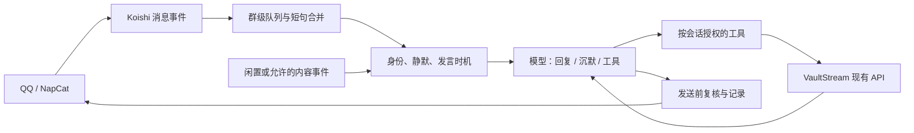

# 小 i 聊天机器人：源码调研与自研建议

调研日期：2026-09-26。本文保留调研时的设计建议；后续首版已在独立私有仓库 [ienone/xiaoi](https://github.com/ienone/xiaoi) 实现，覆盖 QQ 与 Telegram 多模态消息、表情收录与选择发送、主动接话和缓存。QQ 测试群已由小 i 接管 Character，完成真实文字收发及构造输入到 QQ 图文发送验收；Telegram 尚未切换。实际验证与能力边界见该仓库的 [当前状态](https://github.com/ienone/xiaoi/blob/main/docs/status.md)。

## 结论

可以自研，建议交付一个面向现有 QQ 群和 VaultStream 的小型 Koishi 聊天插件。NapCat 继续负责 QQ 接入，Koishi 提供消息事件、身份和发送接口；我们实现接话调度、人设与聊天记忆、模型调用、业务工具绑定。收藏、搜索、解析和分发继续使用 VaultStream。

主要工作量在群聊行为和执行可靠性：连续消息如何合并、何时插话、补充消息如何影响正在生成的回答、静默后怎样恢复、工具写入如何避免重复。接通模型只是其中一小部分。能快速做出可运行版本；能否自然融入群聊，需要真实群聊验收，不能由框架功能清单推断。

## 调研范围与源码证据

下载了下列 8 个公开仓库的源码快照，重点阅读消息触发、会话调度、工具执行和记忆相关路径。没有安装或运行这些项目，没有进行性能横向实测；表中的判断是静态源码分析。链接固定到本次提交，避免上游更新后依据漂移。

| 项目 / 提交 | 核对到的实现 | 对我们的价值与取舍 |
| --- | --- | --- |
| MaiBot，`e69dc9414f59` | [群聊循环](https://github.com/lonh-jing/MaiMBot/blob/e69dc9414f591749b4ba59af372ff3e397743803/src/chat/heart_flow/heartFC_chat.py#L184-L237)先判断提及、消息量和发言概率，再进入动作规划；[规划器调用模型](https://github.com/lonh-jing/MaiMBot/blob/e69dc9414f591749b4ba59af372ff3e397743803/src/chat/planner_actions/planner.py#L661-L679)，回复动作另行调用生成器。群聊使用 HeartFChatting，私聊使用 BrainChatting。 | 借鉴“沉默也是动作”、按话题组织上下文。规划和生成分开可做复杂行为，但普通闲聊会增加串行模型调用环节；首版合并为一次回复决策。 |
| ChatLuna Character，`6ee173bf89b2` | [触发过滤](https://github.com/ChatLunaLab/chatluna-character/blob/6ee173bf89b28dffc685da347e46abfad7629259/src/plugins/filter.ts#L269-L329)区分直接呼唤、消息数量和停顿；[消息服务](https://github.com/ChatLunaLab/chatluna-character/blob/6ee173bf89b28dffc685da347e46abfad7629259/src/service/message.ts#L828-L935)检查静默、冷却、取消信号和触发序号，再获取会话响应锁。 | 最直接的参考。保留每群串行生成、过期触发失效、冷却后合并处理的语义；把触发条件收敛为少数清楚的行为。 |
| ChatLuna Spark，`a81c51960c94` | [主动触发](https://github.com/vioaki/koishi-plugin-chatluna-spark/blob/a81c51960c9490b2a4bcafa5ecd09ef424bac836/src/triggers/proactive.ts#L111-L171)受休息时段、闲置时间、递增概率控制，调用现有 Character 或聊天引擎；[跟进任务](https://github.com/vioaki/koishi-plugin-chatluna-spark/blob/a81c51960c9490b2a4bcafa5ecd09ef424bac836/src/service/trigger_adapter.ts#L645-L675)可在创建者于同一会话发新消息时取消。 | 冷场开话题与新消息触发可以共用同一条回复链路。跟进需要有效期和取消条件；不能持续追问无人响应的话题。 |
| AstrBot，`69ae35a359e8` | [限流阶段](https://github.com/AstrBotDevs/AstrBot/blob/69ae35a359e8c9a44375004e6b8252ee366102bb/astrbot/core/pipeline/rate_limit_check/stage.py#L43-L92)按会话选择等待或丢弃；[Agent 循环](https://github.com/AstrBotDevs/AstrBot/blob/69ae35a359e8c9a44375004e6b8252ee366102bb/astrbot/core/agent/runners/tool_loop_agent_runner.py#L1145-L1175)限制工具步骤，耗尽后转为最终回答；模型等待支持停止信号。 | 借鉴执行边界、取消和工具预算。其完整平台、插件和多模态体系超出本次首版范围。 |
| LangBot，`aad78767cda7` | [消息聚合器](https://github.com/langbot-app/LangBot/blob/aad78767cda7c374d564f56c71f26342c63c19f4/src/langbot/pkg/pipeline/aggregator.py#L140-L261)捕获可信执行上下文，按工作区、机器人、会话和流水线隔离；新消息重置合并计时器，达到消息上限则立即刷新。 | 借鉴连续短句合并和上下文隔离。我们可用 bot ID + 会话类型 + 会话 ID 做范围键；增加最长等待时间，防止热闹群一直不能触发。 |
| LangBot Local Agent，`b6644965ad1e` | [运行控制](https://github.com/langbot-app/langbot-local-agent/blob/b6644965ad1ef22b54d3317ff5b9dd0920d56fa1/components/runner/default.py#L47-L129)让组装、模型和工具共享总耗时预算，并响应取消；[能力组装](https://github.com/langbot-app/langbot-local-agent/blob/b6644965ad1ef22b54d3317ff5b9dd0920d56fa1/pkg/run_assembly.py#L44-L101)从宿主获取授权模型和工具。 | 工具清单应由可信程序按当前用户、会话生成。总耗时预算比每次 API 各自超时更能限制长时间无回复。 |
| NoneBot2，`4510ce2e6c69` | [唯一会话插件](https://github.com/nonebot/nonebot2/blob/4510ce2e6c690250778f5ec53f80393d79b3d604/nonebot/plugins/single_session.py)在已有响应器执行时忽略新事件。 | 展示了很小的会话互斥实现，但群聊需要保留补充消息并合并处理。已有 Koishi 接入，改框架本身不会解决接话策略。 |
| Koishi，`5525cfd06e0e` | [Session](https://github.com/koishijs/koishi/blob/5525cfd06e0e48be0d65fa31a0ce46d0dc65ffde/packages/core/src/session.ts#L153-L177)通过账号 ID 识别提及，区分引用中的提及；消息经 middleware 处理。 | 现有基础足够承载自己的聊天核心。昵称 wam 与人设名小 i 是别名，身份判断应一直使用真实账号 ID。 |

### MaiBot 是否支持工具写入

支持实现写入工具。`BaseTool.execute()` 是通用异步执行接口，[工具调度](https://github.com/lonh-jing/MaiMBot/blob/e69dc9414f591749b4ba59af372ff3e397743803/src/plugin_system/core/tool_use.py#L215-L246)将模型参数交给该方法；仓库中的 [MCPToolProxy](https://github.com/lonh-jing/MaiMBot/blob/e69dc9414f591749b4ba59af372ff3e397743803/plugins/MaiBot_MCPBridgePlugin/plugin.py#L537-L603)先按工具、群、用户和会话类型验权，再调用 MCP 工具。因此，接入一个保存收藏的自定义工具或 MCP 服务在机制上可行。

这不等于已经完成 VaultStream 写入集成。仍要绑定真实 QQ 身份、明确保存目标、处理结果未知和重复事件，并遵守 VaultStream 的业务权限。桥接层还存在工具结果缓存，写入工具应单独核对缓存及重试语义。本次未做 MaiBot 写入实测。

### 延迟不能只看模型

Character 的 [typingTime 默认值](https://github.com/ChatLunaLab/chatluna-character/blob/6ee173bf89b28dffc685da347e46abfad7629259/src/config.ts#L326-L334)为每字 200 毫秒，[发送路径](https://github.com/ChatLunaLab/chatluna-character/blob/6ee173bf89b28dffc685da347e46abfad7629259/src/plugins/chat.ts#L1939-L1966)据此计算模拟输入延迟。模型完成之后仍可能等待；这项源码事实不能直接当成当前部署全部延迟的归因。

自研版应分别记录消息合并等待、模型调用、工具执行、发送耗时；普通闲聊默认无思考，模拟打字只保留短暂且有上限的停顿。是否更快，要比较真实 QQ 收发时间。

## 与现有 VaultStream 的接合点

| 当前代码 | 可以复用 | 需要处理的边界 |
| --- | --- | --- |
| [Koishi 插件 client](../../../integrations/koishi-plugin-vaultstream/src/client.ts) | 收藏搜索、正文读取、明确保存及 API 结果解析。 | 当前工具注册依赖 ChatLuna，自研聊天核心需要重新绑定工具；服务端凭据不进入模型上下文。 |
| [Koishi 插件入口](../../../integrations/koishi-plugin-vaultstream/src/index.ts) | 从真实 Session 校验管理员私聊；每次执行重新取会话；保存 URL 来自当前原始消息。 | 本地版本的防重是进程内最近 200 条消息，重启后不能保证来源记录幂等。迁移前应核对服务器插件与本地版本的差异。 |
| [Agent 工具注册](../../../backend/app/services/agent/tool_registry.py)及[运行服务](../../../backend/app/services/agent/service.py) | 参数模型、读写权限分类、写操作确认记录、执行结果和历史记录。 | 当前 AgentToolContext 没有 QQ 操作者与群可见范围；直接复用通用 Agent 接口，不能自动得到群权限隔离。按需扩展可信上下文和能力绑定。 |
| [QQ 回调](../../../backend/app/routers/qq_events.py)及[消息收录](../../../backend/app/services/qq_messages.py) | 事件鉴权、来源标识、链接解析入队。 | 这是受 BotChat 监控开关控制的收录入口，私聊文字也可能被收藏。聊天消费应保持独立，不能为了接话开启自动收录。 |
| [NapCat 发送](../../../backend/app/push/napcat.py) | 发送协议、现有群发送额度策略。 | 当前服务面向内容分发；自研聊天发送需明确与既有群限频控制面的关系，不能绕过用户设置。 |

用户已允许私有收藏发送给 DeepSeek。这与群内公开私有收藏是不同权限：私有查询和正文仍保持管理员私聊范围；群聊只使用明确允许该群访问的材料。工具的权限身份由程序提供，不能由模型参数或聊天文字声明。

## 推荐首版

采用 TypeScript Koishi 插件，面向一个目标群先验收。聊天核心直接调用已授权的 DeepSeek API；VaultStream 保持现有数据与业务职责。以下是设计建议，未部署。



1. **主动行为分三种。** 被叫名字、被 @ 或被引用时优先接话；旁听群友聊天时根据话题和人设选择插话；冷场时可以从尚未聊完的话题或该群可见的新内容发起话题。无人回应时停止连续追问，收到新消息后取消已经过时的跟进。兴趣参与度主要通过真实对话调节。
2. **普通闲聊一次模型决策。** 把人设、近期上下文、当前消息一起提供给模型，同次输出回复或沉默；需要资料才进入有限工具循环。模型参数明确关闭思考，避免依赖供应商默认值。后台话题摘要不阻塞当前回复。
3. **消息聚合有上限。** 建议普通消息停顿 1–2 秒合并，最长等待 8 秒；直接呼唤优先。每群只运行一轮生成，新消息进入待处理上下文。发送前检查静默及回答是否过时；单纯出现新消息不意味着永远取消，以免活跃群持续饥饿。
4. **人设与记忆分层。** 小 i / wam 的身份和兴趣是固定人设；近期消息是短期上下文；确认过的偏好和有来源的话题摘要是长期记忆。按群、私聊隔离，摘要能追溯来源，错误记忆可删除。上下文在预算内只追加，达到高水位后成批压缩，具体见下文缓存设计。首版使用现有持久化能力保存少量状态，后续按实际召回需求选择索引。
5. **工具沿用业务规则。** 先完成现有搜索、正文、明确保存；群侧接入已有授权的公开上下文。更多编辑、整理或外部动作复用对应确认流程。写操作不会因为模型调用超时、群消息重报或取消而被自动重新执行。
6. **行为控制保持简单。** 对外提供安静、自然、活跃三个参与档位，以及现有“闭嘴”静默能力。内部记录可定位的触发、沉默、取消和发送结果，便于回答“这条为什么没回”。发言次数与模型评估次数分别控制，避免把每次旁听判断都算作已发言。

在最终接管某个会话时，该会话只启用一个聊天引擎。开发期可离线回放样本；小 i 现有生产配置继续工作，待新实现验收后再切换。旧 Character 与新核心不同时向同一群回复。

## 缓存与上下文设计建议

2026-09-26 核对 [DeepSeek 上下文缓存规则](https://api-docs.deepseek.com/guides/kv_cache/)：缓存自动启用，命中要求完整匹配已经落盘的前缀单元。前缀单元来自输入/输出边界、跨请求公共前缀识别，以及长输入的固定间隔；刚出现的相同前缀不一定立刻命中。缓存构建需要时间，服务按尽力而为策略运行，不能承诺固定命中率或保留期。以下为设计建议，尚未采集现有 QQ Bot 的实际命中数据。

### 1. 固定前缀，变化内容放后面

建议的消息内容顺序：

```text
稳定的规则与人设
当前会话的记忆快照 / 已归档话题摘要
本轮上下文周期内的历史消息（原样追加）
本次新消息、当前状态及需要的检索资料
```

工具 schema 在同一权限范围内保持固定定义和顺序；群公开工具与管理员私聊工具分别形成明确的集合，每次执行仍重新验权。工具列表不能为了提高命中率而扩大权限。

当前时间、触发原因、活跃度、随机 ID 放在本次输入尾部或留在程序侧；历史消息的绝对时间、昵称快照和内容只渲染一次，避免每轮重算“几分钟前”。新的状态作为新事件追加。角色、消息边界、工具调用 ID 和工具结果保持合法关联，不为了拼前缀而伪造消息角色或执行记录。

### 2. 成批压缩，避免每条消息都滑动窗口

如果每次都保留“最后 40 条”，窗口满后每来一条就删第一条，会持续改变历史部分的开头。固定人设仍可能命中，但大量重复聊天历史难以复用完整前缀。

改为上下文在总 token 预算内增长：达到高水位后，一次压缩一批较早消息，保留近期原文，降到低水位。摘要和长期记忆在这个周期内保持快照；增量事实追加在尾部，下次压缩再合并。压缩会产生新的前缀，后续多轮复用它。消息删除、权限撤回及重要事实纠正立即应用，不能等待缓存周期结束。

不能为了高命中率无限保留历史；命中的输入仍有成本，过长上下文也有质量和时延代价。预算按实际 token 控制，保证留出工具结果和模型输出空间。

### 3. 把只读工具缓存与模型缓存分开

| 对象 | 建议缓存方式 | 失效 / 权限条件 |
| --- | --- | --- |
| 正文与固定分块 | 按内容 ID、内容版本、分块参数和授权范围缓存。可由后端先校验版本，再复用已渲染正文。 | 修改、重解析、删除或可见范围变化时失效；授权检查先于缓存返回。 |
| 收藏搜索 | 相同规范化参数、分页和授权范围使用短 TTL；同一时刻的相同只读请求合并为一次执行。 | 保存、编辑、删除等相关变更主动失效；TTL 只兜底，不承担撤权检查。 |
| 话题摘要 / 明确偏好 | 按会话和来源版本持久化，作为有来源的记忆快照。 | 更正或删除可追溯到原消息，重建受影响摘要。 |
| 保存、编辑等写操作 | 根据真实来源消息和操作标识持久化执行结果，处理同一事件重报。 | 这是幂等控制，不能按“参数差不多”缓存成功；不同用户指令仍独立执行，结果未知先核对。 |

应用层命中正文缓存可以减少数据库访问或重复处理，但把该正文放在本次新问题之后，不保证能命中模型前缀缓存。只有从开头连续相同且已落盘的部分才能复用。普通聊天回复每次根据当前上下文生成；首版不做语义相似问句的整段答案复用。

### 4. 用实际成本和延迟验证收益

从 [DeepSeek 响应 usage](https://api-docs.deepseek.com/api/create-chat-completion/)采集 `prompt_cache_hit_tokens`、`prompt_cache_miss_tokens`、输出 token，同时记录首 token 和 QQ 实际回复耗时。输入命中率按整个观察窗口计算：`sum(hit) / sum(hit + miss)`，不简单平均各请求百分比。

比较相同输入序列下的滑动窗口与成批压缩方案，分开观察冷启动、连续多轮、工具调用、压缩后和闲置后的结果。总成本还要包括摘要、旁听判断和未发送的生成；缓存收益不能只用命中率评估。保留模型、提示词/记忆版本及首个变化位置的诊断摘要，通常无需记录私有正文。

首版优先实现固定前缀、成批压缩和 usage 统计，再按实际重复访问情况加入只读工具缓存。缓存能力使用现有服务的存储与生命周期，避免仅为提高命中率引入独立基础设施或定时空请求保温。

## 验收范围

实现阶段按真实入口验证：

- 不 @，连续讨论人设感兴趣的话题，能适度插话；与它无关的连续消息也允许保持沉默。
- 叫“小 i”“wam”、@、引用均指向同一机器人；连续短句不会产生多条互相矛盾的回复。
- 生成过程中补充问题或要求静默，最终发送遵守最新有效状态；热闹群不会无限等待停顿。
- 管理员私聊搜索、正文、明确保存走到实际 API 和持久化结果；群聊无法调用私有工具；重复保存事件和结果未知有确定处理。
- 冷场开话题使用该群允许的材料，无人回应后不连发；QQ 收到消息到 Bot 实际发出的总延迟分段记录。

一次性验证脚本和私有群聊样本不入库。静态检查、回放及模型返回成功分别只证明各自边界，最终自然程度需要目标群实际使用反馈。

## 源码使用范围

上述快照中，MaiBot 为 GPL-3.0，Character 和 AstrBot 为 AGPL-3.0，LangBot 为 Apache-2.0，Spark、NoneBot2、Koishi 为 MIT。Local Agent 快照根目录未找到明确许可证文件，不能据此认定可直接复制。实现以自行编写业务代码为主；若搬用上游代码，先核对对应文件与仓库的许可要求并保留必要声明。

本次仅新增调研文档和索引，不安装新机器人框架、不修改生产配置、不产生新的模型调用或群发消息。
