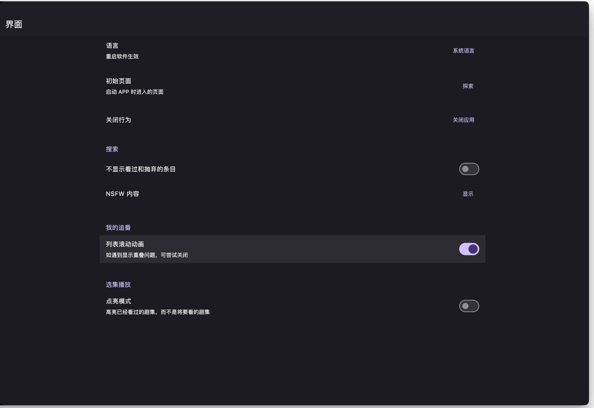

# VaultStream 页面与交互动效审校

2026-09-13 开始取证；本轮报告已完成。**仅审查与记录，未修改产品。**

当前界面已有一致的主导航、设置分区、阅读模板和弹层基础。没有证据支持全量重做 UI。值得优先处理的确认问题是：**分发队列只显示时分，跨日计划无法直接辨别日期**。其余结论主要是设置当前值、表单标签、搜索对齐和复杂阅读状态的局部改进建议。

后续[产品与架构整体重审](../../plans/2026-09-14-product-architecture-review.plan.md)不受上述局部审校范围限制：建议保留组件基础，但重组主导航、来源接入和持续关注任务。原前端方案与系统构想已同步修订；本文截图与动效仍作为当时运行证据，不把“无需全量重做 UI”解释为页面职责不可调整。新取证与限制见[整体重审证据](../product-review-2026-09-14/README.md)。

## 阅读入口

- [逐页、分支与弹层分析](pages.md)：53 组带标注对照图，每组最多四张真实截图，逐项说明观察、建议、边界和对应实现。
- [覆盖矩阵](coverage.md)：22 个路由入口与内部状态的映射；七个设置分区、四步初始化、十类内容模板分别取证。
- [动效审查](motion.md)：10 组实际点击过程，含触发前、过程采样、展开、关闭后的帧及 WebM 录像。
- [原图索引](image-index.md)：194 张页面截图，保留实际分辨率和路由；另有 40 张动效过程帧。
- [确认问题 UI-01](../../issues/2026-09-13-ui-queue-date.md)：复现、实现证据和关闭条件。

## 基线、数据与方法

| 项目 | 本次证据 |
|---|---|
| 源码基线 | `b98815ba1842414f43036d58bb27bb8359d84ade` |
| 既有未提交改动 | 根目录 `Makefile`、`README.md`，均未修改 |
| 前端 | 当前源码 Flutter Web release 构建，真实应用页面；不是 HTML 复刻或设计稿 |
| 后端 | 真实 FastAPI，独立本地 SQLite 和媒体目录，不读取仓库 `.env` |
| 基础尺寸 | 桌面 1280×900、手机视口 390×844；补充 900×900 设置、844×390 播放器 |
| 浏览器 | 本机 Chrome headless；手机为窄浏览器视口，不是原生 Android/iOS 设备 |
| 数据 | 合成内容、事件、来源、目标、规则、队列、任务、消息、Agent 会话；使用本地图片、短音视频和两页 PDF |
| 验证方式 | 实际导航、展开、滚动、菜单和取消操作；截图、录像与代码/接口契约交叉核对 |
| 外部副作用 | 未登录真实平台、调用模型、同步收藏、推送消息或部署 |

独立前端使用 `127.0.0.1:18937`，后端使用 `127.0.0.1:18936`。关闭解析/分发 worker、自动发现、评分、索引、收藏同步、Cookie 保活、周期摘要；队列条目排在未来。媒体归档开关只在隔离库中为显示设置字段启用，worker 仍为零。页面中“未配置”“调度停止”“未连接”是这种环境的真实状态，不算故障。

为进入初始化向导，按真实接口形状模拟初始化状态响应；扫码登录弹窗使用本地假二维码及 session 响应，二维码明确不用于登录。Agent 消息与工具结果直接写入隔离数据库，界面确实读取它们，但不能据此推断模型或工具执行成功。

截图记录的是特定视口和滚动位置，**首屏以外的内容不等于被裁切**。页面数据完善后相关截图进行了重拍；已剔除无效 `segments` 搜索参数和被结构化正文替代的旧样例。跨截图数据不承诺同一秒快照，不把不同阶段的内容数差异当作产品问题。

## 设置页与 Animeko 参考

参考图最值得借鉴的是设置行的组织：分组标题明确；名称与说明在左；短当前值或开关靠右；连续背景承载条目，靠间距和细分隔线分组。不是把每一项包成独立大卡片。

VaultStream 已实现连续设置区域、七个分区、分组分隔和展开编辑，见 [设置到许可的图组 25–33](pages.md)。[SettingGroup / SettingTile](../../../frontend/lib/features/settings/presentation/widgets/setting_components.dart) 已有透明行背景、说明、尾部控件和按可用宽度堆叠的逻辑，因此不建议再造第二套设置容器。

| 当前模式 | 对照判断 | 适合的调整 |
|---|---|---|
| 主题、周期等短枚举使用填充输入式容器 | 当前值可读，但视觉重量接近表单编辑 | 可评估“左侧名称说明 + 右侧当前值菜单” |
| 地址、模型设置收起时摘要在标题下 | 长值不会挤压尾部，编辑有明确入口 | 保留长值换行；不要统一硬塞右侧 |
| 开关行的名称说明在左 | 已接近参考图，行为清晰 | 保留，不为形式统一改成交互更重的卡片 |
| 展开后出现多个凭据或模型字段 | 属于复杂编辑，不是单项偏好 | 统一编辑区间距、标签和保存动作；继续折叠 |
| 来源、目标、事件表单的标签形式不同 | 壳层一致，内部节奏略有差异 | 按字段语义收敛标签规则，优先修改复用组件 |

右对齐适用于短值，长 URL、说明文本和多个输入框需要自己的可用空间。参考图只提供视觉比较，不证明 VaultStream 应照搬其宽度、文案或业务分组。

## 响应式与容器宽度

当前 [ResponsiveLayout](../../../frontend/lib/core/layout/responsive_layout.dart) 的宽度边界是 600 / 840 / 1200 / 1600，高度低于 480 另作判断。[SettingsPage](../../../frontend/lib/features/settings/settings_page.dart) 通过 `LayoutBuilder` 读取自身约束，并依据 `supportsSupportingPane` 决定单双栏；[SettingTile](../../../frontend/lib/features/settings/presentation/widgets/setting_components.dart) 同样读取局部约束。**“根据内容可用空间响应”已经是当前实现，不应再当作未开始的新架构。**

本次截图验证了大桌面、窄手机，以及设置 900 宽和播放器低高度样例。不能因此宣称所有断点均通过。后续若改布局，应优先验证 839/840 附近、侧栏占用后的内容宽度、大字号和软键盘，而不是只看浏览器总宽。

[前端信息架构计划](../../plans/2026-06-10-frontend-information-architecture-redesign.plan.md) 和系统概念文档用于理解产品目标；计划中的历史基线描述不能覆盖当前代码。实际路由、设置分区和动态内部视图已经有实现，报告以本次页面和代码为准。

## 跨页判断与整改排序

| 顺序 | 结论 | 证据与影响 | 建议范围 |
|---|---|---|---|
| 1 · P2 确认问题 | 队列计划时间缺少日期 | 图组 18；未来十天的条目仅显示 `23:47`；格式代码固定 `HH:mm` | 非当天显示日期，悬停与无障碍名称给出完整本地日期时间；保留现有调度规则 |
| 2 · 视觉建议 | 短设置值可更轻、更一致 | 图组 26–32；相同偏好项混用行与填充枚举输入 | 优先主题/周期等短值，不改长地址和复杂表单为拥挤行 |
| 3 · 使用成本建议 | 手机解析候选较深 | 图组 15；长文章之后才能进入候选合并 | 评估轻量定位提示，保留人工版本保护与明确确认 |
| 4 · 视觉建议 | 复杂表单标签和间距不完全一致 | 图组 20、28、30、42–44 | 在现有组件中统一规则，不另造表单体系 |
| 5 · 布局建议 | 搜索框与结果区对齐线变化 | 图组 35；输入限宽与多列结果宽度不同 | 对齐共享起点或清楚定义中心区域；不限制丰富结果的必要宽度 |
| 6 · 文案建议 | Agent 普通状态显示工具原名 | 图组 37–38 的 `search_content` | 普通状态用可读名称，技术详情保留原名 |
| 7 · 视觉建议 | 稀疏详情仍有较大辅助栏 | 文章/PDF 样例的元信息较少 | 按真实内容量评估；有目录与事件时应保留辅助栏 |

本轮未确认 P0/P1。没有发现足以支持“所有页面都有卡片滥用”或“所有动效都应统一成同一种”的证据。阅读、配置、任务处理、媒体播放承担不同职责，应统一基础语法而保留结构差异。

一次样例中的任务状态 `failed` 曾让同步列表显示英文；追查 [record_task_run_error](../../../backend/app/services/background_task_state.py) 后，正常路径实际写入 `error`，[前端映射](../../../frontend/lib/features/automation/widgets/favorites_sync_automation_panel.dart) 已支持中文。样例已修正、相关截图和动效已重拍，**这不是本轮确认问题**。

## Fluid Hover 的适用范围

用户给定的[原参考链接](https://x.com/micka_design/status/2097683693494280270) 本次无法读取视频内容。下面只按“同一个高亮背景在相邻项目间连续移动”的描述讨论，不声称已观看原视频或复现其参数。

最适合试验的是桌面设置分区导航、同一层级的短菜单：项目位置稳定、尺寸接近，连续移动能表达焦点迁移。应区分 hover 与持久选中，指针离开后仍能辨认当前分区。收藏瀑布流、长消息、可展开高度不一的设置编辑区和危险操作不适合一概套用；触屏没有持续悬停，需要独立的按压/选中反馈。减少动态效果开启时应直接切换状态。本次只评估适用性，未实现新动效。

## 未验证边界

- 真实账号有效/过期、扫码成功/失败、验证码、平台同步、媒体远端抓取、Bot 发送、模型流式输出、Agent 工具执行均未验证。
- 网络中断后约 18 秒截图仍是加载骨架，未取得错误终态；代码有错误分支，但本轮不宣称错误提示和恢复通过。
- 未覆盖全量空数据库、所有 HTTP 错误码、全部搜索类型、规则保存校验和每个复杂表单的提交结果。
- 未验证原生手机、真实触控、系统返回手势、键盘遮挡、屏幕阅读器、大字号、折叠屏，以及全部断点邻界。
- 10 组动效展示真实过程和关闭结果；未做帧时间统计、性能压测、快速反向中断、长时播放或逐项减少动态效果运行验收。
- 深色只抽查设置、收藏、Agent；没有执行全部页面颜色对比度测量。

这些是明确边界，不属于已发现的产品缺陷。没有为凑覆盖率把未运行路径写成通过。

## 交付验证

Flutter Web release 构建成功；本次只有审校文档、原图、拼图和录像，不添加正式测试或修改运行代码。素材索引、图片解码和本地链接已核对。一次性取证脚本在交付前删除，本次独立服务在交付前停止。产品未提交、推送或部署。
