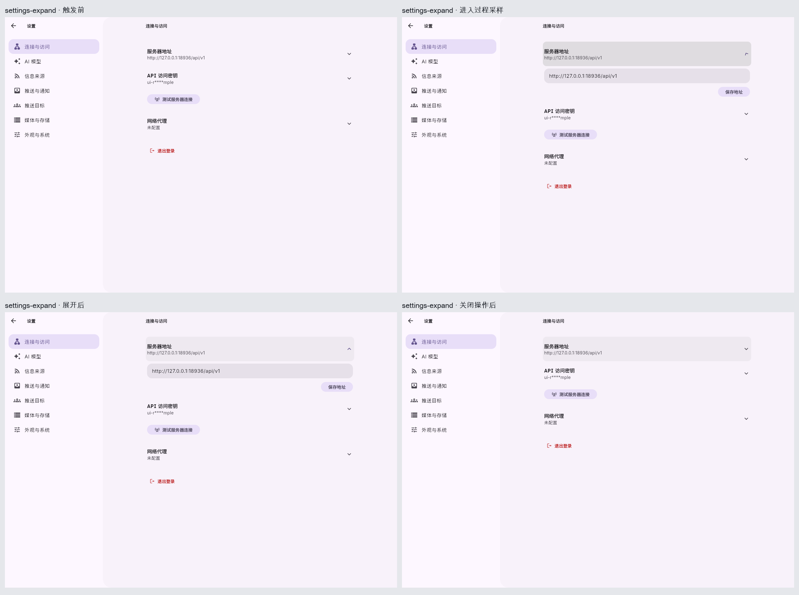
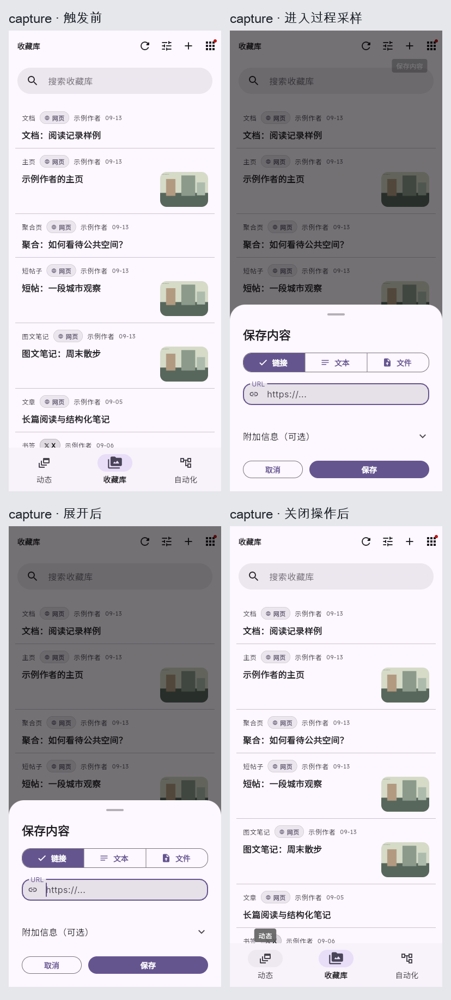
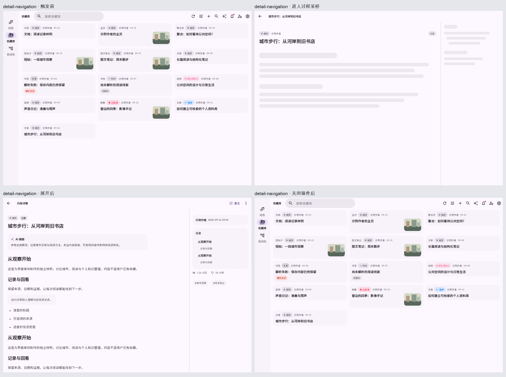
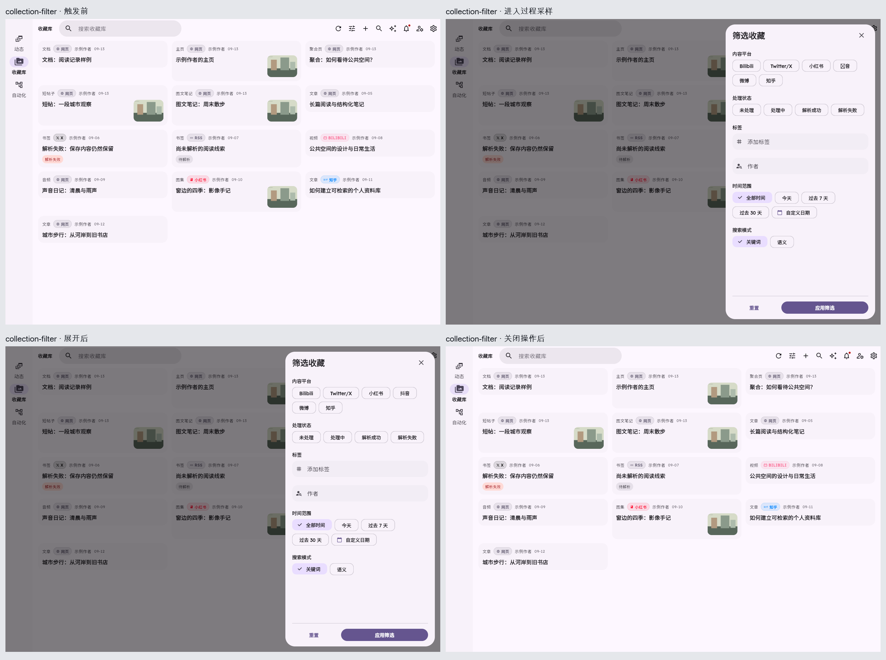
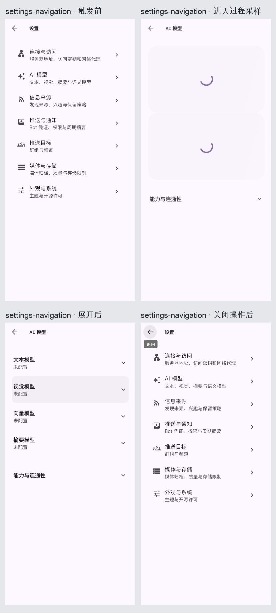
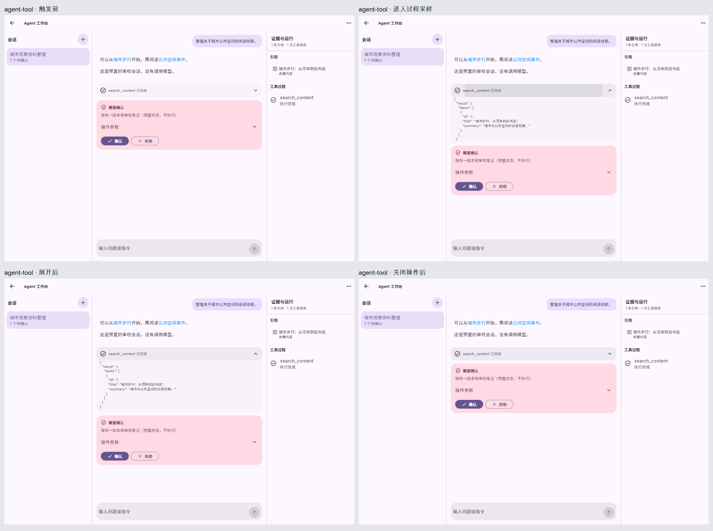
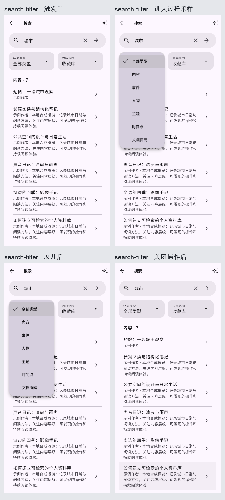
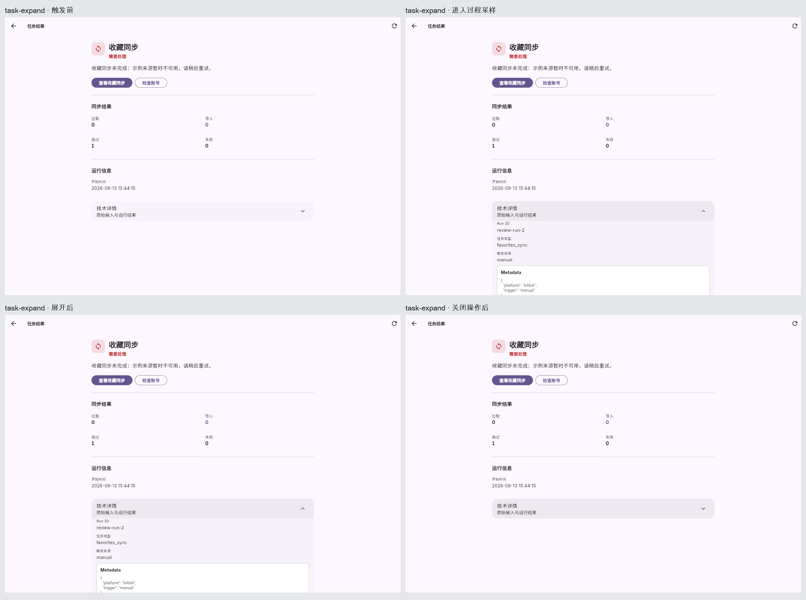
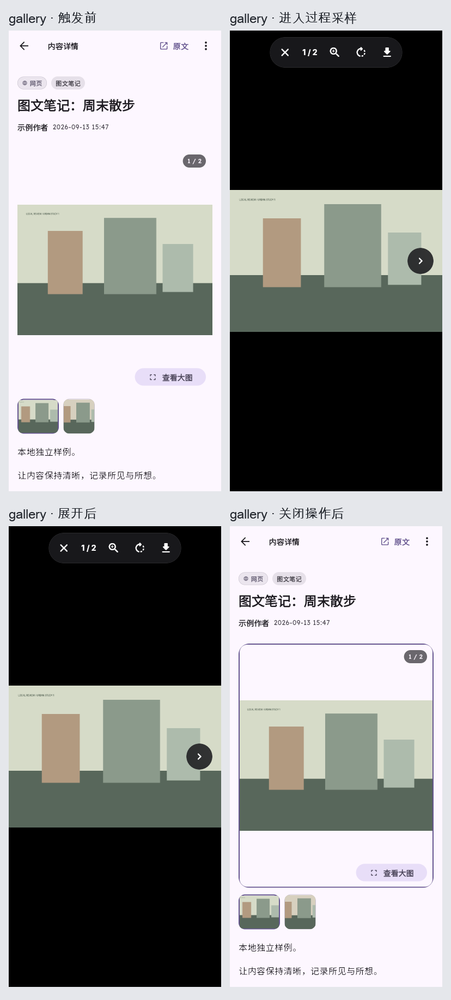
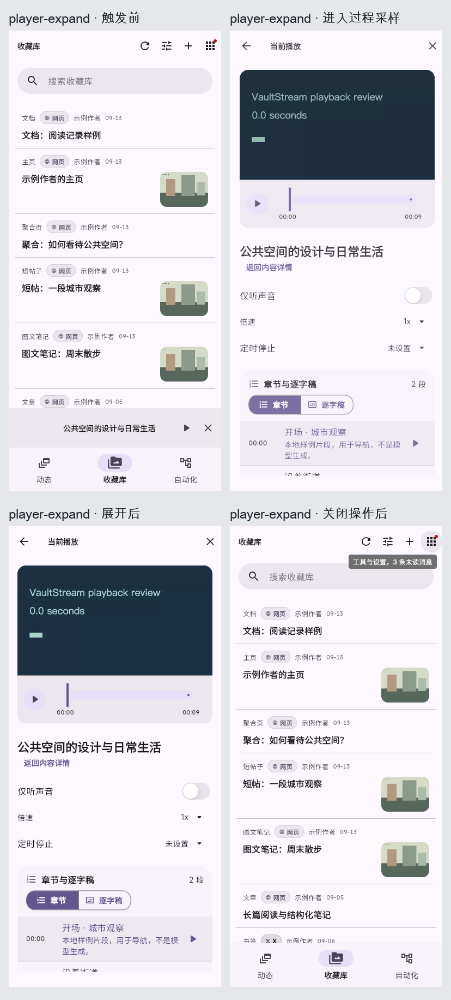

# 实际交互与动效审校

[返回主报告](README.md) · [页面分析](pages.md)

共 10 组真实操作，每组含四张过程采样与一段浏览器录像。帧按触发前、进入过程、展开、关闭操作后排列。截屏本身会耗时，四帧不是固定时间间隔，也不保证采到动画每个阶段；精确过程以录像为准。初始启动可能出现在录像开头。

[AppMotion](../../../frontend/lib/theme/design_tokens.dart) 当前集中定义状态变化 200ms、内容切换 240ms、表面进入 320ms、退出 200ms、容器变换 450ms，标准曲线 easeOutCubic。具体组件也有 Material 默认动效，不能把这些常量当成所有录像的实测持续时间。[筛选弹层](../../../frontend/lib/features/collection/widgets/dialogs/collection_filter_sheet.dart) 和 [设置展开](../../../frontend/lib/features/settings/presentation/widgets/setting_components.dart) 可见减少动态效果分支；本次没有逐个运行该模式。

| 组 | 设备 | 触发与结束 |
|---|---|---|
| 01 桌面设置展开编辑 | 1280×900 | 点击服务器地址行，再点击同一行收起。 |
| 02 手机保存内容弹窗 | 390×844 | 收藏库点击保存内容，点击取消。 |
| 03 桌面收藏进入文章 | 1280×900 | 点击城市步行卡片，再点击详情返回。 |
| 04 桌面筛选侧面板 | 1280×900 | 点击筛选，点击关闭筛选。 |
| 05 手机设置分区导航 | 390×844 | 设置列表点击 AI 模型，再点击返回。 |
| 06 Agent 工具详情展开 | 1280×900 | 点击 search_content 已完成，再点击同一工具行。 |
| 07 手机搜索类型菜单 | 390×844 | 点击结果类型，点击菜单外空白处。 |
| 08 桌面任务技术详情 | 1280×900 | 失败任务点击技术详情，再点击同一行收起。 |
| 09 手机图片大图模式 | 390×844 | 图文笔记点击查看大图，点击关闭图集。 |
| 10 手机小播放器展开 | 390×844 | 视频详情建立本地播放会话后返回收藏库，点击小播放器，再关闭播放器。 |

## 01 桌面设置展开编辑

[打开实际录像](assets/motion/settings-expand.webm)

**操作：** 点击服务器地址行，再点击同一行收起。

**观察：** 输入区在原行下方出现，后续项目向下移动；关闭后回到原顺序。未保存字段。

**判断：** 设置行展开用于保留位置关系，应保留，避免额外整页飞入。

## 02 手机保存内容弹窗

[打开实际录像](assets/motion/capture.webm)

**操作：** 收藏库点击保存内容，点击取消。

**观察：** 容器与遮罩进入，页面仍可辨认；取消后回到收藏库，没有新增条目。

**判断：** 弹层进出应服务操作归属；当前取消路径已实际运行。

## 03 桌面收藏进入文章

[打开实际录像](assets/motion/detail-navigation.webm)

**操作：** 点击城市步行卡片，再点击详情返回。

**观察：** 过渡期间可见内容预览/加载，最终进入真实文章；返回回到收藏网格。

**判断：** 保留来源卡片与详情的连续关系；截图有采样延迟，不能用相邻帧反推加载耗时。

## 04 桌面筛选侧面板

[打开实际录像](assets/motion/collection-filter.webm)

**操作：** 点击筛选，点击关闭筛选。

**观察：** 遮罩与右侧面板进入，关闭后恢复收藏库；关闭控件真实生效。

**判断：** 按容器方向进入合理；与手机底部面板不必使用相同位移方向。

## 05 手机设置分区导航

[打开实际录像](assets/motion/settings-navigation.webm)

**操作：** 设置列表点击 AI 模型，再点击返回。

**观察：** 列表进入独立分区页，加载后四类模型行出现，返回恢复设置分区列表。

**判断：** 单栏层级清晰；仅验证界面返回按钮，未验证原生边缘返回手势。

## 06 Agent 工具详情展开

[打开实际录像](assets/motion/agent-tool.webm)

**操作：** 点击 search_content 已完成，再点击同一工具行。

**观察：** JSON 展开使确认面板下移；收起后恢复消息流和待确认状态，没有执行确认操作。

**判断：** 展开只揭示诊断信息，不能让确认按钮在原地被另一动作替换。样例未见这种替换。

## 07 手机搜索类型菜单

[打开实际录像](assets/motion/search-filter.webm)

**操作：** 点击结果类型，点击菜单外空白处。

**观察：** 菜单在控件附近展开；点击空白处关闭，结果类型仍是全部，结果内容保持。

**判断：** 先前 Escape 尝试未取得关闭结果，本组已改用真实空白处取消；不声称键盘取消已通过。

## 08 桌面任务技术详情

[打开实际录像](assets/motion/task-expand.webm)

**操作：** 失败任务点击技术详情，再点击同一行收起。

**观察：** 技术字段出现在正文之后，收起后普通结果与行动入口仍在。

**判断：** 使用真实 error 状态重新取证；不让技术诊断默认占据普通结果页。

## 09 手机图片大图模式

[打开实际录像](assets/motion/gallery.webm)

**操作：** 图文笔记点击查看大图，点击关闭图集。

**观察：** 图集切换为全屏媒体背景，关闭回到同一笔记，页码和正文仍存在。

**判断：** 查看操作不应改变内容；此次未操作旋转保存或双指缩放。

## 10 手机小播放器展开

[打开实际录像](assets/motion/player-expand.webm)

**操作：** 视频详情建立本地播放会话后返回收藏库，点击小播放器，再关闭播放器。

**观察：** 小播放器进入完整播放器；关闭后回到收藏库，小播放器移除，符合关闭会话而非单纯最小化的语义。

**判断：** 关闭与返回含义不同，应保留明确命名；未测试拖动中断、后台播放和长视频。

## 未验证项

这些过程说明当前样例能展开并经所列操作结束，不构成“全端流畅”的证明。没有统计 FPS/P95 帧时间，也未验证低端设备、系统减少动态效果、快速反向中断、触屏拖动取消、软键盘出现时的布局与焦点恢复。静态对照图只说明布局，不能替代动效证据。
