# 页面、状态与弹层逐项审校

每组最多四张原图，通常每行左侧桌面、右侧手机；特殊尺寸写在图内。编号是展示图组，不是路由数。图像可打开查看全分辨率。[返回主报告](README.md) · [全部原图](image-index.md)

## 01 连接入口

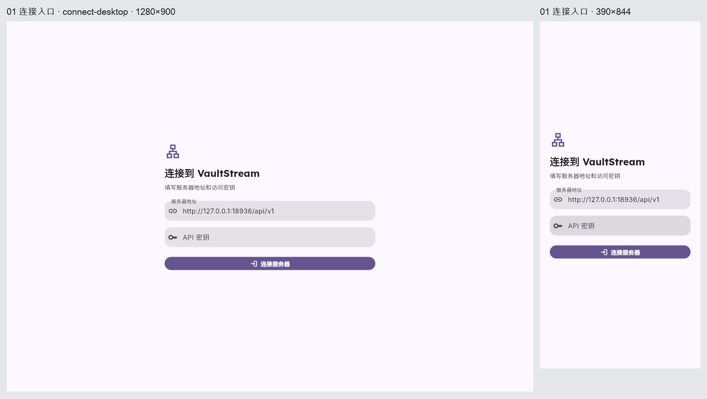

**观察：** 标题、连接地址、访问密钥、主按钮集中在限宽表单中；手机没有强行保留桌面留白。

**判断与边界：** 保留单一连接动作；本次只展示本地地址与合成密钥，不代表远程连接或初始化已验收。

**当前实现：** [auth/presentation/connect_page.dart](../../../frontend/lib/features/auth/presentation/connect_page.dart)。取证状态：`connect`。

## 02 初始设置：AI 与通知

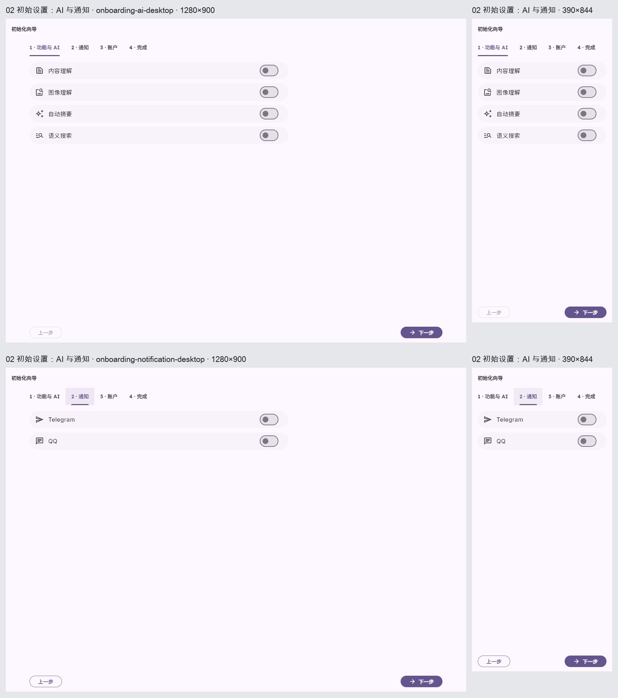

**观察：** 四步进度与底部前进、返回位置稳定；AI 能力和通知渠道使用开关逐项启用。

**判断与边界：** 默认不展开全部配置有利于首用；需启用后的真实校验及提交仍属功能验收范围。

**当前实现：** [auth/presentation/onboarding_page.dart](../../../frontend/lib/features/auth/presentation/onboarding_page.dart)。取证状态：`onboarding-ai`、`onboarding-notification`。

## 03 初始设置：账号与完成

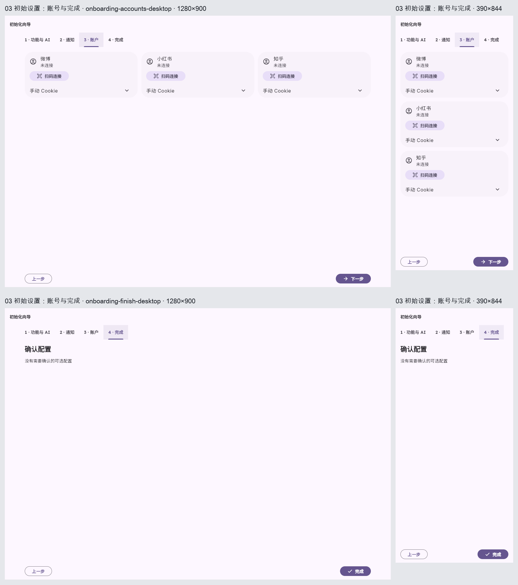

**观察：** 桌面账号并排，手机纵向排列；完成页单列总结，底部提交入口保持一致。

**判断与边界：** 此处只模拟未初始化状态以进入向导，未提交初始化，也未连接任何平台。

**当前实现：** [auth/presentation/onboarding_page.dart](../../../frontend/lib/features/auth/presentation/onboarding_page.dart)。取证状态：`onboarding-accounts`、`onboarding-finish`。

## 04 动态：待收录

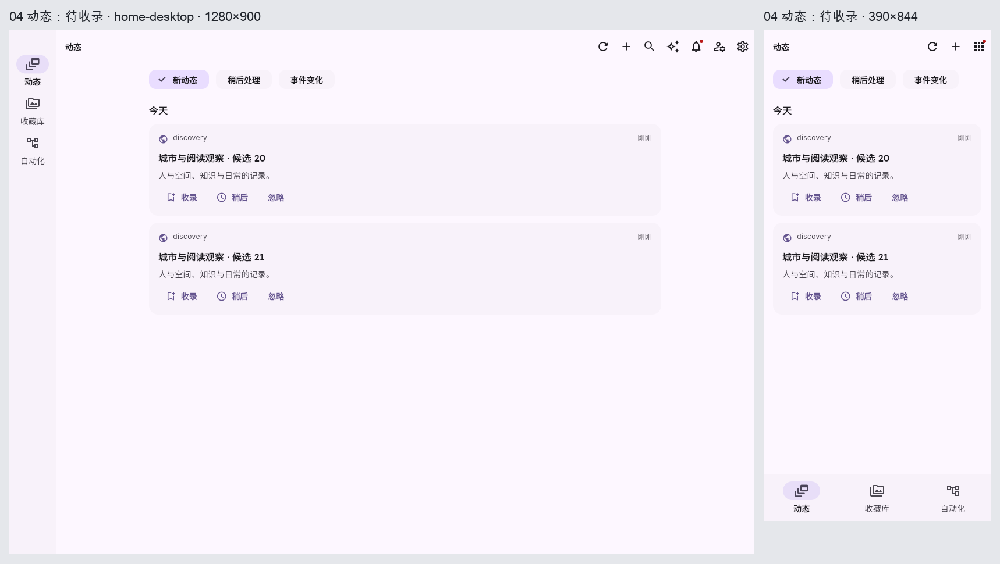

**观察：** 动态使用阅读型单列与分段切换；桌面导航轨和手机底栏分别承载三大主入口，候选卡附带后续操作。

**判断与边界：** 合成样例只有少量条目，不能推断大批候选时的滚动和分页表现。

**当前实现：** [dashboard/dashboard_page.dart](../../../frontend/lib/features/dashboard/dashboard_page.dart)。取证状态：`home`。

## 05 动态：稍后与事件

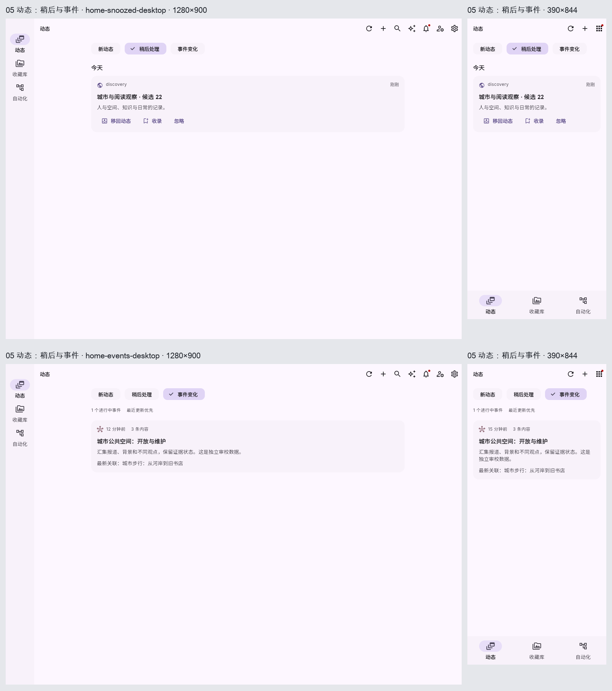

**观察：** 同一页面的稍后候选和事件列表具有不同信息结构；事件显示成员数与摘要，不复用普通候选操作。

**判断与边界：** 这些是已实现的内部视图，应在覆盖中单列；无需再按旧计划把动态描述为占位页。

**当前实现：** [dashboard/dashboard_page.dart](../../../frontend/lib/features/dashboard/dashboard_page.dart)。取证状态：`home-snoozed`、`home-events`。

## 06 收藏库与局部搜索

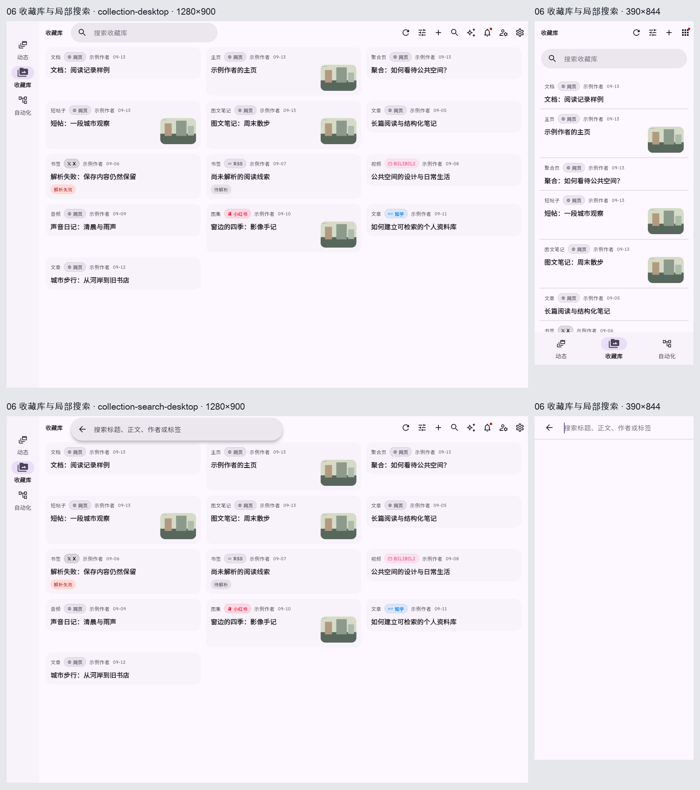

**观察：** 桌面多列卡片、手机单列；类型、来源、标题和异常标记进入同一卡片。局部搜索入口从收藏库打开，手机截图为尚未输入查询的搜索状态。

**判断与边界：** 卡片尺寸和留白适合扫读；现有样例不涵盖超长无空格标题或数万条滚动负载。

**当前实现：** [collection/collection_page.dart](../../../frontend/lib/features/collection/collection_page.dart)。取证状态：`collection`、`collection-search`。

## 07 文章：摘要与结构化正文

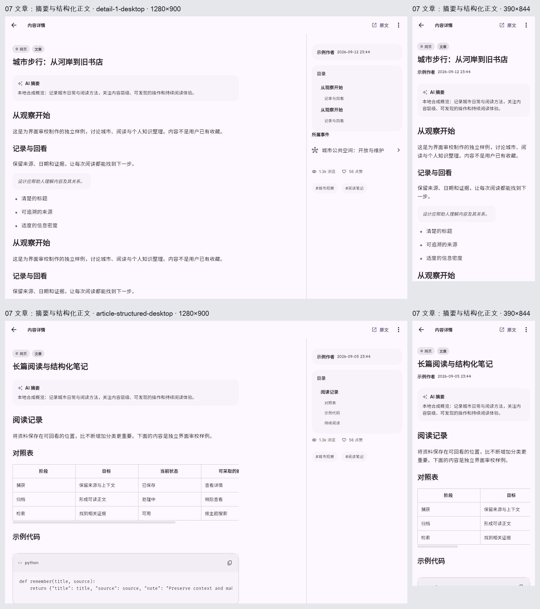

**观察：** 文章有标题、摘要、正文和辅助信息；桌面右栏放作者、目录、事件等，手机按阅读顺序收拢。表格和代码使用不同呈现。

**判断与边界：** 正文与元信息层级清楚；辅助信息很少时右栏仍占空间，可评估按内容量收敛，但这不是已确认缺陷。

**当前实现：** [collection/content_detail_page.dart](../../../frontend/lib/features/collection/content_detail_page.dart)。取证状态：`detail-1`、`article-structured`。

## 08 图文笔记与短帖

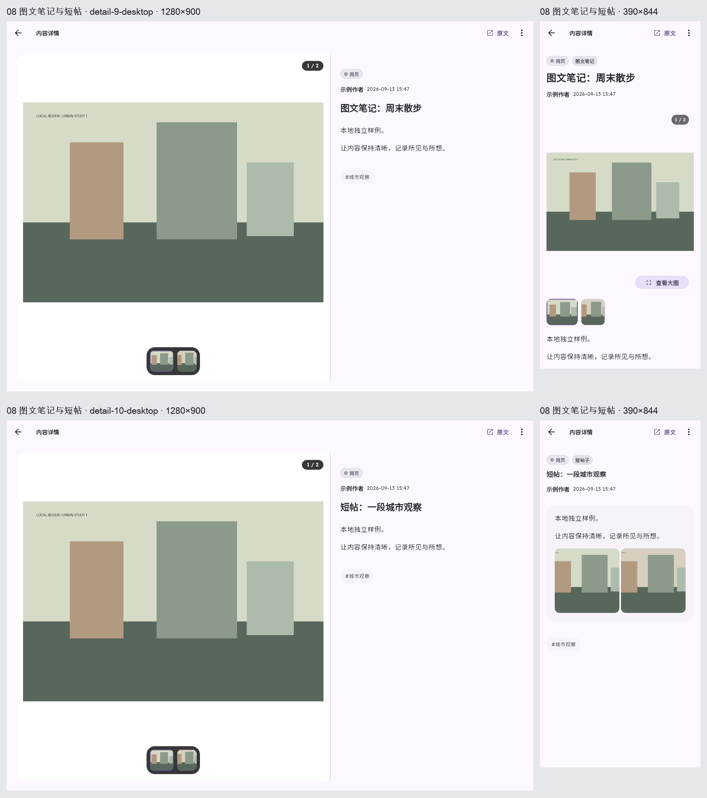

**观察：** 有图片的样例采用大图与文字并列的桌面结构，手机转为纵向阅读；短帖没有被强制拉成文章长页。

**判断与边界：** 保留内容模板差异，不应为统一外观把所有详情做成同一套大卡片。

**当前实现：** [collection/content_detail_page.dart](../../../frontend/lib/features/collection/content_detail_page.dart)。取证状态：`detail-9`、`detail-10`。

## 09 图集与大图

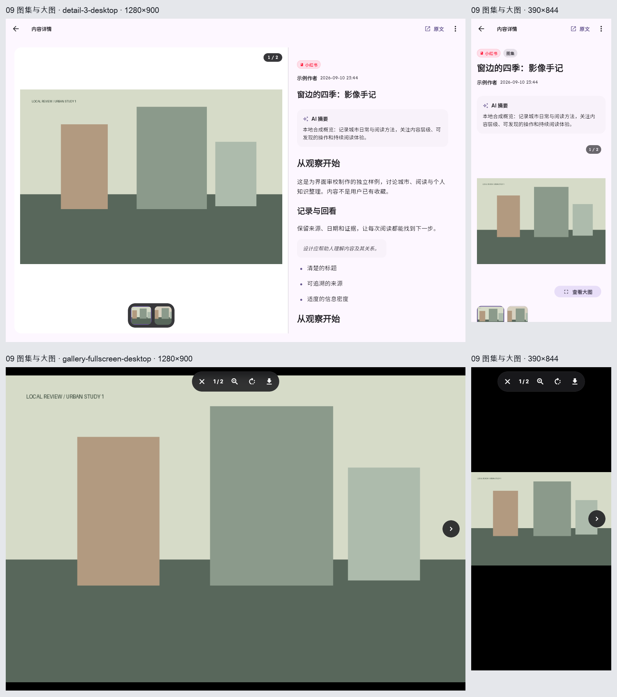

**观察：** 详情图集显示页码和缩略图；大图模式切为深色背景，关闭、缩放、旋转、保存控件集中。

**判断与边界：** 本地两张合成图已进入大图并返回；保存文件与原生双指缩放未验证。

**当前实现：** [collection/content_detail_page.dart](../../../frontend/lib/features/collection/content_detail_page.dart)。取证状态：`detail-3`、`gallery-fullscreen`。

## 10 音频与视频详情

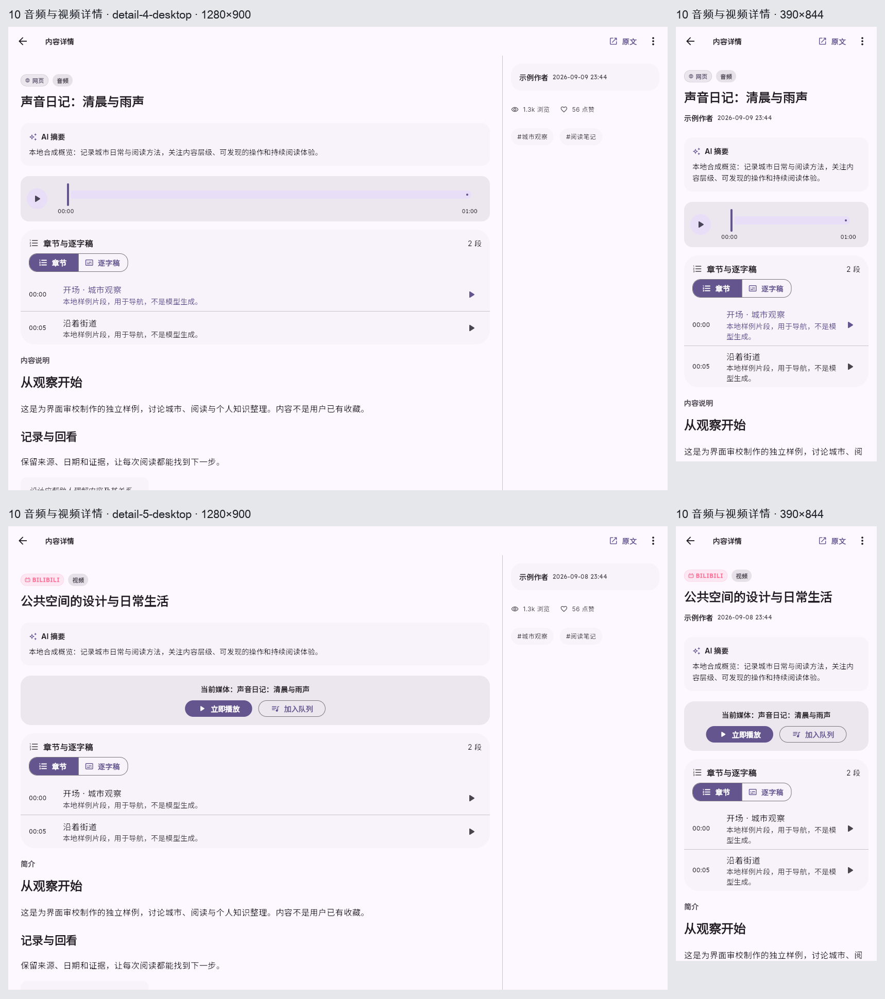

**观察：** 音频以播放器、章节及时间点为主；视频详情保留进入播放器入口与音轨/时间点内容，辅助信息沿用阅读结构。

**判断与边界：** 截图中的视频详情不是全屏播放页；必须与第 45–47 组的实际播放器分开判断。

**当前实现：** [collection/content_detail_page.dart](../../../frontend/lib/features/collection/content_detail_page.dart)。取证状态：`detail-4`、`detail-5`。

## 11 文档阅读

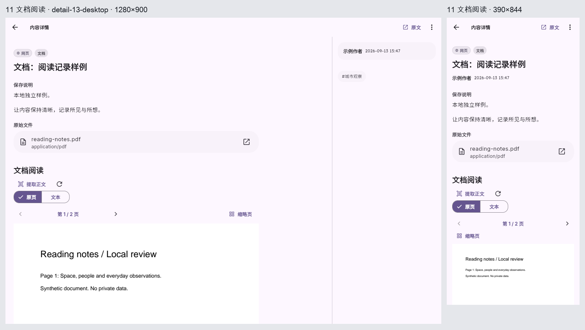

**观察：** 真实本地 PDF 在 Web 页面内渲染，可见文档文件、阅读模式和页码工具；桌面正文与元信息分区。

**判断与边界：** 只验证两页合成 PDF 的加载展示；未执行提取、长文档检索或跨页定位的业务验收。

**当前实现：** [collection/content_detail_page.dart](../../../frontend/lib/features/collection/content_detail_page.dart)。取证状态：`detail-13`。

## 12 聚合页与主页

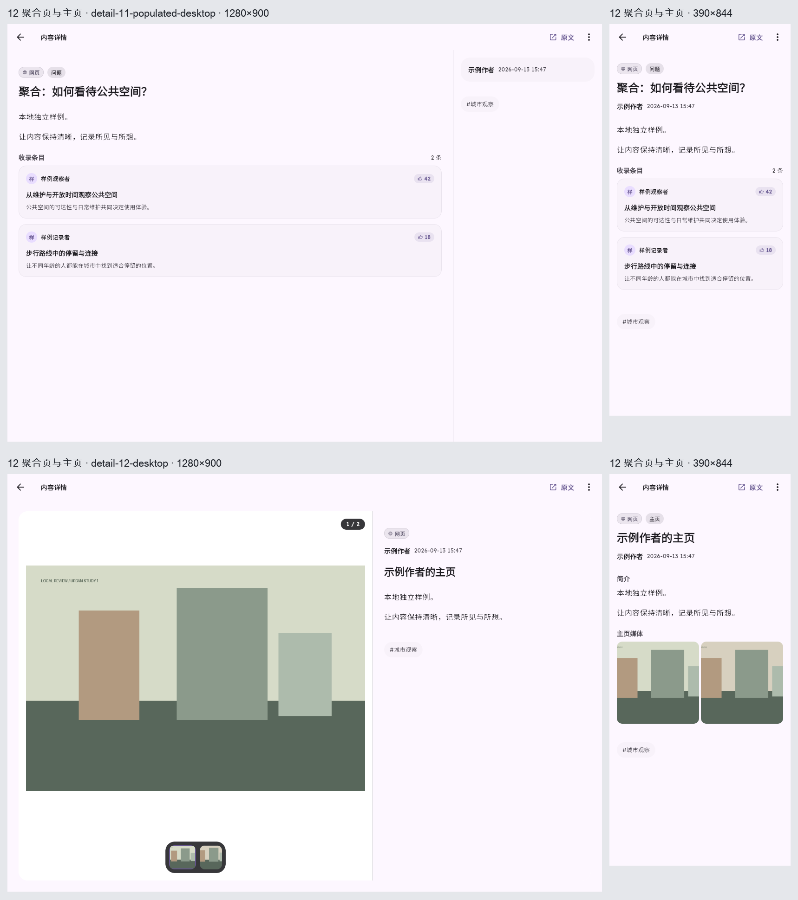

**观察：** 聚合页按子条目呈现资料，主页样例走图片加简介结构；两者并非普通文章的纯标题替换。

**判断与边界：** 聚合数据按真实 blocks/sub_item 结构填充后复拍；无子项空态另留原图索引，不算渲染故障。

**当前实现：** [collection/content_detail_page.dart](../../../frontend/lib/features/collection/content_detail_page.dart)。取证状态：`detail-11-populated`、`detail-12`。

## 13 书签：待解析与失败

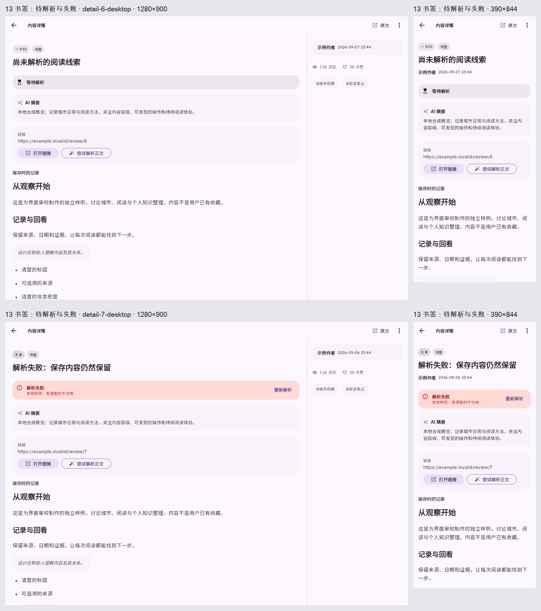

**观察：** 待解析提示与解析失败提示色彩不同；失败仍保留标题、原始地址和已有内容，没有整页被错误信息替代。

**判断与边界：** 保留失败恢复入口；本次不触发真实解析，因此不声称重试成功。

**当前实现：** [collection/content_detail_page.dart](../../../frontend/lib/features/collection/content_detail_page.dart)。取证状态：`detail-6`、`detail-7`。

## 14 编辑与详情操作菜单

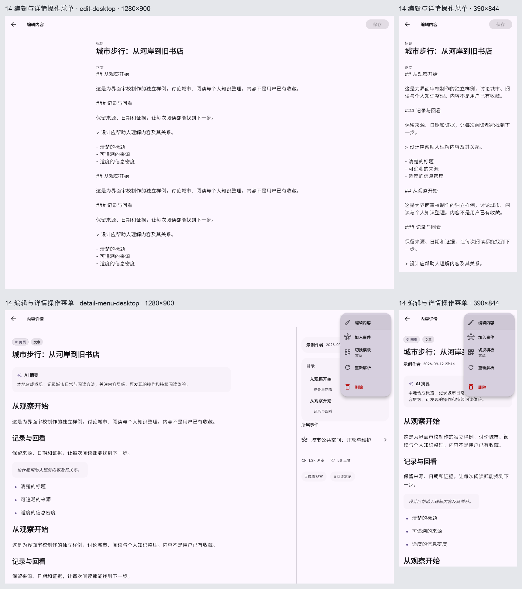

**观察：** 编辑页使用限宽正文表单，顶部保留保存位置；查看态更多菜单容纳编辑、事件、模板等低频动作，删除以危险色区分。

**判断与边界：** 详情阅读和修改入口分离合理；未保存内容、删除条目或触发外部动作。

**当前实现：** [collection/content_edit_page.dart](../../../frontend/lib/features/collection/content_edit_page.dart)。取证状态：`edit`、`detail-menu`。

## 15 解析候选与合并弹窗

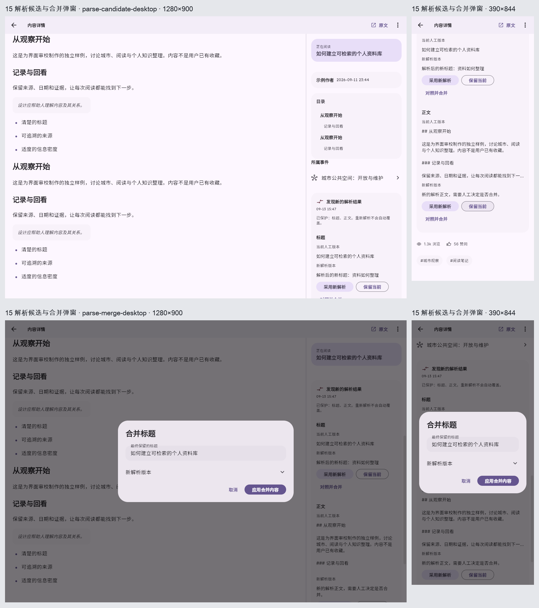

**观察：** 候选同时展示当前人工版本和新解析版本，合并标题另开可编辑弹窗。手机候选位于长正文之后，需要实际滚动才可进入。

**判断与边界：** 人工版本保护提示有价值；手机发现候选的成本偏高，可考虑仅增加轻量定位入口，保留明确确认，不自动合并。

**当前实现：** [collection/content_detail_page.dart](../../../frontend/lib/features/collection/content_detail_page.dart)。取证状态：`parse-candidate`、`parse-merge`。

## 16 自动化总览

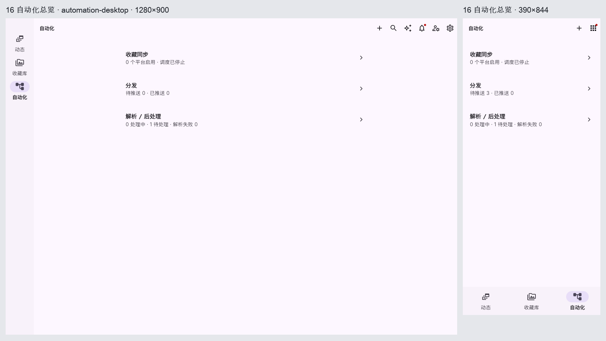

**观察：** 收藏同步、分发、解析后处理以三个任务域呈现，摘要帮助决定进入哪一处，不堆叠全部配置。

**判断与边界：** 保持任务域入口与设置职责分离；隔离环境调度停止属于有意配置。

**当前实现：** [automation/automation_page.dart](../../../frontend/lib/features/automation/automation_page.dart)。取证状态：`automation`。

## 17 收藏同步与预览

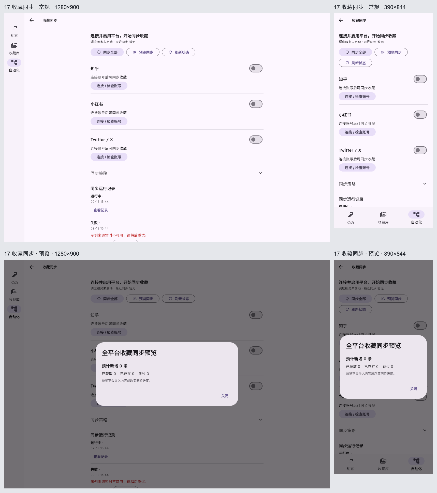

**观察：** 平台开关、账号检查、策略和最近记录分层；预览弹窗集中呈现本次可同步数量，未启用平台时为零。

**判断与边界：** 失败样例已改为后端真实 error 状态并重拍，列表中文失败显示正常。未执行同步或平台访问。

**当前实现：** [automation/widgets/favorites_sync_automation_panel.dart](../../../frontend/lib/features/automation/widgets/favorites_sync_automation_panel.dart)。取证状态：`sync`、`sync-preview`。

## 18 分发队列与历史

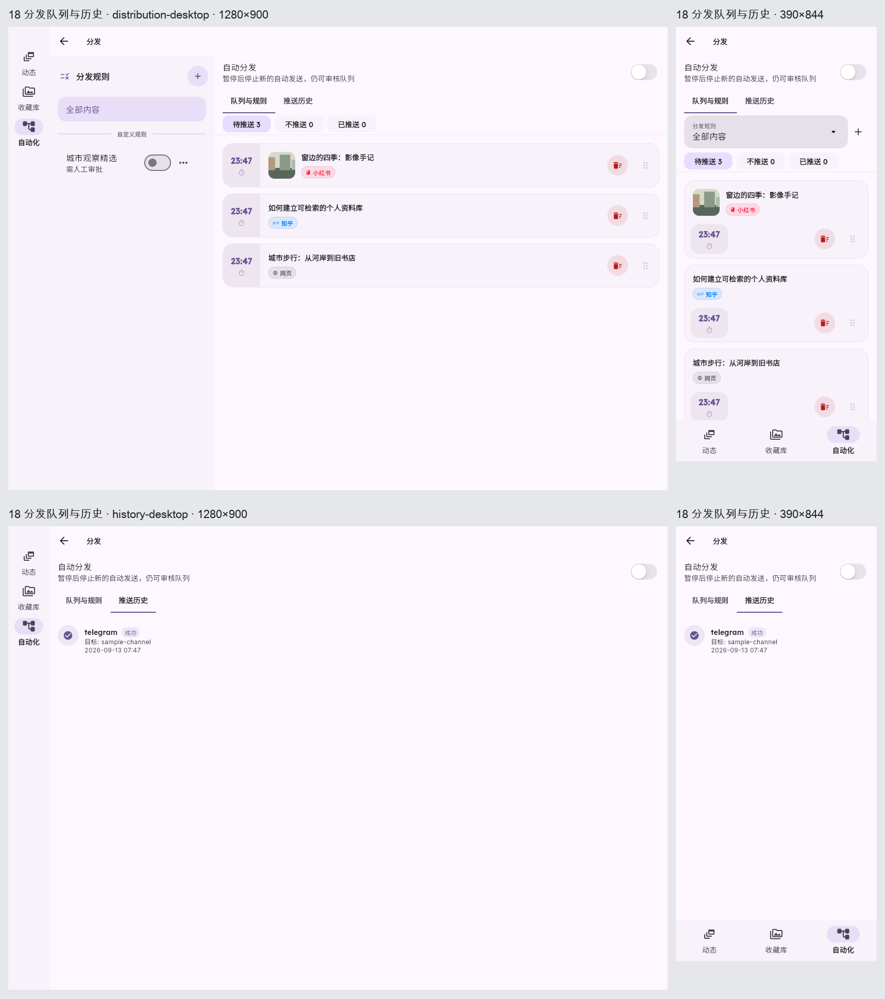

**观察：** 桌面规则与队列并排，手机按可用宽度重排；计划时间块与内容卡相邻。历史页是独立分支，当前无真实推送记录。

**判断与边界：** 确认问题：非当天计划仍仅显示 HH:mm，无法从队列直接辨别日期。见唯一功能问题 UI-01。

**当前实现：** [automation/widgets/queue_content_list.dart](../../../frontend/lib/features/automation/widgets/queue_content_list.dart)。取证状态：`distribution`、`history`。

## 19 新建与编辑规则

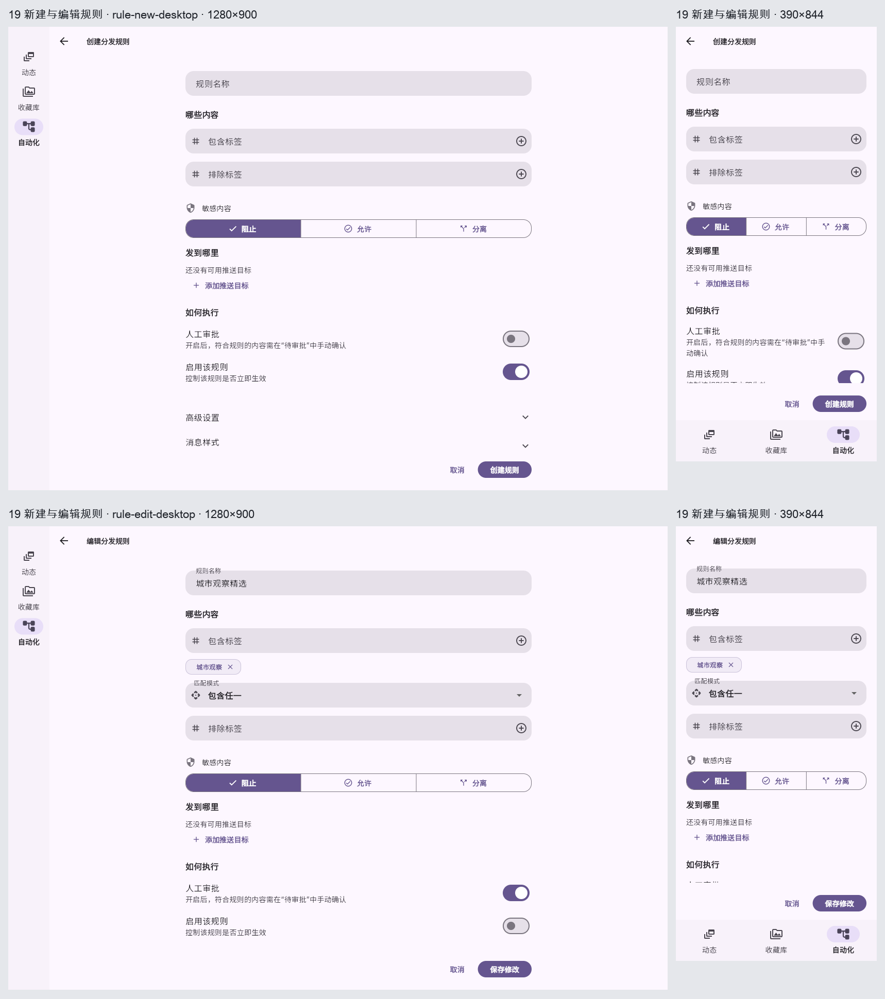

**观察：** 规则按哪些内容、发到哪里、如何执行组织，默认视图没有摊开所有格式配置；新建与编辑的主按钮表达不同操作。

**判断与边界：** 保持基本条件优先；手机纵向滚动是正常表单行为，不将首屏以外字段误报为裁切。

**当前实现：** [automation/distribution_rule_page.dart](../../../frontend/lib/features/automation/distribution_rule_page.dart)。取证状态：`rule-new`、`rule-edit`。

## 20 规则高级项与消息样式

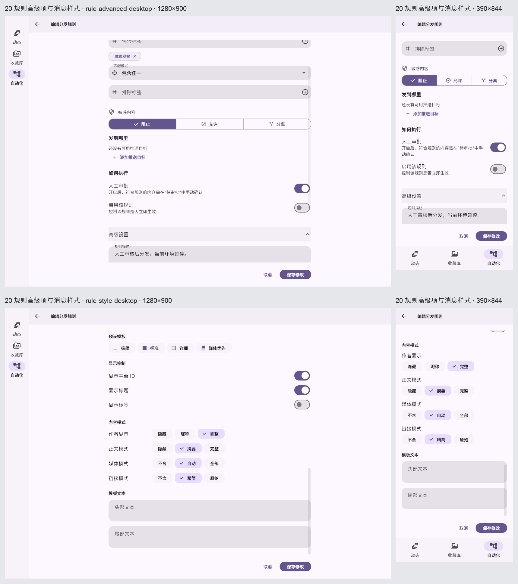

**观察：** 高级设置折叠，消息样式含字段选择、开关、文本框和预览；展开后密度明显增加。

**判断与边界：** 可统一相同枚举控件的标签位置与间距，避免为了紧凑再增加嵌套卡片。未保存规则。

**当前实现：** [automation/distribution_rule_page.dart](../../../frontend/lib/features/automation/distribution_rule_page.dart)。取证状态：`rule-advanced`、`rule-style`。

## 21 解析与后处理

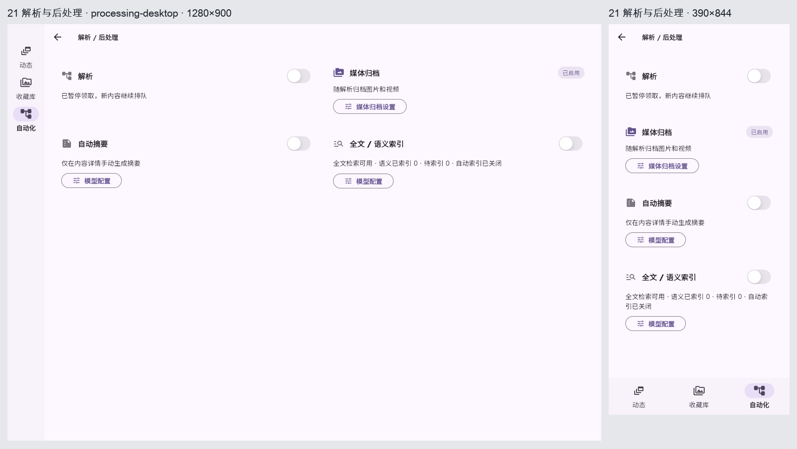

**观察：** 解析、摘要、语义索引、媒体归档呈现独立控制和配置入口；桌面分区并排，手机纵向排列。

**判断与边界：** 入口职责较清楚；归档开关仅在隔离库中为展示字段启用，worker 仍为零，不代表后台处理运行。

**当前实现：** [automation/automation_page.dart](../../../frontend/lib/features/automation/automation_page.dart)。取证状态：`processing`。

## 22 账号中心

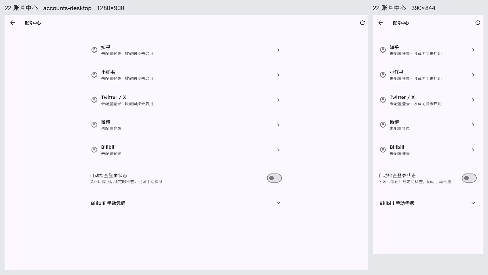

**观察：** 平台连接状态为主要信息，手动凭据低频入口折叠；账号中心与设置中的来源配置没有混成一个列表。

**判断与边界：** 保留平台能力差异；此处所有账号未连接，不对真实有效、过期和验证码状态下结论。

**当前实现：** [accounts/account_center_page.dart](../../../frontend/lib/features/accounts/account_center_page.dart)。取证状态：`accounts`。

## 23 平台详情差异

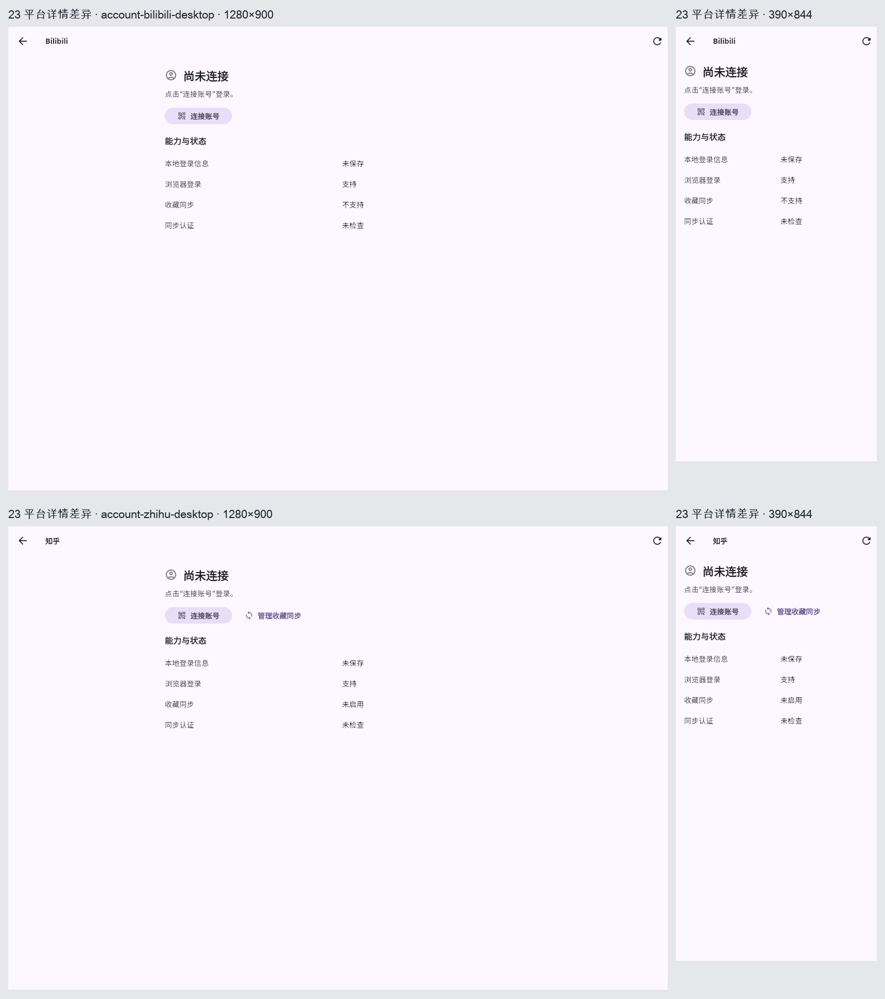

**观察：** Bilibili 与知乎详情展示各自能力与连接入口，未连接状态也能看到账号能力，不只显示空白按钮。

**判断与边界：** 平台名和状态需作为主线；未验证登录后画像、失效重连和收藏夹选择。

**当前实现：** [accounts/account_detail_page.dart](../../../frontend/lib/features/accounts/account_detail_page.dart)。取证状态：`account-bilibili`、`account-zhihu`。

## 24 手动凭据与登录弹窗

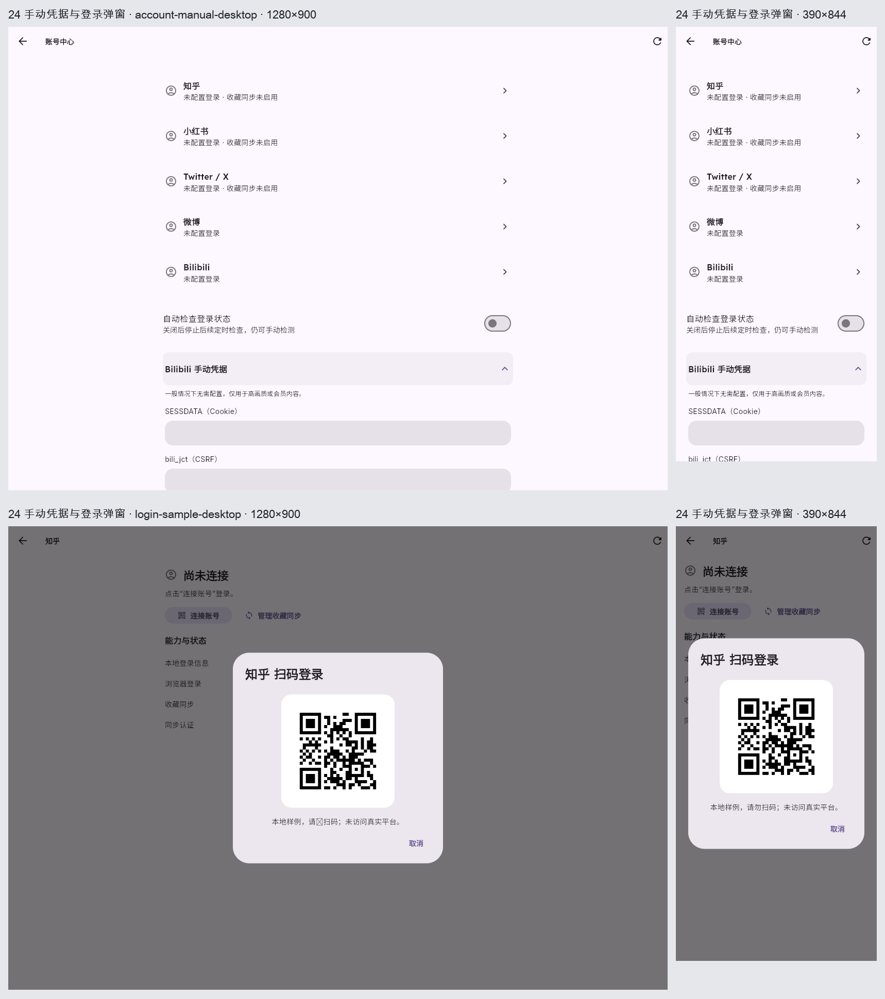

**观察：** 手动凭据展开后出现独立输入项；扫码弹窗的标题、二维码、状态说明、取消构成明确闭环，手机同样可见取消。

**判断与边界：** 二维码为本地无登录含义样例，登录 session 响应按契约模拟。没有启动真实浏览器登录、扫码或提交 Cookie。

**当前实现：** [auth/presentation/widgets/interactive_login_dialog.dart](../../../frontend/lib/features/auth/presentation/widgets/interactive_login_dialog.dart)。取证状态：`account-manual`、`login-sample`。

## 25 设置导航与中等宽度

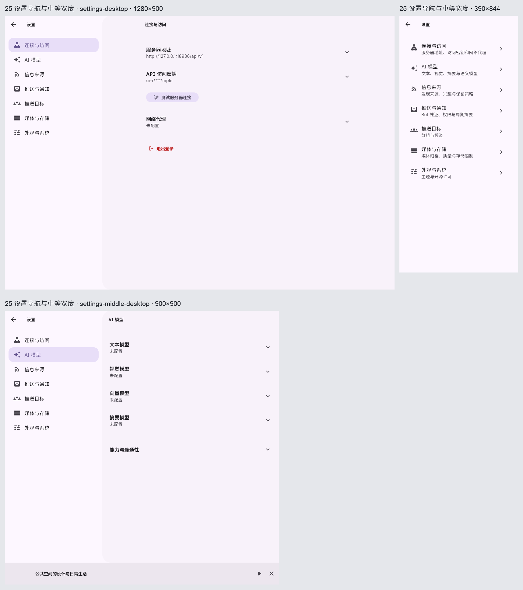

**观察：** 桌面分区导航与内容分栏；手机先列出七个分区；900×900 样例仍保留双栏。尺寸来自图片本身，不能把文件名 desktop 当作宽度证明。

**判断与边界：** LayoutBuilder 按内容可用空间决定单/双栏已实现。仍需在 600、840、1200、1600 邻界和大字号另做专项验收。

**当前实现：** [settings/settings_page.dart](../../../frontend/lib/features/settings/settings_page.dart)。取证状态：`settings`、`settings-middle`。

## 26 连接设置与展开编辑

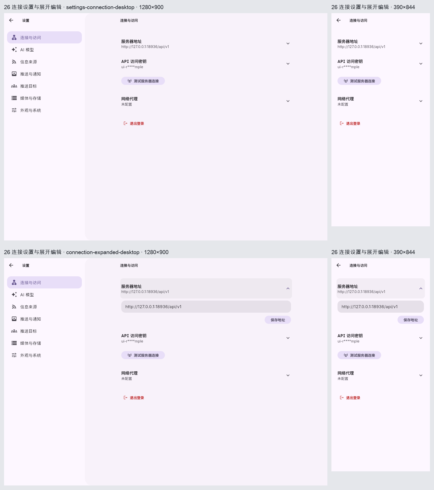

**观察：** 收起行显示标题和当前地址/掩码密钥，展开编辑留在原位置，下方项目顺序稳定。危险退出动作单独着色。

**判断与边界：** 长地址保留可换行空间；不要机械搬到狭窄右侧。短值可按 Animeko 方式右对齐，编辑态维持清楚的保存动作。

**当前实现：** [settings/presentation/tabs/connection_tab.dart](../../../frontend/lib/features/settings/presentation/tabs/connection_tab.dart)。取证状态：`settings-connection`、`connection-expanded`。

## 27 AI 模型配置

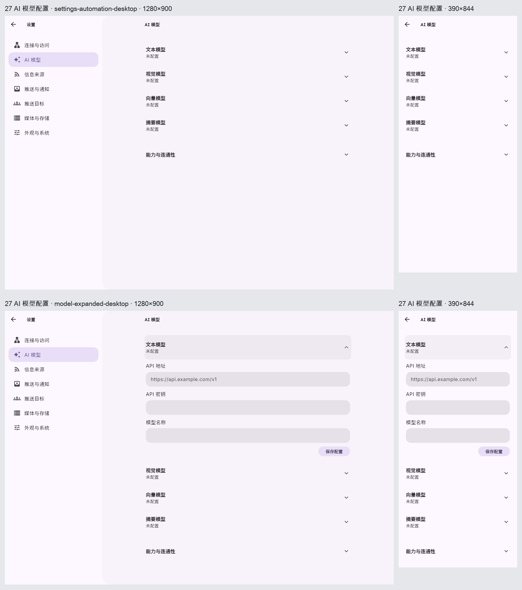

**观察：** 文本、视觉、向量、摘要模型各自折叠，展开一组显示名称、API 地址、密钥和模型名称，减少默认页的字段噪声。

**判断与边界：** 模型配置不是运行证据；未填真实密钥、测试模型或发起摘要。可统一所有编辑组的标题与保存间距。

**当前实现：** [settings/presentation/tabs/automation_tab.dart](../../../frontend/lib/features/settings/presentation/tabs/automation_tab.dart)。取证状态：`settings-automation`、`model-expanded`。

## 28 信息来源与来源编辑

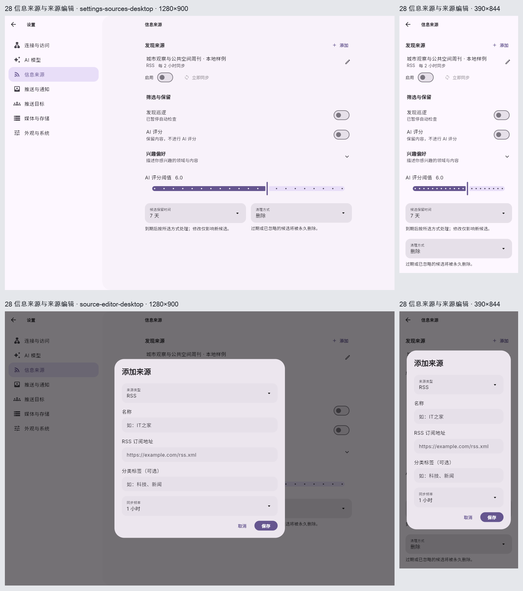

**观察：** 来源条目与发现策略共处一个设置分区，来源编辑以弹窗呈现类型、名称、URL、标签和时间间隔。

**判断与边界：** 来源名称较长仍有文本区；弹窗外置标签与其他事件表单浮动标签不同，建议按字段语义统一而非重做壳层。

**当前实现：** [settings/presentation/tabs/automation_tab.dart](../../../frontend/lib/features/settings/presentation/tabs/automation_tab.dart)。取证状态：`settings-sources`、`source-editor`。

## 29 推送与通知

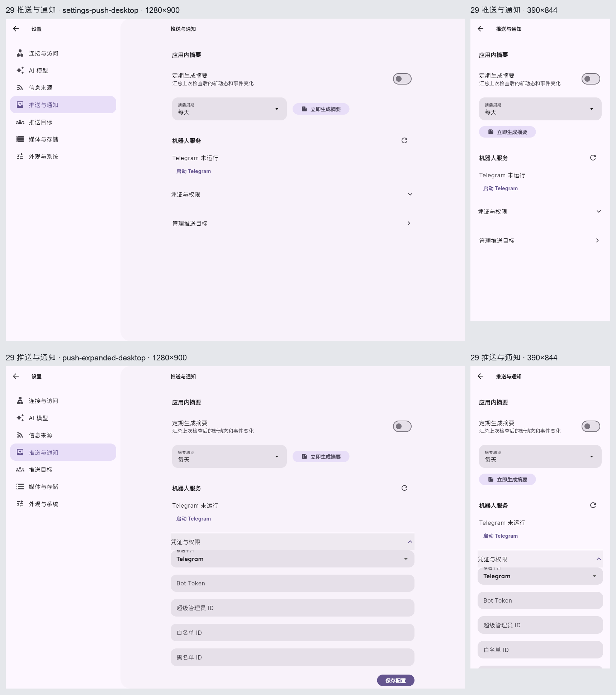

**观察：** 周期摘要、机器人配置分组明确；展开 Bot 配置出现多项凭据和权限输入。主设置页没有把所有秘密字段常驻展示。

**判断与边界：** 短周期值和开关适合右侧行控件；凭据配置继续使用展开编辑。未测试 Bot、触发摘要或通知外部账号。

**当前实现：** [settings/presentation/tabs/push_tab.dart](../../../frontend/lib/features/settings/presentation/tabs/push_tab.dart)。取证状态：`settings-push`、`push-expanded`。

## 30 推送目标与目标弹窗

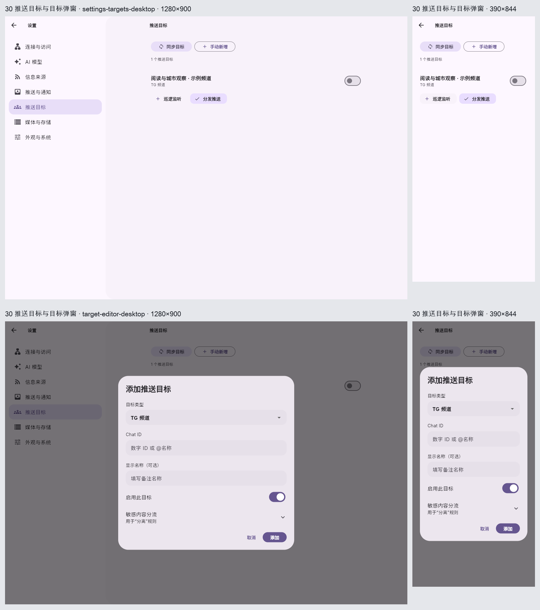

**观察：** 目标列表呈现启停状态与编辑入口；目标弹窗按平台、Chat ID、名称和启用组织，主按钮位于底部。

**判断与边界：** 与来源弹窗对齐字段节奏有收益；Chat ID 属配置标识，保留说明文字，不能只依赖占位符。未保存目标。

**当前实现：** [automation/widgets/bot_chat_dialog.dart](../../../frontend/lib/features/automation/widgets/bot_chat_dialog.dart)。取证状态：`settings-targets`、`target-editor`。

## 31 媒体与存储

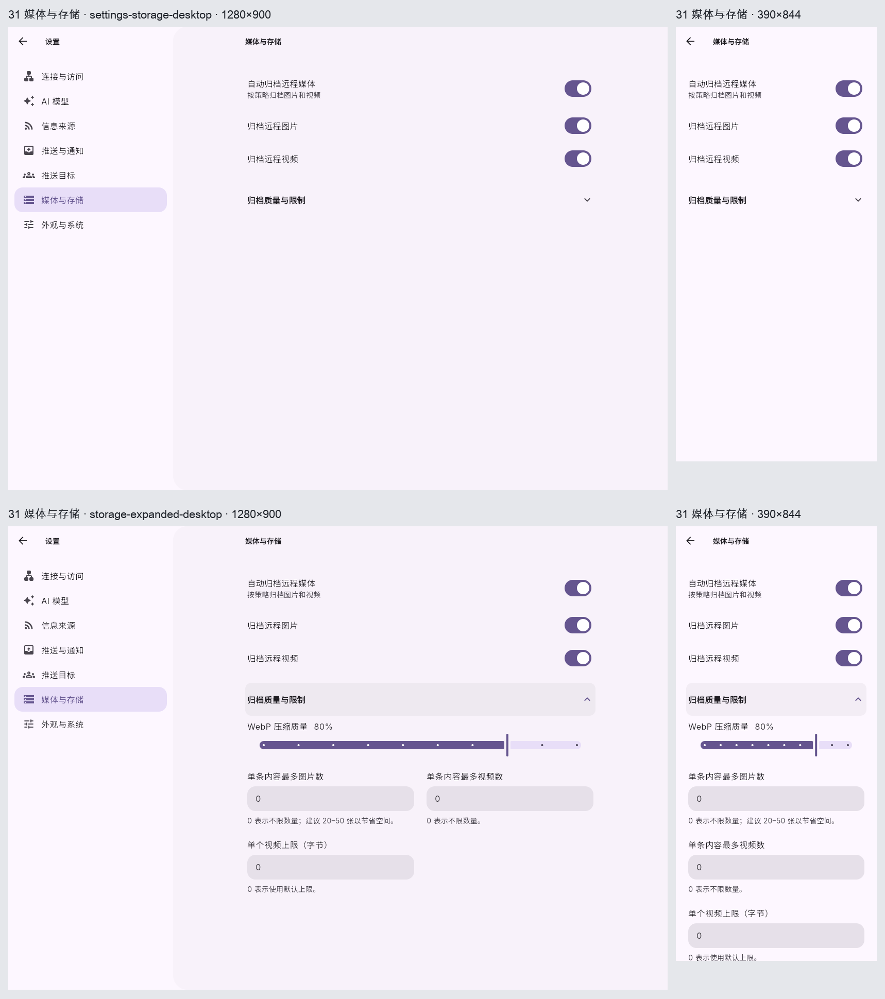

**观察：** 基础开关与质量/限制分层；展开后滑块、数值和说明在同一连续区域，不逐项套卡。

**判断与边界：** 数值设置适合行内当前值；多个限制同时展开时需保留单位和零值含义。仅展示，不宣称任何文件已归档。

**当前实现：** [settings/presentation/tabs/system_tab.dart](../../../frontend/lib/features/settings/presentation/tabs/system_tab.dart)。取证状态：`settings-storage`、`storage-expanded`。

## 32 外观与许可列表

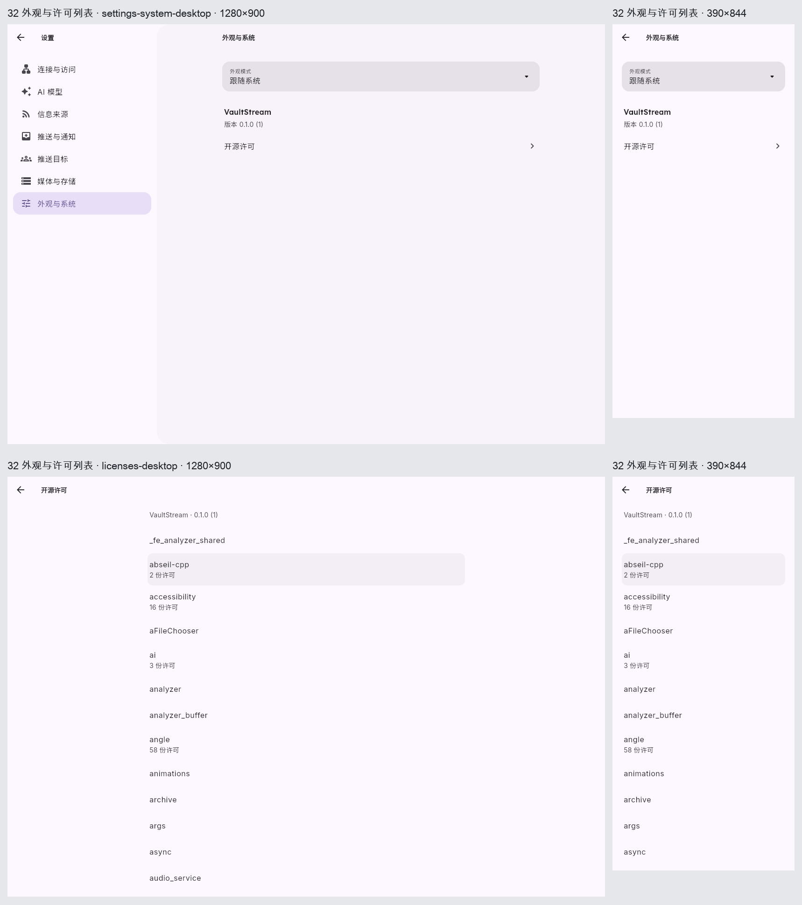

**观察：** 外观设置较短，主题选择与版本、开源许可入口留在同一分区；许可列表使用常规列表结构。

**判断与边界：** 不要为填满桌面空白添加装饰卡。主题枚举是最适合改成右侧当前值菜单的候选之一。

**当前实现：** [settings/presentation/licenses_page.dart](../../../frontend/lib/features/settings/presentation/licenses_page.dart)。取证状态：`settings-system`、`licenses`。

## 33 许可正文

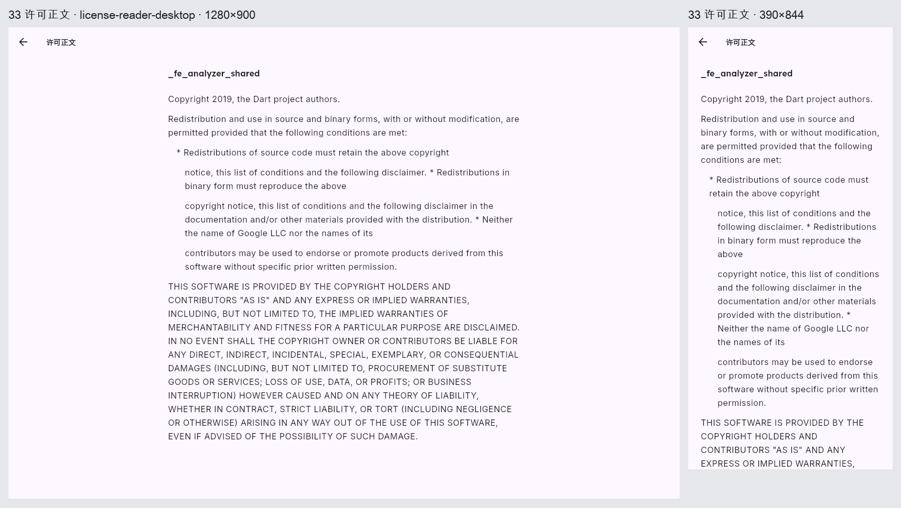

**观察：** 许可证正文进入独立阅读页，回退入口明确，桌面限宽，手机自然换行。

**判断与边界：** 长英文法律文本不应被强制套中文设置行；保留可滚动阅读即可。

**当前实现：** [settings/presentation/licenses_page.dart](../../../frontend/lib/features/settings/presentation/licenses_page.dart)。取证状态：`license-reader`。

## 34 搜索：初始与无结果

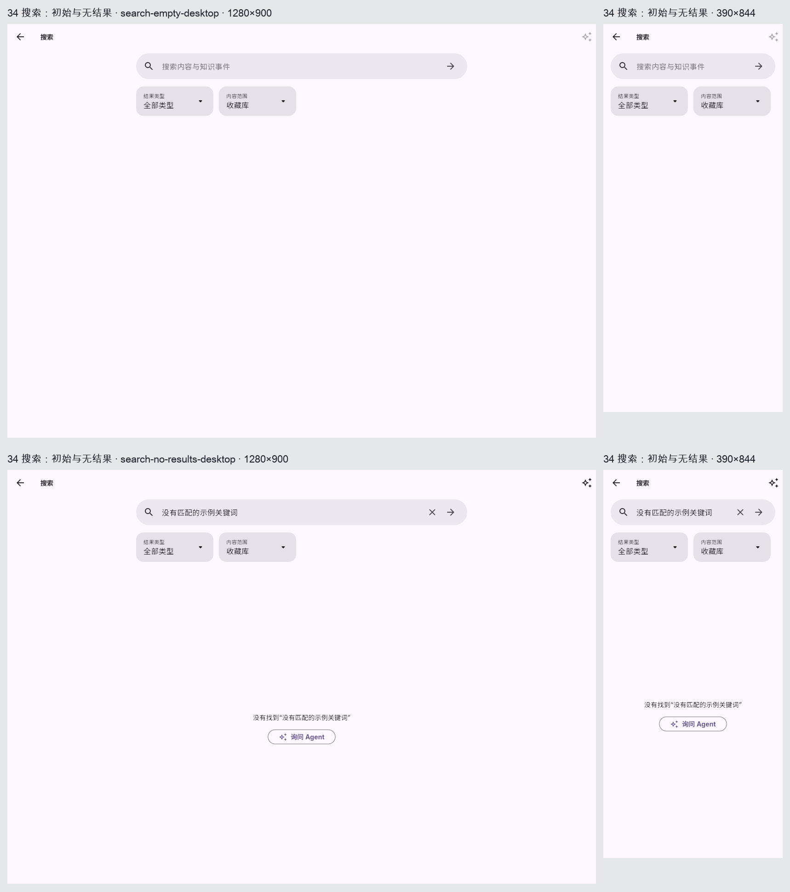

**观察：** 初始空页保留搜索及筛选，零结果状态提供明确反馈与 Agent 入口；两者是不同状态。

**判断与边界：** 无结果并不自动启动模型；本次未点击询问 Agent 发起调用。

**当前实现：** [search/search_page.dart](../../../frontend/lib/features/search/search_page.dart)。取证状态：`search-empty`、`search-no-results`。

## 35 搜索：全部与事件

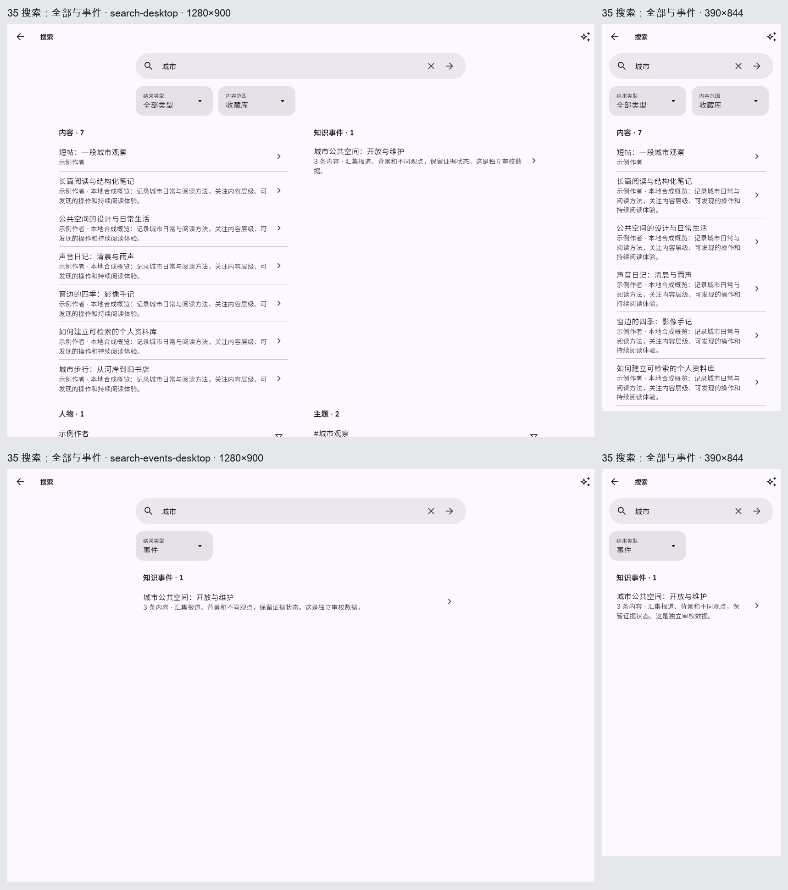

**观察：** 全部结果分类型展示，桌面可多列，手机顺序堆叠；筛选事件后只保留事件结果，降低杂项干扰。

**判断与边界：** 搜索框与结果区最大宽度不同，桌面左缘有跳变。可统一共享对齐线；手机大结果集的类型定位值得后续观察。

**当前实现：** [search/search_page.dart](../../../frontend/lib/features/search/search_page.dart)。取证状态：`search`、`search-events`。

## 36 搜索：时间点

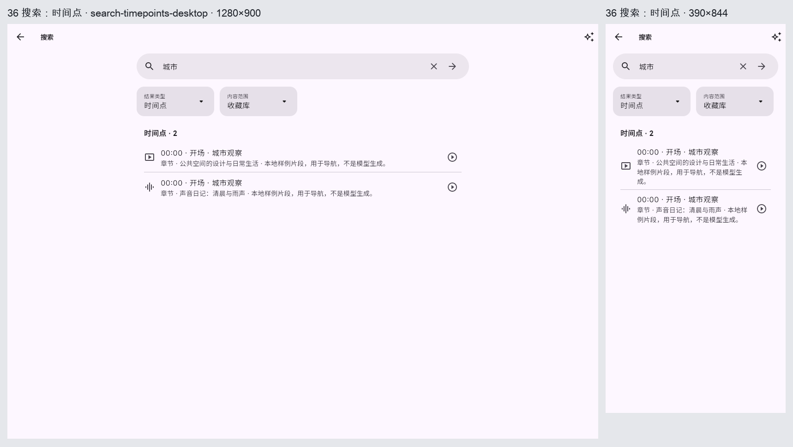

**观察：** 真实 kind=timepoints 筛选展示时间片段与对应内容，属于独立结果结构。

**判断与边界：** 早期误用 segments 参数的图已移除，未把无效查询结果算作产品缺陷；未验证实际跳到音视频时间位置。

**当前实现：** [search/search_page.dart](../../../frontend/lib/features/search/search_page.dart)。取证状态：`search-timepoints`。

## 37 Agent 会话与证据

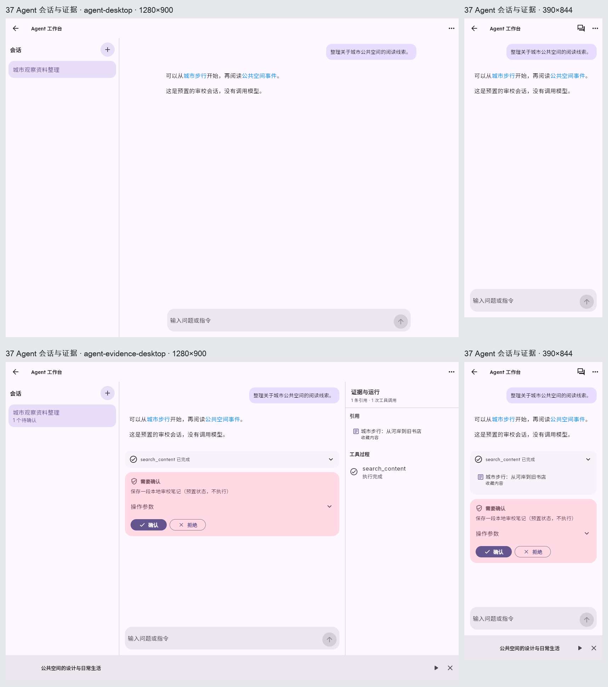

**观察：** 已有会话、回答、工具调用和引用分别占有位置；桌面有侧栏，手机集中呈现会话内容与可进入的辅助信息。

**判断与边界：** 回答和引用为真实持久化的合成记录；没有模型调用。待确认面板与普通回答明显区分，应保留。

**当前实现：** [agent/agent_page.dart](../../../frontend/lib/features/agent/agent_page.dart)。取证状态：`agent`、`agent-evidence`。

## 38 Agent 工具展开与会话菜单

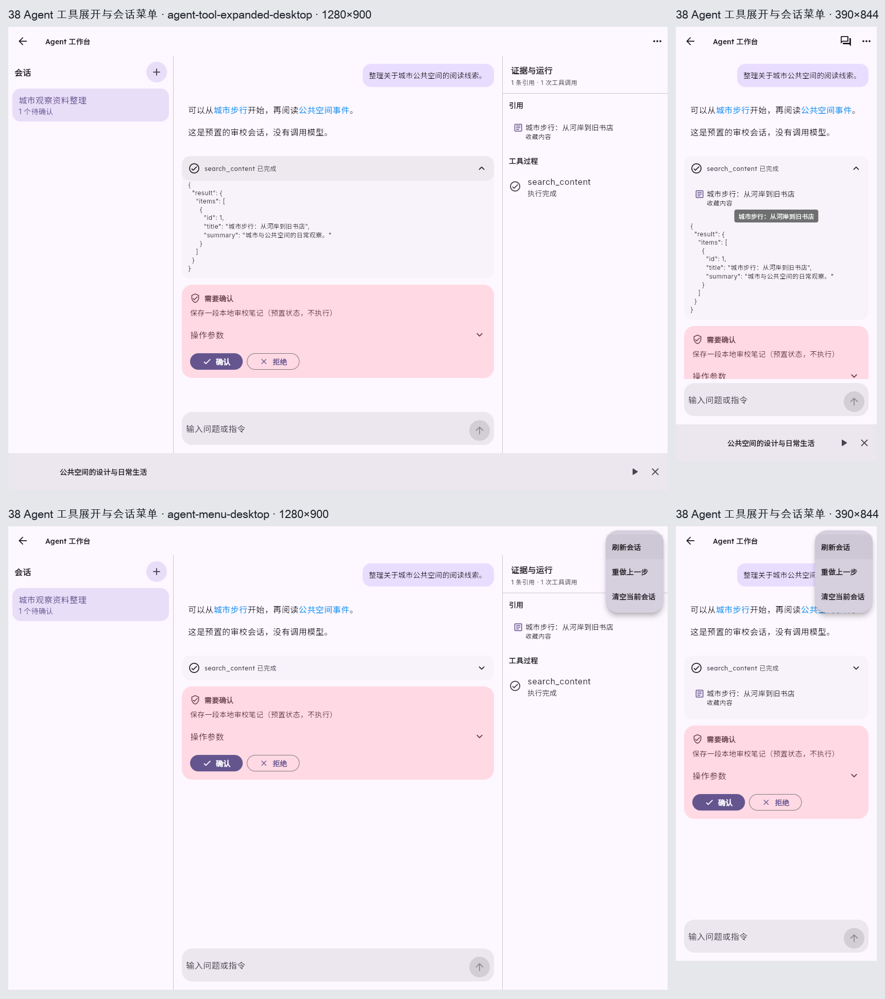

**观察：** 工具展开呈现参数/结果并向下推开确认区，菜单容纳会话低频动作；技术内容没有默认铺满消息流。

**判断与边界：** search_content 直接显示技术名称，普通状态可提供可读名称，技术详情继续保留原名。未确认 capture_content。

**当前实现：** [agent/agent_page.dart](../../../frontend/lib/features/agent/agent_page.dart)。取证状态：`agent-tool-expanded`、`agent-menu`。

## 39 消息盒子与操作菜单

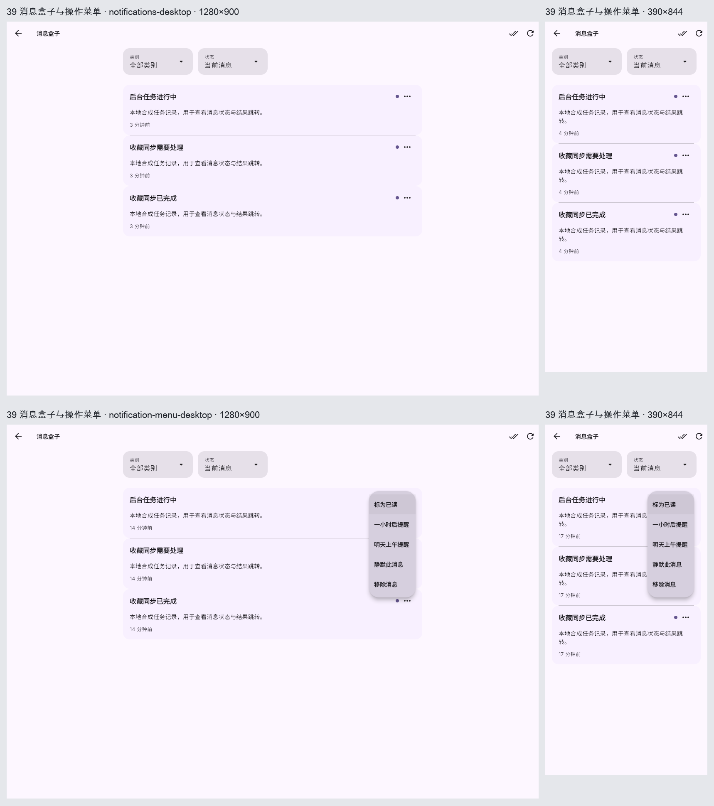

**观察：** 未读消息有明确区分，类别/状态筛选在上方；条目操作菜单独立展开，避免把次要操作铺在每行。

**判断与边界：** 使用三条任务样例验证展示；未把批量清空或消息路由结果全部算作已验收。

**当前实现：** [notifications/notification_center_page.dart](../../../frontend/lib/features/notifications/notification_center_page.dart)。取证状态：`notifications`、`notification-menu`。

## 40 任务完成与失败

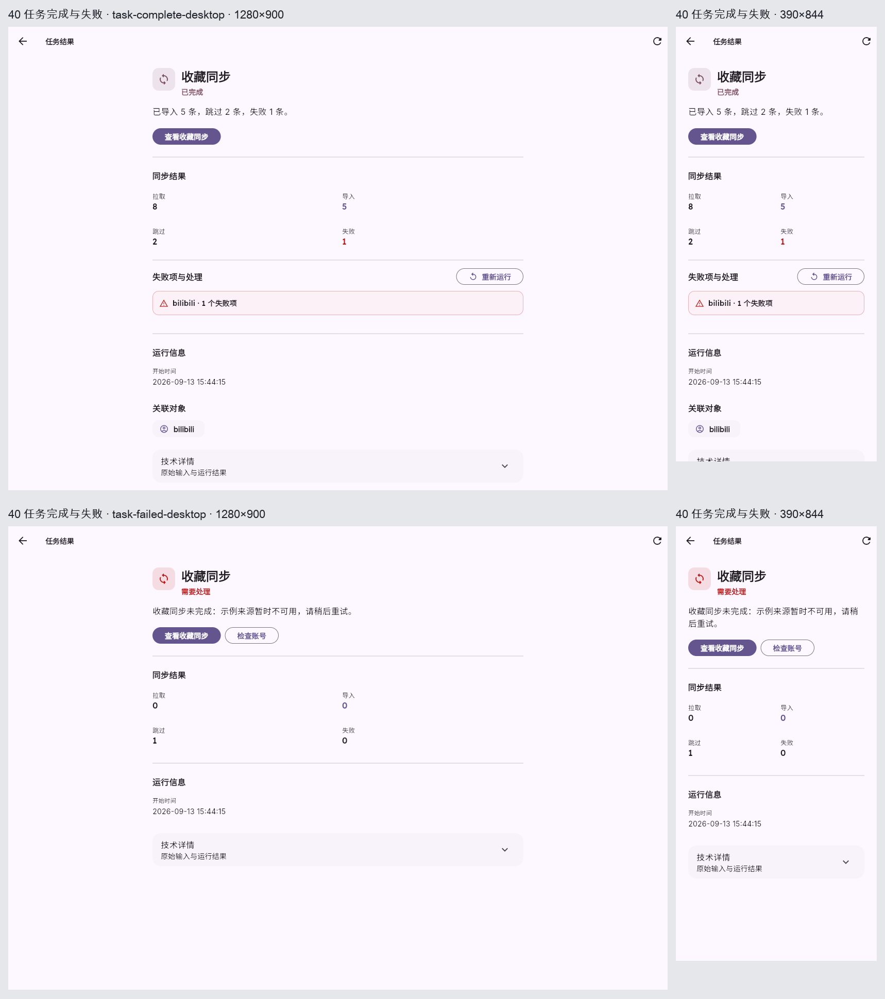

**观察：** 任务结果先讲结果、数量和下一步，再给运行信息；失败提供检查账号等操作。完成任务仍允许呈现局部失败数量。

**判断与边界：** 正常失败状态为 error；合成 failed 值造成的英文曾被排除。完成不等于所有子项成功，当前提示已区分。

**当前实现：** [dashboard/task_result_page.dart](../../../frontend/lib/features/dashboard/task_result_page.dart)。取证状态：`task-complete`、`task-failed`。

## 41 任务运行中与技术详情

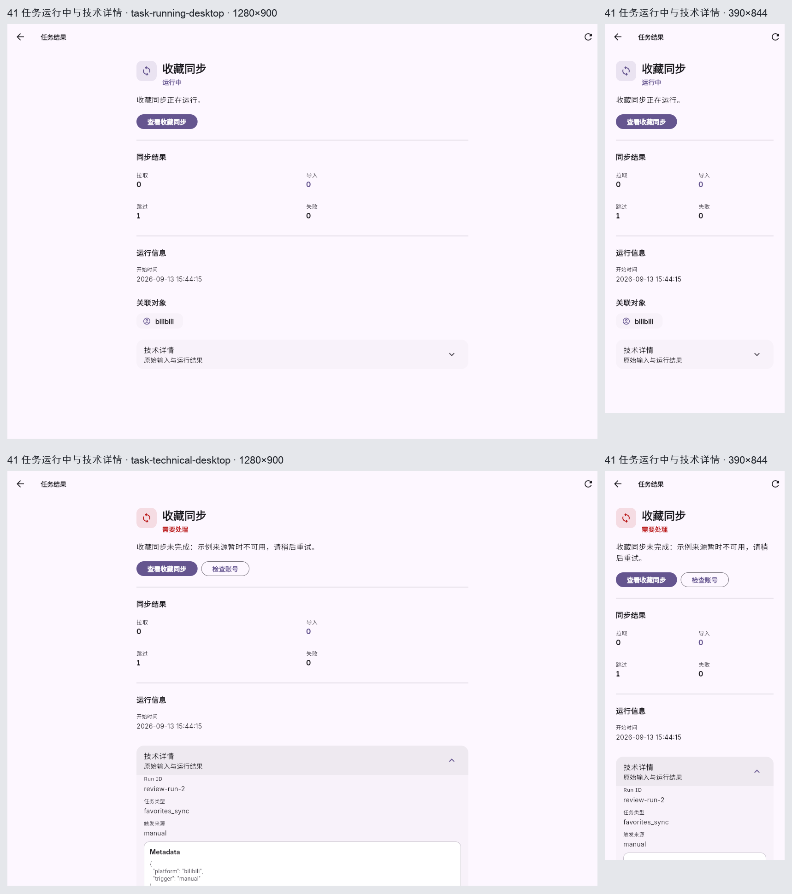

**观察：** 运行中没有冒充已完成；技术详情折叠后不影响普通阅读，展开才出现 Run ID、Metadata、Result。

**判断与边界：** 技术字段集中在明确的技术详情中是合理边界，不应把这些英文诊断字段作为普通界面本地化缺陷。

**当前实现：** [dashboard/task_result_page.dart](../../../frontend/lib/features/dashboard/task_result_page.dart)。取证状态：`task-running`、`task-technical`。

## 42 事件详情与编辑

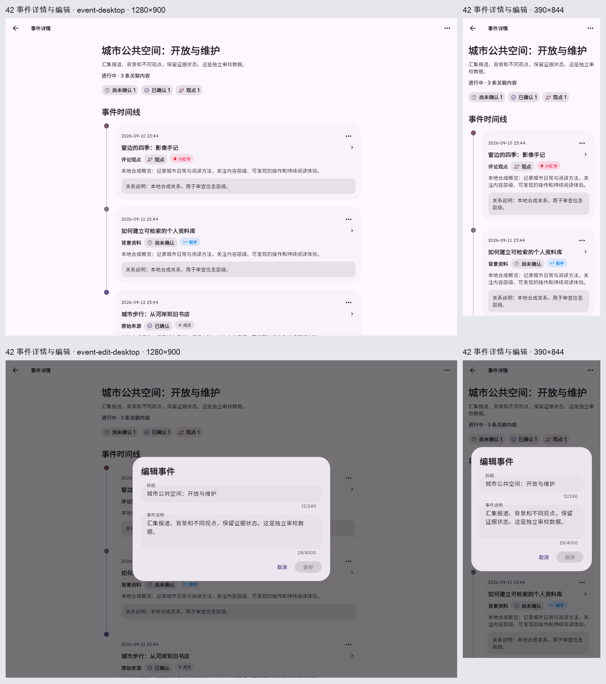

**观察：** 事件按时间顺序组织成员，角色与证据状态形成独立信息；编辑标题摘要使用简洁弹窗。

**判断与边界：** 事件具有不同于收藏详情的阅读任务，保留时间线。弹窗标签与来源编辑可统一，但未保存事件。

**当前实现：** [events/event_detail_page.dart](../../../frontend/lib/features/events/event_detail_page.dart)。取证状态：`event`、`event-edit`。

## 43 加入新事件与已有事件

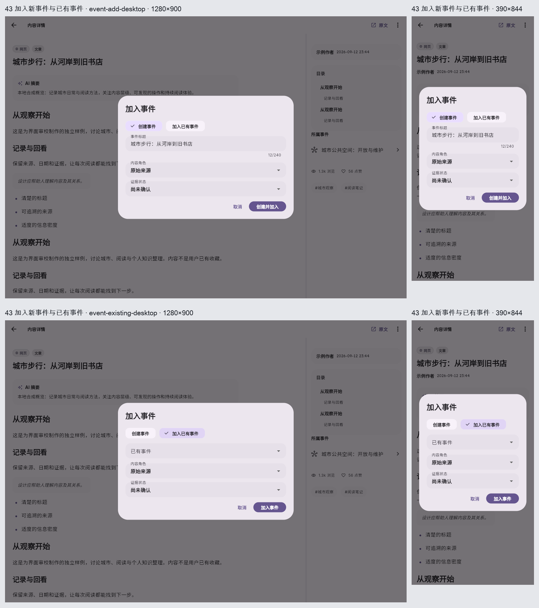

**观察：** 同一弹窗用分段选择新建/已有事件，角色和证据状态在两种模式都可见，用户能知道将如何归入。

**判断与边界：** 这是复杂表单的重要分支；不要只截图默认新建态。未点击最终加入按钮。

**当前实现：** [events/widgets/add_to_event_dialog.dart](../../../frontend/lib/features/events/widgets/add_to_event_dialog.dart)。取证状态：`event-add`、`event-existing`。

## 44 事件关系编辑

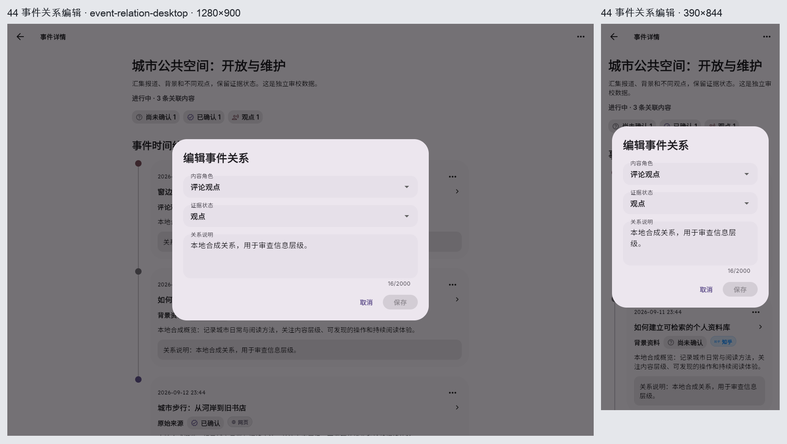

**观察：** 关系角色、证据状态和说明集中在一个弹窗，保留取消与保存，避免在时间线行内堆全部编辑控件。

**判断与边界：** 风险在数据语义而非圆角；此次只验证打开和内容布局，未写回关系。

**当前实现：** [events/event_detail_page.dart](../../../frontend/lib/features/events/event_detail_page.dart)。取证状态：`event-relation`。

## 45 播放器空态与视频

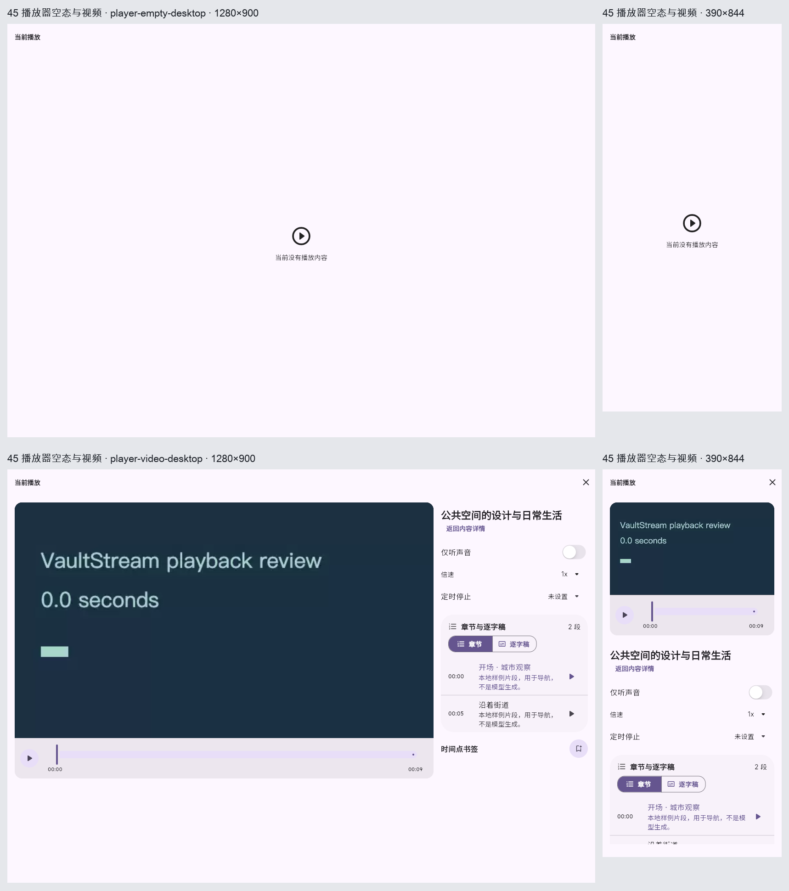

**观察：** 无播放会话时有明确空态；从真实详情建立播放会话后显示本地视频、控制区、章节及时间点，桌面与手机结构不同。

**判断与边界：** 直接刷新 player 路由得到空态不等于视频播放失败。样片约 9 秒，不能据此判断长时稳定性和流媒体兼容。

**当前实现：** [player/player_page.dart](../../../frontend/lib/features/player/player_page.dart)。取证状态：`player-empty`、`player-video`。

## 46 播放器速度与时间点弹窗

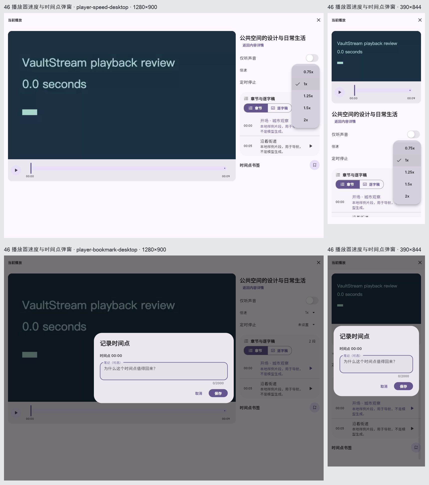

**观察：** 倍速菜单靠近控制区，时间点弹窗让记录说明与当前时间关联，手机仍保留取消和保存。

**判断与边界：** 只打开菜单与记录弹窗，未改变真实内容记录。动效另验证小播放器展开、关闭。

**当前实现：** [player/player_page.dart](../../../frontend/lib/features/player/player_page.dart)。取证状态：`player-speed`、`player-bookmark`。

## 47 播放器横屏

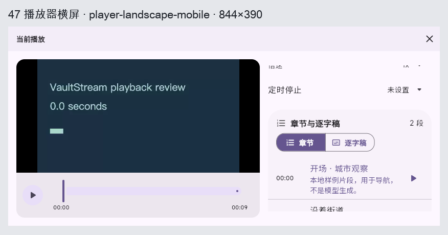

**观察：** 844×390 的低高度环境优先保留媒体，不能只依据横向宽度强塞桌面辅助栏。

**判断与边界：** 这是单个横屏样本，不覆盖旋转过程中系统安全区、触摸控件及后台恢复。

**当前实现：** [player/player_page.dart](../../../frontend/lib/features/player/player_page.dart)。取证状态：`player-landscape`。

## 48 保存内容：链接与文本

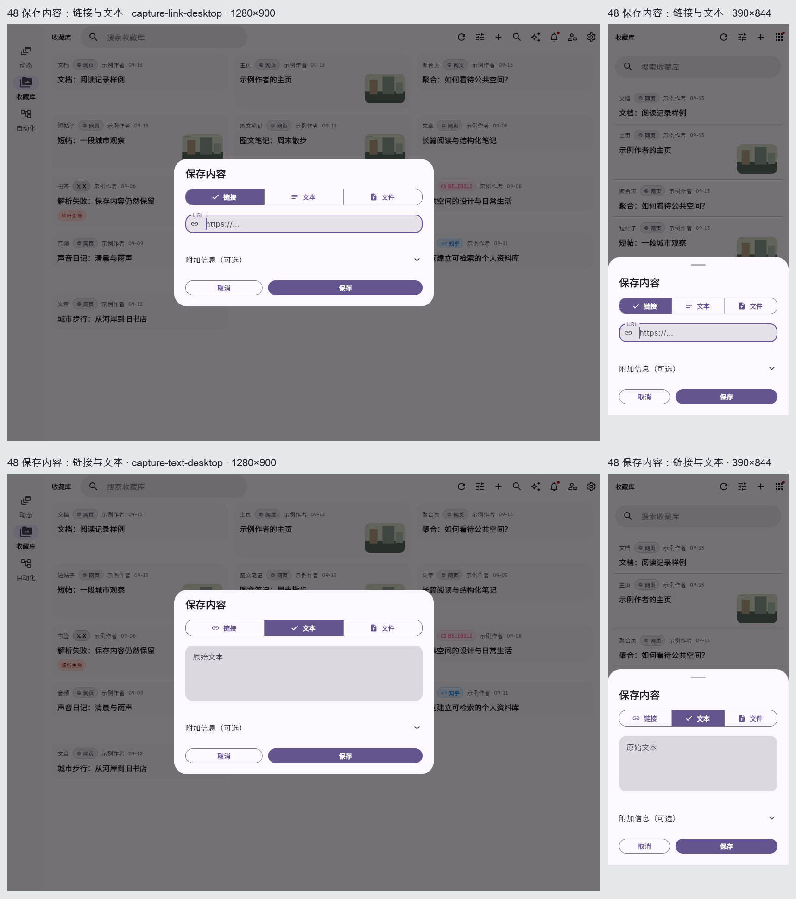

**观察：** 同一容器以分段切换入口，链接用 URL 输入、文本用多行正文；附加信息折叠，底部动作一致。

**判断与边界：** 常用捕获表单结构统一，手机尺寸仍可看到取消/保存。未提交样例，避免把 UI 审校扩大成解析任务。

**当前实现：** [collection/widgets/dialogs/add_content_dialog.dart](../../../frontend/lib/features/collection/widgets/dialogs/add_content_dialog.dart)。取证状态：`capture-link`、`capture-text`。

## 49 保存文件与模板选择

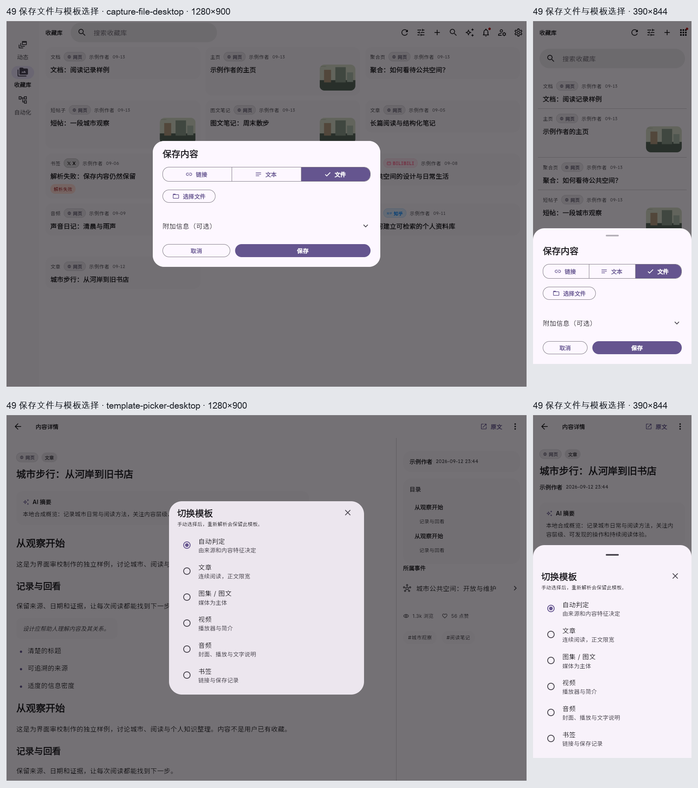

**观察：** 文件态使用选文件入口；模板选择独立列出自动判定与各类阅读模板，两者没有复用含糊的通用选择页。

**判断与边界：** 操作意图清楚。未上传文件或修改已有模板；媒体与文档来自隔离库预置。

**当前实现：** [collection/widgets/dialogs/add_content_dialog.dart](../../../frontend/lib/features/collection/widgets/dialogs/add_content_dialog.dart)。取证状态：`capture-file`、`template-picker`。

## 50 收藏筛选与批量操作

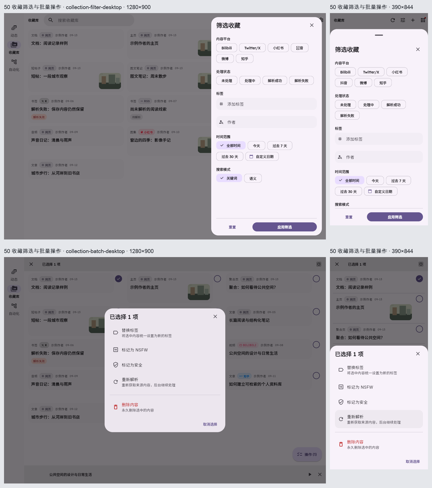

**观察：** 筛选在桌面为侧面板，手机为底部面板；批量操作在已选择内容后独立呈现，删除危险色区别于普通整理。

**判断与边界：** 筛选控件密集但分类明确；已实际打开和取消。没有触发删除、重新解析等副作用。

**当前实现：** [collection/widgets/dialogs/collection_filter_sheet.dart](../../../frontend/lib/features/collection/widgets/dialogs/collection_filter_sheet.dart)。取证状态：`collection-filter`、`collection-batch`。

## 51 选择状态与网络中断采样

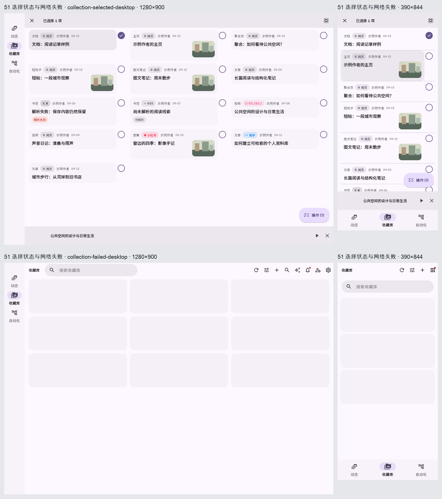

**观察：** 选择态让计数与退出选择明显可见；网络中断图来自拦截 cards 请求后约 18 秒的隔离场景，仍显示加载骨架。

**判断与边界：** 这组没有取得错误终态，不能据此声称失败提示正常或永远加载。代码有 error 分支；错误终态及恢复是未验证项。

**当前实现：** [collection/collection_page.dart](../../../frontend/lib/features/collection/collection_page.dart)。取证状态：`collection-selected`、`collection-failed`。

## 52 深色：设置与收藏

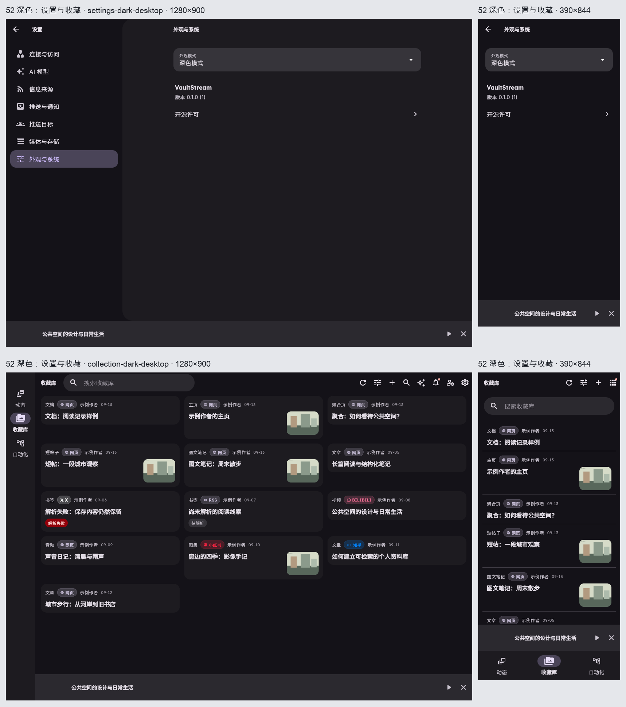

**观察：** 深色下导航选中、卡片背景和文字层级仍有区分，播放器小条作为持久会话可出现在页面底部。

**判断与边界：** 只抽检深色代表页，不声称所有页面对比度达标；未进行仪器色差或 WCAG 对比度测量。

**当前实现：** [settings/settings_page.dart](../../../frontend/lib/features/settings/settings_page.dart)。取证状态：`settings-dark`、`collection-dark`。

## 53 深色 Agent 与正文下半部

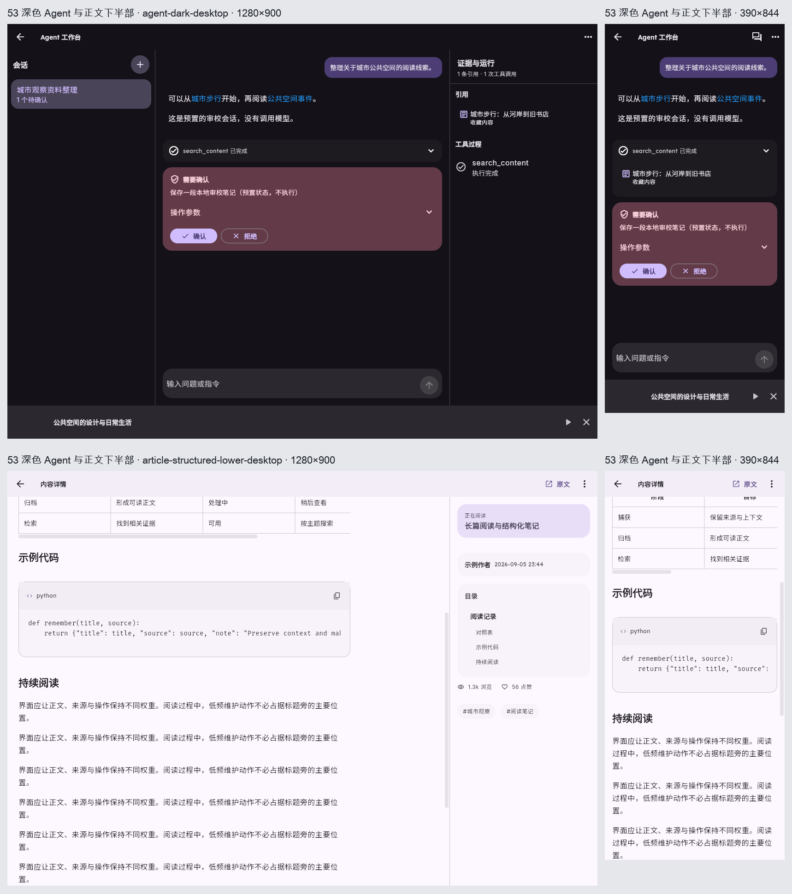

**观察：** Agent 深色确认面板仍显著区别于普通回答；结构化正文下半部可见代码块、表格末端和持续阅读。两组是补充检查，非同一状态比较。

**判断与边界：** 没有发现这些样例中文字与容器的明显重叠；不能外推到放大字体、超长参数和键盘遮挡。

**当前实现：** [agent/agent_page.dart](../../../frontend/lib/features/agent/agent_page.dart)。取证状态：`agent-dark`、`article-structured-lower`。
