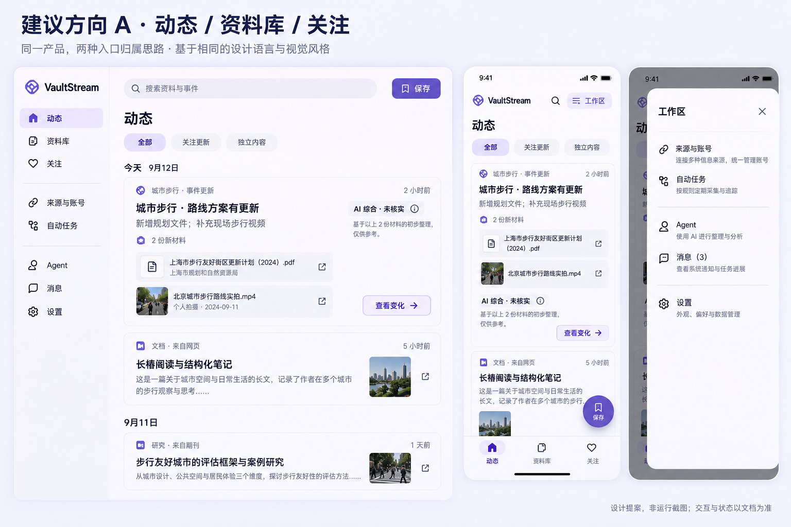

# VaultStream 产品、体验与架构改进方案

状态：设计提案，2026-09-13 开始审查，2026-09-14 汇总。本文的结构选择是本轮建议，不冒称用户已逐项批准，也不代表代码已经迁移。

本文回答“为什么改、现在能做什么、哪些应一起实施”。[系统构想](2026-07-15-vaultstream-system-concept.plan.md)定义长期产品语义，[前端方案](2026-06-10-frontend-information-architecture-redesign.plan.md)定义目标页面与交互；两份原文已同步修订，不再把旧三导航作为不可变前提。当前路由仍见[导航现状](../frontend/navigation.md)。

## 1. 判断：应重组用户任务，不应重写整个产品

VaultStream 最有价值的承诺不是“把各平台内容集中存起来”，而是：**接住值得保留的信息，持续关注变化，在需要时找得到原始证据，并减少重复阅读和人工搬运。** 用户不需要每天巡视同步、解析、索引和分发四个后台环节；需要知道材料是否可用、关注的事情有什么变化、哪些决定必须由自己做。

原构想的捕获 → 归档 → 理解 → 探索 → 行动仍成立，但它是系统协作关系，不应该直接决定页面导航。原前端方案把“动态、收藏库、自动化”固定为主导航，产生了三个问题：

- 前两项是用户消费结果的地方，第三项是后台生产过程；持续追踪事件反而只是动态中的切换项。
- “我要持续接收某个平台的收藏”要在账号、自动化同步、内容列表之间跳转；RSS/TG 来源又在设置中。对象分层正确，不等于用户应该跨几个模块完成一次连接。
- “收藏库”既容纳主动保存、同步导入，也会出现机器生成的综合稿；收藏、存档、证据保留和待阅读意图没有被清楚区分。生成更多条目不能自动等于整理得更好。

因此建议采用 **动态 / 资料库 / 关注** 三个主目的地；把 **来源与账号 / 自动任务** 设为有名称的二级工作区；搜索、保存、Agent、消息、设置和播放器跨上下文复用。这是信息架构的实质调整，不是换三个标签：关注需要持久意图、增量变化和证据，自动任务需要从阶段面板变成持续目标的控制面。

改动规模应是“保留基础、重组职责、补齐连续性”。当前 Material 3 表面、统一断点、设置连续行、稳定路由、内容阅读器、播放器与 Agent 会话都有可复用实现，不支持全量重画或重写。原 UI 审校主要判断局部呈现，并不能证明原产品结构最优；两者不矛盾。[依据 E1–E3](../knowledges/product-review-2026-09-14/README.md#e1)

## 2. 用户任务与概念边界

| 用户要完成的事 | 应形成的连续路径 | 有用的结果，而非技术成功 |
| --- | --- | --- |
| 当下没空读，但以后要用 | 分享/保存 → 立即可见的材料 → 解析/提取补齐 → 继续阅读或查找 | 原文、附件与来源可读；处理失败不丢已保存内容 |
| 不想逐个平台搬收藏 | 来源与账号 → 连接平台 → 选择真实支持的收藏范围 → 预览/启用 → 资料库 | 新增收藏持续出现，重复不增殖，失效只要求修复一次 |
| 不想重复看同一条资讯 | 来源接入 → 去重/归组 → 动态 | 一次变化一个入口，仍能展开不同报道和观点 |
| 持续跟进一个问题 | 内容/搜索 → 关注事件 → 新材料关联 → 查看变化 → 修正或行动 | 与上次相比的新事实、修正、分歧和证据；无变化不打扰 |
| 带着问题使用已有材料 | 上下文搜索 → 原文结果 → 必要时交给 Agent 比较 → 定位证据 | 回答有边界、能复核；无依据时明确不回答 |
| 按时得到简报或发送到频道 | 自动任务 → 选关注范围、输出方式、节奏 → 预览 → 启用 | 收到去重的有效结果，有失败恢复、暂停和发送记录 |

### 不再混用的名词

| 概念 | 唯一职责与关系 |
| --- | --- |
| 内容 | 一份可阅读/观看/检索的材料；多次采集可指向同一内容，但不能丢掉各次来源上下文 |
| 来源 | 持续输入通道或采集出处，如 RSS、TG 频道、某账号的收藏范围；不是“账号是否登录” |
| 账号 | 访问平台的身份与凭据；可供解析、同步等多个能力使用；登录可用不等于某能力可用 |
| 收藏/保存 | 用户希望长期保留的意图；外部取消收藏默认不删除本地材料，不做双向同步承诺 |
| 事件 | 围绕同一具体事件/问题组织的材料与变化；不是普通文章模板，也不是任何同主题内容的筐 |
| 关注 | 用户希望持续得到某对象变化的意图；首期落在事件，后续才考虑明确的主题查询，不把 `active` 状态冒充用户关注 |
| 综合稿 | 某次基于证据生成的解释，属于事件的产物；不能作为支持自己结论的独立来源 |
| 自动任务 | 持续替用户完成某个目标的规则组合；一次运行是它的执行记录，不是另一个主目的地 |
| 消息 | 要用户注意、确认或接收回执的事项；不是资讯候选流，也不是普通 Bot 聊天镜像 |
| 设置 | 应用偏好、模型供应商、存储与部署配置；不再承载持续输入来源和业务目标的管理 |

“稍后处理候选”与“稍后阅读已存资料”也不同：前者是决定是否采纳，留在动态筛选；后者是阅读意图，属于资料库。若实现统一稍后视图，必须显示对象归属与到期影响，不用同一布尔字段偷偷混合。

<a id="capabilities"></a>
## 3. 当前功能完成度：局部闭环已多，持续能力仍不完整

以下以工作区代码为准，包括未提交的五平台收藏、持久会话、TG 增量和聚合改动。基线为 [b98815ba](https://github.com/ienone/VaultStream/commit/b98815ba1842414f43036d58bb27bb8359d84ade) 加本轮开始时已有修改，不把它们写成已发布。近期[来源处理进展](2026-09-13-source-processing-delivery.process.md)明确仍在审查完整同步与恢复；[真实验收记录](../issues/2026-09-10-real-world-acceptance.md)后段的成功证据可纠正前段旧结论，但不能扩大到未跑的场景。

判定口径：**局部完整**指限定范围内能从用户入口得到有用结果；**部分**指生产链已接通但有关键范围、恢复或质量缺口；**界面/契约先行**指有消费结构而缺少稳定生产者；**未形成**指未找到可完成该任务的链路。不给全项目完成百分比。

| 能力 | 当前真实链路与结果 | 判断及关键差距 |
| --- | --- | --- |
| 链接、文字、文件、系统分享 | 捕获控制层 → 正式内容 API → Content/ContentSource/媒体归档 → worker 或原生文档提取 → 详情；历史 Android PDF 与混合附件已有实际保存/阅读证据 | 限定路径局部完整。来源上下文已存，但普通内容详情缺少完整来源历史；捕获成功与全部后处理完成仍需区分 |
| 内容解析与重解析 | 平台 Adapter → ParsedContent → 解析写入 → 媒体资产/来源时间段 → 阅读器；人工字段候选保护和稳定媒体身份真实存在 | 部分。不是“只有封面”的旧版本；但各平台长文、转发、视频、失效网页覆盖不齐，RUNNING 中断接续失败 |
| Bilibili 视频、PDF 文本 | 平台章节/字幕 → 资产绑定 → 索引/时间点 → 全局播放；PDF 原件 → 独立提取 → 页码读取/检索/预览 | 限定来源局部完整。Bilibili 有真实字幕及浏览器 seek，PDF 有真实页码问答；不等于任意音视频 ASR、扫描 OCR、复杂版面均可用 |
| 登录与持久化 | 二维码驱动或显式 Cookie → 配置持久化 → 解析/收藏复用 → 条件刷新 → 失效提醒/重新连接 | 部分且已有本地生命周期闭环。五平台有近期小批读取证据；保活不保证平台永不过期，X 不是通用扫码登录；静态凭据仍以明文 JSON 存库 |
| 个人收藏同步 | 前端预览/执行 → FavoritesSyncService/task → 五平台 Fetcher → 统一 ContentService 导入/解析交接 → 来源和游标持久化 | 部分。知乎、小红书、Bilibili、微博、X 均不再只是空入口；已有续页、集合身份、幂等和失败不推进保护，尚不能证明大库到尾、收藏重排/新增/移除期间不漏项 |
| RSS/TG 订阅 | 来源配置 → DiscoverySyncTask → RSS/TG scraper → 内容与关联 → 动态/后处理 | 部分。RSS 错误不再空成功，TG 有增量跨页、纯媒体和相册处理；订阅输入可能只给摘要。正文/媒体后处理与游标提交间没有耐久交接 |
| 动态与候选处理 | discovery 列表/分页 → 收录、忽略、稍后、恢复；另一个视图按事件 `updated_at` 排序 | 候选处理局部完整，信息治理部分。已有真列表，不是迁移说明；排序更新不等于“新发生了什么”，尚缺跨独立内容/事件的一致变化表达 |
| 事件组织与模型综合 | 人工成员/角色/证据状态；新增周期聚合从内容选批 → 结构化模型 → 引句/版本验证 → 原子保存文章、事件和游标 | 部分，非“未实现自动聚合”。真实模型已产生持久结果；但候选关联依赖有限近邻批次，人为编辑会冻结整事件自动续接，缺少可靠的持续关注和变化对比；到期清理会丢原始成员 |
| 搜索与证据问答 | FTS/向量 RRF → 内容/事件/作者标签/时间点/PDF 页 → read_content/read_image → Agent 引用 → 详情 | 部分且有实际模型与点击证据。作者/主题只是字段聚合；向量召回受最近配置行数上限约束（默认 5000），不是全库 ANN；无答案 top-k 仍有噪声，未形成稳定质量评估 |
| 内容模板 | 多类 layout 与普通/沉浸 renderer，文章、图集、视频、音频、文档已有可用消费路径 | 分层判断。帖子串、对话消息包的结构化生产与节点引用不足；“十类枚举/样例均有截图”不能证明十类语义能力完成 |
| 跨页媒体会话 | 一个应用级控制器，mini player、队列、倍速、书签、恢复；Android MediaSession/后台/PiP 已接入 | 部分，不再写成系统后台播放完全未实现。已有短媒体模拟器证据；真机长播放、音频焦点、PiP 黑帧与连续返回仍需专项验证 |
| 推送与分发 | 规则 → 审批 → 队列 → 渲染/媒体 → 平台 service → message_id → PushedRecord；Agent 也经过策略 | 部分。近期隔离真实队列与发送边界验收较强；本轮无实际外发。过期 PROCESSING 不回收，远端接受后本地未提交属于发送结果未知，不可简单重试 |
| 消息盒子 | 持久回执、账号失效、工具确认、严格 Bot 保存回执、确定性周期活动摘要 → 已读/静默/稍后/移除 | 限定消息类型局部完整。不是统一聊天产品；活动计数摘要不是语义简报，更不代表持续洞察 |
| Agent 任务 | App/Bot 会话 → 白名单工具/确认 → 工具账本 → 引用/结果恢复；原文、图片、PDF 有真实调用样本 | 部分。不是纯聊天壳；开放式捕获、跨消息合并、长期委托、自主查找新源及稳定任务评估尚未形成 |
| 持续自动化 | 周期同步、评分、聚合、摘要/索引、推送开关与任务结果均有实际消费者 | 部分。可周期执行不等于能持续完成目标；恢复、版本变化、输出去重、用户修正和后续交接仍有断点 |
| 通用 OCR/ASR、浏览器探索、完整修订历史/恢复 | 有模板、视觉读取或 Browser 组件可复用，但没有上述完整持续流程 | 未形成；不要把可看一张图当 OCR 索引，也不要把 X 网页传输或登录浏览器当自主探索。OCR 曾按要求撤除，重新引入须独立选择范围 |

代码定位见[能力证据 E4–E9](../knowledges/product-review-2026-09-14/README.md#e4)。完整备份/还原、引用证据保留、来源健康修复和新建目标引导也是关键缺口；它们比多加几种模板更直接影响“私人知识系统是否值得依赖”。

### 3.1 三个已复现失败，优先于增加模型能力

本轮临时验收使用真实 SQLite、ORM 与队列实现，不启动网络 worker，不读写用户库。三个预期全部失败，并非测试通过：

| 失败 | 构造与实际结果 | 用户影响与处理方向 |
| --- | --- | --- |
| 解析遗留运行态 | 保存一天前的 RUNNING Task，重建 TaskQueue 后 dequeue 返回 None | 重启后内容可能永久“处理中”；增加执行租约、到期归类与有界重试，不能只补一个重试按钮 |
| 分发遗留租约 | 保存一天前的 PROCESSING/locked_at，重建 worker，领取集合为空且状态不变 | 排期不继续；按发送尝试状态决定安全重试或人工核对，不盲目再发 |
| 事件证据被清理 | 两条过期候选作为 source，一篇综合稿作为 report；运行真实 hard_delete 清理后只剩 report 成员 | 生成结论留存而原始证据与来源关系消失；证据保留规则须先于自动聚合扩面 |

这些不是“测试覆盖率不足”的抽象问题，而是具体失效序列。[复现步骤与代码](../knowledges/product-review-2026-09-14/README.md#e7)及[待修复问题](../issues/2026-09-14-continuous-processing-integrity.md)为后续实现入口；本轮未修业务代码。

## 4. 前端结构：三个结果空间，两个明确的工作区

```diagram
┌──────────────────── 应用外壳 ────────────────────┐
│ 搜索 / 保存       工作区入口       持续播放会话   │
├──────────────┬──────────────┬────────────────────┤
│ 动态         │ 资料库       │ 关注               │
│ 新内容与变化 │ 已保留材料   │ 持续跟踪的事件     │
└──────┬───────┴──────┬───────┴─────────┬──────────┘
       │              │                 │
       └──────────────┼─────────────────┘
                      ▼
          内容详情 / 事件详情 / 引用定位

工作区：来源与账号 ─── 自动任务
工具：  Agent / 消息 / 设置
诊断：  任务结果（从对象或消息进入）
```

### 4.1 为什么不选另外两种结构

| 备选 | 优点 | 不作为默认建议的理由 |
| --- | --- | --- |
| 保留动态/收藏/自动化，只重排子页 | 改动少；管理员能快速找后台 | 继续让持续目标隐身、让生产阶段与消费结果同级；用户仍须自己拼流程 |
| 动态/资料库，两项主导航，关注藏在资料库 | 最简；适合纯稍后阅读器 | 本产品明确重视持续事件与自动整理，关注不是收藏筛选；若试用证明用户很少追踪事件，可重新评估此方案 |
| 动态/资料库/来源/自动化/Agent 五项主导航 | 所有能力都显眼 | 把使用频率与实现规模混为一谈；手机空间更紧，Agent 又成为万能入口竞争者 |

[两案概念比较](../knowledges/product-review-2026-09-14/assets/navigation-concepts.png)用于检验入口归属，不是可运行原型。建议方向如下，详细交互以[前端规范](2026-06-10-frontend-information-architecture-redesign.plan.md)为准：



图中手机事件卡过密，实施时默认收起来源列表；保存按钮占位不能照搬为遮挡卡片，需给持续动作与播放器留出布局空间。跨城市示例材料只是占位，不能据此合并为同一事件。图片不定义事实、数据 contract、精确尺寸或动效参数。

### 4.2 页面职责与关键操作变化

- **动态**：同一条流混排独立材料和事件变化，按全部/关注更新/独立内容筛选；不要维持两套同权资讯与事件首页。新综合稿通常折入事件变化，不再把来源、综合稿、活动摘要各推一遍。已读位置、忽略/稍后与保存分开；保存是明确意图，不要求逐条清空“收件箱”。
- **资料库**：原“收藏库”改名但保留内容 ID 和阅读器。默认保留材料视图，近期、阅读待办、来源集合、整理结果是明确视图而不是新顶层。自动生成的每一版草稿不挤占默认列表；同事件显示最新结果与历史入口。外部集合是来源上下文，不冒充用户本地文件夹。
- **关注**：显示真正关注的事件、最近实质变化与下一观察问题；可从材料、搜索结果或事件详情加入。从零使用时用“选择材料建立关注”，不摆空统计卡。首期不强行新造知识图谱、人物实体或万能项目管理器。
- **来源与账号**：一个工作区完成“接入 → 访问条件 → 采集范围/频率 → 首次结果”。凭据详情仍独立，公共 RSS 不要求创建账号。收藏同步配置在对应来源详情，只保留同一编辑器；自动任务中链接到它，不复制表单。
- **自动任务**：默认按“持续同步收藏、整理关注变化、定期简报、发送到目标”等有实际执行器的目标组织。规则/审批/队列与阶段诊断是下钻；总暂停与局部暂停解释影响范围。尚无生产链的目标不呈现可启用卡片。
- **Agent**：资料搜索或事件页传递范围与明确问题，先保留普通结果，再由用户显式发起模型调用。使用同一 session/确认/工具账本，轻量面板可展开完整工作台；不从输入框暗中猜意图并执行写操作。
- **消息**：关注重要变化、需要修复或确认、主动任务回执三类有用结果；自动成功默认静默，账号连续失效合并。点击抵达可操作的对象或同一会话，不把用户扔到总览重新寻找。
- **设置**：收敛到连接与访问、模型与隐私、媒体与存储、通知偏好、外观与系统；Bot 身份和发送目标属于连接工作区，发送规则属于自动任务。一个 channel 可输入也可输出，但权限与开关分别建模。

### 4.3 视觉、动效与响应式不是另起炉灶

保留[当前主题 token](../../frontend/lib/theme/design_tokens.dart)、[统一空间分类](../../frontend/lib/core/layout/responsive_layout.dart)、[连续设置组件](../../frontend/lib/features/settings/presentation/widgets/setting_components.dart)和普通平台路由。正常桌面优先一个阅读主列，只有内容量足够才开辅助栏；手机竖屏默认单列，标题、摘要、来源与动作逐级出现。不要继续沿旧方案推广“越窄越紧凑网格”。

桌面让二级工作区直接可见，搜索与保存留在共享页头；手机保留一触搜索、明确“工作区”入口和三个主导航，不把搜索与低频设置一起藏在九宫格。同一位置只放一个保存入口，存在 mini player 时共同占用受约束的持续区，避免悬浮按钮遮正文。

动效用于解释“当前对象仍在”：切换筛选不整页重播，事件更新不把阅读位置顶走，来源连接成功在原行反馈，展开设置让下面内容自然让位，搜索与 Agent 交接保持输入和焦点。已有 Material/PredictiveBack、设置展开、播放器持续控制不应被新建转场总框架替换。先验证返回目标与状态，再增强容器形变；流体 hover 只适合桌面等高导航项，非收藏卡或长表单的通用效果。[实际动效证据](../knowledges/ui-review-2026-09-13/motion.md)

原报告的队列跨日日期、设置短值轻量化、搜索起始线、解析候选太深、Agent 工具名等仍可顺手处理，但属于所属切片的质量项，不取代上述结构改造。普通桌面 1280×900 与手机 390×844 是本轮主要观察面；其他断点按具体布局/播放器/键盘风险选，不设置截图或字号覆盖指标。

### 4.4 从 Animeko 学任务闭环，不学业务菜单

对照固定版本 [open-ani/animeko](https://github.com/open-ani/animeko/tree/7e20fdc8e1580bd2db65cdd57e87a1c0d4f6c9d6) 的导航、搜索、设置和媒体选择代码：它将探索、收藏与消费连续起来，自动选源有局部状态和人工覆盖，尺寸变化改变容器而非重建业务状态。对 VaultStream 的启发是：连接来源只做一次、阅读从上次继续、自动判断在当前材料旁可纠正、手机与桌面返回同一对象。其缓存管理主导航和可替换视频源不能照搬：VaultStream 的不同来源可能承载不同观点，不能当成可互换资源。详见[可定位的参考代码 E10](../knowledges/product-review-2026-09-14/README.md#e10)。

<a id="backend"></a>
## 5. 后端调整：模块化单体，先修交接再收敛模块

### 5.1 保留合理复杂度

保留 FastAPI/Python、SQLite、既有内容/媒体资产/事件模型和公开 API 边界。平台私有 API、网页会话和二维码协议确实不同，Adapter 的特化有实际必要；摘要与事件综合目的不同，不能为去重代码合成万能提示词。分发规则 CRUD、纯匹配决策、排期、渲染和外部发送也不是同一个职责。

同样必须保留：人工修订版本保护、媒体资产身份与签名访问隔离、上传失败批次清理、分页失败不推进、Cookie 条件刷新、Agent 确认单次领取、发送前重新检查策略。这些复杂度保护数据和外部副作用，不属于应删除的防御性代码。

### 5.2 具体迁移边界

| 当前交叉/冗余 | 目标所有权 | 调整与收益 |
| --- | --- | --- |
| 解析/收藏 Adapter 直接读写 ConfigService；配置服务又调用 Adapter 的 Cookie 解析；X 登录健康调用收藏 Fetcher 私有 `_read_page` | 账号 service 持久化与条件更新，平台 session/transport 负责请求协议，Adapter 只产出内容或分页结果 | 注入一次会话快照和刷新结果；提取有明确能力的 X 共享会话探测，保留真实书签权限探测而非替换成“网页 200 即已登录”。新增平台只补协议与能力声明 |
| DiscoverySyncTask 内含查询、去重、媒体、模型后处理与聚合；一个慢来源/模型延迟整个轮询 | scheduler 仅找 due 工作；源同步 service、导入 service、阶段执行器分工 | 来源分批限并发、平台限速、独立租约；聚合单独调度，不能继续挂在来源轮询尾部。保留同一个生命周期管理，不增加第二套 scheduler 框架 |
| ContentService 入队另开事务；Discovery 保存游标后才在内存继续后处理；PostIngest 无持久阶段计划 | 内容写入与待执行工作在同一事务交接；执行器按来源版本结算结果 | 扩展现有 Task 队列以承载明确阶段工作，替换 fire-and-forget；TaskRun 保持用户结果投影而非另一个执行真相。完成一个阶段不等于整体完成 |
| 解析写入主要在 task，发现另写 Content，收藏复用 ContentService | ContentService/写入仓库统一身份、来源、人工保护、媒体绑定与工作交接 | 统一的是写入不变量，不强迫 RSS 摘要与平台全文走同一个抓取器；导入结果明确新建/更新/附加来源/拒绝及覆盖范围 |
| SystemRepository 同时管理设置、推送记录和队列，worker 又有关键 CAS SQL | 配置与分发数据访问按领域拆开；条件领取/状态转换留在队列 repository | 在接续租约改造时迁移，不做全仓逐行搬 SQL。短事务边界和唯一性比“所有 select 都藏起来”更重要 |
| `tasks/distributor.py` 名像调度器，实际由 worker 调用私有 payload builder | distribution rendering 模块提供公开渲染接口 | 迁移/重命名而非删掉真实逻辑；`decision` 继续在预览、入队和发送前共用；scheduler 的独立 session 包装随耐久交接改造收敛 |
| 模型工厂存在 Agent → Text → Vision 隐式回退；摘要/embedding/聚合调用方式与记录不同 | 显式模型角色解析 + 小型调用门面 | 设置展示每个场景的有效模型/数据去向；未配置就清楚停止。替换隐藏回退，不新增隐式多供应商重试。记录实际 usage/缓存/耗时，无供应商数据则未知 |
| 专用 Agent 工具 + api_bridge | 同一应用 service、权限与动作 contract | 专用工具服务有语义的高频任务；bridge 是受白名单约束的剩余 API 访问，不是另一业务实现。只收窄重复写入口；保留仍有用途的只读 catalog/读取，不无依据整删 |
| X 已替换 CLI，两处账号/收藏健康判断仍特判 `cli_unavailable`；模型兼容类仍注释依赖未在当前调用链中的 browser-use | 平台结构化错误与实际 SDK contract | 清理无生产者的旧错误分类，明确 browser_unavailable；核对 SDK 后去除无用途补丁，不能按陈旧注释继续保留或直接删掉整个模型工厂 |

[会话、分发和 Agent 实际调用证据](../knowledges/product-review-2026-09-14/README.md#e8)。实施后删除被替代的导入分支、内存交接和重复表单；只允许有期限、可核对的公开链接/数据迁移兼容，不留“保险”fallback。

### 5.3 耐久执行不是上通用工作流框架

```diagram
来源批次 / 用户捕获
         │
         ▼
┌──────── 同一短事务 ────────┐
│ 内容 + 来源 + 游标         │
│ 待执行阶段（版本/幂等键）  │
└────────────┬───────────────┘
             ▼
  领取租约 → 解析/提取/理解/索引
             │   每阶段提交结果与下一步
             ▼
  事件增量 / 可读内容 / 简报
             │
             ▼
  独立分发队列 → 发送尝试 → 回执或待核对
```

选择现有 SQLite 耐久队列而非引入 DAG 编辑器：先支持实际阶段、幂等输入版本、租约/心跳、退避、暂停、取消和结果指针。纯本地可重建阶段按 `(内容身份, 来源版本, 阶段, 模型/策略版本)` 复用；不要因另一个阶段失败重跑已成功的付费模型。周期调度只创建工作，不在循环里执行整个模型链。

分发保留独立领域队列。远端已接收但 message_id 未持久化时，本地事务无法承诺 exactly-once；区分“尚未发送”“明确失败”“结果未知”，使用平台幂等/查询能力时必须有真实 contract，否则提示核对。停用目标或重新登录的迟到任务不得获得旧授权。

### 5.4 账号、证据与备份是产品基础

当前 [ConfigService](../../backend/app/services/config_service.py#L166-L228) 将值直接交给 [SystemRepository](../../backend/app/repositories/system_repository.py#L26-L48)，凭据 JSON 未加密；遮蔽输入、SecretStr、脱敏日志不能称为静态加密。设计应提供唯一凭据存储边界、部署密钥注入、轮换/丢失处理和不含秘密的普通配置导出。**加密 schema/密钥迁移必须先确认部署与恢复方式，不能本轮擅自实施。**

候选 TTL 只管理未采纳且未被依赖的材料。进入事件证据、用户保存或已发送产物引用的内容，不能被候选清理独立删除；先定义版本和引用影响，再允许清理原件。第一步保护现有事件成员，后续将引用绑定到稳定来源版本/片段；用户选择不可逆擦除时明确列出受影响结论并失效标注，不偷偷保留秘密副本。

补齐备份/恢复体验：数据库、内容寻址媒体、模型索引可重建说明与凭据密钥分别处理；恢复到空环境后必须能读原文、解析已有来源身份并识别缺失媒体。备份文件存在不算恢复成功。单人自托管优先，不因此扩成多租户权限重写。

<a id="automation"></a>
## 6. 自动化演进：从周期执行到持续产生有用变化

### 6.1 三条先做通的持续任务

1. **持续收藏同步**：连接平台 → 声明范围 → 首次小批结果 → 持续增量 → 定期头部重扫/覆盖检查 → 单次登录修复。游标是恢复工具，不是完整性证明；上游 offset 重排需要可见覆盖状态，平台不提供稳定快照时不能许诺绝不漏项。远端取消收藏先标来源变化，本地保留依用户策略处理。
2. **关注事件更新**：选择事件与观察问题 → 新材料确定性去重 → 检索相关旧证据/候选事件 → 模型判断同一事件、差异与分歧 → 验证/版本门禁 → 追加变化与证据 → 一条动态更新。人工修正不应让整个事件永久退出自动处理；被锁定的关系不改，新建议单独待确认。
3. **定期有证据的简报**：从关注范围内的真实变化选择 → 合并重复 → 无实质变化则不生成 → 可读简报/站内结果 → 按明确授权发送。首次配置给真实预览与输出目标，不要求用户先理解评分、索引、队列；活动统计摘要继续独立命名。

### 6.2 确定性流程、模型和 Agent 各做什么

| 确定性执行 | 有界模型任务 | Agent 的适用位置 |
| --- | --- | --- |
| 授权、同步游标、下载限额、平台身份/哈希去重、版本、来源归属、保留约束 | 不同表述是否同一事件、当前材料中的变化/冲突、摘要、少量关系建议 | 用户描述关注目标、比较材料、查找缺少的原始证据、生成规则草案 |
| 索引调度、重试退避、确认领取、通知去重、排期与目标许可 | 在给定证据范围内做价值判断；提供引文且可返回无变化/不确定 | 遇到非标准问题解释失败与建议处理，不直接绕过策略修改账号或外发 |

确定性数据缺失不能靠 Agent 猜测修复；模型输出有 schema 和有效引句，也不证明结论被引句支持。对来源正文中的指令始终按材料处理。引入模型时明确给出输入范围、输出结构、拒绝条件、人工纠正入口和费用边界。

### 6.3 当前聚合如何继续，而非另造一套

保留当前默认关闭、批次上限、来源版本检查、原子保存、独立外发开关和不覆盖人工编辑等正确设计。替换以下限制：

- `20 新 + 10 近七天` 是成本限制，不是相关性检索。先以候选事件/来源身份/全文召回选历史，再用有限模型判断；保留明确的输入截断说明。一个月前事件被一条新报道重提，必须能找回，不被十条无关近讯挤掉。
- 从 `updated_at` 扫描改为可说明的内容版本/事件变化输入。新来源评论、正文更正、撤回、用户纠正分别触发受影响结果，不因普通元数据更新反复生成。
- 区分“新增来源”“无实质变化”“更正旧结论”“观点冲突”。事件时间线只记录变化，不把每次综合稿全文追加成一条新新闻。
- 保存综合产物后同事务交接索引、站内变化与可选分发；当前生成后仅发布事件并可选调用分发，未进入统一索引后处理，不能将生成成功视为下游完整。
- 给人工决策局部边界：拒绝某个成员/关联、锁定某条结论、保留观察问题；不因改一个事件标题就永久冻结全部自动续接。自动合并/拆分先建议，未经确认不改两个已有事件。

### 6.4 用结果评估，不用开关数量评估

持续运行验收围绕一组可解释场景：同新闻多源但不同评论、旧事件的新进展、相同主题的不同事件、来源更正/撤回、无依据问题、部分附件不可读、会话失效后恢复、进程中断及发送结果未知。关注漏掉的重要变化、错误合并、重复提醒、证据可达、人工修正是否保持和每次有效结果成本；不预设截图、测试或覆盖率指标。

先本地可控材料和隔离数据库，随后按授权使用少量真实来源持续观察；不能用一个真实模型成功样本替代长期体验。普通页面只显示用户可采取行动的状态，模型调用/缓存/费用在设置与运行详情可追溯。

<a id="sequence"></a>
## 7. 按价值和依赖实施，不按前后端目录排期

| 顺序 | 可演示的切片 | 必须一起改 | 验收出口 |
| --- | --- | --- | --- |
| 0 · 防止越用越不可信 | 事件证据清理保护；解析/分发遗留运行态可归类恢复 | 清理与成员约束、队列租约/发送尝试、真实状态与消息、对应长期完整性回归 | 三个本轮失败被真实实现修复；发送未知不冒充失败重发；已有人工编辑/发送保护不退化 |
| 1 · 接住且能读 | 一种平台收藏 + RSS/TG 的“连接到可读结果”纵向路径 | 来源与账号工作区、来源详情复用同步编辑器、Adapter session 边界、幂等写入/耐久后处理、完整来源历史 | 首次小批、重复、上游变动、失效再登录与重启后接续都产生可定位结果；没有到处找配置 |
| 2 · 真正持续关注 | 事件关注 + 增量变化 + 动态统一流，同时启用新三导航 | 事件/关注 contract、相关历史召回、局部人工保护、结果索引/保留、动态与关注/事件详情 | 一条老事件新进展能续接；同主题不同事件不误合并；无变化不刷屏；从变化回到原证据 |
| 3 · 让材料被用起来 | 统一上下文搜索、原文阅读、轻量 Agent 交接 | 收藏搜索与全局搜索状态收敛、引用版本/页码/时间点、结果质量与简洁回答、阅读恢复 | 搜索→证据→回答→原文→返回不丢状态；不能回答时不编造；大库旧材料不被静默忽略 |
| 4 · 让结果按时到达 | 自动任务目标页、关注简报和受控分发 | 目标配置、模型使用记录、变化去重、审批/排期/发送回执、消息分级、跨日日期 | 无变化安静；有变化能预览与送达；暂停/过期授权阻止迟到外发；不重跑已成功生成 |
| 5 · 扩充已证明的需求 | 通用语音/图像处理、帖子串/消息包、更多平台 | 生产者、结构化证据、索引与阅读器成套推进 | 用真实样本证明保存、消费、引用和成本有用，而非仅增加模板枚举 |

凭据安全与备份/恢复从第 0 阶段开始明确方案，在扩大自动接入前完成密钥迁移确认与恢复演练；不因它横跨阶段而无人负责。统一模型调用的最小记录能力随第 2 阶段聚合进入，完整费用/策略控制在第 4 阶段收拢。阶段 1 可保留当前主导航，不能提前发布一个空“关注”；阶段 2 切换 Shell 时同时移除旧事件首页与重复同步入口。

不建议当前立项：全量微服务、Rust 重写、通用可视化工作流平台、完整知识图谱、多租户后台、无界 Browser Agent。若以后有性能数据或明确用户任务，再单独证明收益。

## 8. 本轮交付与验证边界

本轮交付是相互一致的分析、目标设计、问题与证据文档；未修改业务实现、API 或数据库 schema，未提交、推送、部署，也未新做真实平台登录/同步、外发或私人材料模型调用。生成的概念图仅比较组织方式。

实际界面复核使用 9 月 13 日已有 Flutter Web 构建与隔离的当前后端、合成数据；不是当前未提交前端的重新构建。当前账号/聚合等较新控制面的判断依据是代码和已有专项证据，不伪装为新截图。Flutter/Dart 无提权执行通道，本轮没有运行 analyze/test/build；实际操作、截图检查、后端回归及三个失败探针的结果见[证据与验证记录](../knowledges/product-review-2026-09-14/README.md)。

方案可实施的前提是保持这些边界：先让任务持续产出可复核结果，再把这种能力放在日常导航里；不要先重画后台面板，再把它称作自动化完成。
